# AMBA 总线架构和协议

- Author：hongjh
- Time：20210731
- Version:

---------

[toc]

## 1. 了解AMBA 总线架构和协议

### 1.1 概述

==高级微控制器总线体系结构（英语：Advanced Microcontroller Bus Architecture, AMBA）是用于连接和管理片上系统（SoC）设计中功能块的开放标准片上互连规范。从本质上说，AMBA 协议定义功能块如何互相进行通信。==

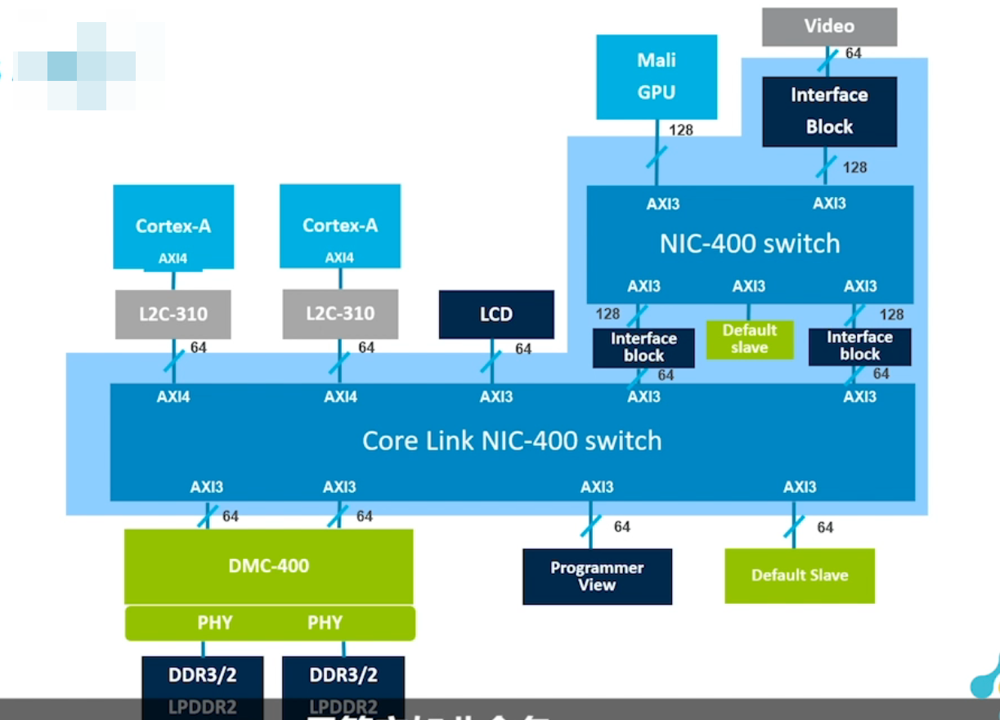

现在，AMBA广泛用在各种ASIC和SoC部件中，包括在IoT子系统、智能电话和联网SoC等设备中使用的应用程序处理器，使用AMBA 有许多优势：

- AMBA可实现有效的IP重用，IP重用在降低SoC开发成本和缩短开发时间方面发挥着至关重要的作用。AMBA规范提供了可实现IP重用的接口标准。正因为如此，数以千计的SoC和IP产品都在使用AMBA接口；

- AMBA还能够灵活地使用多种SoC，IP重用需要一个通用标准，同时支持具有不同能耗、性能和区域要求的多种SoC，Arm 还可提供一系列针对不同要求进行优化的接口规范；

- 标准接口规范（如AMBA）可使来自不同设计团队或供应商的IP组件之间互相兼容，

- AMBA得到很好的支持，它在整个半导体行业中得到广泛的实施和支持，其中包括来自第三方IP产品和工具的支持，包括AMBA在内的各种总线接口标准的差别，体现在它们能够实现的性能上。

  **总线接口性能**有两个主要特性，第一个是**带宽**（带宽是指通过接口驱动数据所能达到的速率）。在同步系统中，最大带宽受时钟速度与数据总线宽度之乘积的限制；第二个重要特性是**延迟**，这是事务启动与完成之间的延迟，但在基于突发事务的系统中，延迟数字通常指的是完成第一次传输而不是突发事务，具体取决于系统的重要性，接口的效率将取决于它以零延迟获得最大带宽的程度。

---

### 1.2 AMBA 发展历程

1996年，Arm 引入AMBA，最初的AMBA总线是高级系统总线（==**ASB**==）和高级外设总线（==**APB**==），**APB 是为低带宽控制访问而设计的。**例如，在系统外设上注册接口，此总线具有简单的地址和数据阶段，信号列表的复杂程度很低；

1999年，推出AMBA 2，Arm 添加了AMBA高性能总线（==**AHB**==），这是一个单边时钟协议，AHB中的一个简单事务，由一个地址阶段和一个后续数据阶段组成，这与APB 协议相似，对目标设备的访问通过MUX来控制，从而**允许总线一次访问一个总线主接口**，而且，**与APB相比，AHB具有更大的总线带宽**（64/128位）；

2003年，推出AMBA 3，其中包括高级跟踪总线（==**ATB**==），这是Coresight片上调试和跟踪解决方案的一部分，==**AHB-Lite**==是AHB 的子集，该子集可简化具有单个主接口的总线的设计，==**AXI**==是在AMBA 3规范中定义的第三代AMBA接口，它的目标是**实现高性能、高时钟频率的系统设计**，并且还包括使其能够实现高速亚微米互连的功能。

2010年，从AMBA 4 ==**AXI4**==开始引入了AMBA 4规范。

2011年，引入了 AMBA 4 ==**ACE**==，ACE 通过附加的信号引入了系统范围的一致性，从而对AXI进行了扩展，该系统范围的一致性**允许多个处理器共享内存**，并可启用类似Arm 的big.LITTLE处理之类的技术，同时，==**ACE-Lite**==协议还可实现单向一致性，例如，一个网络接口可从完全一致的ACE处理器的缓存中读取数据，==**AXI4-Stream**== 协议适用于**从主接口到从属接口的单向数据传输，这也被称为点对点传输，该协议可降低信号路由开销**，因此是在FPGA中实现传输的理想选择。

2014年，引入了AMBA 5 ==**CHI**==（一致性集线器接口）规范，**重新设计的高速传输层和功能专门用于减少阻塞**。

2016年，AHB协议被更新至==**AHB5**==，这是对ARMv8-M体系结构的补充，可扩展从处理器到系统的TrustZone安全基础，

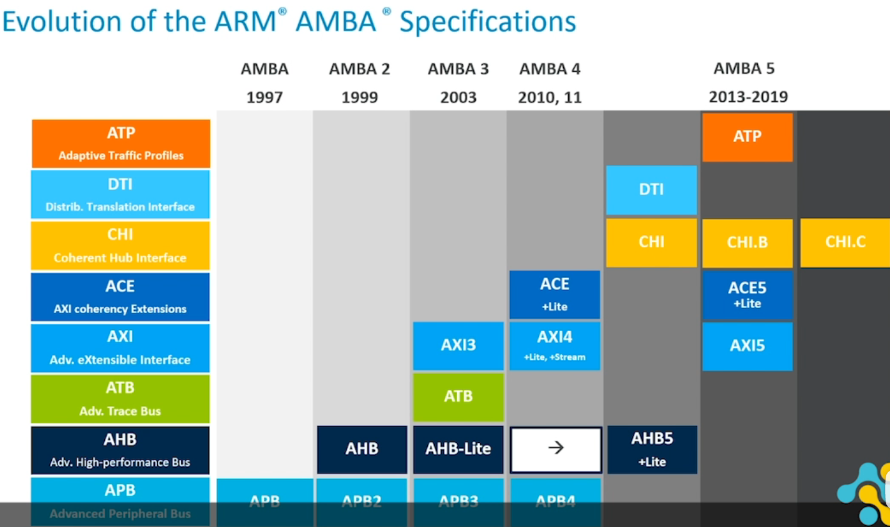

### 1.3 协议介绍

1、APB：高级外围设备总线（APB）用于连接低带宽的外围设备。它是一个简单的非流水线协议。读写操作共享同一组信号，不支持burst数据传输。是最容易学习的AMBA协议。
2、AHB：高级高性能总线（AHB）用于连接共享总线上需要更高带宽的组件。这些slave组件可以是内部内存或外部内存接口、DMA、DSP等。AHB可以通过burst数据传输来获得更高的带宽。
3，AHB-lite协议是AHB的一个简化版本。简化后**只支持一个主设计**，这消除了对任何仲裁、重试、分割事务等的需求。
4、高级可扩展接口（AXI）适合于高带宽和低延迟互连。这是一个点对点的互连，并克服了AHB、APB等共享总线协议在可连接的代理数量方面的限制性。该协议支持多个outstanding 的数据传输、burst数据传输、单独的读写通道和支持不同的总线宽度。
5，AXI-lite协议是AXI的简化版本，简化后不支持突发数据传输。
6，AXI-stream 协议是AXI协议的另一种风格，它只支持数据流从master 流到slave。与完整的AXI或AXI-lite不同，AXI-stream协议中没有单独的读/写通道，因为其目的是只在一个方向上流。
7，ACE-AXI协议是AXI4协议的扩展，应用于在一个芯片上集成多个CPU核心与一致性cache的场景。ACE协议扩展了AXI读写数据通道，同时引入了单独的snoop地址、snoop数据和snoop响应通道。这些额外的通道提供了实现基于snoop的一致性协议的机制。
8，ACE-Lite-对于没有自己cache的agents，但仍属于可共享一致性域的一部分，如DMA或网络接口agent，使用ACE-lite协议实现这种"单向"一致性。
9，CHI-ACE协议作为AXI的扩展而开发，以支持一致性互连。ACE协议使用了master/slave之间的信号电平通信，因此互连需要大量的线和增加的通道来进行snoops和响应。这对于具有2/4核移动SOC的小一致性clusters非常有效。随着SOC上集成越来越多的一致性clusters——AMBA5修订版引入了CHI协议。CHI协议使用基于分层分组的通信协议，具有协议、链路层和物理层实现，还支持基于QoS的流控制和重试机制。

## 2. APB

### 2.1 简介

- APB（Advanced Peripheral Bus）是AMBA总线的一部分，从1998年第一版至今共有3个版本。

```
AMBA2 APB：定义最基本的信号 interface, 读写 transfer, APB bridge, APB slave.

AMBA3 APB：增加定义信号 PREADY, PSLVERR 来支持 wait state  和 Error reporting  的功能。

AMBA4 APB：增加定义信号 PPROT, PSTRB  来支持 transaction protection 和 sparse data transfer 的功能。
```

- APB 是非流水线协议，用于连接低带宽和不需要高性能总线的外围设备，信号传输发生在时钟上升沿，每次传输至少需要两个时钟周期。

- APB 可以同 AHB、AHB-Lite、AXI、AXI4-Lite互连。

### 2.2 信号

| Signal  | Source                | Description                                                  |
| ------- | --------------------- | ------------------------------------------------------------ |
| PCLK    | Clock source          | 时钟，上升沿有效                                             |
| PRESETn | System bus equivalent | 复位，低有效（通常直连系统总线复位信号）                     |
| PADDR   | APB bridge            | 地址，位宽最高可达32 bits                                    |
| PPROT   | APB bridge            | 保护类型。该信号指示事务的正常、特权或安全保护级别，以及该事务是数据访问还是指令访问。（Protection type. This signal indicates the normal, privileged, or secure protection level of the transaction and whether the transaction is a data access or an instruction access.） |
| PSELx   | APB bridge            | 片选信号，由APB bridge 产生对每个外围从设备的片选信号        |
| PENABLE | APB bridge            | 使能信号，标记传输开始                                       |
| PWRITE  | APB bridge            | 读/写控制信号，高为写操作，低为读操作                        |
| PWDATA  | APB bridge            | 写数据，位宽最高可达32 bits                                  |
| PSTRB   | APB bridge            | Write strobes. This signal indicates which byte lanes to update during a write transfer. There is one write strobe for each eight bits of the write data bus. Therefore, PSTRB[n] corresponds to PWDATA[(8n + 7):(8n)]. Write strobes must not be active during a read transfer. |
| PREADY  | Slave interface       | 标记从机是否已将数据发送到总线，高有效                       |
| PRDATA  | Slave interface       | 读数据，位宽最高可达32 bits                                  |
| PSLVERR | Slave interface       | 传输错误指示。非必须，如果外设不包含该引脚，输入APB bridge默认为低 |

==**由于APB 协议 读写数据总线不包含握手信号，所以不支持同时读写**==

### 2.3 传输时序

#### 2.3.1 Write

分无等待和等待两种情况

**① With no wait states**

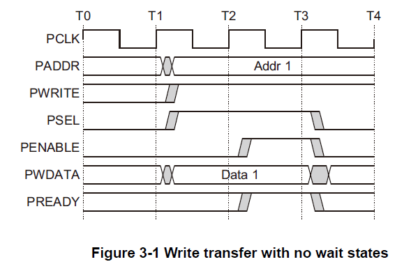

- T1 时刻， APB 将地址信息 PADDR 和写的数据 PWDATA 准备好，拉高 PWRITE 表示进入写，同时拉高 PSEL，从 IDLE 进入 SETUP
- T2 时刻，拉高 PENABLE，使得状态进入 ACCESS
- T3 时刻，检测到 PREADY 被拉高，也就是说 Slave 已经正确接收到数据，传输完成；PENABLE 拉低，PSEL 拉低

**② With wait states**

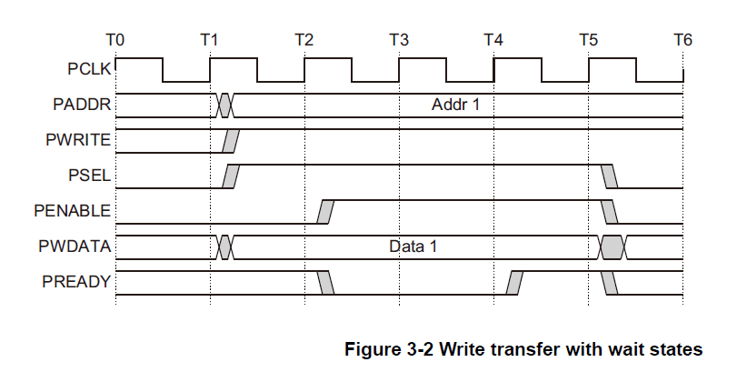

- T3时刻检测到PREADY为0，也就是说Slave还没有接收完数据，所以在此刻，下面信号必须保持，以便Slave能够继续采样；直到PREADY为1 ，说明Slave已正确接收到数据，传输完成，PENABLE 拉低，PSEL 拉低

==**注意：即使传输结束，也不要立即改变 address 和 data 信号，直到下一次传输才更新地址和数据。这样可以减少功耗**==

#### 2.3.2 Write stobes

PSTRB信号，用于指示写数据中哪些字节有效，PSTRB[n]  对应 PWDATA[(8n + 7):8n]，高有效

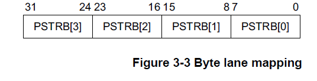

==**注意：在读操作过程中，所有PSTRB信号要保持低电平**==

#### 2.3.3 Read

读操作与写操作时序差不多

**① With no wait states**

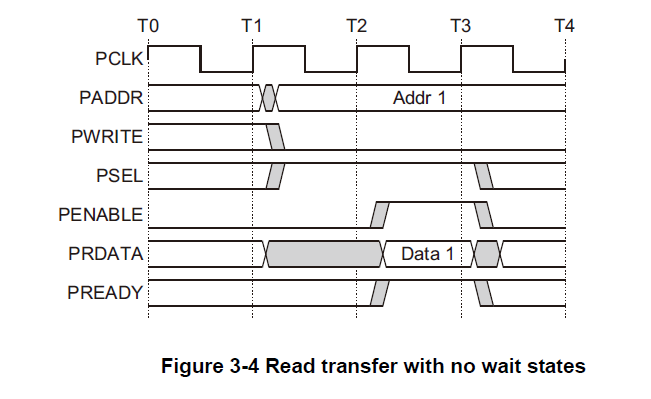

- T1时刻APB将地址信息PADDR准备好，拉低PWRITE表示进入读，同时拉高PSEL，从IDLE 进入SETUP 
- T2时刻也就是下一个时钟周期拉高PENABLE，使得状态进入ACCESS 
- T3时刻检测到PREADY 被拉高，也就是说Slave已经完成收据发送，PRDATA上就是来自Slave的数据，传输完成；PENABLE拉低，PSEL拉低

**② With wait states**

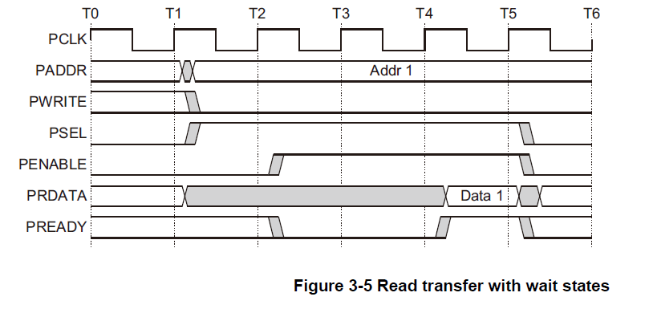

#### 2.3.3 Error response

- 在读和写的过程，可能出现错误，错误通过PSLVERR信号来指明；

- APB外围设备不要求必须支持PSLVERR引脚，当不使用该引脚时，应被置低；

- **PSLVERR 只有在传输的最后一个周期有效，且此时 PSEL、PENABLE、PREADY均为高。**

##### 2.3.3.1 Write transfer

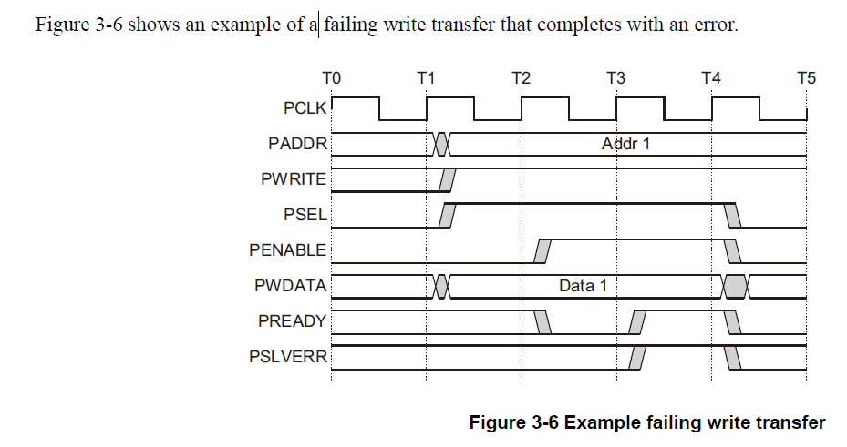 

##### 2.3.3.2 Read transfer

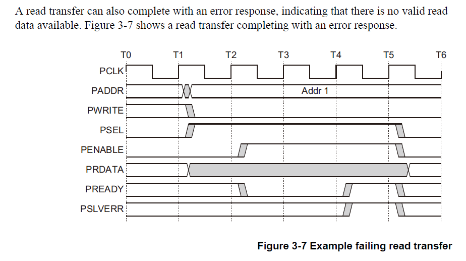

##### 2.3.3.3 Mapping of PSLVERR

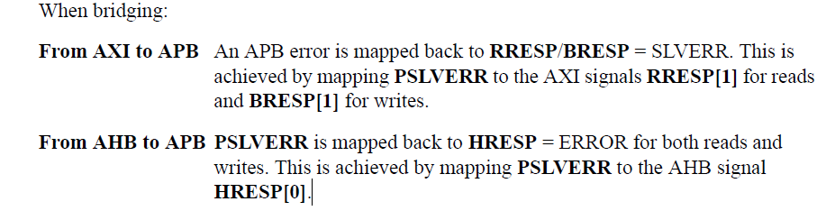

#### 2.3.4 Protection unit support

为了支持复杂的系统设计，互连和系统中的其他设备通常都需要提供防止非法交易的保护。对于APB接口，这种保护是由PPROT[2:0]信号提供的。

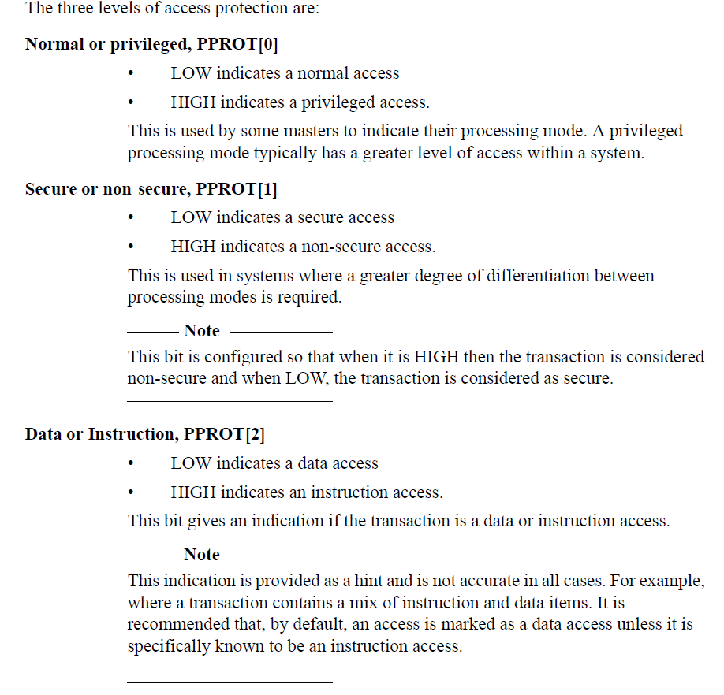

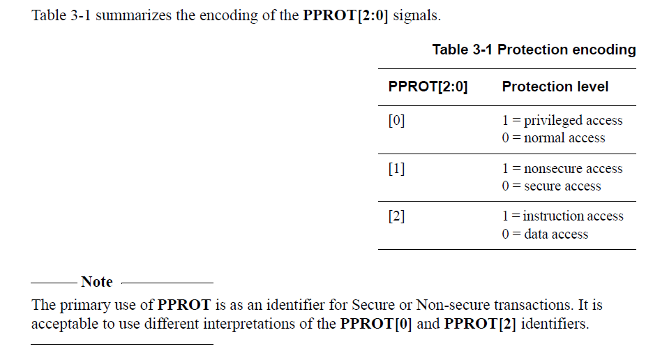

### 2.4 状态机

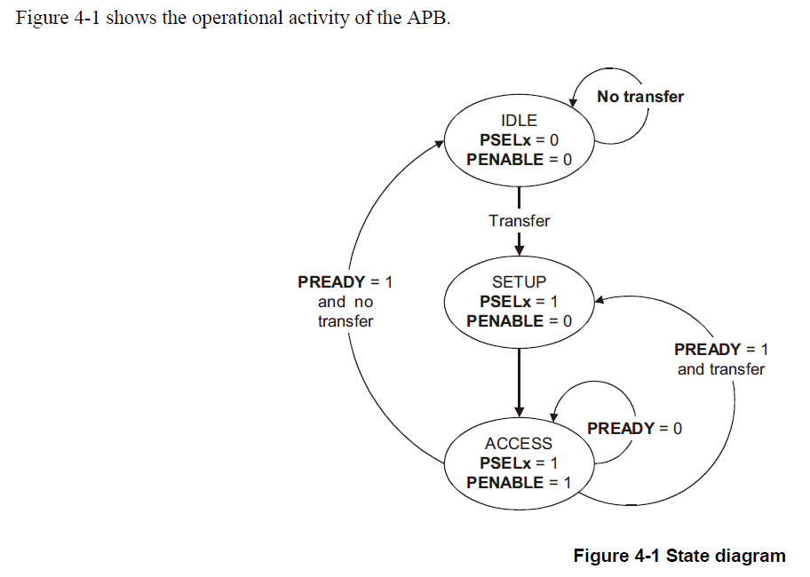

- **IDLE**：这个是APB的默认状态，也就是没有传输时候的状态；
- **SETUP**：当需要进行一个传输的时候，APB 首先进入这个状态；PSELx信号首先拉高；总线仅仅在SETUP状态停留一个时钟周期，然后接着在下一个时钟的上升沿进入ACCESS状态；
- **ACESS**：
  - 在SETUP状态转换到ACCESS，PENABLE 信号被拉高；在SETUP状态转换到ACCESS状态这段时间里，address，write，select 和 write data 信号必须保持稳定；
  - 处于ACESS状态下，如果PREADY为0，会让其继续处于ACCESS状态；否则，PREADY为1，如果还有传输则再次进入，SETUP-> ACCESS，如果没有传输，直接回到IDLE；

## 3. AHB

### 3.1 简介

- AHB（Advanced High-performance Bus）是一种适合高性能综合设计的总线接口。它定义了组件之间的接口，如 masters, interconnects, and slaves。
- AHB 从设备一般是内部存储设备、外部存储接口和高带宽外设，低带宽外设一般是通过APB总线，使用AHB2APB 桥接到APB总线。

### 3.2 信号

| Signals             | Name         | Source                             | Description                                                  |
| ------------------- | ------------ | ---------------------------------- | ------------------------------------------------------------ |
| **==Global==**      | HCLK         | Clock source                       | 时钟，上升沿有效                                             |
|                     | HRESETn      | Reset controller                   | 复位，低有效，复位整个系统和总线                             |
| **==Master==**      | HADDR[31:0]  | Slave and decoder                  |                                                              |
|                     | HBURST[2:0]  | Slave                              |                                                              |
|                     | HMASTLOCK    | Slave                              |                                                              |
|                     | HPROT[3:0]   | Slave                              |                                                              |
|                     | HPROT[6:4]   | Slave                              |                                                              |
|                     | HSIZE[2:0]   | Slave                              |                                                              |
|                     | HNONSEC      | Slave and decoder                  |                                                              |
|                     | HEXCL        | Exclusive Access Monitor           |                                                              |
|                     | HMASTER[3:0] | Exclusive Access Monitor and slave |                                                              |
|                     | HTRANS[1:0]  | Slave                              |                                                              |
|                     | HWDATA[31:0] | Slave                              | 最小位宽32bit                                                |
|                     | HWRITE       | Slave                              | 读/写控制信号，高为写操作，低为读操作（时序同地址信号，在一个突发内维持不变） |
| **==Slave==**       | HRDATA[31:0] | Multiplexor                        |                                                              |
|                     | HREADYOUT    | Multiplexor                        |                                                              |
|                     | HRESP        | Multiplexor                        | 告知mastar传输状态，低为OKAY，高为ERROR                      |
|                     | HEXOKAY      | Multiplexor                        |                                                              |
| **==Decoder==**     | HSELx        | Slave                              |                                                              |
| ==**Multiplexor**== | HRDATA[31:0] | Master                             |                                                              |
|                     | HREADY       | Master and slave                   | 高为前一个传输完成                                           |
|                     | HRESP        | Master                             | Transfer response, selected by the decoder.                  |
|                     | HEXOKAY      | Master                             | Exclusive okay, selected by the decoder                      |


### 3.3 传输时序

# 简介

## **PS 与 PL**

- PS：处理系统（Processing System），就是与FPGA无关的ARM是SoC的部分。
- PL：可编程逻辑（Programmable Logic）,就是FPGA部分。

## **AXI**

### 简介

- AXI 全称 “Advanced Extensible Interface ”，主要描述主设备和从设备之间的数据传输方式。AXI 是 ARM 公司提出的 AMBA（Advanced Microcontroller Bus Architecture）的一部分，是一种高性能、高带宽、低延迟的片内总线，也用来替代以前的 AHB 和 APB 总线。
- 第一个版本的 AXI（AXI3）包含在 2003年发布的 AMBA3.0 中， AXI 的第二个版本 AXI （AXI4）包含在 2010 年发布的 AMBA 4.0 之中。

### **AXI 协议**

​		主设备和从设备之间通过握手信号建立连接。当从设备准备好接收数据时，会发出 Ready 信号。当主设备的数据准备好时，会发出和维持 Valid 信号，表示数据有效。数据只有在 Valid 和 Ready 信号都有效的时候才开始传输。当这两个信号持续保持有效，主设备会继续传输下一个数据。主设备可以撤销 Valid 信号，或者从设备撤销 Ready 信 号终止传输。 AXI 的协议如图， T2 时，从设备的 Ready 信号有效， T3 时主设备的 Valid 信号有效，数据传输开始。

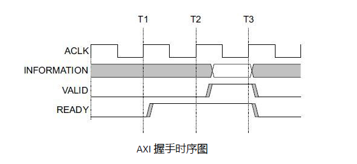

​		在 ZYNQ 中，支持 AXI-Lite，AXI4 和 AXI-Stream 三种总线，下表介绍这三种 AXI 接口的特性。

|  接口协议   |         特性         |      应用场合      |
| :---------: | :------------------: | :----------------: |
|  AXI4-Lite  |   地址/单数据传输    |   低速外设或控制   |
|    AXI4     |  地址/突发数据传输   |   地址的批量传输   |
| AXI4-Stream | 仅传输数据，突发传输 | 数据流和媒体流传输 |

- AXI4-Lite：

  具有轻量级、结构简单的特点，适合小批量数据、简单控制场合。不支持批量传输，读写时一次只能读写一个字（32 bit）。主要用于访问一些低速外设和外设的控制。

- AXI4：

  相比 AXI4-Lite ，增加了批量传输功能，可以连续对一片地址进行一次性读写。也就是说具有数据读写的 burst 功能。

​       上面两种均采用内存映射控制方式，即 ARM 将用户自定义 IP 编入某一地址进行访问，读写时就像在读写自己的片内 RAM ，编程也很方便，开发难度较低。代价就是资源占用过多需要额外的读地址线、写地址线、读数据线、写数据线、写应答线这些信号线。

- AXI4-Stream：

  这是一种连续流接口，不需要地址线（很像 FIFO ，一直读或一直写就行）。对于这类 IP ，ARM 不能通过上面的内存映射方式控制（ FIFO 根本没有地址的概念），必须有一个转换装置，例如 AXI DMA 模块来实现内存映射到流式接口的转换。 AXI Stream 适用的场合有很多：视频流处理；通信协议转换；数字信号处理；无线通信等。其本质都是针对数据流构建的数据通路，从信源（例如 ARM 内存、 DMA 、无线接收前端等）到信宿（例如 HDMI 显示器、高速 AD 音频输出，等）构建起连续的数据流。==这种接口适合做实时信号处理==。
