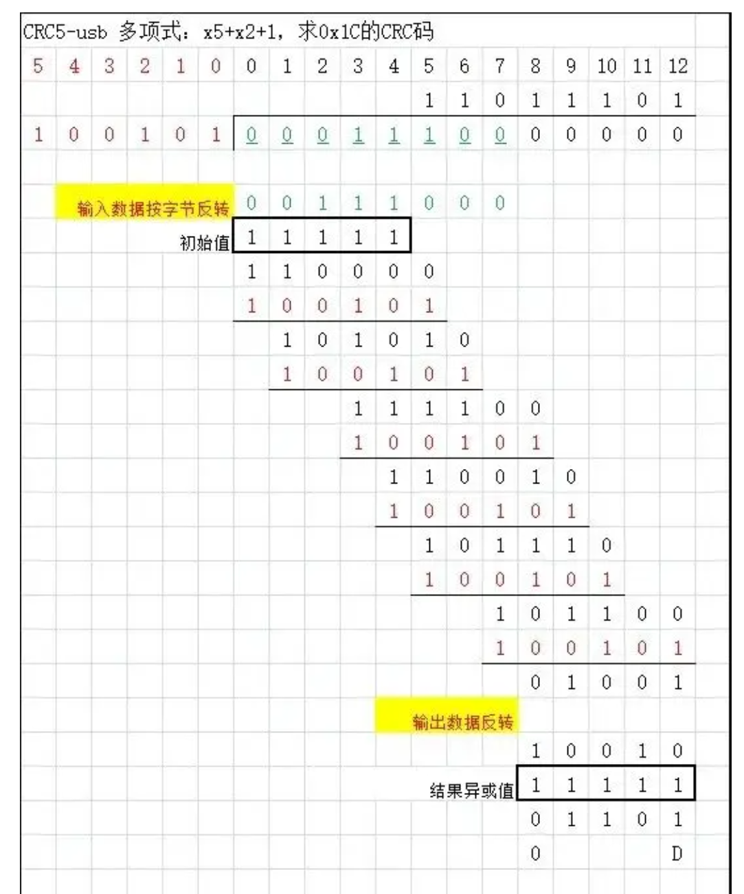
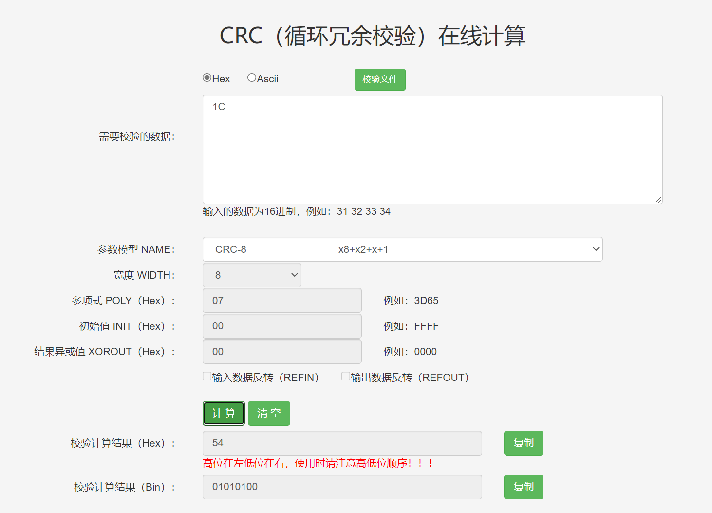
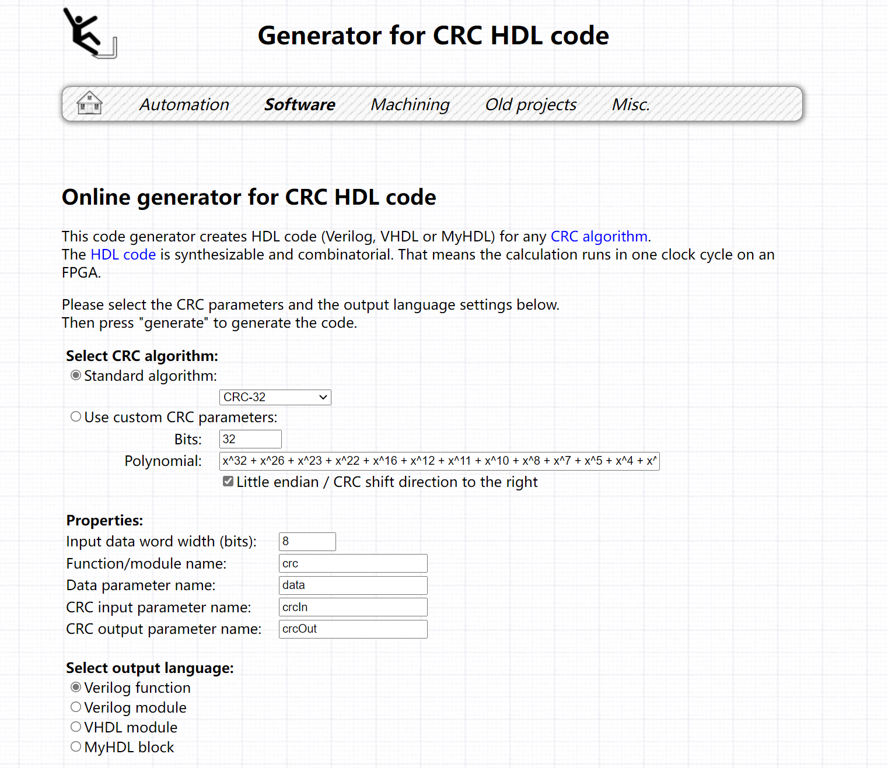

# CRC

- Author：hongjh
- Time：20220126
- Version: 1.0

---------

[TOC]

## 一、CRC介绍

[循环冗余校验](https://baike.baidu.com/item/循环冗余校验/3219009)（Cyclic Redundancy Check， CRC）是一种根据网络数据包或计算机文件等数据产生简短固定位数校验码的一种信道编码技术，主要用来检测或校验数据传输或者保存后可能出现的错误。它是利用除法及余数的原理来作错误侦测的。

CRC的目的是保证数据的完整性，其方法是在发送数据的后面再增加多余的若干位数据，接收方使用同样的CRC计算方法，检查接收到的数据CRC是否为0： 

- 如果为0，则表示数据是完整的，接收方可以开开心心的去处理这个数据。

- 如果不为0，则表示数据不完整/出错，接收方就需要处理下这个数据（一般是丢弃/要求重发）。 

**举例**：CRC5-usb，多项式：x5+x2+1，输入数据反转，输出数据反转，初始值0x1F，输出异或值0x1F。



**总结CRC计算过程：**

1. 如果输入数据反转为True，对输入数据**按字节反转**后作为被除数；否则直接将输入数据作为被除数。

2. 被除数补0，CRC码为几位就补几个0，CRC4补4个0，CRC5补5个0，...，CRC32补32个0。

3. 如果初始值不为0，第一步计算需要先把被除数同初始值做模二加法运算（异或）。

4. 进行二进制除法运算，求得余数，得到结果。(**==模二加减法实际上就是异或操作==**)
5. 如果输出数据反转为True，那么最终的结果还需要进行**按位反转**。

6. 如果结果异或值不为0，那么最后的结果需要同结果异或值做异或运算。

了解了CRC的原理，会发现：**输入初始值，输入数据反转，输出数据反转，结果异或值都只跟输入输出数据相关的，主要是多项式（Poly）的区别。** 

参考资料：

1. [史上解释CRC最清楚的文章 - 哔哩哔哩 (bilibili.com)](https://www.bilibili.com/read/cv12483775)

## 二、在线计算器

[CRC（循环冗余校验）在线计算_ip33.com](http://www.ip33.com/crc.html)

==注意：CRC参数模型不要参考这个，有些是错误的==



## 三、HDL代码生成器

[CRC代码生成器](https://bues.ch/cms/hacking/crcgen)



## 四、Python计算CRC

==注：这里用的是python3.10==，参数模型见下节。

```PYTHON
from re import A
import crcmod
import binascii
import struct
######################## CRC 校验介绍######################
# CRC即循环冗余校验码（Cyclic Redundancy Check）：是数据通信领域中最常用的一种查错校验码，
# 其特征是信息字段和校验字段的长度可以任意选定。循环冗余检查（CRC）是一种数据传输检错功能，
# 对数据进行多项式计算，并将得到的结果附在帧的后面，接收设备也执行类似的算法，以保证数据传输的正确性和完整性。
## CRC算法参数模型解释：
##    poly   : 生成多项式
##    initCrc: 算法开始时寄存器（crc）的初始化预置值，十六进制表示。
##    rev    : 判断输入每个字节是否按位反转; 在计算后之后，异或输出之前，整个数据是否按位反转
##    xorOut : 计算结果与次参数异或后得到最终的CRC值

## 官方网站  ：http://crcmod.sourceforge.net/crcmod.predefined.html
## 在线计算器：http://www.ip33.com/crc.html

######################## CRC 计算模型######################
crc32_func = crcmod.mkCrcFun(poly=0x104C11DB7, initCrc=0xFFFFFFFF, rev=True, xorOut=0xFFFFFFFF)    ## CRC-32
######################## 测试单个数据 ######################
# bData = b'\xAA'
# print("result:",hex(crc32_func(bData)))#,int(0x7394f613))))
######################## 读取文件数据、写结果 ######################
fp = open("F:\\Project\pyfile\\test_data\\test.hex", 'rb')
fp2 = open("F:\\Project\pyfile\\test_data\\test_result.txt", 'w')

a=0
bDataInit = 0
while True:
    tempByte = fp.read(1)
    if tempByte:
        bDataInit = crc32_func(tempByte,bDataInit)
        fp2.write("%d:\t%s\t%s\n" % (a,tempByte.hex() ,hex(bDataInit)))
        if a < 20 :
            print(a,": result:",hex(bDataInit))
        a=a+1
    else:
        print("Calculate Done!")
        print(a,": result:",hex(bDataInit))
        break
fp.close()
fp2.close()
```

## 五、CRC参考模型

**官方网址：**[crcmod.predefined – CRC calculation using predefined algorithms — crcmod v1.7](http://crcmod.sourceforge.net/crcmod.predefined.html)


---------

