# FPGA大串讲

- author：hongjh
- time：20211021
- version:

---------

[toc]

# 1 学习误区

问题一：verilog学习、软件思维

表现：

1. 入门就看Verilog，花几个月时间学习语法（Verilog 90%的语法是测试用的）
2. 把Verilog当C语言使用，软件思维，不知道会综合出来什么电路，设计的代码含有initial、#5、for循环、高阻态z、不定态x等语句（Verilog是“硬件描述语言”，不是“设计语言”）
3. 钻研Verilog语法，追求用最少的代码实现功能（衡量设计的好坏，不是看代码量，而是看综合出来的电路）

问题二：追求功能实现

1. 不停做I2C、串行接口、数码管等实验，只看功能实现没有，认为实现了功能就是完成了设计（企业20%的时间花在功能实现上，80%的时间花在质量上）
2. 认为FPGA逻辑设计很容易，认为算法实现才是高级的设计（“容易”皆因标准低。高标准：快速设计、资源少、速率满足、维护性强、可扩展）

问题三：

1. 错误认识：begin里面的代码是串行执行的
2. 纠结“<=”和"="的区别：记住一点就行，时序电路用“<=”，组合电路用“=”

# 2 FPGA知识大串联

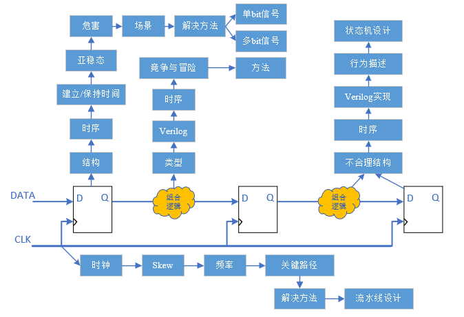

# 3 组合逻辑

## 3.1 类型

1. 门级逻辑

	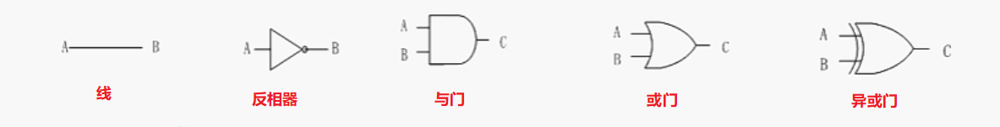

2. 选择器、比较器

	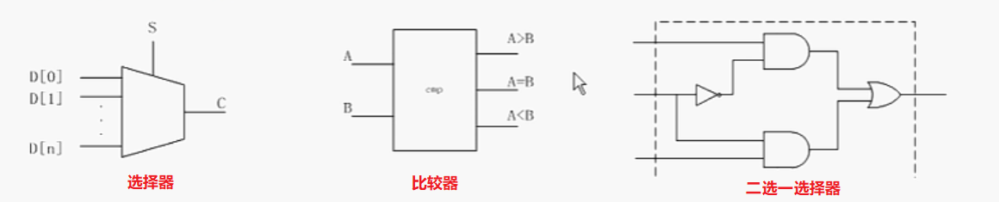

	本质上，选择器、比较器均是由与门、非门等门逻辑组合而成的功能电路。

3. 运算逻辑

	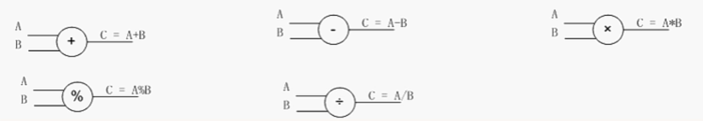

	本质上，运算逻辑均是由与门、非门等门逻辑组合而成的功能电路。

总结：

​		组合逻辑由以上逻辑组合成的电路。不能由门逻辑实现的均不能作为组合逻辑电路，不能综合（可综合原则）

## 3.2 Verilog


组合逻辑的Verilog，always后加 *


## 3.3 竞争与冒险

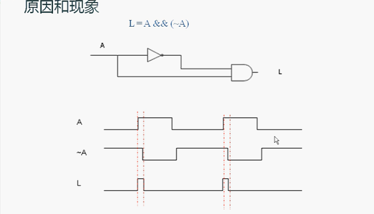

原因

1. 不要试图去消除竞争冒险，有组合逻辑，就必定有毛刺
2. 控制使用的场合即可

方法

1. D触发器对竞争冒险不敏感
2. 组合逻辑输出不要连到时钟、复位
3. 模块输出要寄存器输出


# 4 D触发器


# 5 时序逻辑

数字电路结构—正确结构

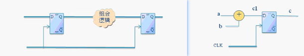

代码实现：

```verilog
always@(*)begin
    c1 = a+b;
end
always@(posedge clk)begin
    c <= c1;
end
//or
always@(posedge clk)begin
    c <= a+b;
end
```

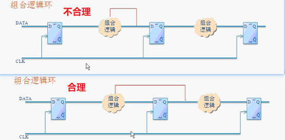

代码体现：

```verilog
always@(*)begin
    g = a+b+c+d;
end
always@(*)begin
    a = ~g;
end
```

为什么不合理？

如果组合逻辑实现取反操作，那么下一级寄存器采集到的是1还是0

不合理

组合逻辑当时钟

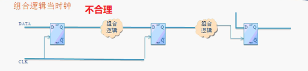

组合逻辑当复位

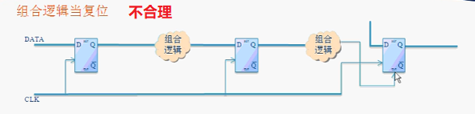

双沿触发

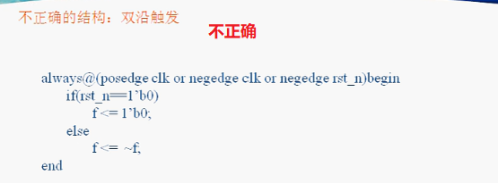

不推荐结构

寄存器输出当时钟

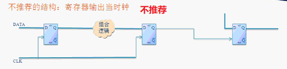

寄存器输出当复位，除了复位产生模块

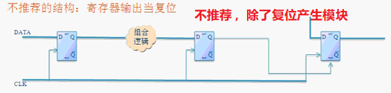

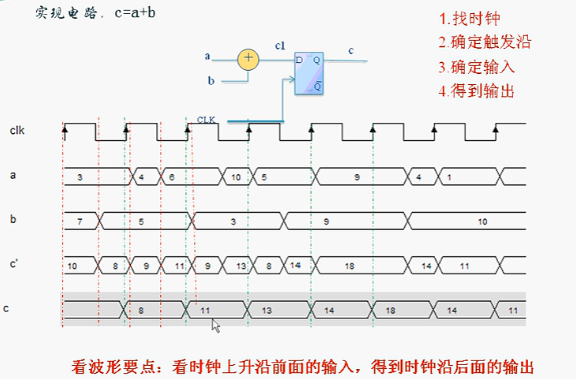


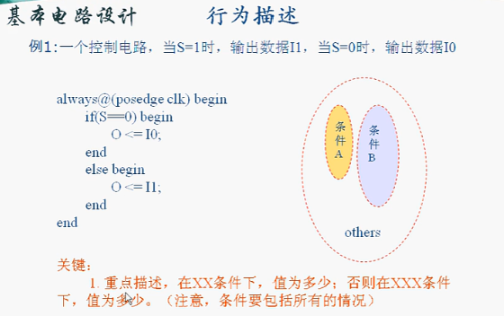

状态机设计

注意：三段式非三个always


# 6 FPGA时序

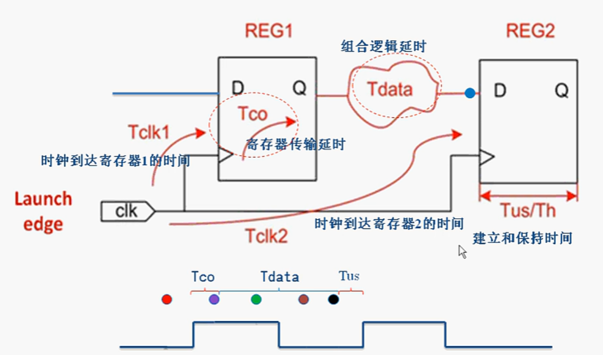

时钟要跑100M、200M、300M取决于哪些因素

最高时钟频率，即最小时钟周期==**T~min~=T~CO~+T~data~+T~su~**==

所以如果要提高时钟频率，只能更改==组合逻辑延时**T~data~**==

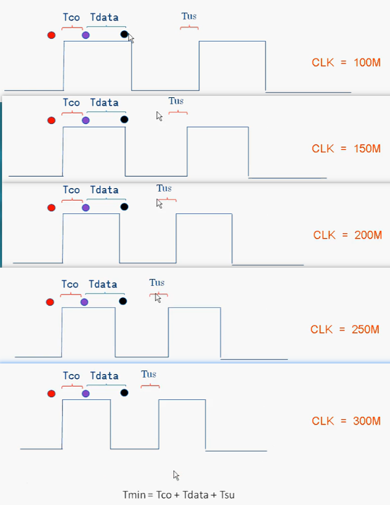


偏抖Skew，目的地 -   源

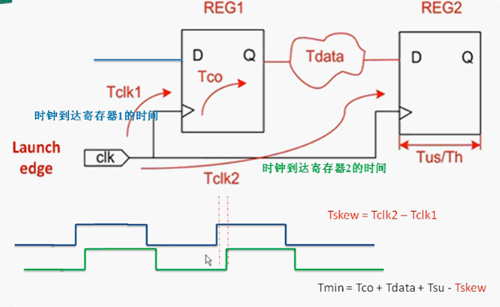


T~min~=T~CO~+T~data~+T~su~-==T~skew~==

skew为负数，对时序起恶化作用；

skew整数，对时序起改善作用


关键路径：延时最长的路径

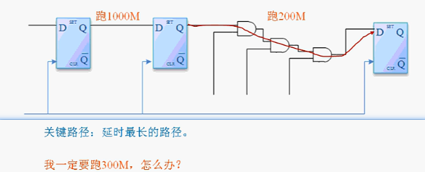

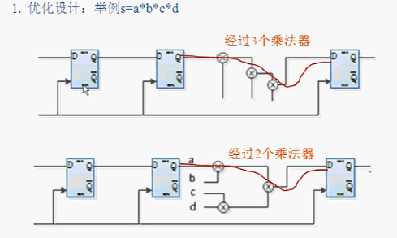

减少了一个乘法器延时

在设计的时候，工具会根据约束自动优化


下面工具没法自动优化：
中间插入一级寄存器

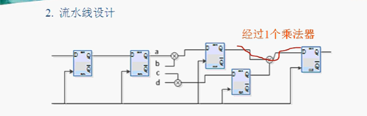

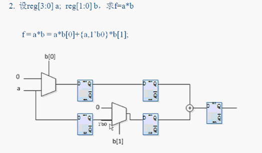

选择器和加法器还可以拆成与门、非门，直至拆成最简单的COM电路，基本是最高时钟了
