# 目录

---------

[toc]

----

# FPGA 知识点总结

## 1. FPGA 内部资源

### 1.1 什么是 FPGA

FPGA是一种可以重构电路的芯片，是一种硬件可重构的体系结构。Field Programmable Gate Array，中文名是**现场可编程门阵列**。通过编程，用户可以随时改变它的应用场景，它可以模拟CPU、GPU等硬件的各种并行运算。通过与目标硬件的高速接口互联，FPGA可以完成目标硬件运行效率比较低的部分，从而在系统层面实现加速。

### 1.2 FPGA 内部资源

目前主流的FPGA都采用了SRAM工艺的查找表（LUT）结构，LUT本质上就是个RAM。FPGA内部组成主要有：**可编程输入/输出块（IOB）、可配置逻辑块（CLB）、嵌入式块RAM（BRAM）、**丰富的**布线资源、底层内嵌功能资源、**内嵌专用**硬核**资源等。

#### 1.2.1 可编程输入/输出块（IOB）

为了便于管理和适应多种电气标准，FPGA的IOB被划分为若干个组（bank），每个bank的接口标准由其接口电压VCCO决定，一个bank只能有一种VCCO，但是不同的bank的VCCO可以不同。只有相同标准的端口才能连接在一起，VCCO电压相同是接口标准的基本条件。

#### 1.2.2 可配置逻辑块（CLB）

由查找表和可编程寄存器组成，查找表（LUT）完成纯组合逻辑，内部寄存器可配置成触发器或者锁存器。在Xilinx公司的FPGA器件中，CLB由多个（一般为4个或者2个）相同的Slice和附加逻辑构成。每个CLB模块不仅可以用于实现组合逻辑、时序逻辑，还可以配置为分布式RAM和分布式ROM。

**Slice**：Slice是Xilinx公司定义的基本逻辑单位，一个Slice由两个4输入的函数、进位逻辑、算术逻辑、存储逻辑和函数复用器组成。

- 算术逻辑包括一个异或门（XORG）和一个专用与门（MULTAND），一个异或门可以使一个Slice实现2bit全加操作，专用与门用于提高乘法器的效率；
- 进位逻辑由专用进位信号和函数复用器（MUXC）组成，用于实现快速的算术加减法操作；进位逻辑包括两条快速进位链，用于提高CLB模块的处理速度。
- 4输入函数发生器用于实现4输入LUT、分布式RAM或16比特移位寄存器（Virtex-5系列芯片的Slice中的两个输入函数为6输入，可以实现6输入LUT或64bit移位寄存器）（根据不同型号去看）；

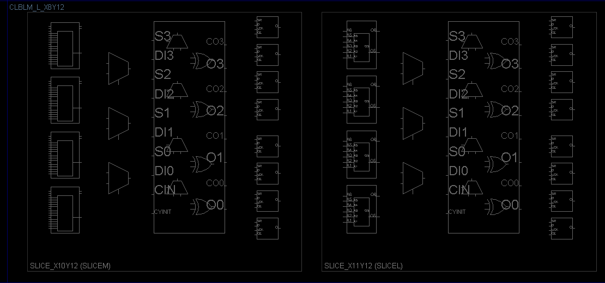

上图中左边为SliceM，右边为SliceL。

SliceM相比SliceL多出的功能在于可以配置成Distribute RAM（分布式RAM）；

SliceM相比SliceL多了做存储器和移位的功能；

SliceM相比SliceL中含有能够把LUT资源重新整合为RAM何ROM的逻辑。

**LUT**：目前FPGA中多使用4输入的LUT，所以每一个LUT可以看成一个有4位地址线的16x1的的RAM。当用户通过原理图或HDL语言描述了一个逻辑电路以后，FPGA开发软件会自动计算逻辑电路的所有可能结果，并把结果事先写入RAM，这样，每输入一个信号进行逻辑运算就等于输入一个地址进行 查表，找出地址对应的内容，然后输入即可。

- **分布式RAM（DRAM）**：查找表存储器

  只有成为SLICEM的逻辑块里的查找表(LUT)才可以用做分布式RAM。

  利用查找白哦为电路实现存储器，既可以实现芯片内部存储，又能提高资源利用率。**分布式RAM的特点是可以实现BRAM不能实现的异步访问。**不过使用分布式RAM实现大规模的存储器会占用大量的LUT，可用来实现逻辑的查找表就会减少。因此建议仅在需要小规模存储器时，使用这种分布式RAM。

#### 1.2.3 嵌入式块RAM

可配置成单端口RAM、双端口RAM、内容地址存储器（CAM）以及FIFO的常用的存储结构。Block RAM都有两套访问存储器所需的地址总线、数据总线及控制信号灯信号，因此其既可以作为单端口存储器，也可以作为双端口存储器。需要注意的是**访问BRAM需要和时钟同步，异步访问不支持的**。

- **单口RAM（Single Port RAM）：**只有一组数据线和地址线，因此读写不能同时进行。

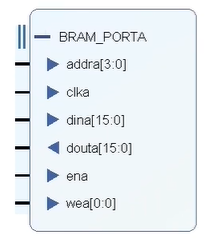

- **伪双口RAM（Simple Dual Port RAM）：**一个端口只读，另一个端口只写。

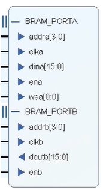

- **双口RAM（True Dual Port RAM）：**两个端口都可以读写。

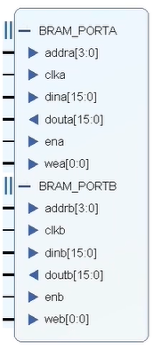

- **RAM构成：**
  比如在7系列的Xilinx器件中，每个36Kb的RAM由两个18Kb的RAM组成，每个BRAM有36Kbit的容量，既可以作为一个36Kbt的存储器使用，也可以拆分为两个独立的18Kbit存储器使用。反过来相邻两个BRAM可以结合起来实现72Kbit存储器，而且不消耗额外的逻辑资源。

  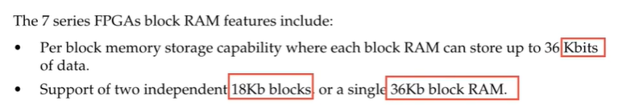

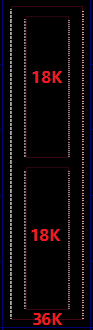

- **RAM资源使用：**
  在器件选择的时候我们可以看到使用器件的资源详细信息，比如XCKU040这款拥有600个RAM块。

  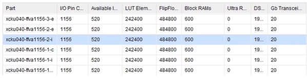

​	总容量：600×36Kb=21600Kb=21.1Mb。
​			我们例化一个RAM，看看资源占用情况：
​			数据深度：20480	宽度：18
​			占用BRAM内存：20480×18=20×18Kbit=10×36Kbit
  		  通过以上的分析正好为10个36Kbit，应该占用10个36Kb的BRAM即10个BRAM.

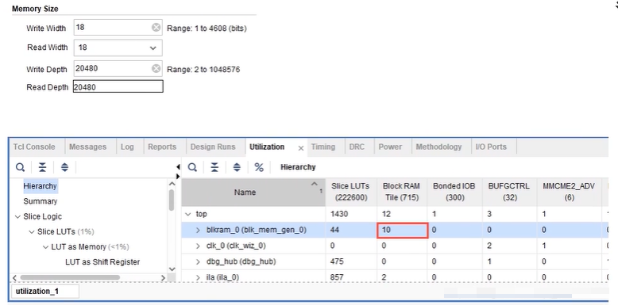

**调用ILA也是会消耗BRAM的资源的**
	    ILA IP配置如下：

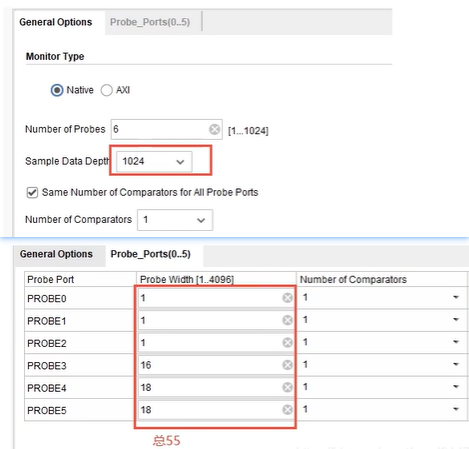

ila数据总宽度：55	ila数据深度：1024
		55*1024=56320=55Kbits
		需要BRAM至少55/36=1.52→2个（往上取整）。

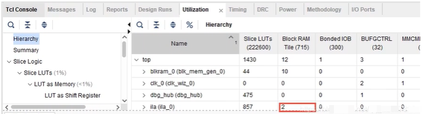

#### 1.2.4 丰富的布线资源

布线资源连通FPGA内部的所有单元，而连线的长度和工艺决定信号在连线上的驱动能力和传输速度。主要分为四类：**全局布线资源、长线资源、短线资源、分布式布线资源**，FPGA中的布局布线资源主要包括三部分：CB、SB和行列连线。布线资源的目的是为了能够让位于不同位置的逻辅资源块、时钟处理单元、BRAM、DSP和接口模块等资源能够相互通信，从而协调合作，完成所需功能。FPGA中的布线资源，就好比绘制PCB板时的连线资源一样，虽然器件A和器件B的位置和连接关系没有任何改变，但很可能因为周边电路的布局、布线的一些变化，使得前后两次A、B之间的连线形态发生很大的变化。因此，与采用固定长度的金属线将所有宏单元连接在一起的CPLD不同，FPGA中任意两点之间的线延迟是无法预测的，必须等到布局、布线完成之后才能确定。**这也是为什么在FPGA的开发中，时序约束和时序分析这两样工作是必不可少的。**

#### 1.2.5 底层内嵌的功能单元

主要包括DLL、PLL、DSP、CPU等，现在越来越丰富的内嵌功能单元，便得FPGA称为了系统级的设计工具，使其具备了软硬件联合设计的能力。

- **PLL：**
  PLL的英文全称是Phase Locked Loop，即锁相环，是一种反馈控制电路。
  锁相环作为一种反馈控制电路，其特点是**利用外部输入的参考信号控制环路内部震荡信号的频率和相位**。因为锁相环可以实现输出信号频率对输入信号频率的自动跟踪，所以锁相环通常用于闭环跟踪电路。锁相环在工作的过程中，当输出信号的频率与输入信号的频率相等时，输出电压与输入电压保持固定的相位差值，即输出电压与输入电压的相位被锁住，这就是锁相环名称的由来。

#### 1.2.6 内嵌专用的硬核资源

内嵌的专用硬核是相对底层软核而言的，指FPGA处理能力强大的硬核，等效于ASIC电路。主要有乘法器、高速收发器、PCle、以太网控制器等。

## 2. 同步时钟、同步/异步电路

### 2.1 相位、频率、时间同步

- **相位同步**

  相位时间（Phase Time）指时钟信号与理想信号在对应的有效瞬间（一般指上升沿或者下降沿）的延迟时间，简称为“相位”。**相位即时延**。

  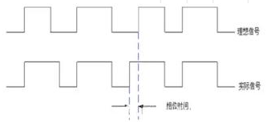

  **相位同步**又称为时间同步（时间延迟同步），**指时钟信号的有效沿**（上升沿或者下降沿)**同步**。

  如图所示，信号A和B是相位同步，信号C和A不是相位同步。

  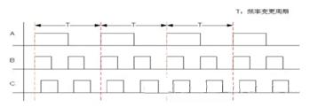

- **频率同步**

  **频率同步指两个信号的变化频率相同或者保持固定的比例。**信号的相位可以不一致，频率也可以不一致。
  如图所示，信号A、B和C是频率同步。

  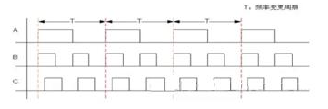

### 2.2 同相位、同源、同时钟域时钟

- **同相位时钟**

  即相位相同，也就是说**时钟的有效沿必须同步**（有效沿为上升沿或者下降沿）。

  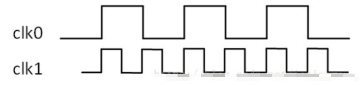

- **同源时钟**

  同源时钟，通常由一个PLL或者DLL产生，相位不需要相同，**只要求相位固定**。
  同源时钟即时钟产生的**源头相同**，同源时钟在传输过程中通过的组合逻辑电路如果不相同，则两个同源时钟的有效沿的延迟也就不同，但是却是固定的，也就是相位是固定的。

- **同时钟域时钟**

  **同时钟域的时钟既是同源时钟，还要求相位相同并且频率相同**，通常是同一个PLL产生的频率相同相位相同的时钟，PLL能够保证两个时钟在不同的情况下（如温度不同）的偏差在精度范围内。从波形上看，同时钟域两个时钟频率一样，跳变沿完全对称。但是从波形上看两个时钟频率一样，跳变沿完全对称的不一定是同时钟域时钟，如两个PLL输出的看似相同的时钟不是同一个时钟域的，例如在不同的温度下，就不能保证两个时钟的偏差。

### 2.3 同步/异步时钟

当两个时钟的相位关系是固定关系，则可以称这个时钟为同步时钟（synchronous clock），经过一个PLL产生相位不同，但是相位固定的两个时钟，他们依旧是同步时钟。而如果是两个晶振产生的时钟，因为两个晶振在上电时相位差是随机的，而且不同晶振时钟漂移抖动也不一样，所以相位是不固定的。当无法判断两个时钟间的相位时，则可以称这两个时钟为异步时钟（asynchronous clocks）。

### 2.2 同步/异步电路

- **同步时序电路**
  同步时序逻辑特点：<u>各触发器时钟端全部连接在一起，并接在系统的时钟兰，只有当时钟脉冲到来时，电路的状态才改变，改变后的状态会一直保持到下一个时钟脉冲的到来。</u>
  - 电路核心逻辑是用各种触发器实现
  - 电路主要信号、输出信号等都是在某个时钟沿驱动触发器产生的；
  - 同步时序电路可以很好的避免毛刺；
  - 利于器件移植；
  - 利于静态时序分析（STA）、验证设计时序性能。
- **异步电路**
  异步时序逻辑特点：<u>电路没有统一的时钟，电路中除了可以便用器时钟的触发器外，还可以便用不蓄时钟的触发器和延迟元件作为存储元件。电路状态的改变是由外部输入的变化直接引起的。</u>
  - 电路核心逻辑是用组合电路实现；
  - 异步时序电路的最大缺点是容易产生毛刺；
  - 不利于器件移植；
  - 不利于静态时序分析（STA）、验证设计时序性能。

## 3. 同步复位/异步复位

### 3.1 同步复位

同步复位只有在时钟沿到来时复位信号才起作用，则复位信号持续的时间应该超过一个时钟周期才能保持系统复位。

#### 3.1.1 Verilog代码

```VERILOG
//同步复位
module top(
	input  clk,
    input  rst_n,
    input  a,
    
    output reg b
);
    
always@(posedge clk)begin
    if(!rst_n)
        b <= 1'b0;
    else
        b <= a;
end
endmodule
```

#### 3.1.2 RTL视图

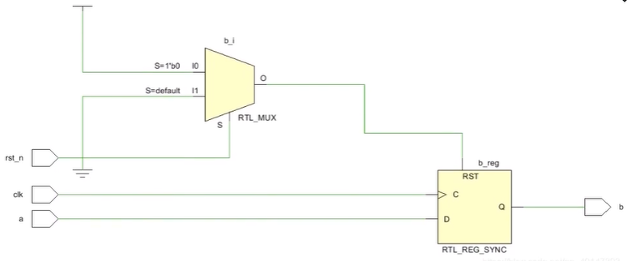

#### 3.1.3 优点&缺点

- **优点**

  一般能够保证电路百分百同步。确保复位只发生在有效沿，可以作为过滤掉毛刺的手段。

- **缺点**

  复位信号的有效时长必须大于时钟周期，才能真正被系统识别并完成复位。同时还要考虑如：时钟偏斜、组合逻辑路径延时、复位延时等因素。由于大多数的厂商目标库内的触发器都只有异步复位端口，采用同步复位的话，就会耗费较多的逻辑资源。

### 3.2 异步复位

只要有复位信号系统马上复位，有些噪声也能使系统复位，因此异步复位抗干扰能力差，因此有时候闲不稳定，要想设计一个好的复位最好使用异步复位同步释放。

#### 3.2.1 Verilog代码

```VERILOG
//同步复位
module top(
	input  clk,
    input  rst_n,
    input  a,
    
    output reg b
);
    
always@(posedge clk or negedge rst_n)begin
    if(!rst_n)
        b <= 1'b0;
    else
        b <= a;
end
endmodule
```

#### 3.2.2 RTL视图

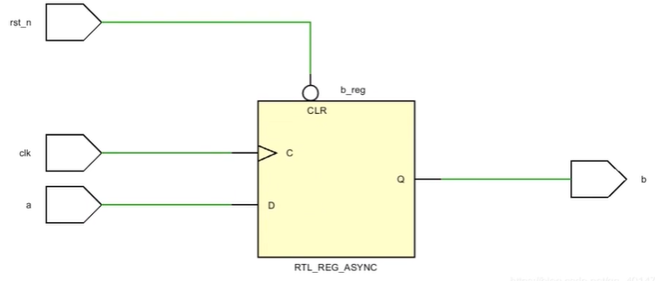

#### 3.2.3 优点&缺点

- **优点**

  异步复位信号识别方便，而且可以很方便的使用全局复位。由于大多数的厂商目标库内的触发器都有异步复位端口（CLR）（在这个端口一般接低电平有效的复位信号nRst，即使设计中是高电平复位，实际综合后也会把异步复位信号反向后接到CLR端）可以节约逻辑资源。

- **缺点**

  复位信号容易受到毛刺的影响。复位结束时刻恰在亚稳态窗口内（建立时间或者保持时间之内）时，无法决定现在的复位状态是1还是0，会导致亚稳态。

### 3.3 异步复位同步释放

使用异步复位同步释放就可以消除上述缺点。所谓“异步复位，同步释放”就是在复位信号到来的时候不受时钟信号的同步，而是在复位信号释放的时候受到时钟信号的同步，为了消除亚稳态的产生，利用两个同一时钟沿触发的层叠寄存器，将异步信号同步化。

####  3.3.1 Verilog代码

```VERILOG
//异步复位，同步释放
module top(
	input  clk,
    input  rst_n,
    input  a,
    
    output reg b
);
reg rst_n_r, rst_n_rr;
wire rst_sync_n;
always@(posedge clk or negedge rst_n)begin
    if(!rst_n)
        {rst_n_rr,rst_n_r} <= 2'b0;
    else
        {rst_n_rr,rst_n_r} <= {rst_n_r,rst_n};
end
    
//assign rst_sync_n = rst_n_rr;    
always@(posedge clk or negedge rst_sync_n)begin
    if(!rst_sync_n)
        b <= 1'b0;
    else
        b <= a;
end
endmodule
```

#### 3.2.2 RTL视图

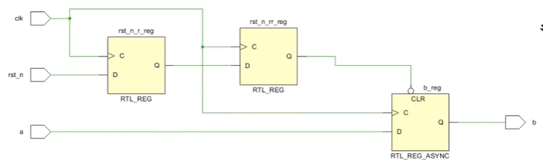

 

## 4. 同步FIFO/异步FIFO

FIFO本质上还是RAM，是一种先进先出的数据缓存器（先存入的数据先取出）。它与普通存储器的区别：没有外部读写地址线，只能顺序写入数据，顺序的读出数据，其数据地址由**内部读写指针自动加1**，不像其他存储器可以由地址线决定读取或写入某个指定的地址，异步FIFO读写时钟不同，读写是相互独立的。

**一般用途：**

1. 跨时钟域多bt传输：读写可以由不同的时钟控制，使用异步FIFO可以在两个不同时钟系统之间快速方便的传输数据。
2. 数据匹配：对于不同宽度的数据接口可以使用FIFO，比如写入数据宽度为8bit，读取数据宽度为16bit，通过FIFO数据缓存器就可以达到数据匹配。

### 4.1 同步FIFO

同步FIFO的写时钟和读时钟为同一个时钟，FIFO内部所有逻辑都是同步运辑，常常用于交互数据缓冲。

- **FIFO空、满信号的检测**
  		在设计FIFO时最重要的就是空满信号的检测，FIFO的主要是通过空（empty）信号、满信号（ful）来控制数据的读写的，如果FIFO为空还读取数据势必会出现数据的错误，FIFO已满再写数据就会导数FIFO溢出同样会导致数据出错。那FIFO的空、满信号是怎么产生的呢。

  ​		首先我们要明白读写FIFO的时候我们不用操作读写地址，但是我们在**写入数据或者读出数据时FIFO内部会通过写入或读出数据的操作在内部进行地址的自动增加**。当FIFO满或者空时我们通过内部读写地址的特征就会判断出FIFO的状态。
  ​		例如我们设计深度为8的FIFO即最大可以存放8个数据，地址所需位数为3，在设计FIFO时我们将地址为扩展为4位**根据我们的扩展位可以判断FIFO的空满状态**。

- **8深度的FIFO经过以下4个操作：（下面方框代表地址）**

1. 当FIFO为空时，读指针为0_000B，写指针为0_000B，此时FIFO里面没有数据，FIFO的状态为空。

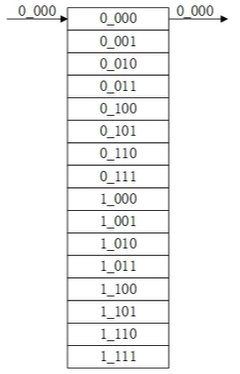

 2. 当FIF0写入8个数据时，写指针指向1_000B，读指针还为0_000B，此时FIFO里有8个数据，FIFO状态应该为满。

	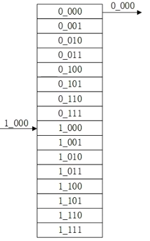

 3. 当FIFO读出8个数据时，写指针还指向1_000B，读指针为1_000B，此时FIFO里面没有数据，FIFO的状态为空。

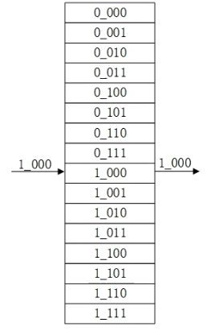

4. 向FIFO再写入8个数据，写指针指向0_000B，读指针还为1_000B，此时FIFO里有8个数据，FIFO状态应该为满。

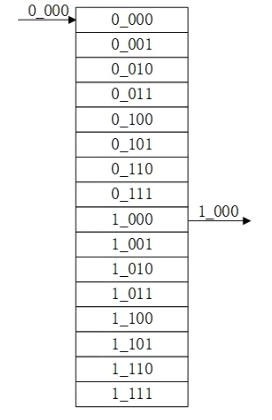

通过上述观察发现地址除了最高位余下的3位为地址0-7的循环。

- **判断FIFO空的条件：读写地址完全相同。**
- **判断FIFO满的条件：读写地址的最高位不同其余位均相同。**

#### 4.1.1 Verilog代码

设计深度为16，数据位宽为16的同步FIFO

```verilog
//深度16 位宽16
module top#(
    parameter  depth = 16,
    parameter  width = 16
)(
    input               clk,
    input               rst_n,
    input               wr_en,
    input  [width-1:0]  data_in,

    input               rd_en,
    output [width-1:0]  data_out,

    output              full,
    output              empty
);

reg [width-1:0] mem [depth-1:0];    //深度16 位宽16的mem
reg [4:0]       waddr;              //写指针
reg [4:0]       raddr;              //读指针
reg [width-1:0] temp_rdata;

//写指针
always@(posedge clk or negedge rst_n)
begin
    if(!rst_n)
        waddr <= 5'b0_0000;
    else if(wr_en == 1'b1)
        waddr <= waddr + 1'b1;
    else
        waddr <= waddr;
end

//读指针
always@(posedge clk or negedge rst_n)
begin
    if(!rst_n)
        raddr <= 5'b0_0000;
    else if(rd_en == 1'b1)
        raddr <= raddr + 1'b1;
    else
        raddr <= raddr;
end

//写数据
always@(posedge clk)
begin
    if(!full)
        mem[waddr] <= data_in;
    else
        mem[waddr] <= mem[waddr];
end

//读数据 1 latency
assign data_out = temp_rdata;
always@(posedge clk or negedge rst_n)
begin
    if(!rst_n)
        temp_rdata <= {width{1'b0}};
    else if(!empty)
        temp_rdata <= mem[raddr];
    else
        temp_rdata <= temp_rdata;
end

//空信号判断
assign empty = (waddr == raddr)? 1'b1:1'b0;

//满信号判断
assign full = ({~waddr[4], waddr[3:0]} == raddr)? 1'b1:1'b0;

endmodule
```

#### 4.1.2 testbench

```VERILOG

```


#### 4.1.3 仿真波形


### 4.2 异步FIFO

异步FIFO的写时钟和读时钟为异步时钟，FIFO内部的写逻辑和读逻辑的交互需要异步处理，异步FIFO常用于跨时钟域交互。因为FIFO为异步设计，读写都有不同的时钟，读写是相互独立的，因为空满信号的判断是借助于读写地址进行的，所以涉及到了不同的时钟域，当二进制读地址从0111向1000变化时，地址所有位都要变化，如果写时钟恰好在读地址的变化时刻采样，写所得到的读地址值有可能是从0000到1111中的任何一个（即**亚稳态的发生**），可以采用格雷码形式。**由于格雷码每次只变化一位，采用格雷码可以降低亚稳态的发生概率**。


格雷码表：

| **十进制数** | **二进制数** | **格雷码** |
| :----------: | :----------: | :--------: |
|      0       |     0000     |    0000    |
|      1       |     0001     |    0001    |
|      2       |     0010     |    0011    |
|      3       |     0011     |    0010    |
|      4       |     0100     |    0110    |
|      5       |     0101     |    0111    |
|      6       |     0110     |    0101    |
|      7       |     0111     |    0100    |
|      8       |     1000     |    1100    |
|      9       |     1001     |    1101    |
|      10      |     1010     |    1111    |
|      11      |     1011     |    1110    |
|      12      |     1100     |    1010    |
|      13      |     1101     |    1011    |
|      14      |     1110     |    1001    |
|      15      |     1111     |    1000    |

二进制转格雷码：

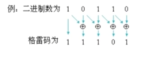

```Verilog
assign grey_code = (bin_code >> 1) ^ bin_code;
```


## 5. FIFO最小深度计算

### 5.1 FIFO最小深度

在数据的传输中当读速率慢于写速率时，FIFO便可被用作系统中的缓冲元件或队列，类似于水流经过一个缓冲区，上游水流速度快，下游水流速度慢，部分水就可以被缓存在中间的缓冲区，但是上游与下游的水速差距过大，就会导致流入中间缓存区的水超出了缓存区承受能力导致水的溢出，不能顺利到达下游。在上游水流速度最大，下游水流速度最小的情况下，中间缓冲区不能溢出的大小就是我们关系的问题。

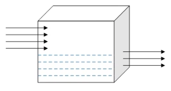

同理，读写速率差距过大，FIFO深度太小，就会导致一段时间内向FIFO灌输的数据超出了FIFO的承受能力，就会导致数据的丢失，该容量取决于读写数据的速率。所以在写速率最大，读速率最小时，这时正好不导致数据溢出的FIFO的深度就是我们要计算的FIFO最小深度。

 总结：**要确定FIFO的深度，关键在于计算出在突发读写的这段时间内有多少数据没有被读走。也就是说FIFO的最小深度就等于没有被读走的数据个数。**

### 5.2 示例分析

#### **示例一（写入速率 > 读取速率）**

 A/D采样率为50MHz，读A/D的速率为40MHZ，要不丢失地将10万个采样数据送入FPGA，在A/D和FPGA之间至少加多大容量（深度）的FIFO才可以？

写一个数据所需的时间为：

​														1 / 50MHz = 0.02 × 10^-6^ s

写完所有数据所需的时间为：

​										       	100,000 × 0.02 × 10^-6^ = 0.002 s

读一个数据所需的时间为：

​														1 / 40MHz = 0.025 × 10^-6^ s

0.002 s 内读走的数据为：

​										 0.002 / （0.025 × 10^-6^）= 0.08  × 10^6^  = 80,000

则FIFO的最小深度为：

​                           100,000 - 80,000 = 20,000（0.002s 还没被读走的数据的个数）

（如果读比写慢几拍，则深度比 20,000 略大）

#### **示例二（FIFO写入时钟为100MHz，读取时钟为80MHz）**

**①：传输2000个数据，FIFO最小深度为多少？**

100MHz时钟写入一个数据需要的时间为：

​									1 / 100MHz = 10 ns

写入2000个数据所需的时间为：

​									2,000 × 10 = 20000 ns

80MHz时钟读出一个数据需要的时间为：

​									1 / 800MHz = 12.5 ns

2000 ns读出的数据个数为：

​									2000ns / 12.5 ns =  1600

剩余FIFO中没有读走的数据个数为：

​									2000 - 1600 = 400

所以FIFO的最小深度为400.

-----

**②：100个时钟写入80个数据，1个时钟读1个数据，求FIFO的最小深度**

100MHz时钟写入一个数据需要的时间为：

​										1 / 100MHz = 10 ns	

80MHz时钟读出一个数据需要的时间为：

​									1 / 80MHz = 12.5 ns

100个时钟写入80个数据，可以理解为，100个时钟包含80个有效写时钟，20个空闲时钟。

 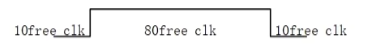

但是在什么情况下会出现突发写入数据最多呢，在两个100个时钟，前一个100个时钟的后80个时钟在写数据，后100个时钟的前80个数据在写数据，也就是如下所示：

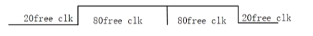

在这种情况下，以100MHz的时钟一次写入了160个数据。

写入160个数据所需的时间为：

​										160 × 10ns = 1600 ns

1600ns 读取的数据个数为

​										1600ns/12.5ns = 128

FIFO内剩余的数据为：

​										160 - 128 = 32

所以FIFO最小深度为32

----

**③：100个时钟写入80个数据，3个时钟读1个数据，求FIFO的最小深度**

**④：100个时钟写入80个数据，3个时钟读2个数据，求FIFO的最小深度**

同理，都是计算FIFO内剩余个数，取大于该个数2的n次幂深度。

## 6. 逻辑电平

|      电压       |                 说明                 |
| :-------------: | :----------------------------------: |
| V<sub>OH </sub> |            输出高电平门限            |
| V<sub>IN </sub> |            输入高电平门限            |
| V<sub>T </sub>  | 阈值电压（电路刚刚勉强能翻转的电压） |
| V<sub>IL </sub> |            输入低电平门限            |
| V<sub>OL </sub> |            输出低电平门限            |

**关系：V<sub>OH </sub> > V<sub>IH </sub> > V<sub>T </sub> > V<sub>IL </sub> > V<sub>OL </sub>**

### 6.1 TTL电平标准

TTL（Transistor-Transistor Logic），晶体管-晶体管逻辑电平。工作于TTL接口标准下的数字电路，其内部的有源器件的标准电源供给应为5V。输出输入如下：

| 输入 | 逻辑1的电压要求大于或等于2.0V，逻辑0的电压要求小或等于0.8V |
| ---- | ---------------------------------------------------------- |
| 输出 | 逻辑1的电压要求大于或等于2.4V，逻辑0的电压要求小或等于0.5V |

**对于输出、输入端的电压要求，可以看出输出端的电压输出要求要比输入端的双阈值判定标准更加严格，这样做主要是考虑到噪声的干扰以及电信号在输出与输入间的传输速度，从而让双阈值判定更加可靠，下同。**

### 6.2 LVTTL电平标准

由于2.4V到5V之间还有很大空间，这对改善噪声干扰并没有明显的提高，而且会增加系统的功耗，并且由于数字逻辑1、0之间电平相差较大，还会影响到数字电路的响应速度。所以产生了LVTTL-Low Voltage Transistor-Transistor Logic，即低压TTL电平标准。LVTTL又有LVTTL3V3和LVTTL2V5：

**1）LVTTL3V3**

内部有源器件的标准电源供给为3.3V，如我们常用的部分单片机，输出、输入情况如下：

| 输入 | 逻辑1的电压要求大于或等于2.0V，逻辑0的电压要求小或等于0.8V |
| ---- | ---------------------------------------------------------- |
| 输出 | 逻辑1的电压要求大于或等于2.4V，逻辑0的电压要求小或等于0.4V |

**2）LVTTL2V5**

内部有源器件的标准电源供给为2.5V，输出、输入情况如下：

| 输入 | 逻辑1的电压要求大于或等于1.7V，逻辑0的电压要求小或等于0.7V |
| ---- | ---------------------------------------------------------- |
| 输出 | 逻辑1的电压要求大于或等于2.0V，逻辑0的电压要求小或等于0.2V |

==TTL使用注意：==TTL电平一般过冲都会比较严重，可能在始端串22欧或33欧电阻；TTL电平输入脚悬空时是内部认为是高电平，要下拉的话应用1k以下电阻下拉。TTL输出不锣驱动CMOS输入。

### 6.3 COMS电平标准

CMOS（Complementary Metal Oxide Semiconductor），这种接口电平标准初衷是用于基于CMOS、PMOS组成的MOS管结构的数字系统之间的。工作于CMOS接口标准下的数字电路。其内部有源器件电源供给为5V，输入输出如下：

| 输入 | 逻辑1的电压要求大于或等于1.45V，逻辑0的电压要求小或等于0.5V |
| ---- | ----------------------------------------------------------- |
| 输出 | 逻辑1的电压要求大于或等于3.5V，逻辑0的电压要求小或等于1.5V  |

COMS与TTL接口相比，有了更大的噪声容限，并且其输入阻抗也远大于TTL输入阻抗。

### 6.4 LVCOMS电平标准

同TTL一样，鉴于功耗和响应速度的考虑，CMOS也同样行生出了LVCOMS接口标准，并且由于COMS管相对于三极管的导通门限更加低，因此 LVCOMS 比 LVTTL 更容易使用较低的电压进行通信。

**1）LVCOMS3V3**

内部有源器件的标准电源供给为Vcc=3.3V

| 输入 | 逻辑1的电压要求大于或等于2.0V，逻辑0的电压要求小或等于0.7V |
| ---- | ---------------------------------------------------------- |
| 输出 | 逻辑1的电压要求大于或等于3.2V，逻辑0的电压要求小或等于0.4V |

**2）LVCOMS2V5**

内部有源器件的标准电源供给为Vcc=2.5V

| 输入 | 逻辑1的电压要求大于或等于1.7V，逻辑0的电压要求小或等于0.7V |
| ---- | ---------------------------------------------------------- |
| 输出 | 逻辑1的电压要求大于或等于2.0V，逻辑0的电压要求小或等于0.4V |

**3）LVCOMS1V8**

内部有源器件的标准电源供给为Vcc=1.8V，当然这是由一定容忍度的，与之前介绍的电平标准不同，这个容忍度会影响它的输入输出情况：

| 输入 | 逻辑1的电压要求大于或等于0.65倍Vcc，逻辑0的电压要求小或等于0.35倍Vcc |
| ---- | ------------------------------------------------------------ |
| 输出 | 逻辑1的电压要求大于或等于Vcc-0.45V，逻辑0的电压要求小或等于0.45V |

如果Vcc精确为1.8V：

| 输入 | 逻辑1的电压要求大于或等于1.17V，逻辑0的电压要求小或等于0.63V |
| ---- | ------------------------------------------------------------ |
| 输出 | 逻辑1的电压要求大于或等于1.35V，逻辑0的电压要求小或等于0.45V |

**4）LVCOMS1V5**

内部有源器件的标准电源供给为Vcc=1.5V

| 输入 | 逻辑1的电压要求大于或等于0.65倍Vcc(0.975V)，逻辑0的电压要求小或等于0.35倍Vcc(0.525V) |
| ---- | ------------------------------------------------------------ |
| 输出 | 没有明确要求，但是肯定是逻辑1越接近Vcc越好，逻辑0越接近0V越好 |

**5）LVCOMS1V2**

内部有源器件的标准电源供给为Vcc=1.2V

| 输入 | 逻辑1的电压要求大于或等于0.65倍Vcc(0.78V)，逻辑0的电压要求小或等于0.35倍Vcc(0.42V) |
| ---- | ------------------------------------------------------------ |
| 输出 | 没有明确要求，但是肯定是逻辑1越接近Vcc越好，逻辑0越接近0V越好 |

CMOS使用注意：CMOS结构内部寄生有可控硅结构，当输入或输入管脚高于VCC一定值（比如一些芯片是0.7V）时，电流足够大的话，可能引起闩(shuan)锁效应，导致芯片的烧毁。

### 6.5 RS232

RS232总线标准共设有25条信号线，RS232的标准电源供给为±12V或±15V。

| 逻辑1 | -15~3V |
| :---: | :----: |
| 逻辑0 | 3~15V  |

### 6.6 RS485

RS485采用差分的形式来传递信息的，因此抗干扰要优于RS232。

| 逻辑1 |  两线之间的电压差要求为2~6V之间  |
| :---: | :------------------------------: |
| 逻辑0 | 两线之间的电压差要求为-6~-2V之间 |

### 6.7 ECL、PECL、LVPECL

ECL:Emitter Coupled Logic 发射极耦合逻辑电路（差分结构）：

速度快，驱动能力强，噪声小，很容易达到几百M的应用。但是功耗大，需要负电源。

|       Vcc       |   0V   |
| :-------------: | :----: |
|       Vee       | -5.2V  |
| V<sub>OH </sub> | -0.88V |
| V<sub>OL </sub> | -1.72V |
| V<sub>IH </sub> | -1.24V |
| V<sub>IL </sub> | -1.36V |

为简化电源，出现了PECL（ECL结构，改用正电压供电）和LVPECL。

**1）PECL**

|       Vcc       |  5V   |
| :-------------: | :---: |
| V<sub>OH </sub> | 4.12V |
| V<sub>OL </sub> | 3.28V |
| V<sub>IH </sub> | 3.78V |
| V<sub>IL </sub> | 3.64V |

**2）LVPECL**

|       Vcc       | 3.3V  |
| :-------------: | :---: |
| V<sub>OH </sub> | 2.42V |
| V<sub>OL </sub> | 1.58V |
| V<sub>IH </sub> | 2.06V |
| V<sub>IL </sub> | 1.94V |

==ECL、PECL、LVPECL使用注意：==不同电平不能直接驱动。中间可用交流耦合、电阻网络或专用芯片进行转换。以上三种均为射随输出结构，必须有电阻拉到一个直流偏置电压。（如多用于时钟的LVPECL：直流匹配时用130欧上拉，同时用82欧下拉；交流匹配时用82欧上拉，同时用130欧下拉。但两种方式工作后直流电平都在1.95V左右。）

### 6.8 LVDS

前面的电平标准摆幅都比较大，为降低电磁辐射，同时提高开关速度又推出LVDS电平标准。

LVDS：Low-Voltage Differential Signaling  差分对输入输出，内部有一个恒流源3.5-4mA，在差分线上改变方向来表示0和1。通过外部的100欧匹配电阻（并在差分线上靠近接收端）转换为±350mV的差分电平。LVDS使用注意：可以达到600M以上，PCB要求较高，差分线要求严格等长，差最好不超过10mil（0.25mm）。100欧电阻离接收端距离不能超过500mil，最好控制在300mil以内。

### 6.9 CML

CML：是内部做好匹配的一种电路，不需再进行匹配。三极管结构，也是差分线，速度能达到3G以上。只能点对点传输。

### 6.10  GTL

**GTL：**类似CMOS的一种结构，输入为比较器结构，比较器一端接参考电平，另一端接输入信号。1.2V电源供电。

|       Vcc        |  1.2V   |
| :--------------: | :-----: |
| V<sub>OH  </sub> | >=1.1V  |
| V<sub>OL  </sub> | <=0.4V  |
| V<sub>IH  </sub> | >=0.85V |
| V<sub>IL  </sub> | <=0.75V |

**PGTL/GTL+:**

|       Vcc        |  1.5V   |
| :--------------: | :-----: |
| V<sub>OH  </sub> | >=1.4V  |
| V<sub>OL  </sub> | <=0.46V |
| V<sub>IH  </sub> | >=1.2V  |
| V<sub>IL  </sub> | <=0.8V  |

### 6.11 HSTL

HSTL 是主要用于QDR存储器的一种电平标准：一般有VCCIO=1.8V和VCCIO=1.5V。和上面的GTL相似，输入为比较器结构，比较器一端接参考电平（VCCIO/2），另一端接输入信号。对参考电平要求比较高（1%精度）。

### 6.12 SSTL

SSTL主要用于DDR存储器。和HSTL基本相同。VCCIO=2.5V，输入为比较器结构，比较器一端接参考电平1.25V，另一端接输入信号。对参考电平要求比较高（1%精度）。HSTL和SSTL大多用在300M以下。

## 7. 建立时间与保持时间

### 7.1 建立时间与保持时间概述及模型

- **建立时间（T<sub>su </sub>）**：在时钟采样沿之前，数据必须保持稳定的时间，该时间量称为建立时间。

- **保持时间（T<sub>h </sub>）**：在时钟采样沿之后，数据必须保持稳定的最短时间。

理想最优的建立时间和保持时间出现在数据中间采样的位置，如下所示，实质就是使触发器在采样沿得到稳定的数据，如果数据在时钟上升沿的建立保持时间内{latch edge-setup，latch edge+hold time}发生跳变，则会产生亚稳态输出，即输出值在短时间内处于不确定态，有可能是1，有可能是0，也可能什么都不是，处于中间态。

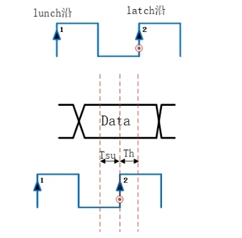

在出现沿打沿的现象时会出现建立时间最大值或者保持时间最大值。

理想建立时间或保持时间最大值：

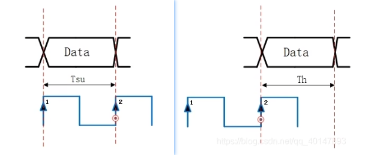

### 7.2 寄存器之间数据传输时建立时间与保持时间

寄存器数据传输的模型：数据从在Reg1到Rg2，理想情况下采样沿到达Reg2时，数据的中间位置到达Reg2的数据端，这样出现最优的建立时间和保持时间，此时采样的数据也是最稳定的，如果时钟早到或者数据早到就会产生余量，严重的情况下就会产生时序为例。

数据和时钟到达Rg2最优情况，采样沿位于数据的中间位置：

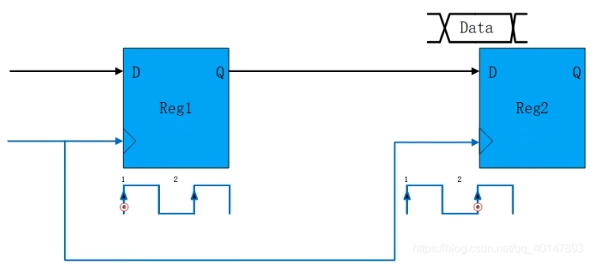

出现建立时间最大值，采样沿与数据结束位置对齐；出现保持时间最大值，采样沿与数据起始位置对齐。如下如所示：

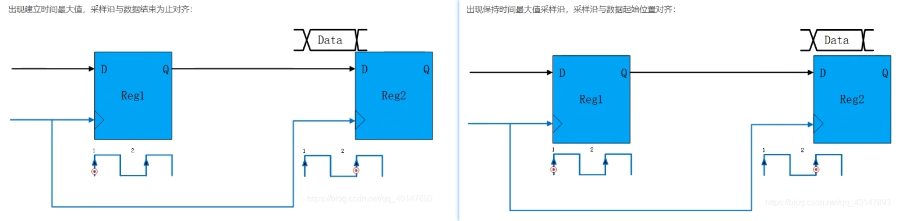

### 7.3 建立时间余量与保持时间余量计算

在实际的数据传输中器件和线路均会存在延迟，寄存器间数据传输模型如下所示：

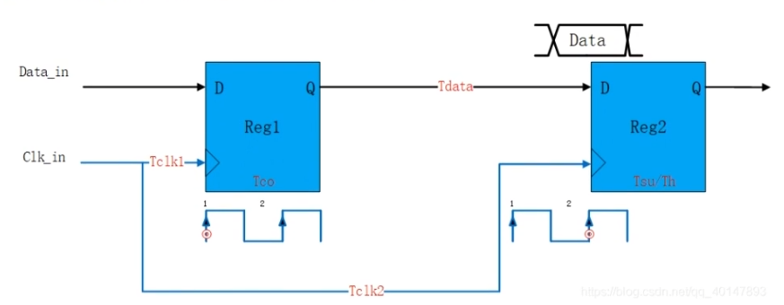

Tclk1：时钟到达Reg1的时钟延时。

Tco：数据从Reg1器件D到Q的物理延时。

Tck2：时钟到达Reg2的时钟延时。

Tdata：数据从Reg1的Q端到Reg2的D端的线路延时。

Tsu/Th：建立时间/保持时间。

----

**建立时间余量（Setup Slack）：要求数据到达时间和数据实际到达时间的差值。**

实际考虑线路延时时数据从Reg1到Reg2的时序图如下所示：

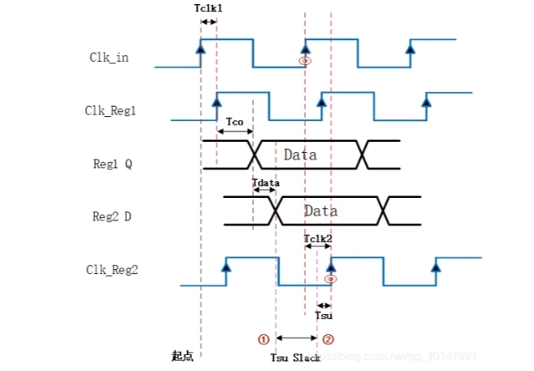

- Clk_in：输入时钟。
- Clk_Reg1：Clk_in 经过 Tclk1时延到达Reg1的时钟
- Reg1_Q：数据从Reg1的D端进入到达Q端经过Tco时延的数据。
- Reg2_D：数据从Reg1的Q端输出经过Tdata时延到达Reg2的D端的数据.
- Clk_Reg2：Clk_in经过Tclk2时延到达Reg2的时钟.

通过上图观察：（Tcycle为一个时钟周期）

要求数据达到的时间=Tcycle+Tclk2-Tsu（图中②）

实际数据到达的时间=Tclk1+Tco+Tdata（图中①)

==建立时间余量（Setup Slack）=Tcycle+Tclk2-Tsu-（Tclk1+Tco+Tdata)==

----

**保持时间余量（Hold Slack）：数据实际结束位置和要求数据结束位置的差值。**

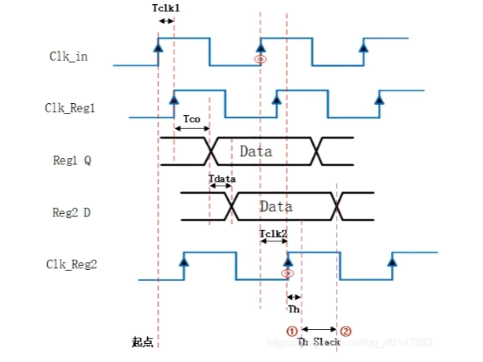

通过上图观察：（Tcycle为一个时钟周期)

实际数据结束的时间=Tcycle+Tclk1+Tco+Tdata（图中②）

要求数据结束的时间=Tcycle+Tclk2+Th（图中①)

==保持时间余量（Hold Slack）=Tcycle+Tclk1+Tco+Tdata - (Tcycle+Tclk2+Th）==

上面的公式中可以看出建立时间余量（Hold Slack）与时钟周期Tcycle无关，所以时钟频率与保持时间余量无关。

### 7.4 FPGA允许的最大时钟频率或最小时钟周期

通过上面的推导时钟周期和频率与保持时间无关，所以在建立时间余量为0时取得最大时钟频率，即最小时钟周期。

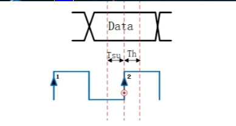

### 7.5 计算FPGA时钟所允许的最大频率或最小时钟周期

**例：计算建立时间余量Setup Slack与系统时钟允许的最大时钟领率Fmax**

时钟周期为10ns；Clkin到Reg1的时延为3ns；Clkin到Reg2的时延为2ns；Reg1_Q端到Reg2_D端的时延为3ns；Tsu=0.5ns：Tco=1ns；建立时间余量？FPGA允许的最大时钟频率？

==建立时间余量（Setup Slack）=Tcycle+Tclk2-Tsu-（Tclk1+Tco+Tdata)==

Setup Slack=10+2-0.5-(3+1+3)=4.5ns

建立时间余量为0时取得最大时钟频率，即最小时钟周期

Fmax =1/(Tcycle-Setup Slack)=1/(10-4.5)

----

**例：计算保持时间余量Hold Slack与系统时钟允许的最大时钟频率Fmax**

时钟周期为10ns；Clkin到Reg1的时延为3ns；Clkin到Reg2的时延为2ns；Reg1_Q端到Reg2_D端的时延为3ns；Th=0.5ns：Tco=1ns；保持时间余量？FPGA允许的最大时钟频率？

==保持时间余量（Hold Slack）=Tcycle+Tclk1+Tco+Tdata - (Tcycle+Tclk2+Th）==

Hold Slack=3+1+3-2-0.5=4.5

Fmax与保持时间余量无关。

----

另一种模型（给出时钟偏斜），其实和上面一样，Tskew=Tclk2-Tclk1

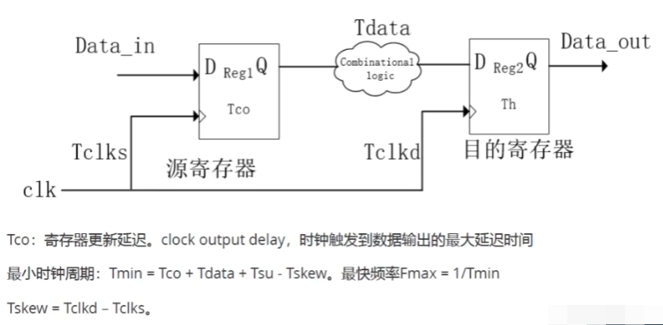

----

另一种模型（不给出时钟延迟）：

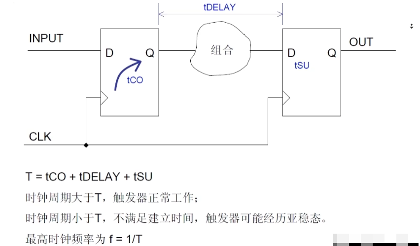

时钟到达的时间为：Tcycle（就是采样沿和发射沿的时间，其实就是一个时钟周期)

数据到达的时间为：Tco+Tdelay

要求数据到达的时间为：Tcycle-Tsu

数据实际到达的时间为：Tco+Tdelay

触发器正常工作条件为，建立时间余量大于0

TsuSlack = Tcycle-Tsu-（Tco+Tdelay)>0，即Tcycle>Tsu+Tco+Tdelay触发器才能正常工作。

### 7.6 违反建立和保持时间会发生什么

在触发器建立期间，如果数据在时钟上升沿的建立保持时间内{latch edge-setup，latch edge+hold time}发生跳变，则会产生亚稳态输出，即输出值在短时间内处于不确定态，有可能是1，有可能是0，也可能什么都不是，处于中间态。

## 8. Recovery Time 和 Removal Time

在同步电路中，为了防止亚稳态，输入数据需要与时钟满足setup time和hold time才能进行数据的正常传输。

对于异步复位奇存器来说，为了防止亚稳态，同样异步复位信号和时钟满recovery time和removal time才能有效进行复位操作和复位释放操作。简而言之，复位置位信号不要在clk的有效跳变沿发生变化。

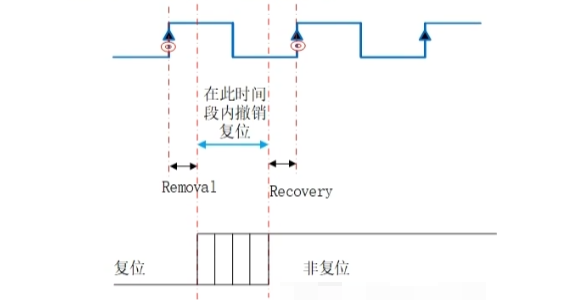

- **recovery time：恢复时间（不要影响下一个有效时钟沿）**
	在撤销复位时，复位信号到非复位状态必须在时钟有有效沿到来之前一段时间到达。

- **removal time：移除时间（不要影响上一个有效时钟沿）**

	在撤销复位时，在时钟沿来临时之后复位信号还要保持的时间（异步复位信号撤销时离上一个有效时钟沿的最小时间长度）

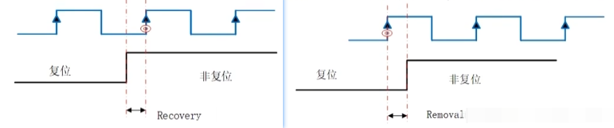

## 9. 亚稳态

亚稳态，是因为违反寄存器的建立时间和保特时间产生的。

逻辑电路中绝大多数的时序问题基本都是因为这个原因产生的。由于寄存器在任何信号通路中都有特定的建立和保特时间，这要求输入信号要保持稳定，在触发器建立期间，如果数据在时钟上升沿的建立保持时间内{latch edge-setup，atch edge+hold time}发生跳变，则会产生亚稳态输出，即输出值在短时间内处于不确定态，有可能是1，有可能是0，也可能什么都不是，处于中间态，这个未知的状态便称为亚稳态。

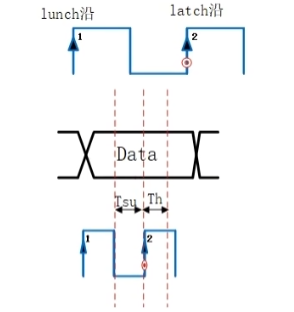

**常见的情况：**

1. 输入信号是异步信号
2. 时钟偏移抖动高于容限值（时钟信号质量不好）
3. 跨时钟域信号传输
4. 复位电路设计

**降低亚稳态的概率：**其实就是避免余量出现负值。

==建立时间余量（Setup Slack）=Tcycle+Tclk2-Tclk1-Tsu-Tco-Tdata==

==保持时间余量（Hold Slack）=Tclk1- Tclk2+Tco+Tdata -Th==

1. 跨时钟域信号传输可以使用FIFO进行数据缓冲
2. 复位电路采用异步复位、同步释放处理
3. 用反应更快的FF
4. 改善时钟质量，用边沿变化快速的时钟信号
5. 降低系统时钟频率

## 10. 竞争与冒险

### 10.1 竞争与冒险产生原因

观察以下门电路，Gata1为非门，Gate2为与门，实现了逻辑

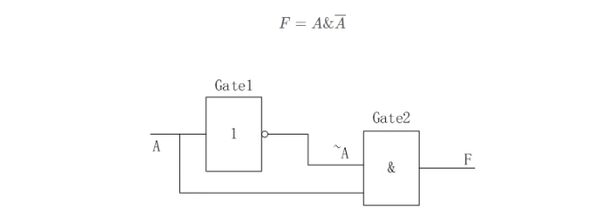

理想情况下输入与输出的关系为：

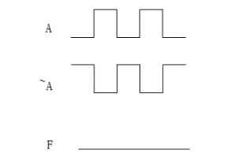

但是由于门电路的输入到输出是一定会有时间延迟的，这个时间通常叫做电路的开关延迟，就会导致出现以下毛刺。（Gate1输入到输出有一定的延迟，导致~A信号就会滞后于A一段时间）


**竞争：**信号由于不同路径传输到达某一汇合点的时间有先有后的现象。（当一个门的输入有两个或两个以上的变量发生改变时，由于这些变量是经过不同路径产生的，使得他们的状态改变的时刻有先有后，这种时差引起的现象称为竞争。）
**冒险：**由于竞争现象所引起的电路输出发生瞬间错误（产生干扰脉冲)的现象。

### 10.2 判断电路是否存在竞争-冒险现象

**代数法：**只要输出函数中出现互补信号，就存在竞争冒险的可能。


**卡诺图法：**观察卡诺图中是否有两个圈相切但不相交的情况，如有则存在竞争-冒险的现象。
以下卡诺图代表组合逻辑电路的逻辑表达式为

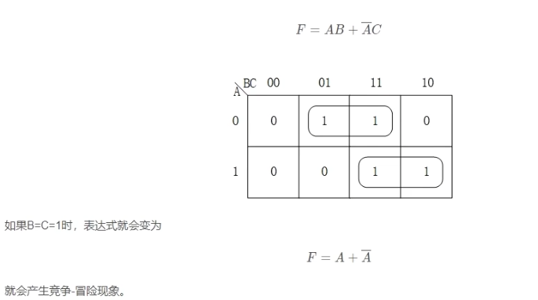

**实际中：**实际上逻辑电路级数多、输入变量多，判断竞争冒险非常复杂，广泛采用仿真和实际测量逻辑电路来观察是否存在竞争冒险的现象。

### 10.3 消除竞争与冒险

当组合电路的某一部分存在竞争冒险现象时，可能危及电路的正常工作。因此必须消除竞争冒险，以提高电路的可靠性。消除竞争冒险的方法有以下几种：

1. **接入滤波电容**
    在逻辑电路较馒的速度下工作，为了消除竞争冒险，可以在输出端并联一个电容器，其容量为4-2pF，这时在输出端不会出现逻辑错误，该方法只能用于对波形和延迟时间要求不严格的情况。

  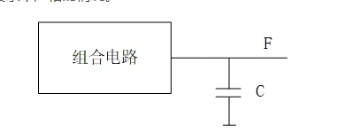

  为什么在输出端接入滤波电容就会消除冒险现象呢？
  简单可以理解为电容通高频阻低频，尖脉冲直接对地短路，消除了尖脉冲，稳定了输出。

  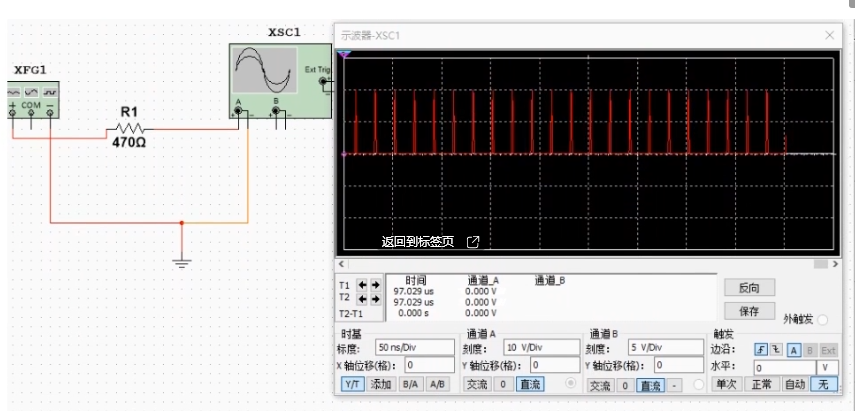

  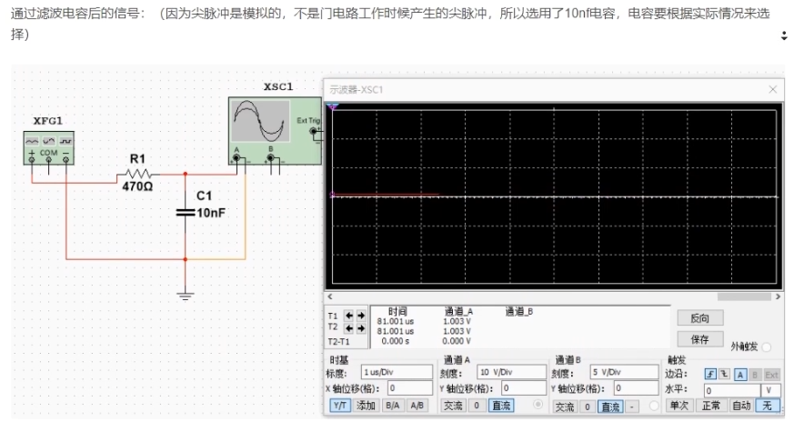

2. **引入选通信号**

  在输入信号变化，并有可能出现竞争冒险，选用一个选通信号将输出门封锁，等到所有输入信号都变为稳态后，再去掉封锁输出信号。这样就避免了电路输出端出现瞬时尖蜂脉冲。

  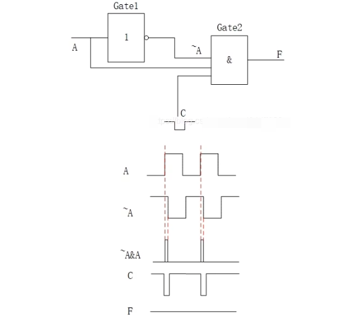

3. **更改逻辑设计（利用卡诺图增加冗余项）**

   适当的逻辑表达式中增加一些冗余项，它们的增加不改变逻辑功能，但是可消除互补信号产生的竞争-冒险现象。

   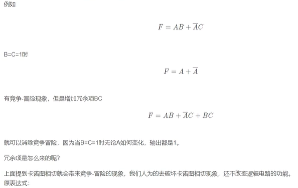

   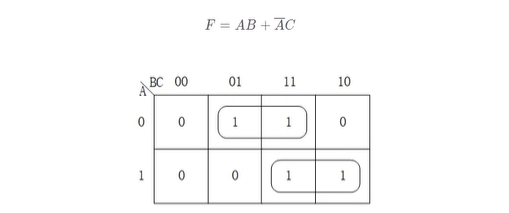

   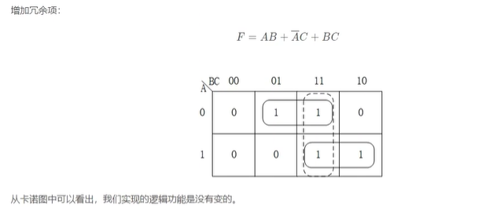

   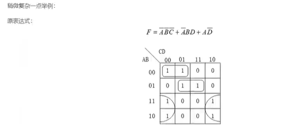

   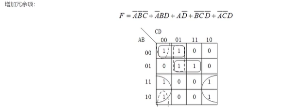

4. **信号延时法**

   因为毛刺最终是由于延迟造成的，所以可以找出产生延迟的支路。对于延迟相对较小的支路加上毛刺宽度的延迟可以消除毛刺。在分离电路中可以加一些非门或者其他门，在FPGA中，开发软件在综合设计时会将这些门当做冗余逻辑去掉，达不到延时的效果。可以用高频时钟来驱动移位寄存器，待延时信号作为数据输入，按所需延时正确设置移位寄存器的级数，移位寄存器的输出即为延时后的信号。数据以接入的时钟周期通过通过寄存器，我们通过设置移位寄存器的级数就可以控制延时。

   

### 10.4 避免冒险竞争六原则

掌握以下六个原则，可解决在综合后仿真中出现绝大多数 的冒险竞争问题

1. 时序电路建模时，用非阻塞赋值；
2. 锁存器电路建模时，用非阻塞赋值；
3. 用 always 块建立组合逻辑模型时，用阻塞赋值；
4. 在同一个 always 块中建立时序和组合逻辑电路时，用非阻塞赋值；
5. 在同一个 always 块中不要既用非阻塞赋值又用阻塞赋值；
6. 不要在一个以上的 always 块中为同一个变量赋值。

## 11. 奇数分频

### 11.1 奇数分频介绍

奇数分频（2N+1），以三分频（N=1）为例，三分频即分频后的时钟半周期（周期）是原时钟半周期（周期）的3倍宽度。


偶数分频我们只需要借助原时钟的上升沿或者下降沿进行计数分频，但是要实现奇数分频我们就要同时利用原时钟的上升沿和下降沿。可以通过原时钟的上升沿和下降沿计数产生clk1和clk2，再通过clk1和clk2的关系实现奇数分频。这种关系可以是或、与、异或，详细如下所述。

### 11.2 通过时钟 相或 实现奇数分频

原时钟ck通过上升沿和下降沿计数产生时钟clk1和ck2，clk1和clk2 相或 产生clk三分频的clk_div3时钟。

- clk1：原时钟ck的上升沿产生
- clk2：原时钟ck的下降沿产生
- clk1和cIk2特征：
  - 3分频：高电平:低电平=1:2
  - 2N+1分频：高电平:低电平=N:N+1


**代码**：

```verilog
//clock or
module top(
    input   clk,
    input   rst_n,

    output  clk_div3
);

reg [3:0]   cnt_pos;//posedge count
reg [3:0]   cnt_neg;//negedge count
reg         clk_pos;
reg         clk_neg;

assign clk_div3 = clk_neg | clk_pos;

always @(posedge clk or negedge rst_n) begin
    if(!rst_n)begin
        cnt_pos <= 4'd0;
        clk_pos <= 1'b0;
    end else begin
        cnt_pos <= (cnt_pos == 4'd2)? 4'd0:cnt_pos + 4'd1;
        clk_pos <= (cnt_pos == 4'd1)? 1'b1:1'b0;
    end
end

always @(negedge clk or negedge rst_n) begin
    if(!rst_n)begin
        cnt_neg <= 4'd0;
        clk_neg <= 1'b0;
    end else begin
        cnt_neg <= (cnt_neg == 4'd2)? 4'd0:cnt_neg + 4'd1;
        clk_neg <= (cnt_neg == 4'd1)? 1'b1:1'b0;
    end
end

endmodule
```

**仿真**：


### 11.3 通过时钟 相与 实现奇数分频

原时钟clk通过上升沿和下降沿计数产生时钟clk1和clk2，clk1和clk2 相与 产生clk三分频的clk_div3时钟。

- clk1：原时钟clk的上升沿产生
- clk2：原时钟clk的下降沿产生
- clk1和clk2特征：
  - 3分频：高电平:低电平=2:1
  - 2N+1分频：高电平:低电平=N+1:N


**代码**：

```verilog
//clock and
module top(
    input   clk,
    input   rst_n,

    output  clk_div3
);

reg [3:0]   cnt_pos;//posedge count
reg [3:0]   cnt_neg;//negedge count
reg         clk_pos;
reg         clk_neg;

assign clk_div3 = clk_neg & clk_pos;

always @(posedge clk or negedge rst_n) begin
    if(!rst_n)begin
        cnt_pos <= 4'd0;
        clk_pos <= 1'b0;
    end else begin
        cnt_pos <= (cnt_pos == 4'd2)? 4'd0:cnt_pos + 4'd1;
        clk_pos <= (cnt_pos <= 4'd1)? 1'b1:1'b0;
    end
end

always @(negedge clk or negedge rst_n) begin
    if(!rst_n)begin
        cnt_neg <= 4'd0;
        clk_neg <= 1'b0;
    end else begin
        cnt_neg <= (cnt_neg == 4'd2)? 4'd0:cnt_neg + 4'd1;
        clk_neg <= (cnt_neg <= 4'd1)? 1'b1:1'b0;
    end
end

endmodule
```

**仿真**：


### 11.4 通过时钟 相异或 实现奇数分频

原时钟clk通过上升沿和下降沿计数产生时钟clk1和clk2，clk1和clk2 相异或 产生clk三分频的clk_div3时钟。

- clk1：原时钟clk的上升沿产生
- clk2：原时钟clk的下降沿产生
- clk1和clk2特征：
  - 3分频：clk1以原时钟clk的3个周期为单位翻转，clk2在clk1时钟的中间点发生翻转
  - 2N+1分频：clk1以原时钟clk的2N+1个周期为单位翻转，clk2在clk1时钟的中间点发生翻转。


**代码**：

```VERILOG
//clock xor
module top(
    input   clk,
    input   rst_n,

    output  clk_div3
);

reg [3:0]   cnt_pos;//posedge count
reg         clk_pos;
reg         clk_neg;

assign clk_div3 = clk_neg ^ clk_pos;

always @(posedge clk or negedge rst_n) begin
    if(!rst_n)begin
        cnt_pos <= 4'd0;
        clk_pos <= 1'b0;
    end else begin
        cnt_pos <= (cnt_pos == 4'd2)? 4'd0:cnt_pos + 4'd1;
        clk_pos <= (cnt_pos == 4'd2)? ~clk_pos:clk_pos;
    end
end

always @(negedge clk or negedge rst_n) begin
    if(!rst_n)begin
        clk_neg <= 1'b0;
    end else begin
        clk_neg <= (cnt_pos == 4'd1)? ~clk_neg:clk_neg;
    end
end

endmodule
```

**仿真**：


## 12. 时钟抖动（Clock Jitter）和时钟偏斜（Clock Skew）

### 12.1 时钟抖动

时钟抖动指的在某一个给定的点上时钟周期发生短暂性变化，使得时钟周期在不同的周期上可能加长或者缩短。（两个时钟周期存右差值，是时钟发生器内部产生的，和晶振或者PLL内部电路有关，布线对其没有影响）；**它是频率上的不确定。**

时钟边沿的变化不可能总是理想的瞬变，它总会有一个从高到低或者从低到高的变化过程；这就导致某一个给定的点上时钟周期发生短暂性变化，使得时钟周期在不同的周期上可能加长或者缩短，产生时钟抖动。参考之前的建立时间与保持时间，严格的说建立时间应该是Tsu+T1，保持时间应该是Th+T1。


时钟频率具有随环境温度变化的特性。理想的方波是不存在的，在不影响系统性能的情况下，允许时钟周期在一个很小的时间范围内变化（这个变化的范围往往是微乎其微，有的甚至可以不去考虑）。时钟抖动是源时钟的不确定性因素之一。如下图所示：


### 12.2 时钟偏斜

时钟偏斜，由于布线长度以及负载不同引起的，导致同一个时钟信号到达相邻两个时序单元的时间不一致。（同样的时钟产生的多个子时钟之间的延时差异），（同一时钟信号到达两个不同寄存器之间的时间差值）（**相位上的不确定**）。


它是相位上的不确定，同一个时钟信号到达相邻两个时序单元的时间不一致。

### 12.3 时钟抖动与偏斜的区别

- 时钟抖动（Clock Jitter）是在时钟发生器内部产生的，和晶振或者PLL内部电路有关，布线对其没有影响；它是**频率上**的不确定。

- 时钟偏斜（Clock Skew）是由不同布线长度导致的不同路径的时钟上升沿到来的时延不同；它是**相位上**为不确定。

## 13. Verilog的结构化、数据流、行为级描述方式

Verilog HDL描述层次示意图：（开关级涉及模拟电路，在数字电路中一般不考虑）


==以表达式L=AB+BC+AC，进行verilog代码编写以及RTL视图的观察来描述三种方式。==


### 13.1 结构化描述方式及RTL视图

**结构化描述方式：**是使用实例化低层次模块的方法，即调用其他已经定义过的低层次模块对整个电路的功能进行描述，或者直接调用Verilog内部预先定义的基本门级元件描述电路的结构。

**结构化描述代码：**

```VERILOG
module Top(
	//Inputs
    input	A,
    input	B,
    input	C,
    //Outputs
    output	L
);

//inner signal declare
wire AB,BC,AC;

and U1(AB,A,B);//and gate
and U2(BC,B,C);//and gate
and U3(AC,A,C);//and gate

or U4(L,AB,BC,AC);//or gate

endmodule
```

**结构化描述RTL视图：**


### 13.2 数据流描述及RTL视图

**数据流描述方式：**是使用连续赋值语句（assign）对电路的逻辑功能进行描述，该方式特别便于对组合逻辑电路建模。

**数据流描述代码：**

```verilog
module top(
    //Inputs
    input A,
    input B,
    input C,
    //Outputs
    output L
);

assign L = (A&&B)||(B&&C)||(A&&C);

endmodule
```

**数据流描述RTL视图：**


### 13.3 行为级描述方式及RTL视图

**行为级描述方式：**是使用过程块语句结构（always）和比较抽象的高级程序语句（时序控制、流控制等）对电路的逻辑功能进行描述。

**行为级描述代码：**

```verilog
module top(
    //Inputs
    input A,
    input B,
    input C,
    //Outputs
    output reg L
);

always @(A,B,C) begin
    case ({A,B,C})
        3'b000: L = 1'b0; 
        3'b001: L = 1'b0; 
        3'b010: L = 1'b0; 
        3'b011: L = 1'b1; 
        3'b100: L = 1'b0; 
        3'b101: L = 1'b1; 
        3'b110: L = 1'b1; 
        3'b111: L = 1'b1; 
        default: L = 1'bx;
    endcase
end

endmodule
```

**行为级描述RTL视图：**


### 13.4 常用门级元件

verilog拓展知识：VerilogHDL内置26个基本元件，其中14个门级元件，12个开关元件。以下为我们常用的门级元件。


## 14. 函数（Function）和任务（Task）

### 14.1 函数

- function函数的目的是返回一个用于表达式的值。
- verilog中的function只能用于组合逻辑。

----

**定义函数的语法**

```verilog
function<返回值的类型或者范围><函数名>
<端口说明语句>
<变量类型说明>
begin
<语句>
end
endfunction
```

- <返回值的类型或范围>这一项为可选项，如果缺失，则返回值为一位寄存器类型数据。
- 函数的返回值：函数的定义蕴含声明了与函数同名、位宽一致的内部寄存器。
- 函数的调用：函数的调用是通过将函数作为表达式中的操作数来实现的。其调用格式：
  <函数名>（<表达式…，<表达式>）；
- 函数使用的规则
  - **函数定义不能包含有任何的时间控制语句。即任何用#、@、wait来标识的语句。**
  - **函数不能调用“task”。**
  - **定义函数时至少要有一个输入参数。**
  - **在函数的定义中必须有一条赋值语句给函数中与函数同名、位宽相同的内部寄存器赋值。**
  - **verilog中的function只能用于组合逻辑。**

**具体实例**：利用函数计算简单的加法

```verilog
module top_test;

wire [3:0] result;

assign result = add(4'd2,4'd3);

function [3:0] add;
    input [3:0] a;
    input [3:0] b;
    begin
        add = a + b;
    end
endfunction

endmodule
```

### 14.2 任务

任务就是一段封装在“task-endtask”之间的程序。任务是通过调用来执行的，而且只有在调用时才执行，如果定义了任务，但是在整个过程中都没有调用它，那么这个任务是不会执行的。调用某个任务时可能需要它处理某些数据并返回操作结果，所以任务应当有接收数据的输入端和返回数据的输出端。另外，**任务可以彼此调用，而且任务内还可以调用函数。**

----

**任务定义**

```verilog
task task_id;
	[declaration]
	procedural_statement
endtask
```

其中，关键词task和endtask 将它们之间的内容标志成一个任务定义，task 标志着一个任务定义结构的开始；task_id是任务名；可选项declaration是端口声明语句和变量声明语句，任务接收输入值和返回输出值就是通过此处声明的端口进行的；procedural_statement是一段用来完成这个任务操作的过程语句，如果过程语句多于一条，应将其放在语句块内；endtask为任务定义结构体结束标志。

**定义任务要注意：**

- **在第一行“task”语句中不能列出端口名称；**
- **任务的输入、输出端口和双向端口数量不受限制，甚至可以没有输入、输出以及双向端口。**
- **任务定义的描述语句中，可以使用/出现不可综合操作语句（使用最频繁的就是延迟控制语句），但是这样会造成该任务不可综合。**
- **在任务中可以调用其他任务或函数、也可以调用自身。**
- **在任务定义结构内不能出现initial和always过程块。**
- **在任务定义中可以出现“disable中止语句”，将中断正在执行的任务，但其是不可综合的。当任务被中断后，程序流程将返回到调用任务的地方继续向下执行。**

**具体实例**：通过任务写一个简单的比较器。

```verilog
module top_test;

reg [3:0] reg_a;
reg [3:0] reg_b;
reg [3:0] reg_c;

initial
begin
    reg_a=4'd3;
    reg_b=4'd2;
    task_demo(reg_a,reg_b,reg_c);
    #10;
    reg_a=4'd2;
    reg_b=4'd3;
    task_demo(reg_a,reg_b,reg_c);
end

task task_demo;
    input [3:0] a;
    input [3:0] b;
    output y;
    if(a>b)
        y=1'b1;
    else
        y=1'be;
endtask
endmodule
```

虽然任务中不能出现initial 语句和always 语句语句，但任务调用语句可以在initial语句和always 语句中使用，其语法形式如下：

task_id[（端口1，端口2…，端口N）]；

其中task_id是要调用的任务名，端口1、端口2，…是参数列表。参数列表给出传入任务的数据（进入任务的输入端）和接收返回结果的变量（从任务的输出端接收返回结果）。**任务调用语句中，参数列表的顺序必须与任务定义中的端口声明顺序相同。任务调用语句是过程性语句，所以任务调用中接收返回数据的变量必须是寄存器类型。**

在调用任务时，要注意以下几点：

- 任务调用语句只能出现在过程块内；
- 任务调用语句和一条普通的行为描述语句的处理方法一致；
- 当被调用输入、输出或双向端口时，**任务调用语句必须包含端口名列表，且信号端口顺序和类型必须和任务定义结构中的顺序和类型一致**。需要说明的是，任务的输出端口必须和寄存器类型的数据变量对应。
- **可综合任务只能实现组合逻辑**，也就是说调用可综合任务的时间为“0”。而在面向仿真的任务中可以带有时序控制，如时延，因此面向仿真的任务的调用时间不为“0”。

## 15. 波特率

**基础知识**

|                    波特率 115200                     |        1s 传输二进制的位数115200 bit         |
| :--------------------------------------------------: | :------------------------------------------: |
|                                                      |         传输1bt需要1/115200s=8.68us          |
| 系统时钟50MHz（为串口提供的时钟频率）+ 波特率 115200 | 传输1bit需要计数<br>（50*10^6^/115200）= 434 |

以上重点是推导出 50M系统时钟+波特率为115200条件下传输1bit需要计数个数为434。

## 16. 锁存器/触发器

latch是电平触发，register是边沿触发，register在同一时钟边沿发下动作，符合同步电路的设计思想，而latch则属于异步电路设计，往往会导致时序分析困难，不适当的应用latch则会大量浪费芯片资源。

一般信号经过两级触发器就可以消除毛刺。

为什么锁存器不好？

- 锁存器对毛刺不敏感，很容易在信号上产生毛刺。
- 没有时钟信号，不容易进行静态时序分析。

正是因为这两个原因，我们在FPGA设计时，尽量不用锁存器。

**注意：“FPGA中只有LUT和FF的资源，没有现成的Latch，所以如果要用Latch，需要更多的资源搭出来”这个观点是==不完全正确==的。**

在Xlinx的FPGA中，6系列之前的器件中都有Latch；6系列和7系列的FPGA中，一个Slice中有50%的storage element可以被配置为Latch或者Flip-Flop，另外一半只能被配置为Flip-Flop。比如7系列FPGA中，一个Slice中有8个Flip-Flop，如果被配置成了Latch，该Slice的另外4个Flip-Flop就不能用了。这样确实造成了资源的浪费。

但在在UltraScale的FPGA中，所有的storage element都可以被配置成Flip-Flop和Latch。

## 17. 组合/时序逻辑

----

**组合逻辑**

==组合逻辑的特点是任意时刻的输出仅仅取决于该时刻的输入，与电路原本的状态无关，逻辑中不涉及条边沿信号处理。==

组合逻辑的verilog描述方式有两种：

- always@（电平敏感信号列表）

  always模块的敏感列表为所有判断条件信号和输入信号，但一定要注意敏感列表的完整性。在always模块中可以使用if、case 和for等各种RTL关键字结构。由于赋值语句有阻塞赋值和非阻塞赋值两类，建议读者使用阻塞赋值语句“=”。always模块中的信号必须定义为reg型，不过最终的实现结果中并没有寄存器。这是由于在组合逻辑电路描述中，将信号定义为reg型，只是为了满足语法要求。

- assign描述的赋值语句。
  信号只能被定义为wire型

----

**时序逻辑**

==时序逻辑的特点是任意时刻的输出不仅取决于该时刻的输入，而且还和电路原来的状态有关。==电路里面有存储元件（各类触发器，在FPGA芯片结构中只有D触发器）用于记忆信息，从电路行为上讲，不管输入如何变化，仅当时钟的沿（上升沿或下降沿）到达时，才有可能使输出发生变化。

与组合逻辑不同的是：

- 在描述时序电路的always块中的reg型信号都会被综合为寄存器，这是和组合电路不同的
- 时序逻辑电路中推荐使用非阻塞赋值“<=”
- 时序逻辑的敏感信号列表只需要加入所用的时钟触发沿即可，其余所有的输入和条件判断信号都不用加入，这是因为时序逻辑是通过时钟信号的跳变沿来控制的

----

## 18. 阻塞/非阻塞赋值

**阻塞赋值**

==阻塞赋值使用赋值运算符为“=”。阻塞赋值的过程是立刻执行的，即阻塞赋值运算符右侧表达式求值完后立刻会更新至运算符左侧，并且这个执行的过程不受其他语句执行的影响，其后的语句只有当前的赋值操作执行完成后才能顺序执行。==

所谓阻塞的概念是指在同一个always块中，其后面的赋值语句从概念上是在前一条赋值语句结束后开始赋值的。

----

**非阻塞赋值**

==非阻塞赋值使用的赋值运算符为“<=”。非阻塞赋值执行过程为：在当前仿真时间槽（time-slot）开始分析计算获得右侧表达式的值，在当前时间槽执行结束时更新左侧表达式的值，在右侧表达式分析计算和左侧表达式被更新之间，任何其他事件都可以执行，同时也有可能修改已经计算完成的右侧表达式的值，即非阻塞赋值的过程不影响其他语句的执行.==

根据非阻塞赋值的特点，其赋值运算符左侧操作数只能为寄存器类型，因此非阻塞赋值只能用于过程性语句中（initial和always），不允许在连续赋值语句中使用非阻塞赋值。

----

**verilog模块编程的8个原则：**

（1）时序电路建模时，用非阻塞赋值。

（2）锁存器电路建模时，用非阻塞赋值。

（3）用always块建立组合逻辑模型时，用阻塞赋值。

（4）在同一个always块中建立时序和组合逻辑电路时，用非阻塞赋值。

（5）在同一个always块中不要既用非阻塞赋值又用阻塞赋值。

（6）不要在一个以上的always块中为同一个变星赋值。

（7）用$strobe系统任务来显示用非阻塞赋值的变量值。

（8）在赋值时不要使用#0延时。

## 19. 跨时钟域处理

### 19.1 单bit信号

**1）电平检测**

==最为简单的方法。通过寄存器打两拍进行同步，也就是所谓的电平同步器。==

存在问题为，输入信号必须保特两个接收时钟周期，每次同步完，输入信号要恢复到无效状态。所以，如果是从快到慢，信号很有可能被滤除。

**两级触发器可防止亚稳态传播的原理：**假设第一级触发器的输入不满足其建立保持时间，它在第一个脉冲沿到宋后输出的数据就为亚稳态，那么在下一个脉冲沿到来之前，其输出的亚稳态数据在一段恢复时间后必须稳定下来，而且稳定的数据必须满足第二级触发器的建立时间，如果都满足了，在下一个脉冲沿到来时，第二级触发器将不会出现亚稳态，因为其输入端的数据满足其建立保持时间。==更确切地说，输入脉冲宽度必须大于同步时钟周期与第一级触发器所需的保持时间之和。最保险的脉冲宽度是两倍同步时钟周期。==所以，这样的同步电路对于从较慢的时钟域来的异步信号进入较快的时钟域比较有效，对于进入一个较慢的时钟域，则没有作用。

为什么是打两拍呢，打一拍、打三拍行不行呢？

两级并不能完全消除亚稳态危害，但是提高了可靠性减少其发生概率。总的来讲，就是一级概率很大，三级改善不大。如果再加上第三级寄存器，==由于第二级寄存器对于亚稳态的处理已经起到了很大的改善作用，第三级寄存器在很大程度上可以说只是对于第二级寄存器的延拍，所以意义是不大的。==

==适用于慢时钟域向快时钟域。==

----

**2）边沿检测**

在电平同步器的基础上，通过输出端的组合逻辑，可以完成对于信号边沿的提取，识别上升沿，下降沿以及双边沿，并发出相应的脉冲。

==适用于慢时钟域向快时钟域。==

----

**3）脉冲同步**

==先将原时钟下的脉冲信号，转化为电平信号（使用异或门），在进行同步，==同步完成之后再把新时钟域下的电平信号转换为脉冲信号（边沿检测器的功能）。
这就从快时钟域的取出一个单时钟宽度脉冲，在慢时钟域建立新的单时钟宽度脉冲。
结合了之前所提到的两种同步器。

但存在一个问题，输入脉冲的时间间距必须在两个接收时钟周期以上，否则新的脉冲会变宽，这就不再是单时钟脉冲了。

==适用于快时钟域向慢时钟域。==

### 19.2 多bit信号

**1）采用保持寄存器加握手信号的方法（多数据，控制，地址）**

**2）异步F1F0握手**

握手指的是两个设备之间通信的一种方式，用来通信的信号就是握手信号。**最简单的握手信号是valid和ready**，也可以叫request和grant。假设设备1向设备2发送数据，设备1不知道设备2什么时候可以接收数据，设备2也不知道设备1什么时候会发送数据，那么它们之间如果用握手通信可能是这样的顺序：

设备1将vald信号置1，告诉设备2，数据准备就绪了，请查收

设备2此刻正处于忙碌状态无法接收数据，设备2将ready信号保持为0

设备2空闲了，将ready信号置1接收设备1的数据

设备1看到设备2的ready为1，它知道设备2已经接收好数据了，将valid置0同时撤销数据，准备下一次发送。

可以看到因为有握手控制，可以确保数据的正确传输。不会丢失。跨时钟域的握手设计就是利用握手控制这种优势，从而避免因为跨时钟域引起的数据传输错误。

## 20. 位宽计算（N bit与M bit相加、相乘）

**有符号数（补码）：**-2^N-1^~2^N-1^-1 

如N=8则范围为：-128\~127（因为0算在正数范围中）

**无符号数：**0-2^N-1^

如N=8则表示范围是：0~255。

**有符号定点数：**

如果有符号，那么整数位被占去—位。

精度（最小的小数值）

 **N bit数和M bit数相加、相乘后需要多少bit？**

- 无符号数
  - 相加：N bit + M bit = （M + 1）bit  （M > N)
  - 相乘：N bit * M bit = （M + N）bit  
- 有符号数
  - 相加：
  - 相乘：N bit * M bit = （M + N）bit  

## 24. RAM/SRAM/DRAM/SDRAM/DDR

**RAM随机存储器**

存储单元的内容可按需随意取出或存入，且存取的速度与存储单元位置无关的存储器。这种存储器==在断电时将丢失其存储的内容==，故主要用于存储段时间使用的程序。

**SRAM（Static Random-Access Memory）**

静态随机存取存储器：只要供电它就会保持一个值。一般而言SRAM要比DRAM快，这是因为SRAM没有刷新周期。每个SRAM存储单元由6个晶体管组成，而DRAM存储单元由一个晶体管和一个电容器组成。相比而言，DRAM比SRAM每个存储单元的成本要高。照此推理，可以断定在给定的固定区域内DRAM的密度比SRAM的密度要大。

**DRAM（Dynamic Random Access Memory）**

动态随机存取存储器：这是一种以电荷形式进行存储的半导体存储器。DRAM中的每个存储单元由一个晶体管和一个电容器组成。数据存储在电容器中。电容器会由于漏电而导致电荷丢失，因而DRAM器件是不稳定的。为了将数据保存在存储器中，DRAM器件必须有规律地进行刷新。

==SRAM常常用于高速缓冲存储器，因为它有更高的速率；而DRAM常常用于PC中的主存储器，因为其拥有更高的密度。==

**SDRAM（synchronous dynamic random-access memory）**

同步动态随机存储器：意思是指理论上其速度可达到与CPU同步。

**DDR SDRAM（Dual Date Rate SDRAM）**

简称DDR，也就是“双倍速率SDRAM“的意思。DDR可以说是SDRAM的升级版本，DDR在时钟信号上升沿与下降沿各传输一次数据，这使得DDR的数据传输速度为传统SDRAM的两倍。

## 25. ROM/PROM/EPROM/E2PROM/FLASH

**ROM（Read-Only Memory）**

只读存储器，这是一种线路最简单半导体电路，通过掩膜工艺，一次性制造，其中的代码与数据将永久保存（除非坏掉），不能修改

**PROM（Programmable Read-Only Memory）**

可编程只读存储器。这样的产品只允许写入一次，所以也被称为“一次可编程只读存储器（One Time Progarmming ROM，OTP-ROM）。PROM在出厂时，存储的内容全为1，用户可以根据需要将其中的某些单元写入数据0（部分的PROM在出厂时数据全为0，则用户可以将其中的部分单元写入，以实现对其“编程”的目的。

**EPROM（Erasable Programmable Read-Only Memory）**

它的特点是具有可擦除功能，擦除后即可进行再编程，但是缺点是擦除需要使用紫外线照射一定的时间。

**EEPROM（Electrically Erasable Programmable Read-Only Memory）**

它的最大优点是可直接用电信号擦除，也可用电信号写入。EEPROM不能取代RAM的原因是其工艺复杂，耗费的门电路过多，且重编程时间比较长，同时其有效重编程次数也比较低。

**Flash memory**

指的是“闪存”，所调“闪存”，它也是一种非易失性的内存，属于EEPROM的改进产品。它的最大特点是必须按块（Block）擦除（每个区块的大小不定，不同厂家的产品有不同的规格），而EEPROM则可以一次只擦除一个字节（Byte）。

## 26. 硬核/软核/固核

### 26.1 硬核（Hard IP Core）

硬核在EDA设计领域指**经过验证的设计版图**；具体在FPGA中指布局和工艺固定、经过前端和后端验证的设计，设计人员不能对其修改。不能修改的原因：

①：系统设计对各个模块的时序要求很严格，不允许打乱已有的物理版图。

②：保护只是产权的要求，不允许设计人员对其有任何改动。

IP硬核的不许修改特点使其复用有一定的困难，因此只能用于某些特定应用，使用范围较窄。

### 26.2 软核（Soft IP Core）

软核在EDA设计领域指的是综合之前的寄存器传输级（RTL）模型；具体在FPGA设计中指的是对电路的硬件语言描述，包括逻辑描述、网表和帮助文档等。软核只经过功能仿真，需要经过综合以及布局布线才能使用。其优点是灵活性高、可移植性强，允许用户自配置；缺点是对模块的预测性较低，在后续设计中存在发生错误的可能性，有一定的设计风险。软核是IP核应用最广泛的形式。

### 26.3 固核（Firm IP Core）

固核在EDA设计领域指的是**带有平面规划信息的网表**；具体在FPGA设计中可以看做带有布局布线规划的软核，通常以RTL代码和对应具体工艺网表的混合形式提供。将RTL描述结合具体标准单元库进行综合优化设计，形成门级网表，再通过布局布线工具即可便用。和软核相比，固核的设计灵活性稍差，但在可靠性上有较大提高。目前，固核也是IP核的主流形式之一。

例如当你使用一个IP核生成一个8×8的乘法器时，如果选择使用逻辑资源块来实现，那么此时的乘法器IP核就相当于一个**软核**；如果你选择使用DSP资源来实现，那么此时的乘法器IP核就相当于一个**硬核**；如果你要用DSP资源生成一个36×36的乘法器时，那么FPGA恐怕需要若干个DSP资源来实现，这时候，每个DSP核的布局布线都是固定的，但是到底选择哪几个DSP资源来实现是可以由编译器决定的，因此此时的乘法器IP核就相当于一个**固核**。

## 27. 浮点数与定点数

### 27.1 浮点数

小数点非固定的数，可表示数据范围较广，整数，小数都可表示。包含float，double。

float 和 double 这两种类型的浮点数在计算机中的存储结构如下所示：


**符号位部分（S）**

0 正数；1 负数

**阶码部分（E）**

- 对于float型浮点数，指数部分8位，考虑可正可负，因此可以表示的指数范围为-127\~128
- 对于double型浮点数，指数部分11位，考虑可正可负，因此可以表示的指数范围为-1023~1024

**尾数部分（M）**

浮点数的精度是由尾数的位数来决定的：

- 对于float型浮点数，尾数部分23位，换算成十进制就是2^23^=8388608，所以十进制精度只有6～
  7位；
- 对于double型浮点数，尾数部分52位，换算成十进制就是2^52^=4503599627370496，所以十进制精度只有15~16位

----

实例：（浮点数-->二进制）

①十进制小数转换为二进制

​						(100.25)<sub>10 </sub> = (1100100.01)<sub>2 </sub>

②非规格数--->规格化数（小数点在最高位后面）

​						(1100100.01)<sub>2 </sub> = (1.10010001)<sub>2 </sub>×2^6^

③计算阶码（偏置值（127）+阶码真值（6））

​						1111111+110=1000101

④尾数（扩到23位）

​						10010001→100_1000_1000_0000_0000_0000

实际尾数是24位，默认最高位为1（观察上面的图），尾数M=

​						1+（0.100_1000_1000_0000_0000_0000）

则32bit浮点数表示100.25为：
						이100_0010_1|100_1000_1000_0000_0000_0000

表示为十六进制为：42C88000

⑤反推真值= ±（1+尾数）x2^（阶码-127）^

​					（1 +（0.100_1000_1000_0000_0000_0000）<sub>2 </sub>）x 2^6^ =（1 + 0.56640625）<sub>10 </sub> x 64 = 100.25

### 27.2 定点数

一种约定所有数值数据的小数点隐含在某一个固定的位置，称为定点表示法，简称定点数。


### 27.3 浮点数转定点数

举例来说，我们用8位定点数，1个符号位，4个整数位，3个小数位，则其可表示范围是-16.00~15.875，最大精度0.125。有几个浮点数：0.145，1.231，2.364，7.512，每个却需要32bit表示。

如果我们可以将某些浮点数转换为定点数表示，在接受精度损失的前提下，每次就可以读取多个进行运行，可显著提高运算效率。

**浮点数转换为定点数：**

**float类型的1.231转换为8位的定点数，1个符号位，4个整数位，3个小数位。**这个3称为量化系数。以下过程称为**量化**。
						1.231 2^3^ = 9.84（取10）<sub>10 </sub> =（0000_1010）<sub>2 </sub>

所以转换后的8bit为
						（10）<sub>10 </sub> =（0000_1010）<sub>2 </sub>

0000_1010表示的定点数为（1个符号位，4个整数位，3个小数位）
						（1.010）<sub>2 </sub> =（1.25）<sub>10 </sub>

也就是说8bit的定点数，1个符号位，4个整数位，3个小数位1.25最能表示1.231，转换的时候精度出现了丢失。

### 27.4 定点数转浮点数

**定点数1.250转换为浮点，1个符号位，4个整数位，3个小数位**。这个3称为量化系数。以下过程称为**反量化**。
						float（1.250）= （1010）<sub>2 </sub> x 2^-3^

## 28. 有限状态机 FSM（Finite State Machine）

状态机全称是有限状态机（Finite State Machine、FSM），是表示有限个状态以及在这些状态之间的转移和动作等行为的数学模型。

### 工作原理

状态机分为摩尔（Moore）型有限状态机与米利（Mealy）型有限状态机。摩尔状态机输出是只由输入确定的有限状态机（不直接依赖于当前状态）。米利有限状态机的输出不止与其输入有关还于它的当前状态相关，这也是与摩尔有限状态 机的不同之处。


1. 状态机状态编码方式：二进制、格雷码、独热码


从上表中可以发现：独热码，每一个状态均使用一个寄存器，在于状态比较时仅仅需要比较一位，相比其他译码电路简单；格雷码，所需寄存器数与二进制码一样，译码复杂，但相邻位只跳动一位，一般用于异步多时钟域多 bit 位的转 换，如异步 FIFO；二进制码，最为常见的编码方式，所用寄存器少，译码较复杂。

2. 状态机描述方式，可分为一段式、两段式以及三段式。

- 一段式，整个状态机写到一个 always 模块里面。在该模块中既描述状态转移， 又描述状态的输入和输出。 

- 两段式，用两个 always 模块来描述状态机。其中一个 always 模块采用同步 时序描述状态转移，另一个模块采用组合逻辑判断状态转移条件，描述状态转移 规律及其输出。 

- 三段式，在两个 always 模块描述方法基础上，使用三个 always 模块。一个 always 模块采用同步时序描述状态转移，一个 always 采用组合逻辑判断状态转移 条件，描述状态转移规律，另一个 always 模块描述状态输出(可以用组合电路输 出，也可以时序电路输出)。

==编写状态机还应主要注意的事项是，为了避免不必要的锁存器生成，需要穷举所有状态对应的输出动作，或者使用 default 来定义未定义状态动作；在定义状态时，推荐使用本地化参数定义 localparam，这样可以在编写时状态更清晰且不容易出错，也方便修改；在复位或者跑飞能回到初始态或者预定态；要有异步或者同步复位来确保状态机上电有个初始态。==

- **组成元素：**输入、状态、状态转移条件、输出。

- **分类：**根据状态机的输出是否与输入条件相关来区分Moore状态机和Mealy状态机

  - **Mealy状态机**：时序逻辑的输出不仅取决于当前状态，还与输入有关；
  - **Moore状态机**：时序逻辑的输出只与当前状态有关。

- **一段式：**只有一个 always block，把所有的逻辑（输入、输出、状态）都在一个always block的时序逻辑中实现。

- **二段式：**有两个always block，把时序逻辑和组合逻辑分隔开来。时序逻辑里进行当前状态和下一状态的切换，组合逻辑实现各个输入、输出以及状态判断。

  ==在两段式描述中，当前状态的输出用组合逻辑实现，可能存在竞争和冒险，产生毛刺。要求对状态机的输出用寄存器打一拍，但很多情况不允许插入寄存器节拍，此时使用三段式描述。==

- **三段式：**有三个always block，一个采用同步时序的方式描述状态转移，一个采用组合逻辑的方式判断状态转移条件、描述状态转移规律，第三个使用同步时序的方式描述每个状态的输出。

  ==时序逻辑的输出解决了两段式组合逻辑的毛刺问题，但是从资源消耗的角度上看，三段式的资源消耗多一些。==

  **第三段使用 nextstate 和 state 的区别在于，当状态跳转时，基于 nextstate 的输出是立刻变化的，而基于 state 输出会延迟一个周期，其他情况都一样，应该根据自己的时序要求，选择用 nextstate 还是 state 。**

  ----
  
  **三段式状态机示例模板：**

  ```VERILOG
  //第一个进程，采用时序逻辑的方式实现当前状态和下一个状态的切换
  always @ (posedge clk or negedge rst_n)   //异步复位
  if(!rst_n)
       current_state <= IDLE;
  else
       current_state <= next_state;          //注意，使用的是非阻塞赋值
  
  //第二个进程，采用组合逻辑的方式判断状态转移条件、描述状态转移规律
  always @ (*) begin  
      case(current_state)
          S1: if(...)
                  next_state = S2;    //阻塞赋值
          S2: if(...)
                  next_state = S3;    //阻塞赋值
          ...
      endcase
  end
  
  //第三个进程，采用时序逻辑的方式描述每个状态的输出
  always @ (posedge clk or negedge rst_n) begin
      if(!rst_n)                     //初始化
          
      else
          case(next_state)
             S1：
                 out1 <= 1'b1;          //注意是非阻塞逻辑
             S2:
                 out2 <= 1'b1;
             default: ...               //default的作用是免除综合工具综合出锁存器
          endcase
  end
  ```
  
  

## 29. 序列检测器另一种实现方法（移位寄存器）

例如检测序列1101可以用以下移位寄存器的方式：


```VERILOG
//1101序列检测器
module top(
    input   clk,
    input   rst_n,
    input   data_in,

    output  data_out
);

reg reg_a;
reg reg_b;
reg reg_c;
reg reg_d;

assign dataout = reg_d&reg_c&(~reg_b)&reg_a;

always@(posedge clk or negedge rst_n)
begin
    if(!rst_n)begin
        reg_a <= 1'bo;
        reg_b <= 1'bo;
        reg_c <= 1'bo;
        reg_d <= 1'bo;
    end else begin
        reg_d <= reg_c;
        reg_c <= reg_b;
        reg_b <= reg_a;
        reg_a <= data_in;
    end
end

endmodule
```


## 30. FPGA 和 CPLD的区别

|          | CPLD                       | FPGA                        |
| :------- | :------------------------- | :-------------------------- |
| 内部结构 | Product term（基于乘机项） | Look up Table（基于查找表） |
| 程序存储 | 内部EEPROM/FLASH           | SRAM，外挂EEPROM            |
| 资源类型 | 组合逻辑资源丰富           | 时序逻辑资源丰富            |
| 集成度   | 低                         | 高                          |
| 使用场合 | 完成控制逻辑               | 能完成较复杂的算法          |
| 速度     | 慢                         | 快                          |
| 其他资源 | -                          | PLL，RAM、乘法器            |
| 保密性   | 可加密                     | 一般不能保密                |

## 31. 关键路径

==关键路径就是输入到输出延时最大的路径，找到了关键路径便能求得最大时钟频率。==

## 32. 单脉冲跨时钟域传输Verilog实现

### 32.1 单脉冲，慢到快

### 32.2 单脉冲，快到慢

## 33. 多bit跨时钟域（握手机制）

### 33.1 单字节

### 33.2 多字节

## 34. Verilog实现 glitch free（无毛刺）时钟切换电路

### 34.1 两个相关时钟源（频率成倍数关系）切换

### 34.2 异步时钟切换

## 35. Verilog实现8bit环形计数器

## 36. Verilog初始化一个ROM（用于仿真）

## 37. 数值（有无符号）运算、比较

### 37.1 原码、反码、补码

### 37.2 有符号数比较器

### 37.3 有符号数求绝对值

### 37.4 有符号数加法器

## 38. CRC（循环冗余校验）

### 38.1 CRC原理介绍

### 38.2 CRC 简介

### 38.3 通过CRC了解CRC

### 38.4 CRC计算器的使用

### 38.5 CRC电路解析

### 38.6 verilog实现（并行）

### 38.7 verilog实现（串行）

## 39. 按键消抖

### 39.1 只对按键按下消抖

### 39.2 按下、松开都进行消抖

## 40. OC门和OD门

### 40.1 OC门

### 40.2 OD门（漏极开路输出）

## 41. 数字IC设计流程、数字IC后端设计流程

## 42. 芯片功耗问题

### 42.1 静态功耗

### 42.2 动态功耗

## 43. 计算时钟频偏

## 44. 伪随机序列产生电路

### 44.1 伪随机序列

### 44.2 本原多项式

### 44.3 伪随机序列硬件实现
