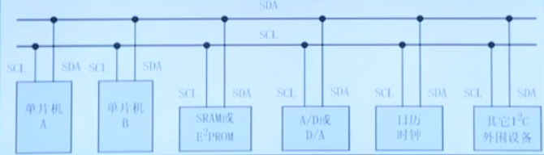
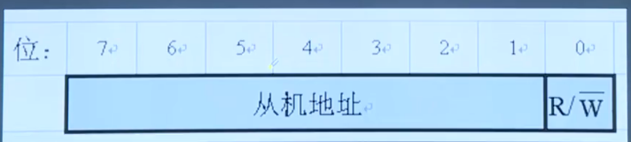
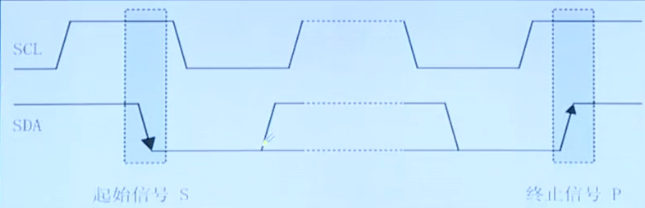
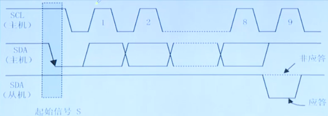
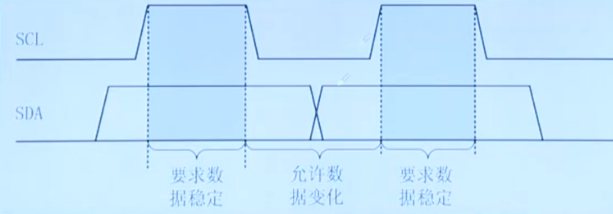
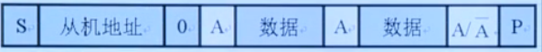
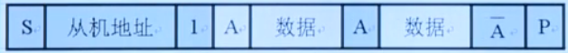
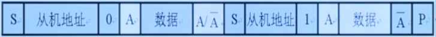

# IIC

- Author：hongjh
- Time：20230326
- Version:

---------

[toc]

### IIC总线概述

#### IIC总线简介

IIC总线是Philips公司在八十年代初推出的**一种串行、半双工总线，主要用于近距离、低速的芯片之间的通信**；IIC总线有两根双向的信号线**一根数据线 SDA 用于收发数据，一根时钟线 SCL 用于通信双方时钟的同步**；IIC总线硬件结构简单，成本较低，因此在各个领域得到了广泛的应用。

IIC总线是一种**多主机总线**，连接在IIC总线上的器件**分为主机和从机**，**主机有权发起和结束一次通信，而从机只能被主机呼叫**；当总线上有多个主机同时启用总线时，IIC也具备冲突检测和仲裁的功能来防止错误产生；每个连接到IIC总线上的器件都有一个唯一的**地址（7bit）**，且**每个器件都可以作为主机也可以作为从机（同一时刻只能有一个主机）**，总线上的器件增加和删除不影响其他器件正常工作；IIC总线在通信时总线上发送数据的器件为发送器，接收数据的器件为接收器；

#### IIC总线通信过程

1. ==主机发送==起始信号启用总线；

2. ==主机发送==**一个字节**数据指明**从机地址**和**后续字节的传送方向**；

3. 被寻址的从机发送应答信号回应主机；

4. ==发送器发送==一个字节数据；

5. ==接收器发送==应答信号回应发送器；

   ... ...（循环步骤4、5）

6. 通信完成后==主机发送==停止信号释放总线。 

#### IIC总线寻址方式

IIC总线上传送的数据是广义的，既包括地址，又包括真正的数据。

主机在发送起始信号后必须先发送一个字节的数据，该数据的高7位为从机地址，最低位表示后续字节的传送方向，'0'表示主机发送数据，'1'表示主机接收数据；总线上所有的从机接收到该字节数据后都将这7位地址与自己的地址进行比较，如果相同，则认为自己被主机寻址，然后再根据第8位将自己定为发送器或接收器。

### IIC总线信号实现    

#### 起始信号、停止信号

- **SCL为高电平时， SDA由高变低表示起始信号**

- **SCL为高电平时， SDA由低变高表示停止信号**

- 起始信号和停止信号都是由主机发出，起始信号产生后总线处于占用状态停止信号产生后总线处于空闲状态

#### 字节传送与应答

IIC总线通信时每个字节为8位长度，数据传送时，==先传送最高位，后传送低位==，发送器发送完一个字节数据后接收器必须发送1位应答位来回应发送器即一帧共有9位

#### 同步信号

IIC总线在进行数据传送时，时钟线SCL为低电平期间发送器向数据线上发送一位数据，在此期间数据线上的信号允许发生变化，时钟线SCL为高电平期间接收器从数据线上读取一位数据，在此期间数据线上的信号不允许发生变化，必须保持稳定。

### IIC典型时序

1. 主机向从机发送数据

- 停止发送有两种情况：①主机不想发了；②从机不想应答了。但是终止信号只能是主机发出

2. 从机向主机发送数据

3. 主机先向从机发送数据，然后从机再向主机发送数据

- **变更操作方向的时候不用发停止信号**，如果发了停止信号再变更，有可能总线使用权就被别的主机抢走了

==注==：阴影部分表示数据由主机向从机传送，无阴影部分则表示数据由从机向主机传送；A表示应答，A非表示非应答，S表示起始信号，P表示终止信号
