# Matlab

- Author：hongjh
- Time：20230531
- Version：

---------

[toc]

## fopen (打开文件)

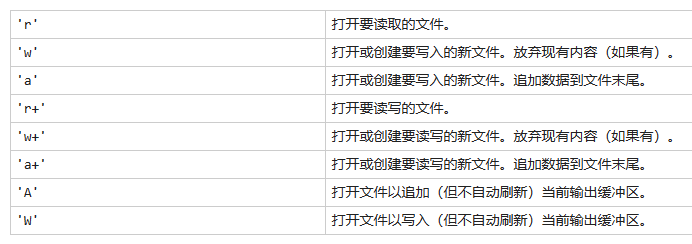

## fread (读取文件)

```matlab
A = fread(fileID,sizeA,precision,skip,machinefmt) 
% 将文件数据读取到维度为 sizeA 的数组 A 中，并将文件指针定位到最后读取的值之后。
% fread 按列顺序填充 A。根据 precision 描述的格式和大小解释文件中的值。
% skip 在读取文件中的每个值之后将跳过 skip 指定的字节或位数
% machinefmt 指定在文件中读取字节或位时的顺序。
```

### sizeA

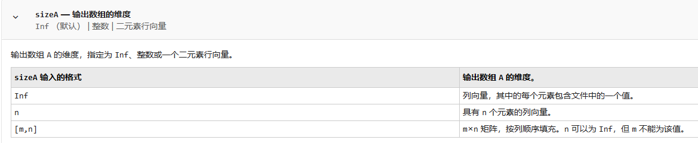

### precision

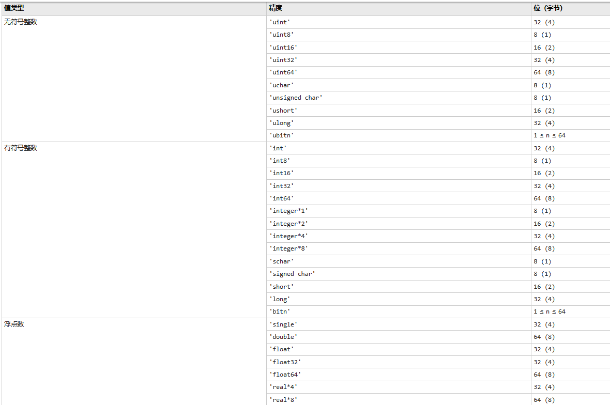

### machinefmt

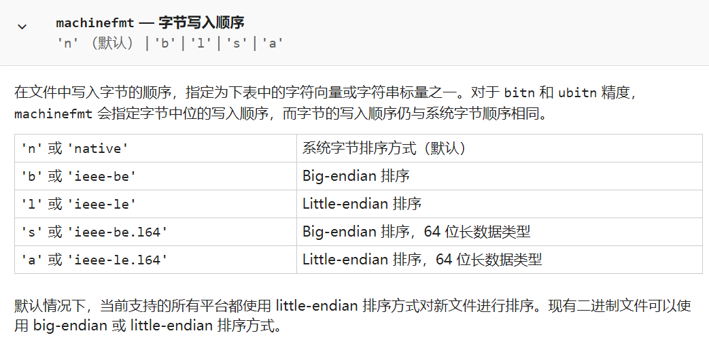

## fwrite (将数据写入二进制文件)

### 语法

```matlab
fwrite(fileID,A,precision,skip,machinefmt)
% fileID 文件标识符
% A 要写入的数据
% precision 要写入的值的类和大小，默认 'uint8'
% skip 要跳过的字节数，写一次，下次要写跳过的字节数
% machinefmt 字节写入顺序
```


## fprintf (将数据写入文本文件）

### 语法

```matlab
x = 0:.1:1;
A = [x; exp(x)];

fileID = fopen('exp.txt','w');
fprintf(fileID,'%6s %12s\n','x','exp(x)');
fprintf(fileID,'%6.2f %12.8f\n',A);
fclose(fileID);

% 第一个对 fprintf 的调用输出标题文本 x 和 exp(x)，第二个调用输出变量 A 的值。
```

### 格式操作符

格式化操作符以百分号 `%` 开头，以转换字符结尾。转换字符是必需的。您也可以在 `%` 和转换字符之间指定标识符、标志、字段宽度、精度和子类型操作符。（操作符之间的空格无效，在这里显示空格只是为了便于阅读。）

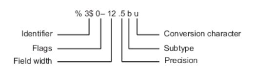

### 转换字符

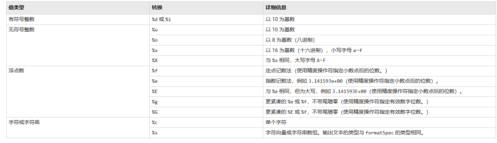

### 标志

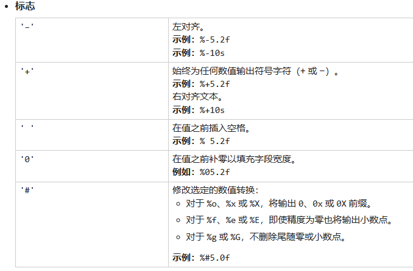

### 特殊字符

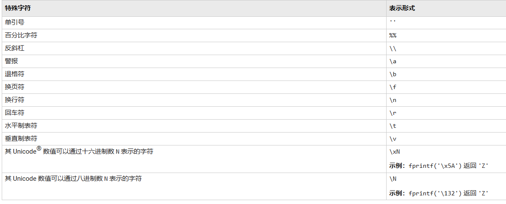

## zeros (创建全零数组)

### 语法

```MATLAB
% 创建一个由零组成的 1(行)×3(列) 向量，其元素为 32 位无符号整数
X = zeros(1,3,'uint32')
% 要创建的数据类型可以为 'double'(默认)、'single'、'logical'、'int8'、'uint8'、'int16'、'uint16'、'int32'、'uint32'、'int64'
```

## for 循环语句

```matlab
% 递增,默认步进值为1
for i = 1 : length(x)
end
% 递减
for i = 1 : -1 : 10
end
% 指定值
for i = [1 5 8 17]
end
```

## length (最大数组维度的长度)

```matlab
X = zeros(3,7);
L = length(X)
% L = 7
```

## case

```MATLAB
n = input('Enter a number: ');

switch n
    case -1
        disp('negative one')
    case 0
        disp('zero')
    case 1
        disp('positive one')
    otherwise
        disp('other value')
end
```

## if, elseif, else

```matlab
if r == c
    A(r,c) = 2;
elseif abs(r-c) == 1
    A(r,c) = -1;
else
    A(r,c) = 0;
end
```

## 运算符

### 关系运算

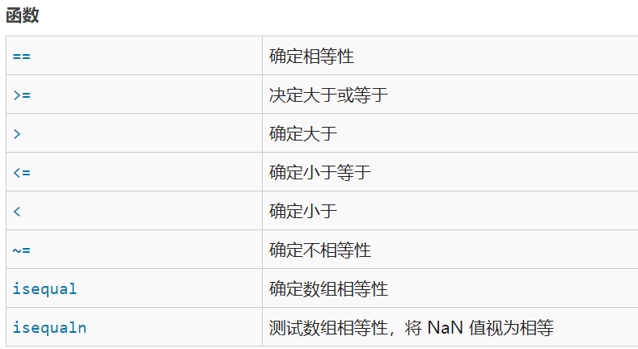

### 逻辑 (布尔) 运算

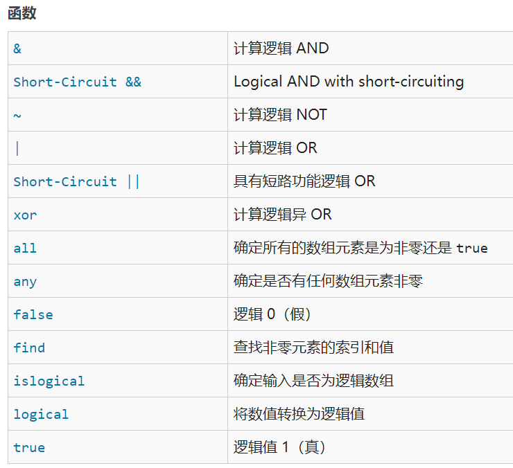

### 按位运算

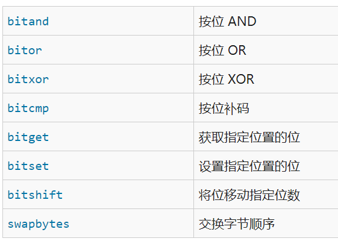

## round (四舍五入取整)

`Y = round(X,N)` 四舍五入到 `N` 位数：

- `N > 0`：舍入到小数点*右侧*的第 `N` 位数。
- `N = 0`：四舍五入到最接近的整数（默认）。
- `N < 0`：舍入到小数点*左侧*的第 `N` 位数。

## 将16进制数写文件

```matlab
clc; % 清除命令行窗口
clear all;% 清除所有变量
close all; % 关闭所有Figure窗口

data = randi([-128 127],1,256);% 产生随机的有符号数据 2^8(-128~127)
% 需要将负数转换为正数
for i = 1:length(data)
    if(data(i)<0)
        data_hex(i) = 2^8 + data(i);% 根据自己需要转换的位宽修改
    else
        data_hex(i) = data(i);
    end
end

% 将有符号的十六进制数写入txt文件
fid = fopen('C:\Users\data_hex.txt', 'w+');
fprintf(fid,'%02x\n',data_hex(i));
fclose(fid);
```


