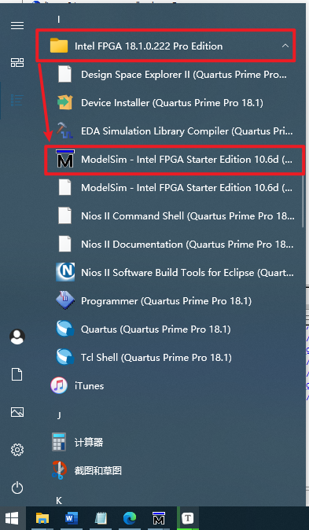
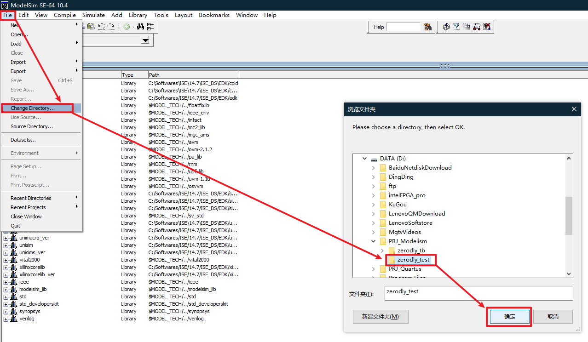
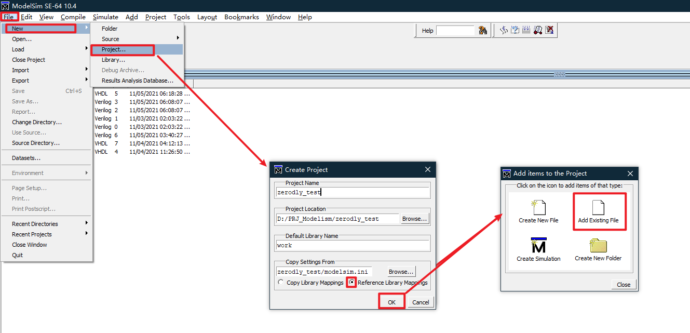
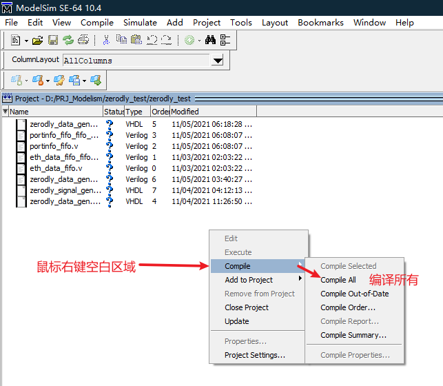
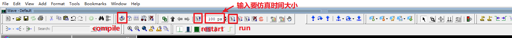
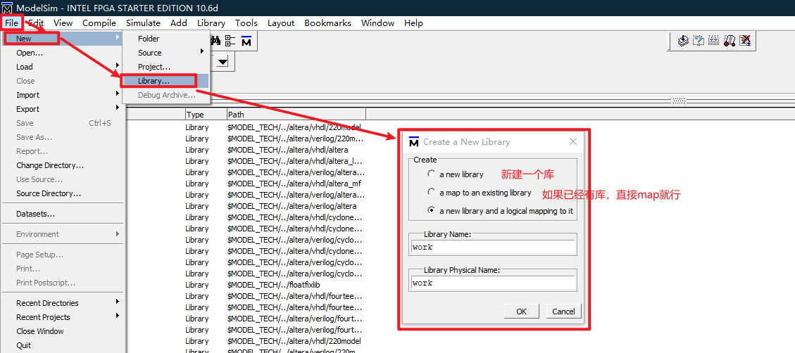

# Modelsim仿真

- author：hongjh
- time：2021
- version:

---------

[toc]

# Quartus 联合 Modelsim

​		这里使用的版本是：

- Quartus Prime 18.1.0.222 Pro Edition

- Modelsim - INTEL FPGA STARTER EDITION 10.6d

  由于直接使用quartus安装时自带的modelsim，所以不需要单独进行Altera库的安装，直接新建工程即可仿真

注：quartus pro版本与modelsim目前所知道最简单的仿真方法就是使用quartus安装时下载的modelsim进行独立仿真，操作步骤如下：


## 新建工程

1. 在电脑上新建个文件夹，用来存放modelsim工程
2. 从windows开始菜单里打开modelsim软件



2. 更改modelsim目录到新建的文件夹下



3. 新建工程，点击 Add Existing File（添加所有要仿真的文件）



4. 编译所有



5. 然后在命令行窗口输入下面语句，其中将 **work.zerodly_data_gen_tb** 改为 **work.+ 你要仿真的文件名**

```
vsim -L work   -L cyclone10gx_ver -L altera_ver -L lpm_ver -L sgate_ver -L altera_mf_ver -L altera_lnsim_ver -L twentynm_ver -L twentynm_hssi_ver -L twentynm_hip_ver -t ps -novopt work.top_scaler_tb  -t ns
```

6. 添加要观察的信号到波形窗口，命令行输入 **view wave**，命令行输入**run 1 ns**，即可观察波形
7. 每次修改代码，直接compile更改的文件 -> restart -> run



8. 可以保存波形窗口格式，下次仿真==直接加载 **.do文件**，然后restart -> run==即可，不用再重新添加信号

## 仿真已有工程

**File -> Library -> a map to an existing library -> compile -> 命令行输入 view wave -> load do文件 -> run**



# Vivado 联合 Modelsim

这里使用的版本是：

- Vivado 2018.3
- Modelsim SE-64 10.6d

# ISE 联合 Modelsim

这里使用的版本是：

- ISE 14.7
- Modelsim SE-64 10.4

