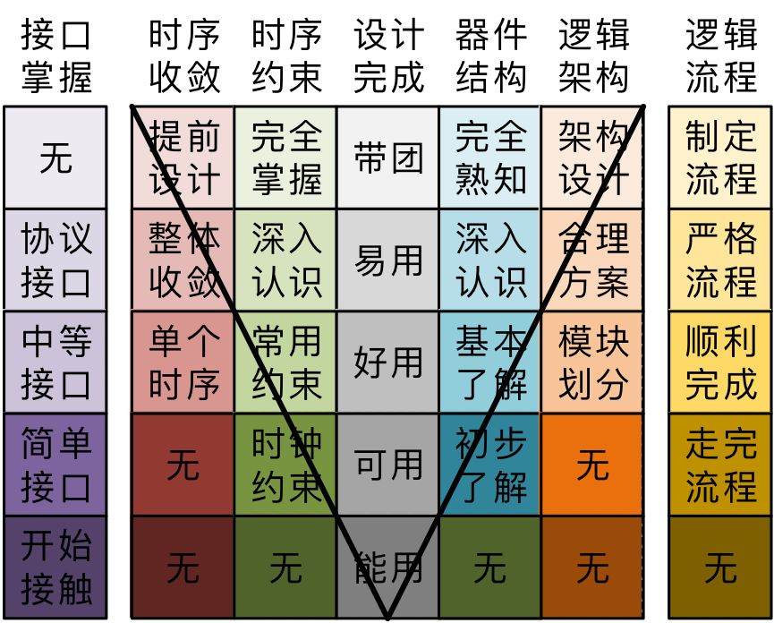

- **Author**：Arlen
- **Time**    ：20210731
- **version**:

--------

# 前言

本文为导航目录，以记录自己的FPGA学习之路。

主要内容包括：

# 一、基础篇

基础篇用于记录以下内容：

- 专业基础
- FPGA开发基础
- 软件使用说明
- 各种模板

| 专业基础                          |      |      |
| --------------------------------- | ---- | ---- |
| [数字电路基础](./数字电路基础.md) |      |      |

| FPGA开发                                        |                                                   |      |
| ----------------------------------------------- | ------------------------------------------------- | ---- |
| [FPGA入门学习路线.png](./FPGA入门学习路线.png)  | [FPGA进阶学习路线.png](./FPGA进阶学习路线.png)    |      |
| [Verilog硬件描述语言](./Verilog硬件描述语言.md) | [VHDL硬件描述语言](./VHDL硬件描述语言.md)         |      |
| [时序分析与时序约束](./时序分析与时序约束.md)   | [FPGA大串讲](./FPGA大串讲.md)                     |      |
| [FPGA面试题总结](./FPGA面试题总结.md)           | [TCL 语法书](./VivadoTcl零基础入门与案例实战.pdf) |      |

| FPGA软件使用                  |                                   |      |
| ----------------------------- | --------------------------------- | ---- |
| [Vivado软件](./Vivado软件.md) | [Modelsim仿真](./Modelsim仿真.md) |      |
| [office软件](./office软件.md) |                                   |      |
| [快捷键](./快捷键.md)         |                                   |      |
|                               |                                   |      |
|                               |                                   |      |

| 模板                                               |                                                |      |
| -------------------------------------------------- | ---------------------------------------------- | ---- |
| [Testbench（Verilog）](./模板/Testbench_Verilog.v) | [Testbench（VHDL）](./模板/Testbench_VHDL.vhd) |      |
| [Changelog](./模板/Changelog.md)                   | [详细文档](./模板/详细文档.docx)               |      |
| [IP设计文档](./IP设计文档.md)                      |                                                |      |

| 其他                          |                                   |      |
| ----------------------------- | --------------------------------- | ---- |
| [python语法](./python语法.md) | [git commands](./git commands.md) |      |
| [Matlab](./Matlab.md)         |                                   |      |
|                               |                                   |      |

# 二、进阶篇

进阶篇用于记录以下内容：

- 接口协议
- 总线协议
- Xilinx IP使用说明
- 其他

| 接口协议              |                             |                             |
| --------------------- | --------------------------- | --------------------------- |
| [UART](./UART.md)     | [SPI](./SPI.md)             | [IIC](./IIC.md)             |
| [以太网](./以太网.md) | [PCIE](./office软件使用.md) | [LVDS](./office软件使用.md) |
| [SCCB](./SCCB.md)     |                             |                             |

| 总线协议                  |                               |      |
| ------------------------- | ----------------------------- | ---- |
| [AMBA总线](./AMBA总线.md) | [FC-AE-1553](./FC-AE-1553.md) |      |
|                           |                               |      |

| Xilinx IP                   |                                   |
| --------------------------- | --------------------------------- |
| [FIFO](./office软件使用.md) | [axi_quad_spi](./axi_quad_spi.md) |

| 驱动 IP                           |      |
| --------------------------------- | ---- |
| [OV5640摄像头](./OV5640摄像头.md) |      |
|                                   |      |

| 其他                        |      | |
| --------------------------- | ---- | --------------------------- |
| [CRC校验](./CRC校验.md) | [报错](./报错.md) | [TCL脚本](./TCL脚本.md) |
| [Testbench用例](./Testbench用例.md) |  | |

# 逻辑工程师应该掌握的各种能力

大概设置了5种能力，每种能力在不同的阶段有不同的要求。其中，设计完成能力是最基本的要求。

## 设计完成能力

第一阶段：可以完成设计，基本知道verilog的语法，能够把一个需求用代码实现出来，并且能够调试出来，经常会上网搜索现成的模块，对逻辑的硬件思维基本没有

第二阶段：开始关注代码风格，开始把自己的代码写的风格统一，并且开始关注代码的硬件实现，突出标志就是开始关注rtl视图，比较能明确的区分可综合语句与仿真语句的区别

第三阶段：在这个阶段，对模块内部的代码书写有了更加深刻的认识，模块内部的写法开始更加统一，基本上，模块内部的代码可以直接生成rtl视图。而且，开始考虑设计的复用，开始考虑模块的划分，注重模块接口，平台化等等

第四阶段：该阶段已经可以比较轻松的完成一个逻辑设计，而且结构合理，易读，可复用。

第五阶段：可以带领一个团队完成比较大规模的逻辑设计，分配不同的工作任务，可以准确的预估项目的风险，进度，可以准确的做出逻辑的整体方案，仿真方案，调试方案，对于整体的业务流有全面而深刻的认识

 

## 器件能力

第一阶段：知道FPGA的意思，但是基本上不知道fpga的内部结构

第二阶段：不怎么关注器件视图。但是基本知道器件的大概结构，知道fpga里面有le，ram，dsp，全局等等，对逻辑器件有了基本的认识

第三阶段：此时开始关注器件结构，了解fpga的内部架构，时钟网络，route，对时序约束有了基本的了解

第四阶段：对器件结构有了比较深入的认识，开始认识到不同厂家器件结构的不同

第五阶段：熟知各个厂家的各种逻辑器件的内部结构，基本逻辑单元结构，以及由此带来的代码风格的相应的改变

 

## 时序约束能力

第一阶段：基本不知道什么是时序约束

第二阶段：知道时序约束，会做时钟约束，可以根据简单的公式计算输出输出约束

第三阶段：懂得时序约束与布线的关系，熟练掌握最基本的常用约束

第四阶段：对时序约束有深刻的认识，可以主动设计整体时钟和复位系统

第五阶段：熟知时序约束，并且能够采取各种手段，解决各种时序问题

 

## 逻辑架构能力

第一阶段：无

第二阶段：有一点点概念，知道大概可以划分模块，对模块的功能，接口没有要求，一般有需要就直接加一个接口信号，不能在项目开始就主动设计

第三阶段：开始考虑设计的复用，开始考虑模块的划分，注重模块接口，平台化等等

第四阶段：接手一些比较大的设计，开始有架构的考虑，对于模块的划分，模块接口，模块职责，整体方案的实现，开始有更多的考虑，此时，可以做出比较好的，合理的方案

第五阶段：对整体的逻辑架构有所考虑，并且开始准确的划分逻辑架构，模块接口，功能划分，工作职责，协同交流

 

## 时序收敛能力

第一阶段：无

第二阶段：无

第三阶段：开始接触到时序收敛，有单个时序不过的信号，能够予以解决

第四阶段：开始主动设计时序，基本可以完成整个设计的时序收敛任务。

第五阶段：对于逻辑的布局，数据流走向有深刻的认识，能够在项目支出就通过设计来保证时序收敛。

 

## 接口掌握能力

第一阶段：开始接触简单的接口，

第二阶段：开始掌握如串口，spi，i2c等简单的外部接口

第三阶段：开始接触ddr，ssram，ad，lpc等等略复杂的接口

第四阶段：开始接触pcie，transceiver，rapid io，phy，等等复杂且带协议的接口

第五阶段：无，此阶段，不需要用掌握接口的多少来衡量

 

## 逻辑流程掌握能力

第一阶段：基本不知道正规逻辑流程，基本无设计文档

第二阶段：能够根据已知的流程完成设计，写出文档

第三阶段：比较熟练逻辑流程，并且能够顺利完成设计文档

第四阶段：有比较严格的逻辑流程，并且完成各种文档，对流程的认识比较深刻

第五阶段：可以根据现状，制定合理流程和文档要求

## 仿真验证水平

## 其他

## 逻辑工程师水平的V模型

根据以上不同阶段对各种能力的要求，可以完成V模型。其中，完成设计是最基本、核心的要求，随着水平的增长，对其他能力的要求也随之变高。

