# **SCCB**

- Author：hongjh
- Time：20230422
- Version：

---------

[toc]

## 概述

SCCB（Serial Camera Control Bus，串行摄像头控制总线）是由OV（OmniVision的简称）公司定义和发展的三线式串行总线，该总线控制着摄像头大部分的功能，包括图像数据格式、分辨率以及图像处理参数等。结构框图如下所示:

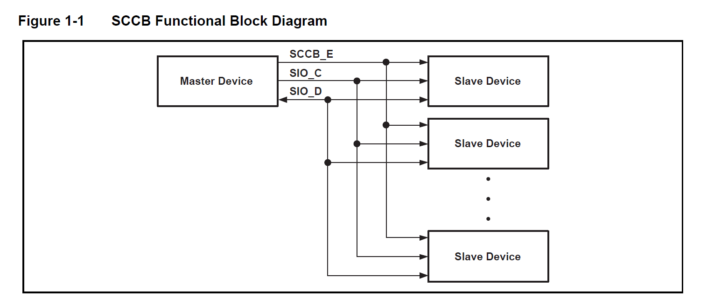

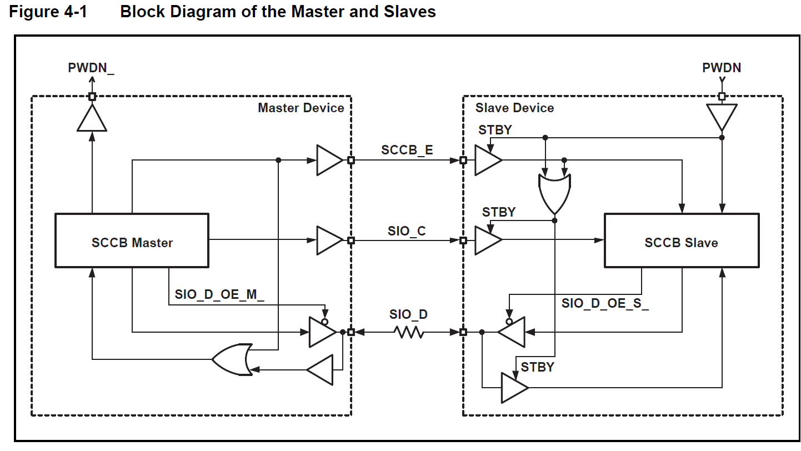

## 引脚

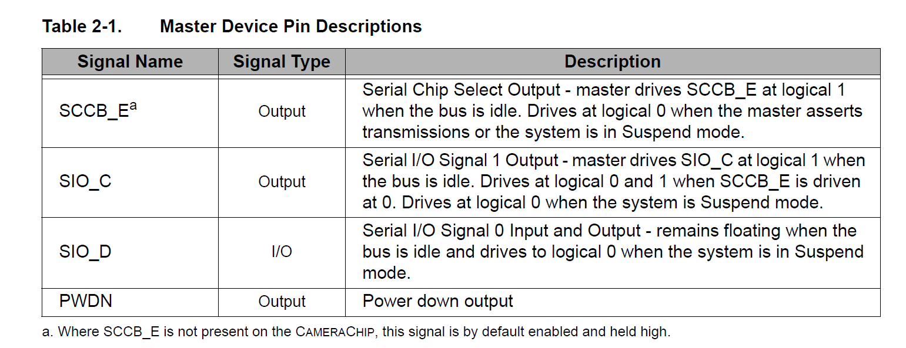

OV公司为了减少传感器引脚的封装，现在SCCB总线大多采用两线式接口总线，包括SIO_C串行时钟输入线和SIO_D串行双向数据线，分别相当于IIC协议的SCL信号线和SDA信号线。SIO_C的最小时间为10us，即最大频率为100K。一般来说，100K-400K之间都可以。

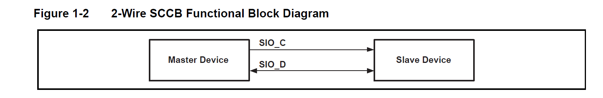

## 传输时序

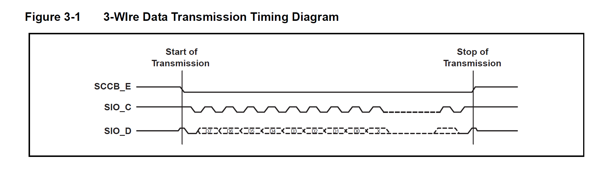

### 起始/结束信号

#### 三线模式

- **起始：SCCB_E由高变低**
- **结束：SCCB_E由低变高**

#### 两线模式

- **起始：SIO_C为高时，SIO_D由高变低**
- **结束：SIO_C为高时，SIO_D由低变高**

----

**参数说明**

- tPRC：SCCB_E拉低之前，SIO_D必须保持高电平的最短时间，==15ns==
- tPRA：SIO_D拉低之前，SCCB_E必须保持低电平的最短时间，==1.25us==
- tPSA：SCCB_E拉高之前，SIO_D必须保持高电平的最短时间，==15ns==
- tPSC：SIO_D拉低之前，SCCB_E必须保持低电平的最短时间，==0ns==

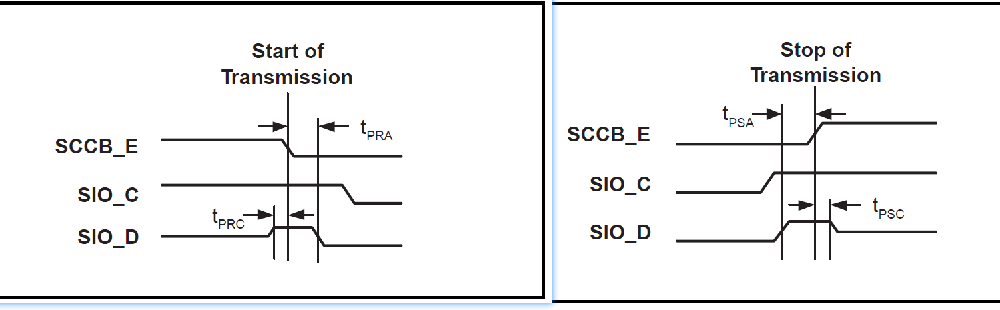

### 

## 传输周期

每个阶段包含9bits，高位优先传输，第9bit为 Don’t care 或 NA

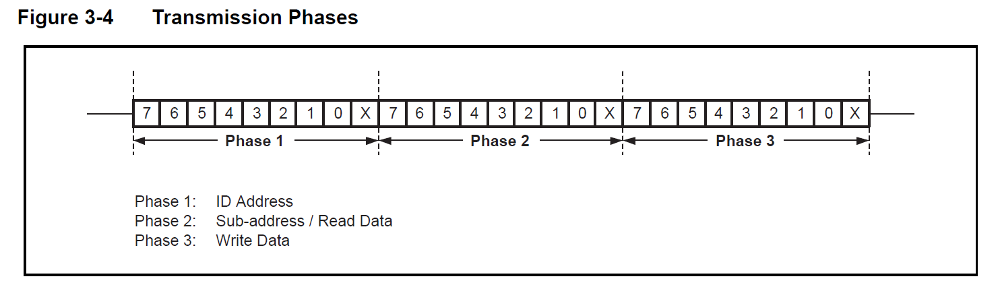

### 3阶段写传输周期

用于主设备写单byte数据至从设备

- 第一阶段：传输从设备地址
- 第二阶段：传输写寄存器地址
- 第三阶段：传输写数据
- 三阶段的第9bit均为Don't care

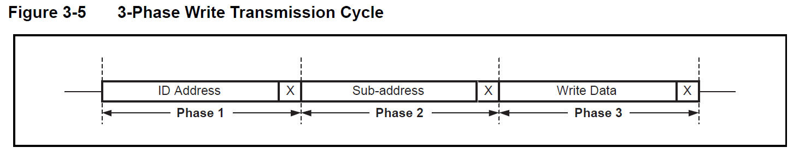

### 2阶段写传输周期

用于指示从设备读寄存器地址

- 读数据前需要先指明从设备读寄存器地址

- 两阶段的第9bit均为Don't care

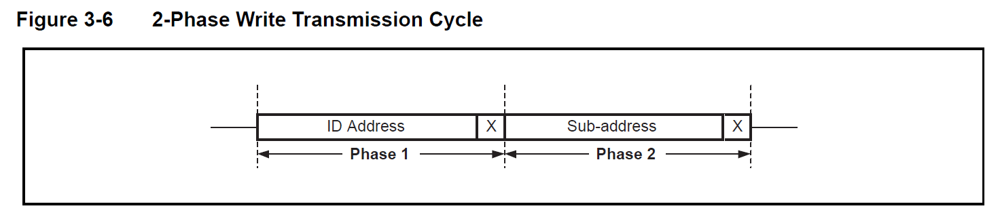

### 2阶段读传输周期

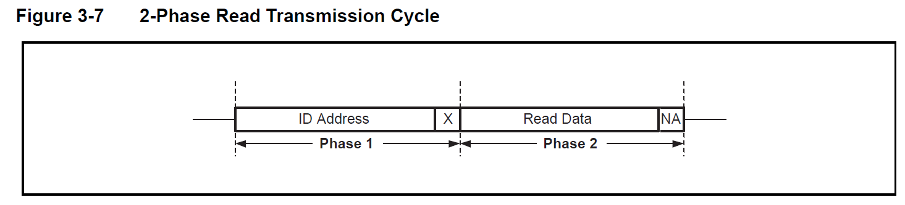

### 阶段一 ID Address

主设备通过阶段1来识别所选的从设备，以便读取或写入数据。每个从设备都有一个唯一的ID地址，由7位组成，从高到低依次编号为位7到位1。第8位（即位0）是读/写选择器位，用于指定当前周期的传输方向。逻辑0表示写入周期，逻辑1表示读取周期。

- SIO_D_OE_M、SIO_D_OE_S低有效，分别为主设备和从设备的I/O使能信号
- SIO_D_OE_S 先变为低，即从设备输出SIO_D信号，主设备作为输入端
- tCYC ：单bit传输周期，最短10us，对应时钟频率100KHz

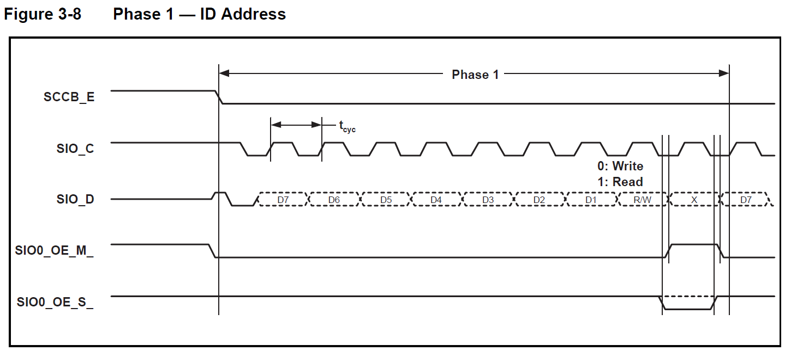

### 阶段二 子地址/读数据

在阶段2中，主设备向所选的从设备发送子地址信息。子地址用于指定要读取或写入的特定寄存器地址。

----

==子地址==

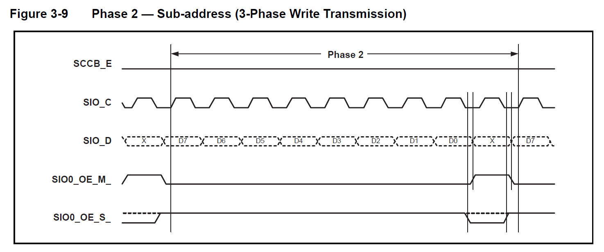

----

==读数据==

第9bit 主设备回复 NA（逻辑1）

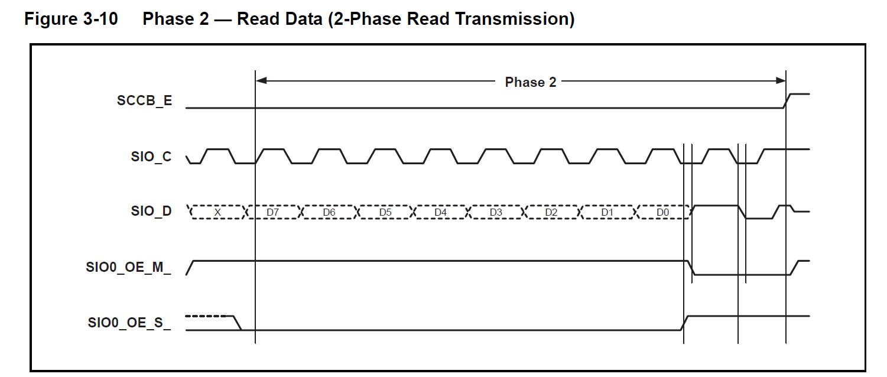

### 阶段三 写数据

在阶段3中，主设备向所选的从设备发送数据信息。如果是写入周期，则主设备将数据写入所选寄存器地址；如果是读取周期，则从设备将请求数据发送回主设备。

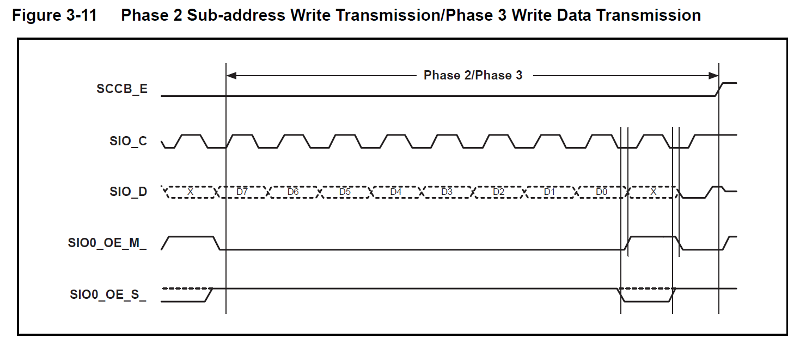

## SCCB与IIC区别

- SCCB的应答位称为X，表示“Don't care”，而IIC应答位称为ACK。

- SCCB只能单次读，而IIC除了单次读还支持连续读。

- SCCB读操作中间有stop，而IIC读操作中间可以有stop也可以不需要stop，具体表现如下

SCCB读：start_1 + phase_1 + phase_2 + ==stop_1== + start_2 + phase_1+ phase_2 + stop_2
     IIC读：start_1 + phase_1 + phase_2 +              + start_2 + phase_1 + phase_2+ stop_2

　　除去上面三点，SCCB和IIC再无区别，因此如果只需要配置寄存器（只用到写），可以直接拿IIC的时序来当做SCCB用，如果需要读，读操作中间必须有一个stop。
