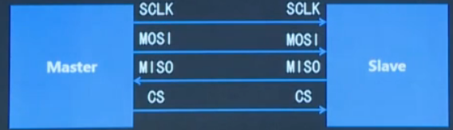
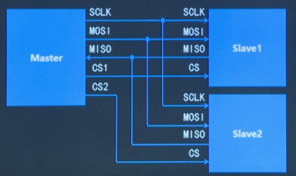
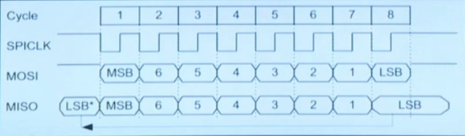
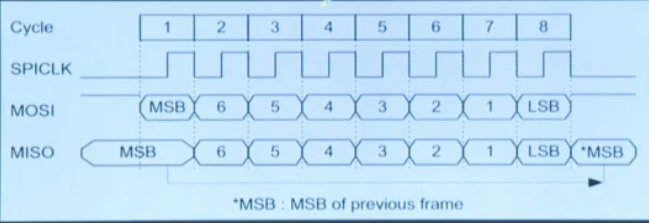
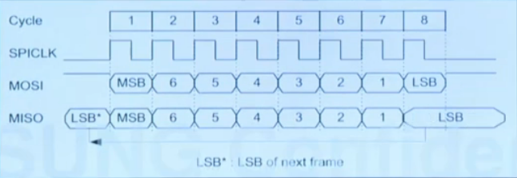
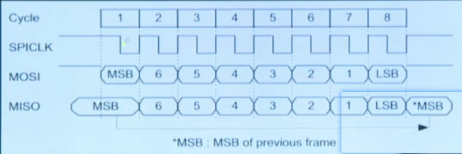
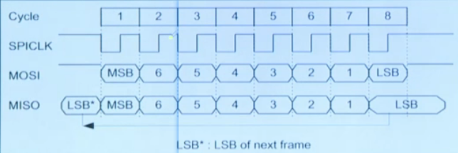

# SPI

- Author：hongjh
- Time：20230326
- Version:

---------

[toc]

## SPI 简介

SPI（Serial Peripheral Interface）是串行外设接口的缩写，SPI是一种**高速**的、**全双工**、同步的**串行**通信总线；SPI采用**主从方式工作**，一般有一个主设备和一个或多个从设备；SPI需要至少4根线，分别是MISO（主设备输入从设备输出）、MOSI（主设备输出从设备输入）、SCLK（时钟）、CS（片选）。SPI使用引脚较少且布线方便，所以越来越多的芯片集成了这种通信协议；

## 寻址方式

当主设备要和某个从设备进行通信时，主设备需要先向对应从设备的片选线上发送使能信号（高电平或者低电平，根据从机而定）表示选中该从设备。

## 通信过程

SPI总线在进行数据传送时，==**先传送高位，后传送低位**==；数据线为高电平表示逻辑‘1’，低电平表示逻辑‘0’；**<u>一个字节传送完成后无需应答即可开始下一个字节的传送</u>**；SPI总线采用同步方式工作，时钟线在上升沿或下降沿时发送器向数据线上发送数据，在紧接着的下降沿或上升沿时接收器从数据线上读取数据，完成一位数据传送，八个时钟周期即可完成一个字节数据的传送；

## 极性和相位

SPI总线有**四种**不同的**工作模式**，取决于极性（CPOL）和相位（CPHL）这两个因素。

- CPOL表示SCLK空闲时的状态
  - CPOL=0，空闲时SCLK为低电平
  - CPOL=1，空闲时SCLK为高电平
- CPHA表示采样时刻
  - CPHA=0，每个周期的第一个时钟沿采样
  - CPHA=1，每个周期的第二个时钟沿采样

1. CPOL = 0, CPHA = 0

2. CPOL = 0, CPHA = 1

3. CPOL = 1, CPHA = 0

3. CPOL = 1, CPHA = 1

需要说明的是，对于一个特定的从设备来说，一般在出厂时就会将其设计为某种特定的工作模式；我们在使用该设备时就必须保证主设备的工作模式和该从设备保持力致，否则是无法进行通信的；所以一般我们需要对主设备的CPOL和CPHA进行配置。

## IIC 和 SPI 的异同

### 相同点

1. 均采用串行、同步的方式
2. 均采用TTL电平，传输距离和应用场景类似
3. 均采用主从方式工作

### 不同点

1. IIC为半双工， SPI为全双工
2. IIC有应答机制， SPI无应答机制
3. IIC通过向总线广播从机地址来寻址， SPI通过向对应从机发送使能信号来寻址

4. IIC的时钟极性和时钟相位固定， SP I的时钟极性和时钟相位可调
