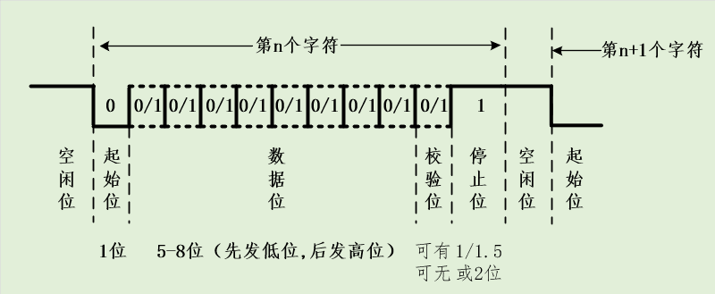
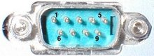

# UART

- Author：hongjh
- Time：20230326
- Version:

---------

[toc]

## 1. UART 协议原理与编程

### 1.1 UART 简介

**UART**，**U**niversal **A**synchronous **R**eceiver **T**ransmitter 即**通用异步收发器**，是一种通用的**串行**、**异步**通信总线该**总线有两条数据线**，可以实现**全双工的发送和接收**在嵌入式系统中常用于主机与辅助设备之间的通信。 

**比特率**：每秒传输的比特的数量

**波特率**：每秒发送的符号（baund）数量

当一个符号只包含两种可能，即一个事件两种可能，那么此时的波特率等于比特率。

- 确定收到几位数据是通过波特率来数的
- 串口发送不允许一次发送多个字节， 为了防止累计误差的出现，一旦出现一位错误，后续全错

### 1.2 UART 帧格式

- **起始位**：发送1位逻辑0（低电平），开始传输数据。
- **数据位**：可以是5-8位的数据，先发低位，再发高位，一般常见的就是8位（1个字节），其他的如7位的ASCII码。
- **校验位：**奇偶校验，将数据位加上校验位，1的位数为偶数（偶校验） ，1的位数为奇数（奇校
  验）。
- **停止位：**停止位是数据传输结束的标志，可以是1/1.5/2位的逻辑1（高电平）。
- **空闲位：**空闲时数据线为高电平状态，代表无数据传输。

### 1.3 UART 缺点

1. 电气接口不统一

   - UART只是对**信号的时序**进行了定义，而未定义接口的**电气特性**；

   - UART通信时一般直接使用**处理器使用的电平，即TTL电平，**但不同的处理器使用的电平存在差异，所以不同的处理器使用UART通信时一般不能直接相连；

   - UART没有规定不同器件连接时连接器的标准，所以不同器件之间通过UART通信时连接很不方便；

2. 抗干扰能力差

   UART一般直接使用TTL信号来表示0和1，但TTL信号的抗干扰能力较差，数据在传输过程中很容易出错

3. 通信距离极短

   因为TTL信号的抗干扰能力较差，所以其通信距离也很短，一般只能用于一个电路板上的两个不芯片之间的通信

### 1.4 Verilog 代码

常用的波特率标准有：

- 1200 bps
- 9600 bps (常用)
- 38400 bps
- 115200 bps (常用，而且通常情况下能用的最快的波特率)

波特率为115200bps 时，每个bit需要 (1/115200)=8.7us，在不考虑奇偶校验位的情况下，发送一个字节还需要发送额外的1个起始位和1个停止位，所以发送1个字节实际所需要的最少时间是10*8.7us=87us，这意味着1s（1000000us）中能发送的字节数为 (1000000/87)=11494，所以在波特率为115200bps的情况下，串口传输数据的速率约为11.5KB/S。而有些电脑的串口有时候需要一个更长的停止位，比如1.5位或2位的停止位，那么发送一个字节所需要的时间比只有一个比特停止位的情况所耗费的时间更长，在这种情况下，串口的传输速率会低于10.5KB/S。

通过上面一系列的总结以后，可以得出FPGA与PC之间的串口通信主要包括三个模块：**波特率产生模块、发射模块和接收模块**。

## 2. RS232、RS485 协议原理

RS232 和 RS485 协议是基于串口，收发时序和串口一样，只是在电气上加以规定，让传输距离更远，抗干扰能力更强。

### 2.1 RS232 协议简介

**RS232协议是**在1970年由美国电子工业协会（EIA）联合贝尔系统、调制解调器厂家、计算机终端生产厂家共同制定的**用于串行通讯的标准**；该标准规定采用一个**标准的连接器**，标准中对连接器的**每个引脚的作用加以规定**，还对信号的**电平加以规定**；

#### 2.1.1 RS232 接口

该<u>标准规定采用一个25引脚的DB-25连接器</u>，标准中对连接器的每个引脚的信号内容加以规定，还对各种信号的电平加以规定；后来<u>IBM的PC机将RS232简化成了**DB-9连接器**</u>，后来成为事实标准；现在工业控制的**RS-232接口一般只使用RXD(PIN2)、TXD(PIN3)、GND(PIN5)三条线**；

#### 2.1.2 RS232 信号

该标准规定==**逻辑 “1” 的电平为 -5v 到 -15v，逻辑 “0” 的电平为 +5v 到 +15v**==，选用该电气标准的目的在于提高抗干扰能力，增大通信距离，其传送距离一般可达15m；

- 电平转换：虽然很多处理器中都会集成UART控制器，但处理器产生的信号一般都是TTL信号并不是符合RS232标准的信号，所以一般我们还需要在处理器外部去添加电路对信号的电平进行转换；

#### 2.1.3 RS232 缺点

- 接口的信号电平值较高，易损坏接口电路的芯片，又因为与TTL电平不兼容，所以需要使用电平转换芯片才能与TTL电路连接
- 通信速度较低
- 易产生共模干扰，抗噪声干扰性弱
- 传输距离较短（15m）

### 2.2 RS485

#### 2.2.1 RS485协议简介

该标准由电信行业协会和电子工业联盟定义；使用该标准的通信网络能在**远距离条件下以及电子噪声大的环境下有效传输信号**；该标准**允许连接多个收发器**，即具有多站能力，这样可以利用单一的RS485接口方便地建立起一个设备网络。 

#### 2.2.2 RS458 信号

==**RS485标准规定采用差分信号进行数据传输，两线间的电压差为 +2v 到 +6v 表示逻辑 “1”，两线间的电压差为 -2v 到 -6v 表示逻辑 “0”**== ；使用差分信号能有效地减少噪声信号的干扰，延长通信距离， RS485的通信距离可以达到1500m； RS485接口信号的电平比RS232降低了，所以不易损坏接口电路的芯片，且该电平与TTL电平兼容，可方便地与TTL电路连接。

#### 2.2.3 RS458 接口

**RS485采用两线制**，这种接线方式为总线式拓扑结构，在同一总线上可以同时存在多个节点；
因为采用两线制，数据的发送和接收都要使用这对差分信号线，发送和接收不能同时进行，所以**只能采用半双工的方式工作**，编程时也需要加以处理

- 电平转换：虽然很多处理器中都会集成UART控制器，但处理器产生的信号一般都是TTL信号并不是符合RS485标准的信号，所以一般我们还需要在处理器外部去添加电路将TTL信号转换成差分信号；

#### 2.2.4 RS485 优点

- 接口的信号电平值较低，不易损坏接口电路的芯片，且与TTL电平兼容，可方便地与TTL电路连接;
- 通信速度快;
- 抗噪声干扰性强;
- 传输距离较远（1500m）;
- 可实现多节点组网.
