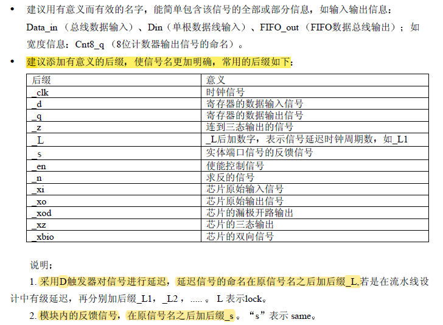
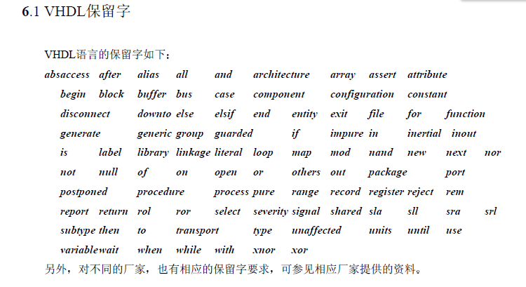

# VHDL硬件描述语言

- author：hongjh
- time：20211109
- version: 0.1

---------

[toc]

## 基本知识

- 代码不区分大小写
- 两个减号为单行注释
- 电路功能分为顺序语句和并行语句两种

## 库Library

- 存放**已编译**程序包和数据集合的地方，可以被调用

- 代码格式

  ```VHDL
  library 库名;
  use 库名中的逻辑体名;
  ```

- 代码实例

  ```VHDL
  library ieee;                  --打开ieee库
  use ieee.std_logic_1164.all;   --加载ieee中std_logic_1164包内的所有内容
  ```

- 库的种类
  - STD库 - VHDL标准库
  - IEEE库 - VHDL标准库的扩展
  - WORK库 - 用户自己的库

- ==**3个常用的库**==

  ```VHDL
  library ieee;
  use ieee.std_logic_1164.all; --包含std_logic、std_vector等类型定义及其相关逻辑类子程序定义
  use ieee.std_logic_arith.all; --包括std_logic类型数据的算术运算子程序定义。（如+、-、*、移位、比较等）
  use ieee.std_logic_unsigned.all; --std_logic_vector类型的无符号数算术运算子程序定义
  use work.PCK_CRC32_D8.all;--用户自己的库
  ```

### 自定义库（程序包的使用）

VHDL中默认一个work库作为用户的project的设计库，用户可以通过定义PACKAGE（程序包）来定义work库中的内容。

**程序号（PACKAGE）的定义分为两部分内容：包首部分和包体部分**

1. 包首部分

    ```VHDL
    package <程序包名称>  is
    --包首说明 ：定义数据类型、元件和子程序等
    end <程序包名称>;
    ```

2. 包体部分

    ```VHDL
    package body <程序包名称>  is
    --包体说明语句 ：描述元件和子程序内容
    end <程序包名称>;
    ```

3. 举例

   ```VHDL
   library IEEE;
   use IEEE.std_logic_1164.all;
   
   package PCK_bk_serdes is
   
   constant FRM_VID   : std_logic_vector(8-1 downto 0):= X"00";
   constant FRM_VSYNC : std_logic_vector(8-1 downto 0):= X"01";
   
   end  PCK_bk_serdes;
   ----------------------------------------------------------------
   ----------------------------------------------------------------
   package body PCK_bk_serdes is
   
   end PCK_bk_serdes;
   ```

## 实体Entity

- 实体用于描述所设计系统的外部接口信号

- 格式

  ```VHDL
  entity entity_name is
  generic(
  	parameter_name : 数据类型 := default_value;
      parameter_name : 数据类型 := default_value
  );
  port(
  	port_name : 方向	数据类型;
      port_name : 方向	数据类型
  );
  end entity entity_name;
  ```

- 端口方向

  ```VHDL
  in     - 输入端口，此类型的信号不能被赋值
  out    - 输出端口
  inout  - 双向端口
  buffer - 缓冲端口
  ```

- 举例

  ```VHDL
  entity entity_name is
  port(
  	sysclk : in  std_logic;
      nRST   : in  std_logic;
      
      led    : out std_logic
  );
  end entity;
  ```

## 结构体Architecture

- 构造体用于描述实体所代表的系统内部结构和行为

- 代码格式

  ```VHDL
  architecture 结构体名 of 实体名 is
  	[说明语句]
  begin
  	[功能描述语句]
  end 结构体名;
  ```

- 说明语句包括了内部信号、常数、元件、数据类型、函数定义

## 数据对象

### 常量Constant

- 常量声明格式

  ```VHDL
  constant 常量名 : 数据类型 [:= 初始值];
  ```

- 可以在library/entity/architecture/process中定义

### 变量Variable

- 变量声明格式

  ```VHDL
  variable 变量名 : 数据类型 [取值范围] [:= 初始值];
  ```

- 变量是**局部量**，只能在进程process和子程序中使用
- 变量的赋值是理想的，没有延时（即使用组合逻辑实现而不是时序逻辑）
- 变量赋值符号为`:=`

- **有些变量类型需要声明范围**，比如integer类型就需要。而std_logic类型就不需要（std_logic取值范围比较小，而integer取值范围很大，手动声明范围可以减少元件的使用）

- 带取值范围的变量声明举例

  ```VHDL
  variable x, y : integer range 15 downto 0 := 1;
  ```

### 信号Signal

- 在architecture中定义
- **信号赋值符号为**`<=`，**但是初始化符号是**`:=`

- 信号声明格式

  ```VHDL
  signal 信号名 : 数据类型 [:= 初始值];
  ```

## 数据类型

- 常用数据类型
  - 标准逻辑				std_logic
  - 标准逻辑序列 	   std_logic_vector
  - 整数                        integer

  ```VHDL
  constant	CLK_NUM		: integer	:= 3;
  constant	CLK_NUM		: std_logic_vector(3 downto 0) := X"3";
  signal		clk_en		: std_logic;
  signal		clk_cnt		: std_logic_vector(7 downto 0);
  signal      num         : integer range 0 to 15;--信号num的取值范围是0-15，可用4位二进制表示
  ```

- 数组

  ```VHDL
  type ARRAY_3xVID_NUM  is array (0 to VID_NUM-1)  of std_logic_vector(2 downto 0);
  signal vsync_meta : ARRAY_3xVID_NUM;
  ------------------------------------------------------------------------
  for i in 0 to VID_NUM-1 loop
      vsync_meta(i) <= vsync_meta(i)(1 downto 0)&vsync_in(i);
      if vsync_meta(i)(2 downto 1) = "10" then
          vsync_neg(i) <= '1';
      else
          vsync_neg(i) <= '0';
      end if;
   end loop;
  ```


## 类型转换

- use IEEE.std_logic_1164.all

| 转换函数            | 作用                                  |
| ------------------- | ------------------------------------- |
| to_std_logic_vector | 将 bit_vector 转换为 std_logic_vector |
| to_bit_vector       | 将 std_logic_vector 转换为 bit_vector |
| to_std_logic        | 将 bit 转换为 std_logic               |
| to_bit              | 将 std_logic 转换为 bit               |

- use IEEE.std_logic_arith.all

| 转换函数              | 作用                                                 |
| --------------------- | ---------------------------------------------------- |
| conv_std_logic_vector | 将 integer、unsigned、signed 转换为 std_logic_vector |
| to_bit_vector         | 将 std_logic_vector 转换为 bit_vector                |

- use IEEE.std_logic_unsigned.all

| 转换函数     | 作用                               |
| ------------ | ---------------------------------- |
| conv_integer | 将 std_logic_vector 转换为 integer |

## 信号运算

- 信号赋值：`<=`  例： x <= ‘1’

- 逻辑运算符： `and`、`or`、`not`、`xor`异或、`xnor` 同或、`nand`与非、`nor`或非 
  - 例： x <= not y;  x <= y and z;  …

- 算术运算符：`+` 加、`-` 减、`*` 乘、`/` 除、 `**` 乘方、 `mod` 取模、 `rem` 取余、 `sll` 逻辑左移、 `srl` 逻辑右移、 `sla` 算数左移、 `sra` 算数右移、 `rol` 逻辑循环左移、 `ror` 逻辑循环右移、`abs` 取绝对值

- 关系运算符：` =`、` /=`、`>`、 `<`、` >=` 、 `<=`

- 位拼接运算：` &`

## 并行语句

- 在结构体语句中，并行语句的位置为

  ```VHDL
  architecture 结构体名 of 实体名 is
  	[说明语句]
  begin
  	[并行语句]
  end 结构体名;
  ```

### 进程语句-process

- 进程描述格式

  ```
  process (sensitivity list)
  begin
  	--功能代码
  end process
  ```

- **进程由敏感信号变化启动**
- 进程内语句为顺序语句，但结构体内的不同进程是并行的，各个进程根据敏感信号独立运行

### 参数传递语句-generic

- 参数传递语句（GENERIC）主要用来传递信息给设计实体的某个具体元件，如用来定义端口宽度、器件延迟时间等参数后，并将这些参数传递给设计实体

- 使用参数传递语句易于使设计具有通用性

- 格式

  ```VHDL
  generic(常数名 数据类型 := 设定值);
  ```

- 应用场景
  - 定义实体的端口大小
  - 设计实体的物理特征；传输延迟，上升和下降延迟等
  - 结构体的总线宽度
  - 设计实体中底层中同种原件的例化数量

### 元件例化语句-component

#### 元件声明格式

```VHDL
component 元件名
generic(
	NUM1 : integer:= 1; --参数说明1;
    NUM2 : integer:= 2  --参数说明2
);
port(
    port1 :in  std_logic;--端口说明1;
    port2 :out std_logic_vector(NUM2-1 downto 0)--端口说明2
);end component;
```

==**注意分号的位置；端口说明中的参数为该元件参数**==

#### 元件例化格式

```VHDL
module1_inst:元件名
generic map(
    NUM1 => NUM3, --参数映射
    NUM2 => NUM4
)
port map(
    port3 =>port1,--端口映射
    port4 =>port2
);
```

### 生成语句-generate

- GENERATE 语句用来产生多个相同的结构和描述规则结构，如阵列、元件例化和进程

- **for...generate**语句设计**规则体**，**不规则体**可用**if...generate**语句

#### for...generate

- 该生成语句用于描述多重模式，结构中所列举的是并发处理语句。这些语句并发执行而不是顺序执行，因此结构中不能用EXIT和NEXT语句

- 格式：

  ```VHDL
  标号：for 变量 in 不连续区间 generate
  <并发处理的生成语句>
  end generate [标号名]；
  ```

#### if...generate

- 该语句用于描述结构的例外情况，如边界处发生的特殊情况

- 格式：

  ```VHDL
  标号：if 条件 generate
  <并发处理的生成语句>
  end generate [标号名]；
  ```

### 块语句-block

- 块（BLOCK）语句可以看作是结构体中的子模块，块语句把许多并行语句组合在一起形成一个子模块，而它本身也是一个并行语句

- 格式

  ```VHDL
  块结构名：
  BLOCK 
  端口说明 类属说明
  BEGIN
  并行语句
  END BLOCK 块结构名;
  ```

### 信号赋值语句

#### 简单信号赋值 <=

```vhdl
Sginal_name <= expression;
```

#### 条件信号赋值 when...else...

```vhdl
Sginal_name <= value_a when condition1 else
               value_b when condition2 else
               value_c;
--Example
Rd_en <= '1' when (Rd_empty = '0') else '0';
```

#### 选择信号赋值 with...select...when

```vhdl
with selection_signal select 
    Select_name <= value_a when value_1_of_selection_signal,
                    value_b when value_2_of_selection_signal,
                    value_c when others;
--Example
with S select
    X <= A when "00"|"10",
         B when "01",
         C when others;
```

选择信号赋值语句**不允许条件重叠或条件涵盖不全**，注意区分逗号和分号

## 顺序语句

### 顺序语句 - 进程语句

进程描述格式：

```bash
[进程标签 :] process (敏感信号参数表)
	[进程说明]
begin
	[顺序描述语句]
end process
```

- **进程由敏感信号变化启动**
- 进程内语句为顺序语句，但构造体内的不同进程是并行的，各个进程根据敏感信号独立运行
- 时序电路中CLK信号常为敏感信号

### 常见顺序语句

#### 赋值语句

变量赋值与信号赋值

#### if-else语句

- 分支少、具有优先级时候使用

- ==if 必须有一个 else 对应（除下面情况可不写 else 语句）,当没有 else 语句，将产生不希望的存储器==

  ```VHDL
  process(Clk,Rst)
  begin
      if(Rst = '1')then
          Q <= '0';
      elsif rising_edge(Clk) then
          Q <= D;
      end if;
  end process;
  ```

#### case - when 语句

- 在多条分支的时候使用

- ==case-when 语句必须有 when others 支项==

- 这里的`=>`不是操作符，相当于then

  ```VHDL
  case Selection_signal is
  	when value1_of_selction sigal => 
      	Statements1;
  	when value2_of_selction sigal => 
      	Statements2;
      ...
  	when others => NULL;
  end case;
  ```

#### for...loop语句

- 在重复操作时使用

  ```VHDL
  process(signal1,signal2)
  beign
      for i in 开始值 to 结束值 loop
          --功能代码
      end loop;
  end process;
  ```

## 时序逻辑相关

- 上升沿的描述：`rising_edge(clk)`

- 状态机定义

  ```VHDL
  type state is(
  	INIT,
      REC_DATA,
      SEND_DATA,
      TAIL
  );
  signal pstate		: state := INIT;
  ```
- 时钟：一定频率的方波

- **组合逻辑**：输出只由输入决定，与时钟无关

  - 无时钟边沿敏感

  ```VHDL
  process (A,B)
  begin
      if(A = '1' and B = '0') then
          C <= X"1";
      elsif (A = '1' and B = '1') then
          C <= X"2";
      else
          C <= X"3";
      end if;
  end process;
  ```

- **时序逻辑**：输出不仅由输入决定，还与时钟相关

  - 异步复位逻辑
  - 时钟单边沿敏感

  ```vhdl
  process (sysclk, nRST)
  begin
      if (nRST = '0') then
          C <= X"0";
      elsif (rising_edge(sysclk)) then
          if(A = '1' and B = '0') then
              C <= X"1";
          elsif (A = '1' and B = '1') then
              C <= X"2";
          else
              C <= X"3";
          end if;
      end if;
  end process;
  ```

## 状态机

```vhdl
type state is(
    IDLE,
    CONFIG,
    DATA,
    DONE
);
signal C_S,N_S: state:= IDLE;

FSM_ONE: process(clk)begin
    if (rst = '1') then
        C_S <= IDLE;
    else
        C_S <= N_S;
    end if;
end process; 

FSM_TWO: process(C_S) begin
    when IDLE => 
        if () then
            N_S = ;
        else
            N_S = IDLE;
    when others => 
            N_S = IDLE;
    end case;
end process;

FSM_THREE: process(clk)begin
    if (rst = '1') then

    else

    end if;
end process;
```


## TEXTIO

TEXTIO 是VHDL 标准库STD 中的一个程序包（Package）。在该包中定义了三个类型：LINE 类型、TEXT类型以及SIDE 类型。另外，还有一个子类型（subtype）WIDTH。此外，在该程序包中还定义了一些访问文件所必须的过程（Procedure）。

详细见链接：

[VHDL学习之TEXTIO在仿真中的应用 - 蓝旭伯 - 博客园 (cnblogs.com)](https://www.cnblogs.com/xiaokai0126/p/3800166.html)

## 其他知识点

1. rising_edge(clk)  和  (clk'event and clk='1')的区别

   - rising_edg 是非常严格的上升沿，必须从0到1；

   -  (clk'event and clk='1') 可以从 X 到1，只要当前状态为1，结果就为TRUE，不管前一个状态

## 书写规范

#### 标识符（Identifiers）命名习惯

##### 标识符定义命名

- 标识符第一个字符必须是字母，最后一个字符不能是下划线，不许出现连续两个下划线；

- 基本标识符只能由字母、数字和下划线组成；

- 标识符两词之间需用下划线连接

  如：Packet_addr    ,  Data_in

- 标识符不得与保留字同名

##### 标识符大小写

- 对常量、数据类型、实体名和结构体名采用全部大写；
- 对变量采用小写；
- 对信号采用第一个词首字符大写；
- 保留字一律小写

##### 信号名连贯缩写

**部分缩写的统一规定为：**

Addr   address;     Clk   clock;     Clr   clear;     Cnt   counter

En   enable;     Inc   increase;     Lch   latch;     Mem   memory

Pntr   pointer;     Pst   preset;     Rst   reset

Reg   register;     Rd   reader;     Wr   write

**常用多个单次的缩写**

ROM     RAM     CPU     FIFO     ALU     CS     CE

**自定义的缩写必须在文件头注释**

##### 信号名缩写的大小写

- 单次的缩写若是信号名的第一个单次则首字母大写，如：Addr_in 中的 Addr；若该代词缩写不是第一个单词则小写，如：Addr_en 中的 en
- 多个单次的首字母缩写都大写，不管该缩写在标识符的什么位置，如：RAM_addr，Rd_CPU_en

##### 信号名一致性

同一信号在不同层次应保持一致性

##### 信号命名建议



#### 其它注意地方

- 只有三态电路才可以在多个process 中出现
- 使用 Latch 必须有所记录，不希望使用 Latch 时，应该将条件赋值语句写全，如在 if 语句最后加 else，case 语句后加 others
- TAB键的间隔，采用4个字符
- 若元件的类属在定义时已经指定默认值，在调用时，若不改变该参数值可以不用定义实参的映射，即map（实参）可不写
- 建议运算操作符两边都加上空格
- 向量比较时，比较的向量的位宽要相等
- 

#### 代码模块划分

设计模块的基本原则是：

1. 有利于模块的可重用性

2. 在组合电路设计中应当没有层次

3. 每个模块输出尽量采用寄存器输出

4. 模块按功能进行划分，划分要合理

5. 模块大小应适中，一般为2000门左右

6. 模块的层次应当至少有三级，可将一个设计划分为三个层次：TOP、MID、功能CORE

   - TOP

     包括实例化的MID和输入输出定义

   - MID

     由两部分组成：1）时钟产生电路；2）功能CORE的实例化

   - 功能CORE

     包括各种功能电路的设计。一个复杂的功能可以分成多个子功能来实现，即再划分子层

## VHDL保留字



## 函数书写实例

注意：

- 函数参数只能是输入类型，不能被赋值修改
- 只能有一个返回值
- 定义函数必须为顺序语句，且其中不能定义新的信号，但可在函数说明域中说明新的变量，并在定义域中对其进行赋值

```VHDL
-- Filename         : FullAdd.vhd
-- Author           : xioaming
-- Description      : A example of function
-- Called by        : Top module
-- Revision History : 2022-07-01

library IEEE;
use IEEE.std_logic_1164.all;
use IEEE.std_logic_arith.all;
use IEEE.std_logic_unsigned.all;

entity FULLADD is
port(
    A            :in  STD_LOGIC;
    B            :in  STD_LOGIC;
    Carry_in     :in  STD_LOGIC;
    Sum          :out STD_LOGIC;
    Carry_out    :out STD_LOGIC
);
end FULLADD;

architecture BEHAVIOR of FULLADD is

    function Majority(A,B,C: STD_LOGIC)
    return STD_LOGIC is
    begin
        reture((A and B)or(A and C)or(B and C))
    end Majority;

begin

    Sum <= A xor B xor Carry_in;
    Carry_out <= Majority(A,B,Carry_in);

end BEHAVIOR;
```

## 程序包书写实例

```VHDL
library IEEE;
use IEEE.std_logic_1164.all;
use IEEE.std_logic_unsigned.all;
use IEEE.std_logic_arith.all;

package time_pkg is

    constant XX : std_logic_vector(7 downto 0):= x"11";

    type TP_DATA_12x5bit is array(0 downto 11) of std_logic_vector(4 downto 0);
    
    type TP_UTC_YMD is
        record
            yy :std_logic_vector(7 downto 0);
            mm :std_logic_vector(3 downto 0);
            dd :std_logic_vector(4 downto 0);
        end record;

    function MULT10(
        din : in std_logic_vector(3 downto 0)
    )return std_logic_vector;

end time_pkg;

package body time_pkg is

    function MULT10(
        din  : in std_logic_vector(3 downto 0)
    )return std_logic_vector is
        variable result : std_logic_vector(6 downto 0);
    begin
        result := (din & "000") + ("00" & din & '0');
        return result;
    end MULT10;
end time_pkg;    
```

### 调用程序包

```VHDL
library time_lib;
use time_lib.time_pkg.all;
```

## 参数化元件实例

```VHDL
component REG_GROUP is
    generic(
        Size : INTEGER:= 2
    );port(
        Clk    : in  STD_LOGIC;
        Rst    : in  STD_LOGIC;
        Load   : in  STD_LOGIC;
        D      : in  STD_LOGIC_VECTOR(Size-1 downto 0);
        Q      : out STD_LOGIC_VECTOR(Size-1 downto 0)
    );
end component;

    U_REG_GROUP:REG_GROUP 
    generic map(
        Size => 2
    )port map(
        Clk    => Clk , 
        Rst    => Rst , 
        Load   => Load,
        D      => D   ,   
        Q      => Q   
    );
```

## VHDL模板

```VHDL
-- Filename         : Div5.vhd
-- Author           : xioaming
-- Description      : Five division
-- Called by        : Top module
-- Revision History : 2022-07-01
library ieee;
use ieee.std_logic_1164.all;
use ieee.std_logic_arith.all;
use ieee.std_logic_unsigned.all;

entity module_name is
generic(
    SIM  : std_logic:= '0';
    NUM1 : integer:= 1;
    NUM2 : integer:= 2
);
port(
    port1 :in  std_logic;
    port2 :out std_logic_vector(NUM1-1 downto 0)
);
end entity;

architecture BEHAVIOR of module_name is

--------------STATE--------------
type state is(
    ST_A,
    ST_B,
    ST_C
);
signal pstate : state := ST_A;
--------------COMPONENT--------------
component module1 is
generic(
    NUM3 : integer:= 3;
    NUM4 : integer:= 4
);
port(
    port3 :in  std_logic;
    port4 :out std_logic_vector(NUM3-1 downto 0)
);
end component;
--------------SIGNAL--------------
constant NUM5  : integer:= 5;
signal signal1 : std_logic;
signal signal2 : std_logic_vector(NUM5-1 downto 0);

----------------------------
begin
----------------------------

module1_inst:module1
generic map(
    NUM3 => NUM1,
    NUM4 => NUM2
)
port map(
    port3   => port1,
    port4   => port2(NUM2-1 downto 0)
);

vid: for i in 0 to NUM1-1 generate
module1_inst1: module1
port map(
);
end generate vid;

process(clk,nRST)begin
    if nRST = '0' then

    elsif rising_edge(clk) then

    end if;
end process;

process(list1,list2)begin
    for i in 0 to NUM5 loop
        if   then

        else

        end if;
    end loop;
end process;

end architecture BEHAVIOR;
```

