# Verilog硬件描述语言

- author：hongjh
- time：20210731
- version:

---------

[toc]

## 设计方法

- **设计方法**
	HDL设计多采用自上而下的设计方法——即先定义顶层模块；再分析要构成顶层模块的必要子模块；然后进一步对各个子模块进行分解、设计，直到无法进一步分解的底层功能块。
	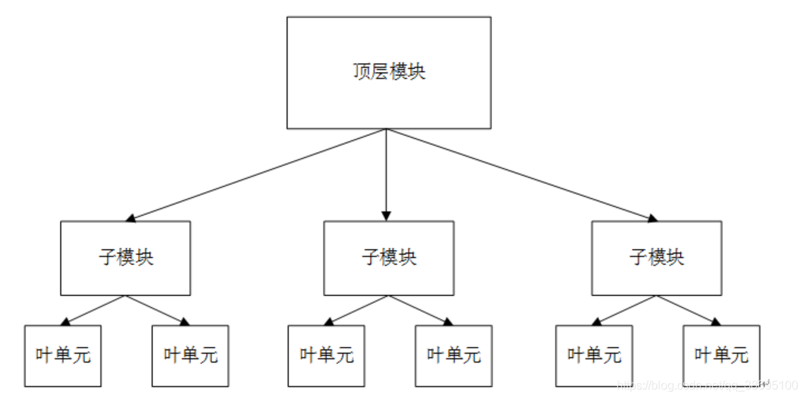
- **设计流程**
	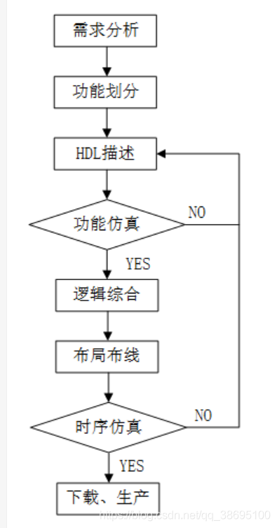
	HDL设计流程，一般包括以下八个步骤：
	- **需求分析**
		根据用户提出的功能需求进行分析理解，做出电路系统的整体规划，形成详细的技术指标，确定初步方案。
	- **功能划分**
		分析完用户需求后，进行逻辑功能的总体设计，设计整个电路的功能、接口以及总体结构；考虑功能模块的划分和设计思路；各自模块的接口和时序（包括接口时序和内部信号的时序）等。
	- **HDL描述**
		使用HDL ，对所需求的数字电路进行设计建模，保存为 .v 文件。
	- **功能仿真==（前仿真）==**
		对建模文件进行编译，对模型电路进行功能上的仿真验证。前仿真不考虑信号的延迟问题，只是验证逻辑正确性。
	- **逻辑综合**
		综合（synthesize），将Verilog 建模转换为门级网表的过程。逻辑综合的目的是产生物理电路门级结构，并在逻辑、时序上进行一定程度的优化，寻求逻辑、面积、功耗的平衡，增强电路的可测试性**。但不是所有的 Verilog 语句都是可以综合成逻辑单元的，例如时延语句。**
	- **布局布线**
		根据逻辑综合出的网表与约束文件，利用厂家提供的各种基本标准单元库，对门级电路进行布局布线。
	- **时序仿真==（后仿真）==**
		布局布线后，电路模型中已经包含了时延信息。利用在布局布线中获得的精确参数，用仿真软件验证电路的时序。单元器件的不同、布局布线方案都会给电路的时序造成影响，出错后可能就需要重新修改 RTL（寄存器传输级描述，即 Verilog 初版描述)。
	- **FPGA/CPLD 下载或 ASIC 制造工艺生产**
		通过下载器将设计的数字电路目标文件下载到 FPGA/CPLD 芯片中，然后在电路板上进行调试、验证。

## 基本知识

- ==Verilog区分大小写==
- 注释：
	- 单行注释： `//`
	- 跨行注释： `/*`  与 `*/`
- 标识符可以是任意一组字母、数字、`$` 符号和 `_`(下划线)符号的组合，但标识符的**第一个字符必须是字母或者下划线，不能以数字或者美元符开始。**
- 原码/反码/补码
  - 原码
  - 反码
    - 正数的反码是其本身；
    - 负数的反码是其原码除符号位以外其余各位按位取反。
  - 补码
    - 正数的补码是其本身；
    - 负数的补码是其反码 +1。

## 数据类型

### 常量

- 整数：<位宽 num'><进制 b|o|d|h><数字>，例如：`4'b1010`
- x值(不定值)和z值(高阻值，也可用?代替)， x和z可以标识某一位或者某一个数字，  `4'b10x0`    `4'bx`   `4'b101z`   `4'bz`    `4'b?`
- 十进制不能用x/z表示，例如 8‘dx、8'dz 均为非法
- 负数：整数最前面加-，例如：`-6'd10`
- 下划线：分割数字部分，增强代码的可读性  `8'b1000_1000`

### 参数

- **``define`**
  - 作用：常用于定义常量可以跨模块、跨文件;
  - 范围：整个工程;

- **`parameter`**
  - 作用：常用于模块间参数传递;
  - 范围：本module内有效的定义;

  ```VERILOG
  // Signed, ranged parameter
  parameter signed [upper:lower] <name> = <value>;
  // Signed, unranged parameter
  parameter signed <name> = <value>;
  // Un-typed, ranged parameter
  parameter [upper:lower] <name> = <value>;
  // Un-typed, unranged parameter
  parameter <name> = <value>;
  ```
  
  
  
- **`localparam`**
  - 作用：常用于状态机的参数定义;
  - 范围：本module内有效的定义，不可用于参数传递;


### 变量

#### wire型

- wire [n-1:0] 数据名

- wire 表示信号，常用来表示assign关键字指定的组合逻辑信号
- wire 型信号可以用作输入，输出

#### reg型

- reg 表示存储单元，常用来表示always模块内的指定信号，常代表触发器
- ==always 块内被赋值的每一个信号都必须定义为 reg 型==
	- 综合出来可以是组合逻辑或时序逻辑，要看敏感列表

#### memory型

- reg [n-1:0] 存储器名[m-1:0]
- reg [n-1:0]表示基本存储单元的大小
- 存储器名[m-1:0]表示基本存储单元的个数，存储空间的容量
- 对存储器进行地址索引的表达式必须是常数表达式
- 一个n位寄存器可以在一条赋值语句里进行赋值，而一个完整的存储器不行

### inout 语句

```verilog
module gpio(
    inout c
);
    wire a,b,oe;
    assign c = (oe == 1'b1)? a:1'bz;
    assign b = c;
endmodule
```


### bit选择 -:  +: 

- **+:**  变量[起始地址 +:数据位宽]  <=> 变量[起始地址+数据位宽-1：起始地址]
  - 例如：[0 +: 8]  <=> [7 : 0]
- **-:**  变量[结束地址 -:数据位宽]  <=> 变量[起始地址：结束地址-数据位宽+1]
  - 例如：[7 -: 8]  <=> [7 : 0]

### \$clog2

- 作用：求位宽

- 自己编写函数，但只能用于模块内部，无法用于接口

```verilog
//	function 实现 
function integer clogb2 (input integer bit_depth);              
    begin                                                           
        for(clogb2=0; bit_depth>0; clogb2=clogb2+1)                   
            bit_depth = bit_depth >> 1;                                 
    end                                                           
endfunction                                                     
 
// 使用案例
localparam integer C_TRANSACTIONS_NUM = clogb2(C_M_AXI_BURST_LEN-1);	 
reg [C_TRANSACTIONS_NUM : 0] 	write_index;
reg [C_TRANSACTIONS_NUM : 0] 	read_index;
```

- Vivado支持\$clog2系统函数

```VERILOG
`timescale 1ns / 1ps
 
module clog2_test#(
	parameter integer	num = 325
)(
	input 							clk,
	input							rst,
	output	reg	[$clog2(num) - 1:0]	result
);
 
always @(posedge clk)begin
	if(rst)
		result <= 0;
	else
		result <= result + 1;
end
 
endmodule
```


## 信号运算

- 算术操作符：乘 `*`、除 `/`、加 `+`、减 `-`、求幂 `**`、取模 `%`

	- **对变量进行声明时**，要根据变量的操作符对变量的位宽进行合理声明，**不要让结果溢出。**上述例子中，相加的 2 个变量位宽为 4bit，那么结果寄存器变量位宽最少为 5bit。**否则，高位将被截断，导致结果高位丢失。**无符号数乘法时，结果变量位宽应该为 2 个操作数位宽之和。

- 关系操作符：大于 `>`，小于 `<`，大于等于 `>=`，小于等于 `<=`

- 等价操作符：
  - 逻辑相等 `==`，逻辑不等 `!=`（不能比较 x 或z，当操作数包含一个 x 或 z，则结果为不确定值）
  - 全等 `===`，非全等 `!==`（对参数的x、z都进行比较）

- 逻辑操作符：逻辑与 `&&`,逻辑或 `||`，逻辑非 `!`

- 按位操作符：取反 `~`，与 `&`，或 `|`，异或 `^`，同或 `~^`

	- 按位操作符对 2 个操作数的每 1bit 数据进行按位操作。

	- 如果 2 个操作数位宽不相等，则用 0 向左扩展补充较短的操作数。

	- 取反操作符只有一个操作数，它对操作数的每 1bit 数据进行取反操作。

- 归约操作符：归约与 `&`，归约与非 `~&`，归约或 `|`，归约或非 `~|`，归约异或 `^`，归约同或 `~^`。

	- 归约操作符只有一个操作数，它对这个向量操作数**逐位进行操作**，最终产生一个 **1bit 结果**。
	- 逻辑操作符、按位操作符和归约操作符都使用相同的符号表示，因此有时候容易混淆。区分这些操作符的**关键是分清操作数的数目**，和计算结果的规则。

```VERILOG
A = 4'b1010 ;
&A ;      //结果为 1 & 0 & 1 & 0 = 1'b0，可用来判断变量A是否全1
~|A ;     //结果为 ~(1 | 0 | 1 | 0) = 1'b0, 可用来判断变量A是否为全0
^A ;      //结果为 1 ^ 0 ^ 1 ^ 0 = 1'b0
```

- 移位操作符：左移 `<<`，右移 `>>`，算术左移 `<<<`，算术右移 `>>>`

	- 移位操作符是双目操作符，两个操作数分别表示要进行移位的向量信号（操作符左侧）与移动的位数（操作符右侧）。
	- 算术左移和逻辑左移时，右边低位会补 0。
	- 逻辑右移时，左边高位会补 0；而算术右移时，左边高位符号位不变，以保证数据缩小后值的正确性。
- 拼接操作符：`{,}`

	- 信号间用逗号隔开；拼接符操作数必须指定位宽，常数的话也需要指定位宽。
- 条件操作符：`?:` 

```Verilog
condition_expression ? true_expression : false_expression
```

- 优先级别：直接加括号

在不确定优先级时，建议用圆括号将表达式区分开来。

| 操作符       | 操作符号                | 优先级 |
| ------------ | ----------------------- | ------ |
| 单目运算     | `+` ` -` ` ! ` `~`      | 最高   |
| 乘、除、取模 | `*` ` / `  `%`          |        |
| 加减         | `+` `-`                 |        |
| 移位         | `<<`  `>>`              |        |
| 关系         | `<` `<=` `>` `>=`       |        |
| 等价         | `==` `!=` `===`  `!===` |        |
| 归约         | `&` `~&`                |        |
|              | `^` `~^`                |        |
|              | `~`                     |        |
| 逻辑         | `&&`                    |        |
|              | `||`                    |        |
| 条件         | `?:`                    | 最低   |

## ==可综合语句==

所有行为语句如表所示，高亮为可综合语句

| 类别         | 语句（==可综合性==）             |
| ------------ | -------------------------- |
| 过程语句     | **initial**                |
|              | ==**always**==             |
| 块语句       | ==**串行块 begin...end**==   |
|              | **并行块 fork...join**     |
| 赋值语句     | ==**连续赋值 assign**==    |
|              | ==**过程赋值 =、<=**==   |
| 条件语句     | ==**if...else**==        |
|              | ==**case**==             |
| 循环语句     | ==**for**==              |
|              | **repeat**                 |
|              | **while**                  |
|              | **forever**                |
| 编译指令语句 | ==**`define**==          |
|              | **`include**               |
|              | ==**\`ifdef,\`else,\`endif**== |
|              | **`timescale**             |

## 过程语句

### initial

- initial语句指定的内容只执行一次 ，initial语句**主要用于仿真测试**，不能进行逻辑综合。

- 语句格式

	```VERILOG
	initial
	    begin
	        语句1;
	        ......
	        语句n;
	    end
	```

### always

- always块内的语句是不断重复执行的，在仿真和逻辑综合中均可使用.

- 敏感信号表达式中应列出影响块内取值的所有信号。

- always 块内被赋值的每一个信号都必须定义为 reg 型

- 语句格式

	```VERILOG
	always @ (敏感列表)
	    begin
	        //过程赋值
	        //if-else,case,casex,casez 条件语句
	        //task,function 调用
	    end
	```

## 块语句

### 串行块 begin...end

- 块内的语句是按==顺序执行==的，即只有上面一条语句执行完后下面的语句才能执行。

- 可以在begin后声明该块的名字，一个标识名。块内声明语句可以是参数声明语句、reg型变量声明语句、integer型变量声明语句和real 变量声明语句。

- 语句格式

	```VERILOG
	begin: 块名
	    块内声明语句
	    语句1;
	    ...
	    语句n;
	end
	```

### 并行块 fork...join

- fork–join之间可以添加多条语句，并且语句的关系是==并行==的，是同时执行的

- 语句格式

	```VERILOG
	fork: 块名
	    块内声明语句
	    语句1;
	    ...
	    语句n;
	join
	```

### 起止时间、结束时间

- 在并行块和顺序块中都有一个起始时间和结束时间的概念。

	```VERILOG
	initial
	 fork
	    #10  a = 1;
	    #15  b = 1;
	    begin
	       #20  c = 1
	       #10  d = 1;
	     end
	    #25  e = 1;
	join
	/*
	该程序运行的结果如下：
	    时刻    |    执行的语句
	      10      |     a=1;
	      15      |     b=1;
	      20      |     c=1;
	      25      |     e=1;
	      30      |     d=1;
	*/
	```

## 赋值语句

### 连续赋值 assign

- 连续赋值语句，位于过程块语句外，常以assign为关键字。

- 连续赋值语句中“=”的左边必须是线网型变量，右边可以是线网型、寄存器型变量或者是函数调用语句。

- 语句格式

	```VERILOG
	assign 赋值目标线网变量 = 表达式;
	```

### 阻塞赋值与非阻塞赋值

- 过程赋值主要出现在过程块always和initial语句内。
- 阻塞赋值 = ，赋值有先后关系，通常用于组合逻辑
- 非阻塞赋值 <= ，赋值同时进行，通常用于时序逻辑

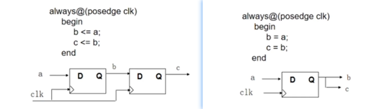

- 不要管阻塞不阻塞，先想一想你要实现什么电路，组合逻辑还是时序逻辑？
- 组合逻辑用 = ；时序逻辑用 <= 。
- **组合逻辑尽量不要用always（*）+reg 这种结构，直接用assign + wire** 。

## Generate

### generate...case

```
generate
  case (<constant_expression>)
     <value>: begin: <label_1>
                 <code>
              end
     <value>: begin: <label_2>
                 <code>
              end
     default: begin: <label_3>
                 <code>
              end
  endcase
endgenerate
```

### generate...if

```verilog
generate
  if (<condition>) begin: <label_1>
     <code>;
  end else if (<condition>) begin: <label_2>
     <code>;
  end else begin: <label_3>
     <code>;
  end
endgenerate
```

### generate...for

```verilog
genvar <var>;
generate
  for (<var>=0; <var> < <limit>; <var>=<var>+1)
  begin: <label>
     <instantiation>
  end
endgenerate
```

### generate...for嵌套

```verilog
genvar <var1>, <var2>;
generate
  for (<var1>=0; <var1> < <limit>; <var1>=<var1>+1)
  begin: <label_1>
     for (<var2>=0; <var2> < <limit>; <var2>=<var2>+1)
     begin: <label_2>
        <code>
     end
  end
endgenerate
```


## 条件语句

### if...else

- 条件语句必须在过程块中使用

- 语句格式

	```VERILOG
	if (表达式1)
	    begin
	    	语句1;
		end
	else if (表达式2)
	    begin
			语句2;
		end
	else 
	    begin
	    	语句3;
		end
	```

### case

- 语句格式

	```verilog
	case(表达式)
	    分支表达式1：语句1;
	    分支表达式2：语句2;
	    ···
	    分支表达式n：语句n;
	    default: 语句n+1;
	endcase    
	```

- **casez**：忽略比较过程中值为 z 的位

	```VERILOG
	//在分支表达式中，z常用？代替。
	casez(a)
		3'b1?? :  out1 = 1; //如果a=100、101或1xx,1zz等，都有out1 = 1。
		3'b0?1 :  out2 = 1; //如果a=001、011、0x1、0z1，都有out2 = 1
	    ...
	endcase
	```

- **casex**：忽略比较过程中值为 z 和 x 的位

	```VERILOG
	casex(a)
	    2'b1x:out=1;  //如果a=10、11、1x、1z，都有out=1。
	    ...
	endcase
	```

## 循环语句

### for

- 语句格式

	```VERILOG
	integer i;
	
	for(i=4;i<=7;i=i+1)
	   begin
	      datain[i]  <=  datain [i-4];
	   end　
	```

### forvever

- 无条件地无限次执行其后的语句，相当于while(1),直到遇到系统任务`$finish`或`$stop`,如果需要从循环中退出，可以使用`disable`。

- 循环语句多用于生成时钟等周期性波形，它与 always 语句不同之处在于不能独立写在程序中，而必须写在 initial 块中。

- **forever应该是过程块中最后一条语句**，其后的语句将永远不会执行

- 语句格式

	```VERILOG
	initial
	    begin
	         clk = 0;
	         forever #25 clk = ~clk;     
	    end
	```

### repeat

- repeat语句是最简单的循环语句，用于循环次数已知的情况。

- 语句格式

	```verilog
	repeat(10)@(posedge clk);
	
	if (rotate == 1)
	    repeat (8)     
	        begin
	            temp = data[15];
	            data = {data << 1,temp};  // data循环左移8次
	        end
	```

### while

- while语句通过控制某个变量的取值来控制循环次数

- 语句格式

	```VERILOG
	i = 0;
	while(i < 4) // 满足条件进入循环
	    begin
	       a = a + 1;
	 	   i = i + 1; //更新条件取值，使循环4次退出循环 
	    end
	```

### disable

- 在有些特殊的情况下，需要使用 disable 强制退出循环。

- 使用 disable 语句强制退出循环，首先要给循环部分起个名字，方法是在begin 后添加 “: 名字”。即 **disable 语句可以中止有名字的 begin…end 块和fork…join 块**。

- disable 语句可以退出 task、function

- 语句格式

	```VERILOG
	begin  :continue
	    a = 0; b =0;
	    for(i=0;i<4;i = i+1)
	        begin
	          a = a+1;
	          if(i==2) disable continue;
	          b = b+1;
	        end
	end
	 //a做3次加1操作后强制退出循环；而b只做2次加1操作。
	
	a=0; 
	b=0;
	for( i=0; i<4; i=i+1)
	    begin: continue
	        a = a+1;
	        if( i ==2) disable continue;
	        b= b+1;
	    end
	//中止一次循环，继续下一次循环； a做4次加1操作， b只做3次加1操作.
	```

## 编译指令语句

以反引号  ` 开始的某些标识符是 Verilog 系统编译指令。

### `define

- ``define` 用于定义一个宏定义

### `undef

- ``undef`用于取消一个宏定义
  - 宏定义可以定义在模块内，也可以定义在模块外，效果都一样，而parameter只能定义在模块内。
  - 可以定义设计参数和常量，如延时、位长、宽度、地址和状态等等.。
  - 如果只在模块里面使用，没有全局的意义，那用localparam。
  - 可以提高代码的可读性和可维护性。

### \`ifdef、\`elsif、\`endif

```verilog
`ifdef <define_name>
   <statements>;
`elsif <define_name>
   <statements>;
`else
   <statements>;
`endif
```

### `include

- ``include` 用于在源文件中插入另一个文件，要插入的内容可以是全局使用的宏定义，也可以是经常使用的任务和函数，便于Verilog文件的管理和维护。

```VERILOG
// Include the contents of the ram_data.vh file in the relative directory ../data
`include "../data/ram_data.vh" 
```


### `timescale

- ``timescale`用于指定后续模块的仿真时间单位（time_unit）和时间精度（time_precision）

```verilog
`timescale 10ns/100ps
```

- 如果精度不够会四舍五入，单位有s/ms/us/ns/ps/fs
- ==不要设置无意义的高精度==

## 任务/函数

任务和函数一般用于行为建模，在编写测试验证程序时用得较多，佷多逻辑综合软件都不能佷好地支持任务和函数。

### task 与 function 区别

- task

	- 常用于调试，或对硬件进行行为描述

	- 可以包含时序控制（#延迟，@, wait）

	- 可以有 input，output，和 inout 参数

	- 可以调用其他任务或函数

- function
	- 通常用于计算，或描述组合逻辑
	- 不能包含任何延迟(#,@,->,wait)；函数仿真时间为0
	- 只含有input参数并由函数名返回一个结果（返回值缺省为reg类型）
	- 可以调用其他函数，但不能调用task

- 共同点
	- 任务和函数必须在module内调用
	- 在任务和函数中不能声明wire
	- 所有输入输出都是局部寄存器
	- 任务函数执行完成后才返回结果

### task

- 任务定义

```verilog
task <task_name>;
  input <input_name>;
  <more_inputs>

  output <output_name>;
  <more_outputs>

  begin
     <statements>;
  end
endtask
```

- 任务调用

```verilog
<task_name>(<comma_separated _inputs>, <comma_separated _outputs>);
```

### function

- 函数定义

```VERILOG
function  [<lower>:<upper>] <output_name> ;
  input <name>;
  begin
     <statements>
  end
endfunction
```

- 函数调用

```verilog
<signal> = <function_name>(<comma_separated _inputs>);
```

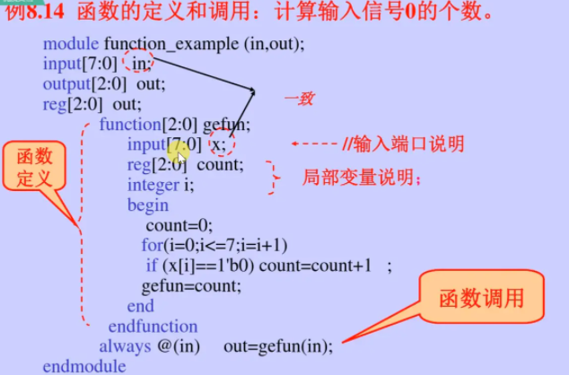

## testbench

### 产生时钟

方法一：

```verilog
parameter PERIOD_50MHz  = 10;
reg clk = 0;
always #(PERIOD_50MHz/2) clk = ~clk;
```

方法二：


```verilog
//clock generate module
initial begin
    clk = 0;
    forever #(PERIOD_50MHz/2)
    clk = ~clk;
end
```

### 过程时序控制

```verilog
//------------------
#10
//------------------
@(posedge clk);
@(negedge clk);
//------------------
event evt1;
-> evt1; // 触发事件
@evt1; // 等待事件
//------------------
reg flag;
wait(flag == 1);
```

### 信号赋值时机

- 建议：testbench中不要在时钟沿上给信号赋值

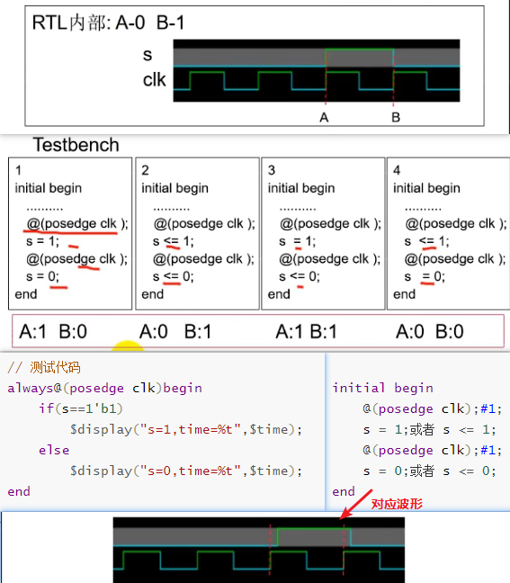

### random

- 返回一个32bit的integer类型的有符号的值

- $random与$random()的用法、结果都是一致的
- $random%b可以生成范围 [ (-b+1) : (b-1) ]内的随机数
- {$random}%b可以生成范围 [ 0: (b-1) ]内的随机数
- 常用方法

```verilog
输入 data_in，位宽【a-1:0】，即位宽a，其值范围2^a
所以如果需要模拟data_in的随机输入，通常这样调用：data_in = {$random}%(2**a);       
```

### $fopen

 系统任务$fopen可以用来打开指定的文件（以便后续对其进行写入操作），其返回值为integer变量，表示当前文件的句柄值，获取句柄值后，后续就可以根据句柄值对不同的文件进行写入操作。

```verilog
integer handle1；// 定义句柄1
handle1 = $fopen("file_name",type); //以指定类型（type）的方式来打开文件，并将其返回值赋给handle1
```

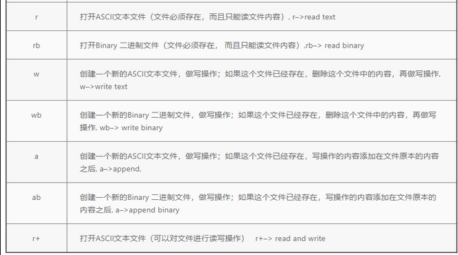

通常情况下，我们使用 w 来作为类型值，即以对一个ASCII文本文件进行写操作的方式来打开该文件 （txt）。

```verilog
integer handle1; //定义句柄1
handle1 = $fopen("D:/file_test/file_test1.txt","w"); //以w类型（写）的方式来打开文件，并将其返回值赋给handle1
```

### \$display, \$write, \$strobe, \$monitor

#### \$display

 \$display可以直接打印一条文本信息，并在每一次\$display执行后**会自动换行**，比如：

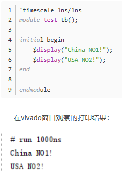

----

#### \$write

 \$write的用法与\$display一致，区别在于，一条\$write语句执行完后，**不会自动换行**。比如下面的代码：

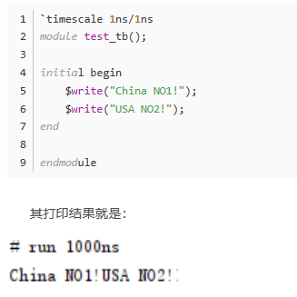

----

#### 打印变量值

 这两个系统函数除了直接打印文本外，也可以打印变量的值，其格式为（以\$display为例）：

```
$display("%b %b",a,b);
```

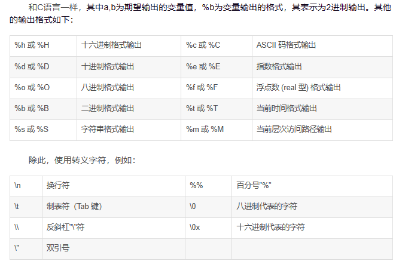

----

#### \$strobe

\$strobe 为选通显示任务。\$strobe 使用方法与 \$display 一致，==但打印信息的时间和$display 有所差异==（也可以直接打印文本）。

当许多语句与 \$display 任务在同一时间内执行时，这些语句和 \$display 的执行顺序是不确定的，一般按照程序的顺序结构执行。两者的区别在于：\$strobe命令会在当前时间部结束时完成；而\$display是只要仿真器看到就会立即执行。==\$strobe 是在其他语句执行完毕之后，才执行显示任务。==例如：

```VERILOG
`timescale 1ns/1ns
module test_tb();
 
reg [3:0]  a ;
initial begin
	$strobe("begin!");
	a = 1 ;
	#1 ;
	a <= a + 1 ;
	//第一次显示
	$display("$display excuting result: %d.", a);
	$strobe("$strobe excuting result: %d.", a);
	#1 ;
	$display();
	//第二次显示
	$display("$display excuting result: %d.", a);
	$strobe("$strobe excuting result: %d.", a);
	$strobe("end!");
end
 
endmodule 
```

其打印结果如下：

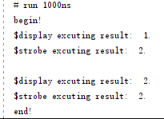

可以看到，\$strobe与\$display的打印内容不是一致的.

这是因为该语句：    a <= a + 1 ；也就是说a的第二次赋值是非阻塞赋值，而非阻塞赋值是需要时间的。

在第一次打印时，\$display不会管你a是阻塞赋值还是非阻塞赋值，它就直接打印a当前的值1。而\$strobe则会等到非阻塞赋值完成后再打印，所以其打印的值为2。

在第二次打印时，又延时了1ns，所以此时的非阻塞赋值完成，那么\$strobe与\$display的打印内容就均为2了。

所以==$strobe这个系统任务通常是用来打印当前非阻塞赋值的变量值的。==

----

#### \$monitor

\$monitor 为监测任务，用于变量的持续监测。只要变量发生了变化，\$monitor 就会打印显示出对应的信息。 其使用方法与 \$display一致.

```VERILOG
`timescale 1ns/1ns
 
module test_tb();
 
reg [1:0]  a ;
reg [1:0]  b ;
reg [1:0]  c ;
 
initial begin
	a = 0 ;
	b = 0 ;
	c = 0 ;
 
	$monitor("a=%d b=%d c=%d",a,b,c);
	#50 $finish;	//50ns后停止
end
 
always #10 begin		//每10ns，随机生成a,b,c
	a = {$random}%4;
	b = {$random}%4;
	c = {$random}%4;
end
 
endmodule 
```

 终端打印结果如下：

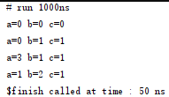


### \$fdisplay, \$fwrite, \$fstrobe, \$fmonitor

 这4个函数都可以对指定文件进行打印或写入操作，其用法与对应的\$display， \$write，\$strobe，\$monitor几乎一致。区别在于\$display等函数是直接在仿真中进行打印，而\$fdisplay等函数是对指定文件进行打印，需要通过句柄来指定是对具体哪个文件进行操作。如：

```
//指定句柄并打开文件
reg data;
integer handle; //定义句柄1

handle1 = $fopen("D:/file_test/file_test1.txt","w"); //以w类型（写）的方式来打开文件，并将其返回值赋给handle1

//对指定文件写入数据
$fdisplay(handle1,"%d\n",data); //按照十进制格式写入数据到handle1对应的文件中，只能逐个写入
```

### $fclose

\$fclose系统任务用来关闭指定文件，关闭后即无法对该文件进行操作。其格式如下：

```VERILOG
$fclose(handle1); //关闭文件file_test1，至此文件操作结束
```

### $printtimescale

打印时间格式`timescale，它的语法格式如下：

```VERILOG
printtimescale_task ::=$printtimescale [(hierarchical_identifier)];
```

其中的hierarchical_identifier代表模块层次，这意味着其不仅可以打印当前module的时间格式，同样可以打印指定module的时间格式。

    其输出内容如下：
        Time scale of (module_name) is unit / precision
### $timeformat

 timeformat用于配置其他打印系统任务中（\$write, \$display,\$strobe, \$monitor, \$fwrite, \$fdisplay, \$fstrobe, and \$fmonitor）%t类型的打印格式，它的语法格式如下：

    timeformat_task ::= $timeformat [(units_number,precision_number,suffix_string,minimum_field_width)];
- units_number使用下表中的数字来表示对应的时间单位：

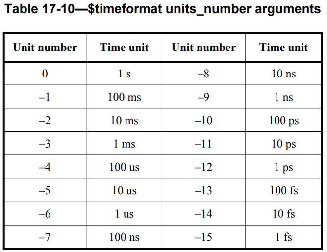

- **precision_number** 表示时间精度，即需要打印到小数点后几位
- **suffix_string** 用来在时间后打印一个用户自定义的字符串

- **minimum_field_width** 表示时间值字符串与后缀字符串合起来的这部分字符串的最小长度，若这部分字符串不足这个长度，则在这部分字符串之前补空格

如果没有调用该系统函数对时间格式进行设置，则其默认设置如下，即时间单位为`timescale设置的时间精度，不精确到小数点后，打印的字符串为空，最小长度为20个长度。

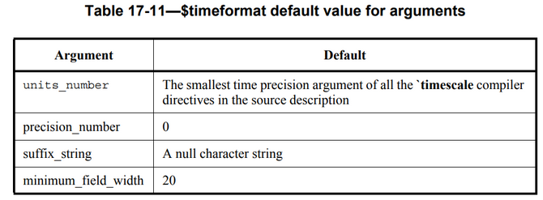

举个例子：分别打印在默认格式下和设置时间格式为单位1ns，精度小数点后3位，打印字符串 ns，最小打印长度10的情况下的仿真时间。如下：

```verilog
`timescale 1 ns / 1 ps				//单位1ns,精度1ps
 
module test_a; 
initial begin
	#10
	$display("%t",$realtime);		//打印默认格式的仿真时间
	#10
	$timeformat(-9,3," ns",10);
	$display("%t",$realtime);		//打印用户设定的格式的仿真时间
end
endmodule
```

### \$time, \$stime, $realtime

这3个系统任务都可以在仿真时（无法综合）获取当前仿真时刻的时间值，但其使用也有一点小小的区别

#### \$time

调用系统任务\$time，将会获得一个==64位的integer型变量==，其表示调用该系统任务时的仿真时间。需要注意的是，其值会自动缩放到`timescale任务所定义的时间单位。下面举个例子：

```verilog
`timescale 1 ns / 1 ns
 
module tb_time_test;
 
reg set;
parameter p = 1.55;
 
initial begin
	$monitor($time,,"set=",set);
	#p set = 0;
	#p set = 1;
end
 
endmodule
```

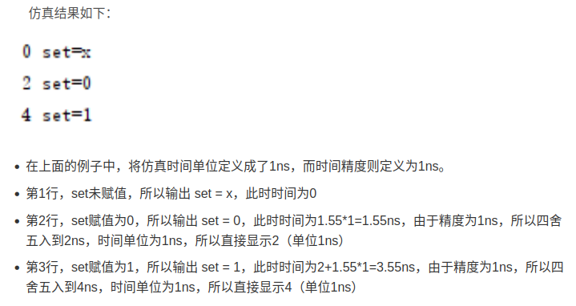

#### $stime

调用系统任务\$stime，将会获得一个==32位的无符号integer型变量==，其表示调用该系统任务时的仿真时间。需要注意的是，其值同样会自动缩放到`timescale任务所定义的时间单位。

这个系统任务的用法基本上和 \$time是一样的，只不过由于其只有32位，所以表示的时间范围会比较小，使用的时候注意别溢出了。

#### $realtime

调用系统任务\$realtime，将会获得一个real型变量，其表示调用该系统任务时的仿真时间。需要注意的是，其值会自动缩放到`timescale任务所定义的时间单位。

由于==其返回值为实数real型==，所以其可以表示小数时间。同样以上面的代码为例：

```verilog
`timescale 10 ns / 1 ns
 
module tb_time_test;
 
reg set;
parameter p = 1.55;
 
initial begin
	$monitor($realtime,,"set=",set);
	#p set = 0;
	#p set = 1;
end
 
endmodule
```

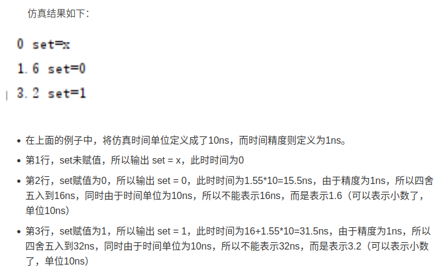

### 读文件

```VERILOG
reg	[M-1:0]	mem	[N:1];

initial
    begin
        $readmemb("E:/Project/data.txt", mem);
    end
```

- readmemb
  - 当data.txt 每行的数据位宽小于 M，数据可以正常读取，高位补 0；
  - 当data.txt 每行的数据位宽小于 M，无法正常读取数据
- readmemh

### 写文件

```VERILOG
integer w_file;
initial w_file = $fopen("E:/Project/modelsim/data_out_1.txt");
always @(ddr_addr)
begin
    $fdisplay(w_file,"%x\n",rom_data_I);
    if(i == 8'd254)    //共写入254个数据
        $display("//*********Write done!*********//");
        $stop;
end
```

### \$readmemh, \$readmemb

这两个系统任务是用来从指定文件中读取数据到寄存器数组或者RAM、ROM中。除了可以在仿真的任何时刻被执行使用外，根据综合工具的不同，也可以用来对RAM或者ROM进行初始化（Vivado支持）。

使用格式共6种：

```verilog
$readmemb ("<数据文件名>",<数组名>)
$readmemb ("<数据文件名>",<数组名>,<起始地址>）
$readmemb ("<数据文件名>",<存贮器名>,<起始地址>,<结束地址>)

$readmemh ("<数据文件名>",<数组名>)
$readmemh ("<数据文件名>",<数组名>,<起始地址>）
$readmemh ("<数据文件名>",<数组名>,<起始地址>,<结束地址>)
```
\$readmemh（h，hexadecimal，十六进制）用来读取16进制的数据，而\$readmemb（b，binary，二进制）则用来读取2进制的数据。       

由于\$readmemh与\$readmemb的用法几乎一样，仅仅是读取数字的进制不同。

-------

#### 数据文件格式

在这两个系统任务中，被读取的数据文件的内容只能包含：空白位置（空格、换行、制表格、注释行、二进制或十六进制的数字。数字中不能包含位宽说明和格式说明，对于\$readmemb和\$readmemh系统任务，每个数字可以是二进制或者十六进制数字。另外，数字必须用空白位置或注释行来分隔开。

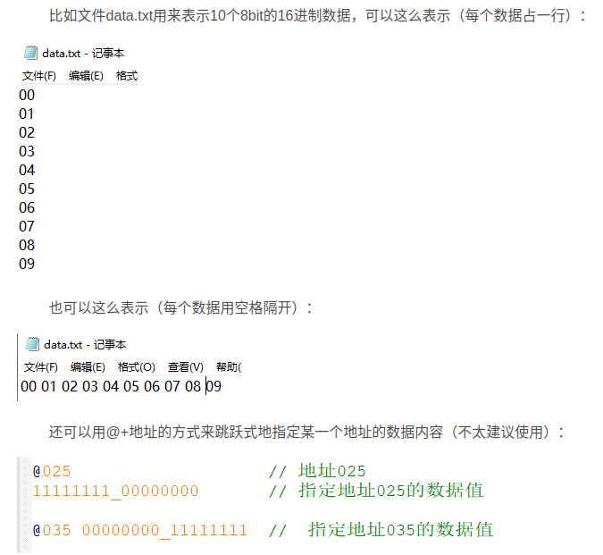

-----

#### 数据文件路径表示方法

可以用两种路径表示方法来指导综合工具找到你的数据文件：1、绝对路径；2、相对路径。

- 绝对路径

绝对路径就是数据文件在系统中的位置，比如：

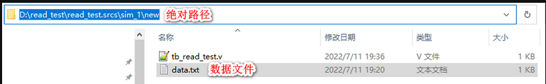

数据文件data.txt的绝对路径就是 D:\read_test\read_test.srcs\sim_1\new 
但是一定需要注意的是，尽管在windows系统中使用**斜杠 \\** 来表示不同的层级，但是在系统函数$readmemh中取需要使用**反斜杠 /** 来表示层级，如下：

```verilog
$readmemh("D:/read_test/read_test.srcs/sim_1/new/data.txt",mem_test);  //绝对路径
```


这样综合工具就会去这个目录下寻找数据文件。

- 相对路径

相对路径是根据仿真文件或者RTL文件的位置来相关的。
比如在vivado中使用系统函数$readmemh时采用如下表示方法：

```verilog
$readmemh("data.txt",mem_test);        //相对路径
```

同时，数据文件必须放在这个路径下：

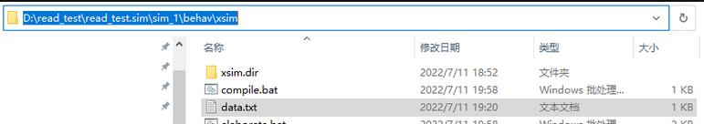

综合工具就会直接去该目录下寻找数据文件，如果该目录下没有指定的数据文件，则会发出警告，同时仿真读取的值都是x

----

#### 使用方法

使用的数据文件data.txt如下:

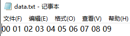

----

- **不指定起始地址和结束对应地址**

即**\$readmemh("<数据文件名>",<数组名>)**，此时会将从数据文件中读到的第1个数据填入数组的第0个位置，此后类推，直到数组被填满。如果数据的个数大于数据文件中数据的个数，则数组无法被填满，未被填满的部分则依然未被赋值。

```verilog
`timescale 1ns / 1ns
 
module tb_read_test();
 
integer i;	 
reg [7:0] mem_test [9:0];		//mem_test是位宽8bit，个数为10的数组
 
initial $readmemh("D:/read_test/read_test.srcs/sim_1/new/data.txt",mem_test);	//绝对路径
 
//显示数组的10个值
initial begin
	for(i=0; i<10; i=i+1)
		$display("%d: %h", i, mem_test[i]);
end
 	
endmodule
```


- 数据被填满，仿真结果如下:

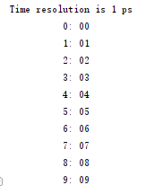

- 去除部分数据文件中的数据，导致数组无法被填满（注释掉后面4个数据），仿真结果如下：

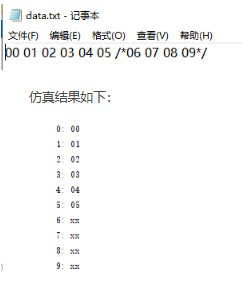

-----

- **指定起始地址，但不指定结束地址**

 即\$readmemh ("<数据文件名>",<数组名>,<起始地址>），此时会将从数据文件中读到的第1个数据填入数组的起始地址，此后类推，直到数组被填满。而之前被起始地址跳过的数组的数据则不会被赋值。如果数据的个数大于数据文件中数据的个数，则数组无法被填满，未被填满的部分则依然是未知状态。

```verilog
initial $readmemh("D:/read_test/read_test.srcs/sim_1/new/data.txt",mem_test,2);	//绝对路径,从地址2开始
```

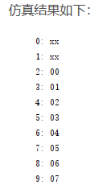

----

- **同时指定起始地址和结束地址**

 即\$readmemh ("<数据文件名>",<数组名>,<起始地址>,<结束地址>)，此时会将从数据文件中读到的第1个数据填入数组的起始地址，此后类推，直到指定的终结地址对应的数组也被赋值。处于起始地址和终结地址构成的区间范围外的地址对应的数组则不会被赋值。如果数据的个数大于数据文件中数据的个数，则数组无法被填满，未被填满的部分则依然是未知状态。

```verilog

initial $readmemh("D:/read_test/read_test.srcs/sim_1/new/data.txt",mem_test,2,8);	//绝对路径,从地址2开始
```

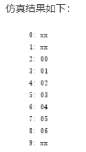

### \$finish、\$stop

**\$finish**

 **系统任务$finish的作用是退出仿真器**，结束仿真过程。

当\$finish带参数时，如\$finish(2)，根据不同的参数值，系统输出信息不同：

- 0：不输出任何信息；
- 1：输出当前仿真时刻和位置；
- 2：输出当前仿真时刻、位置和仿真过程中所用的memory及CPU时间的统计。

​    当\$finish后面不带参数时，则默认参数为1。

----

**\$stop**

 \$stop任务的作用是把仿真器置为暂停模式，在仿真环境下给出一个交互式的命令提示符，将控制权交给用户，格式与\$finish类似。

当\$stop带参数时，如\$stop(2)，根据不同的参数值，系统输出信息不同：

- 0：不输出任何信息；
- 1：输出当前仿真时刻和位置；
- 2：输出当前仿真时刻、位置和仿真过程中所用的memory及CPU时间的统计。

​    当\$stop后面不带参数时，则默认参数为1。

----

**总结**

- \$finish可以终止仿真，一般用在仿真的结尾处。例如完成某些特定激励的仿真后将仿真终止，防止仿真不停地运行
- \$stop可以暂停仿真，一般用来在某个特定的时间暂定仿真
- \$stop和\$finish常用在测试模块的initial模块中，配合时间延迟用来控制仿真的持续时间

### force  

## 层级结构和引用


## Verilog 模板

```verilog
module 模块名
    #(	parameter AW = 2 ,
     	parameter DW = 3 )
    (
        input				clk,
        input  [AW-1:0]		A,
        output reg [DW-1:0]	Q
    );
    wire [AW-1:0] data1;
    reg  [DW-1:0] data2;
    reg [DW-1:0]  mem [0:(1<<AW)-1] ;
    
    //state
    localparam IDLE  = 4'd0;
    localparam START = 4'd1;
    
    assign data1 = A;
    
    always@(posedge clk or posedge rst)begin
        if(rst)begin
        end
        else if()begin
        end
    end
    
    add 
    #(	.AW (AW),
      	.DW (DW)
     )u_add(
        .clk	(clk),
        .rst	(rst)
    );
endmodule
```

## 书写规范

### 标识符（Identifiers）命名习惯

#### 标识符定义命名

- 标识符第一个字符必须是字母，最后一个字符不能是下划线，不许出现连续两个下划线；

- 基本标识符只能由字母、数字和下划线组成；

- 标识符两词之间需用下划线连接

  如：Packet_addr    ,  Data_in

- 标识符不得与保留字同名

#### 标识符大小写

- 对常量、数据类型、实体名和结构体名采用全部大写；
- 对变量采用小写；
- 对信号采用第一个词首字符大写；
- 保留字一律小写

#### 信号名连贯缩写

**部分缩写的统一规定为**：

Addr   address;     Clk   clock;     Clr   clear;     Cnt   counter

En   enable;     Inc   increase;     Lch   latch;     Mem   memory

Pntr   pointer;     Pst   preset;     Rst   reset

Reg   register;     Rd   reader;     Wr   write

**常用多个单次的缩写**

ROM     RAM     CPU     FIFO     ALU     CS     CE

**自定义的缩写必须在文件头注释**

#### 信号名缩写的大小写

- 单次的缩写若是信号名的第一个单次则首字母大写，如：Addr_in 中的 Addr；若该代词缩写不是第一个单词则小写，如：Addr_en 中的 en
- 多个单次的首字母缩写都大写，不管该缩写在标识符的什么位置，如：RAM_addr，Rd_CPU_en

#### 信号名一致性

同一信号在不同层次应保持一致性

#### 信号命名建议


### 其它注意地方

- 只有三态电路才可以在多个process 中出现
- 使用 Latch 必须有所记录，不希望使用 Latch 时，应该将条件赋值语句写全，如在 if 语句最后加 else，case 语句后加 others
- TAB键的间隔，采用4个字符
- 若元件的类属在定义时已经指定默认值，在调用时，若不改变该参数值可以不用定义实参的映射，即map（实参）可不写
- 建议运算操作符两边都加上空格
- 向量比较时，比较的向量的位宽要相等
- 

### 代码模块划分

设计模块的基本原则是：

1. 有利于模块的可重用性

2. 在组合电路设计中应当没有层次

3. 每个模块输出尽量采用寄存器输出

4. 模块按功能进行划分，划分要合理

5. 模块大小应适中，一般为2000门左右

6. 模块的层次应当至少有三级，可将一个设计划分为三个层次：TOP、MID、功能CORE

   - TOP

     包括实例化的MID和输入输出定义

   - MID

     由两部分组成：1）时钟产生电路；2）功能CORE的实例化

   - 功能CORE

     包括各种功能电路的设计。一个复杂的功能可以分成多个子功能来实现，即再划分子层
