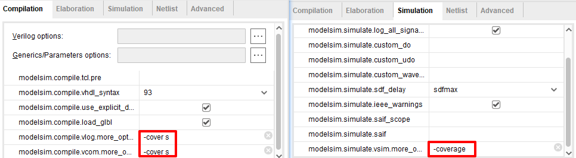
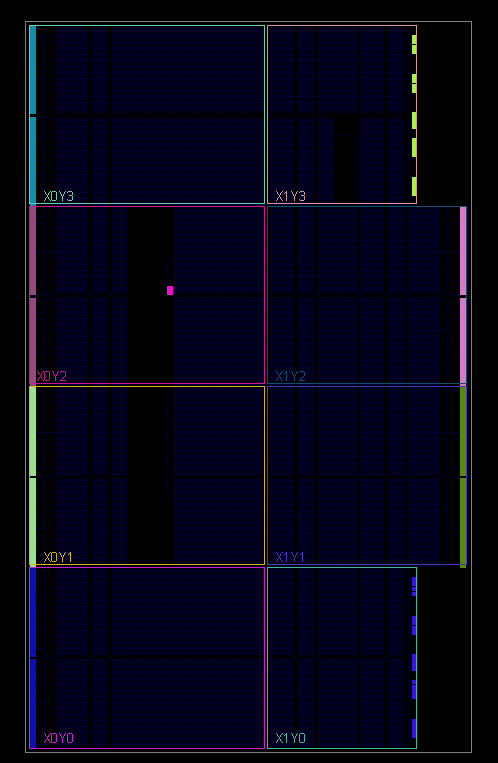
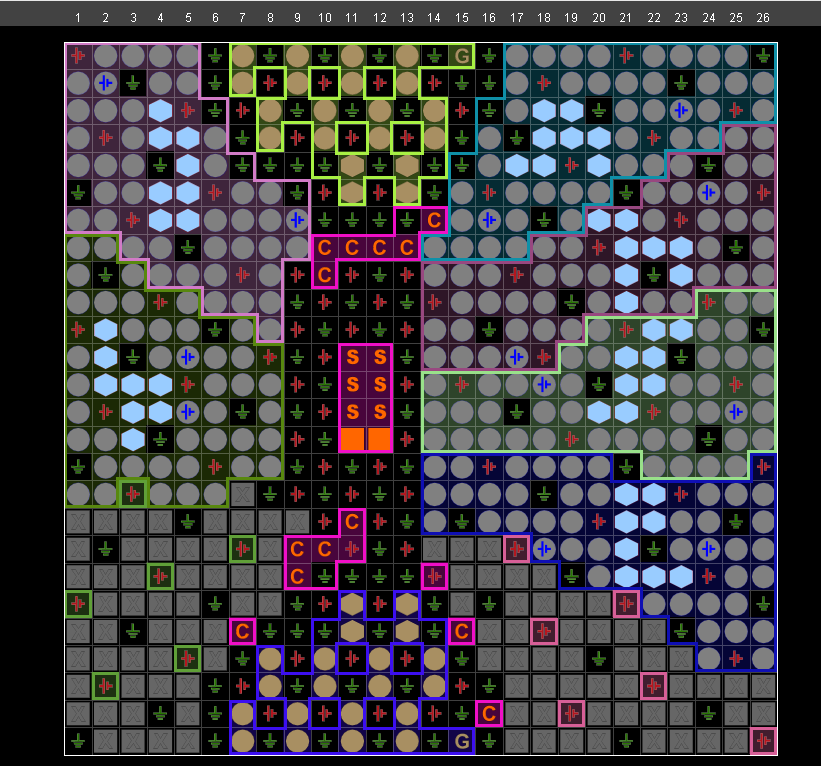

# Vivado软件

- Author：hongjh
- Time：20210731
- Version:

---------

[toc]

## 如何保存/恢复时序报告（.rpx)


## 如何生成网表

1. 打开所要封装网表的工程，点击 Tool->Settings

2. 点击 Synthesis，修改 Options 中的内容

3. -flatten_hierarchy 下拉框，改为 full

4. More Options 中输入 -mode out_of_context

5. 将带封装文件设置为Top层

6. 点击 Run Synthesis 进行文件综合，综合完成后打开综合

7. 若生成 Verilog 文件

   ```
   write_verilog -mode synth_stub E:/TX0121010/src/ngc/int_ctrl_axi.v
   ```

8. 若生成 VHDL 文件

   ```
   write_vhdl -mode synth_stub E:/TX0121010/src/ngc/int_ctrl_axi.vhd
   ```

9. 生成网表文件

   - 若要封装的文件中==未使用== xilinx 官方的IP，网表生成指令如下：

     ```
     write_edif all E:/TX0121010/src/ngc/int_ctrl_axi.edf
     ```

   - 若要封装的文件中==使用== xilinx官方的IP，网表生成指令如下：

     ```
     write_edif -security_mode all E:/TX0121010/src/ngc/int_ctrl_axi.edf
     ```

## Modelsim覆盖率分析



## Debug信号（VHDL）

```vhdl
attribute MARK_DEBUG : string;
attribute MARK_DEBUG : signal is "TRUE";
```

## Force Up-to-Data 功能

当只加了注释，或修改了代码格式，并没有进行功能上的更改时，不需要重新运行综合/实现来浪费时间，可以强制更新为Complete

## 不建Vivado工程，也能看Device视图

在FPGA设计与开发中，Device视图和Package视图发挥着重要的作用。

在Device视图下：

- **可以查看FPGA芯片可用资源**

例如：LUT、FF、BRAM、DSP、URAM等的个数；

- **可以查看关键资源的分布情况**

例如：PCIE的位置，高速收发器的位置，因为这些位置直接影响到PCB设计以及FPGA内部的数据流。

- **可用查看MMCM等时钟资源的位置**

时钟的拓扑结构的质量直接影响到设计后期的时序收敛，在多die芯片中，这一点尤为重要。例如：某个芯片是3个die，设计中的一个时钟要给这3个die使用，那么最好将该时钟分配在中间那个die上，这样跨die次数最小，比较时钟跨die会增加Clock Skew。

那么如何打开Device视图呢？一种可行的方法是创建Vivado I/O工程，但这仍然显得繁琐。这里我们介绍一种更为直接的方法，就是使用Tcl命令link_design。打开Vivado，在Tcl Console中直接输入如下图所示命令：

```TCL
link_design -part xc7a100tfgg676-2
```

此时，该命令后只需跟随一个选项，即-part，-part用于指明具体的芯片型号。这样就打开了Vivado，之后选择Window，点击Device即可打开Device视图，点击Package即可打开Package视图。






## 联合VScode

```
C:/Softwares/VS Code/Code.exe -g [file name]:[line number]
```


