# axi_quad_spi

- Author：hongjh
- Time：20230526
- Version：

---------

[toc]

## 系统框图

### 正常模式

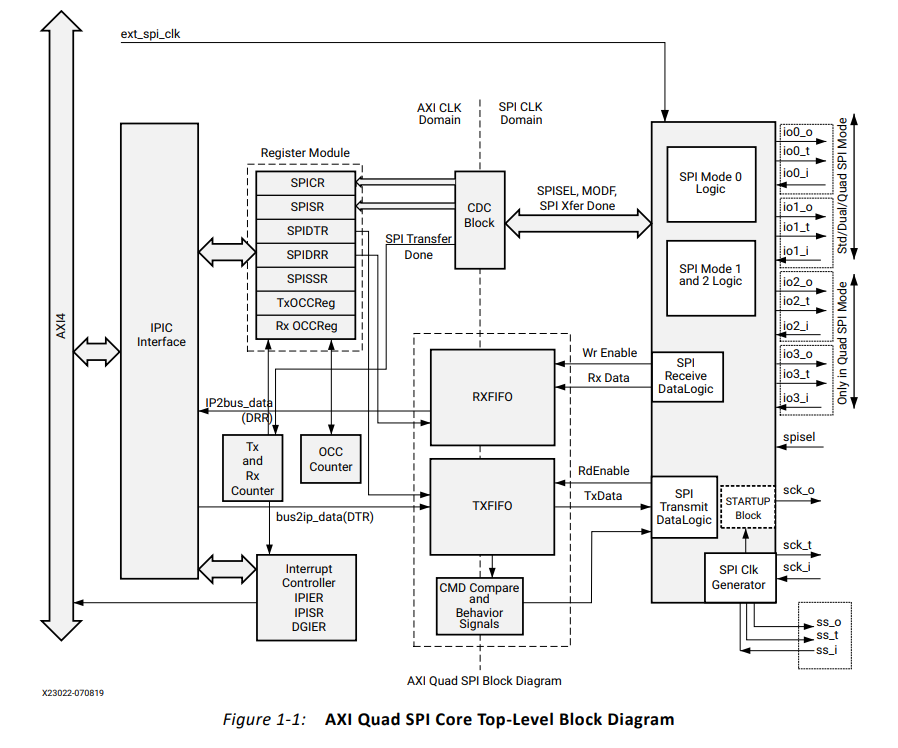

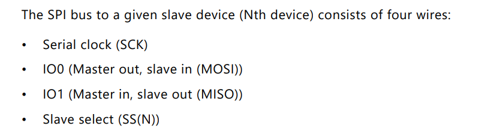

### XIP模式

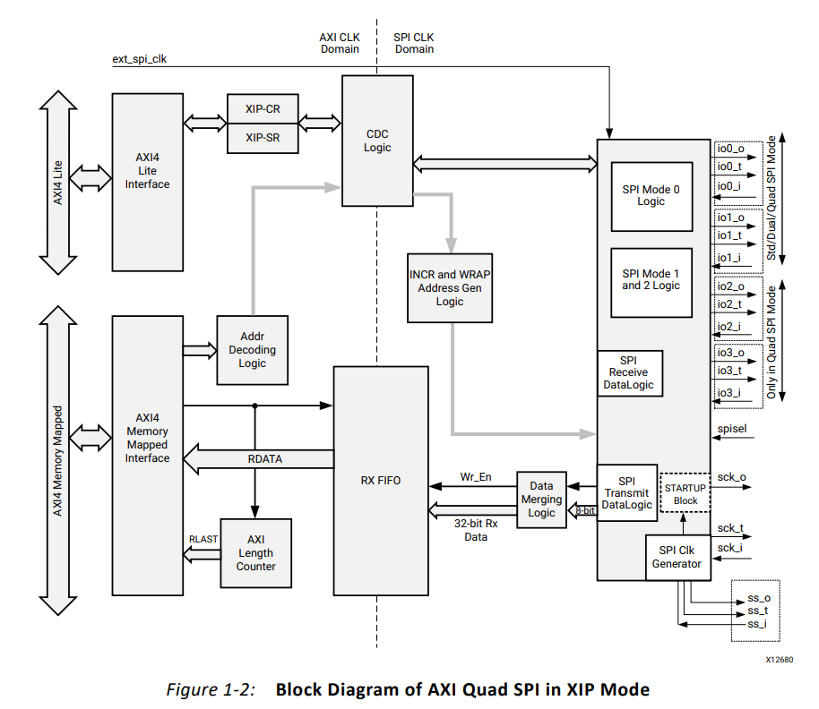

## 性能

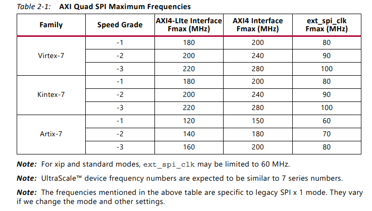

## IP 核配置

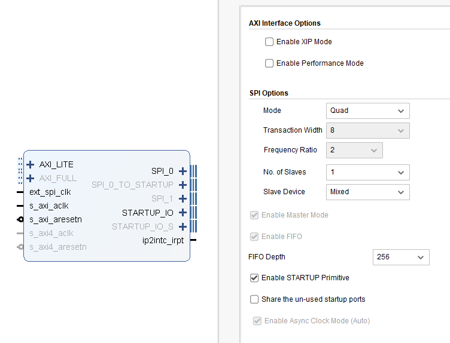

### AXI Interface Option

#### XIP Mode

XIP全称：eXecute In Place（片内执行），只用于读操作。针对外设如果想进行读操作的时候，一般都是通过访问数据寄存器，而XIP则是直接以内存的形式访问。

----

**为什么有XIP模式**

从软件的角度来看，SPI一般是连着flash来使用，flash作为一种存储模块，软件更加期望用memory的形式访问，在SoC上经常会有从flash里面搬运数据的需求。

----

**XIP性能**

一般来说，non-xip模式下，由于可以通过寄存器配置来实现给出一个地址得到一大段的数据的操作，只要配置得当，数据读取的速率是会比xip模式下快的。

但是不同公司的SPI controller的寄存器配置肯定是不同的，完全使用寄存器配置的形式进行读取操作对于软件迁移的成本会比较大。

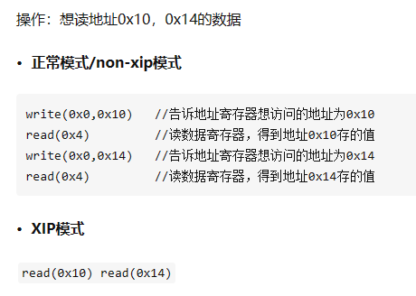

#### Performance Mode

高性能模式将使用 AXI4 代替 AXI4-Lite 接⼝，并且在内核的发送和接收 FIFO 地址处可以使用突发功能。

### SPI Options

#### Mode

模式有standard，dual，quad可选，standard和dual/quad模式间有部分功能不能兼容，具体可以看下面寄存器映射中。

#### Transaction Width

设置传输事务的数据宽度：

- 如果设置为8，即每次数据传输宽度为8-bit，一次数据传输需要8个SCK时钟

- 如果设置为16，即每次数据传输宽度为16-bit，一次数据传输需要16个SCK时钟

#### Frequency Ratio

频率比是由两个数的乘积。输出的SPI时钟（sck）满足：

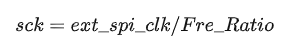

#### Slave Device

设备类型是混合的，支持winbond，micron，spansion，macronix共有的命令。如果勾选Micron，只能支持micron的命令，发送不支持的命令，IPISR状态寄存器就会报command error.

#### Enable Master Mode

这个选项决定SPI设备的主从模式，也可以在配置寄存器60h中修改

#### Enable STARTUP Primitive

STARTUP原语勾选上后指SPI的clk就会从FPGA专用的CCLK引脚输出时钟

## 寄存器映射

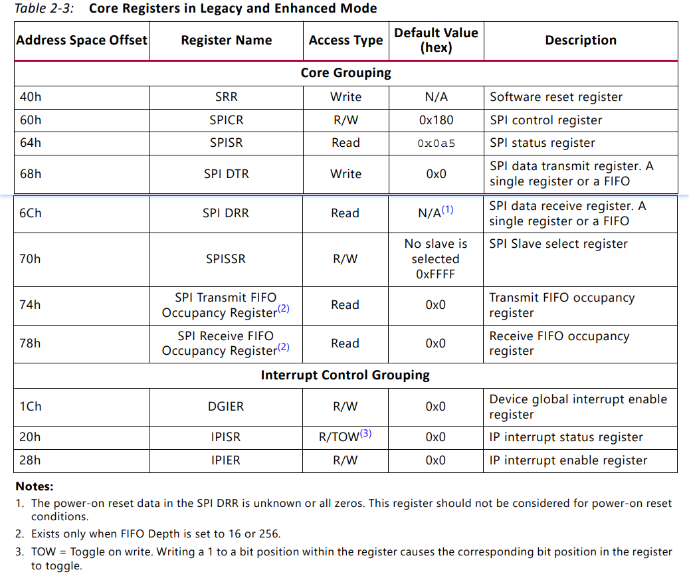

### 0x40 (SRR) 软件复位

将0x0000_000a的值写⼊软件复位寄存器，会将内核寄存器复位四个 AXI 时钟周期。任何其他写访问都会⽣成未定义的结果并导致错误。

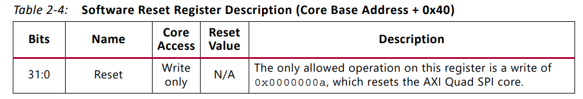

### 0x60 (SPICR) SPI控制

SPI控制寄存器有着配置SPI时序工作方式（CPHA，CPOL），设置SPI设备主从状态，对数据寄存器进行复位等重要功能。需要注意：

- LSB 优先仅在标准 SPI 模式下支持。 Dual/quad SPI 模式仅⽀持 MSB 优先模式
- Dual/quad SPI 模式仅⽀持 CPHA-CPOL 值为 00 或 11。
- 环回模式仅在标准 SPI 模式下支持。

通常作为配置端，我们需要把SPI设置为主设备（SPICR【2】=1），在测试工作状态时，可以设置环回模式（SPICR【0】=1）

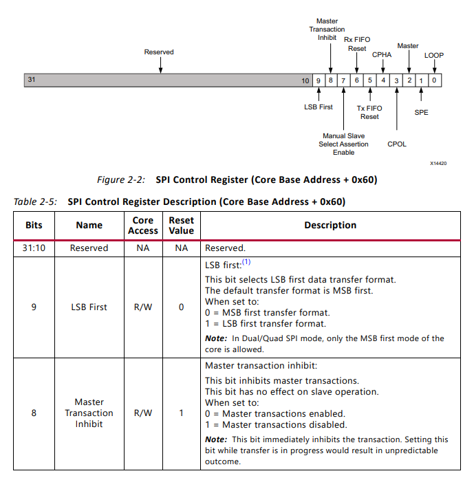

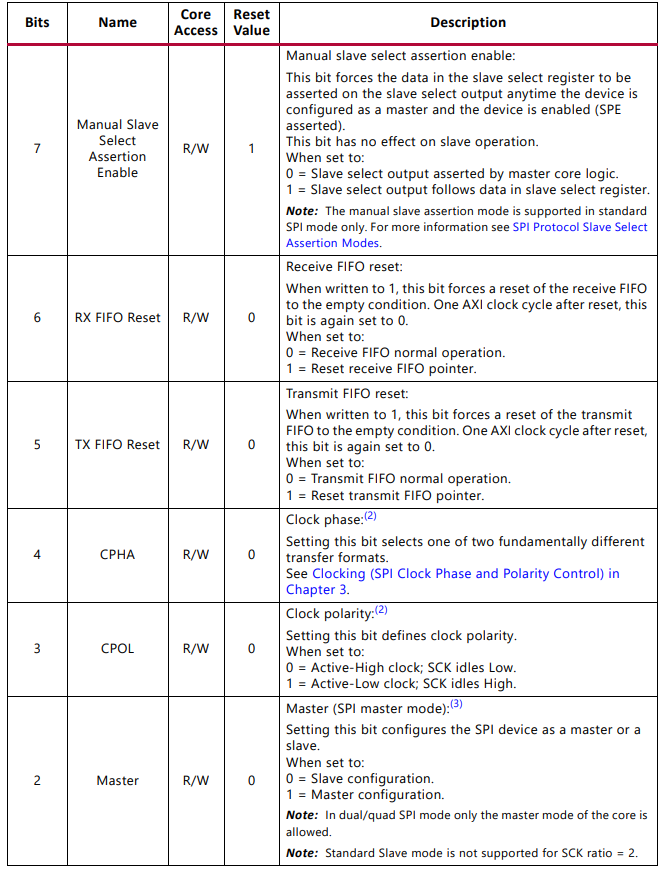

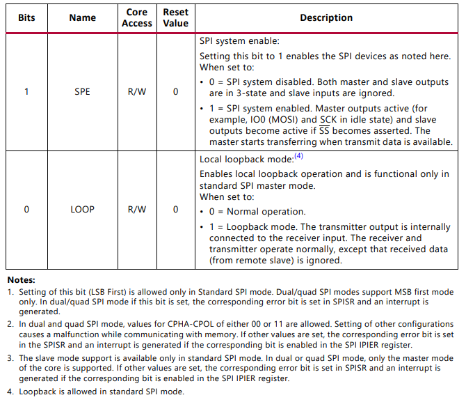

### 0x64 (SPISR) SPI状态

SPI状态寄存器是**只读寄存器**，通常用来：

- 读取各种错误信息，即SPI控制寄存器中的配置错误（注意事项）。
- 从模式配置成功检查
- 数据FIFO的空满状态检查

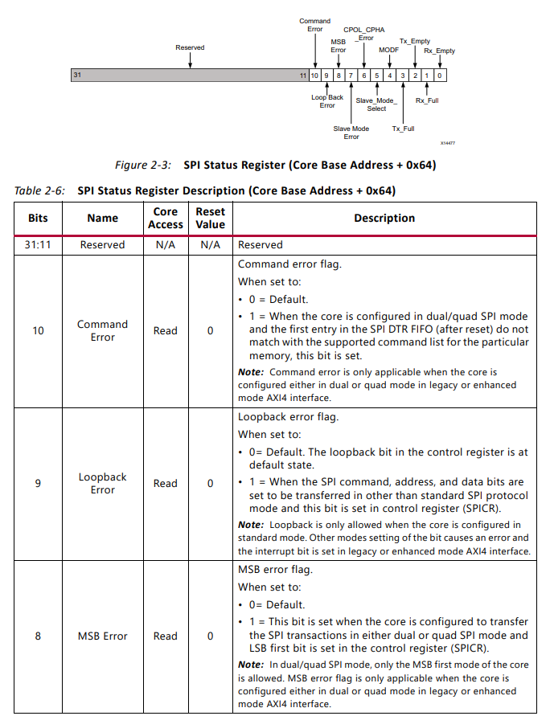

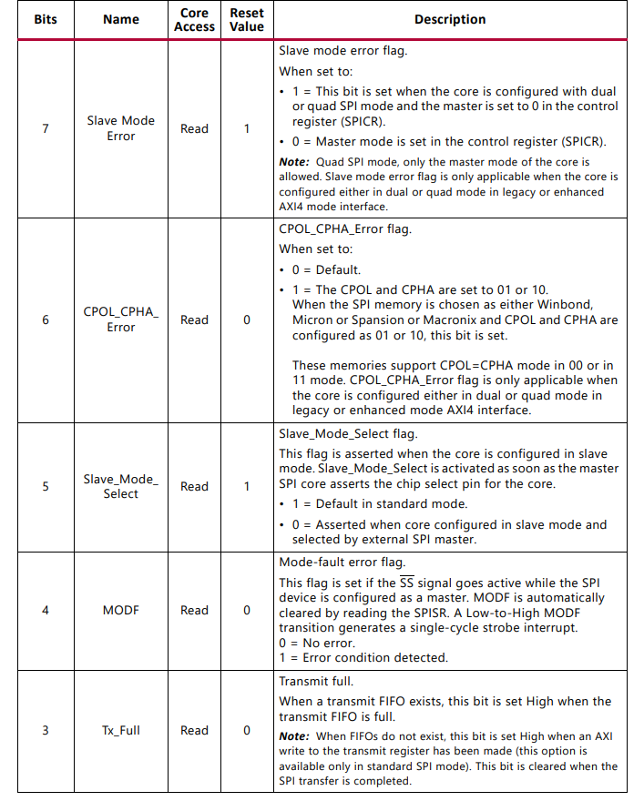

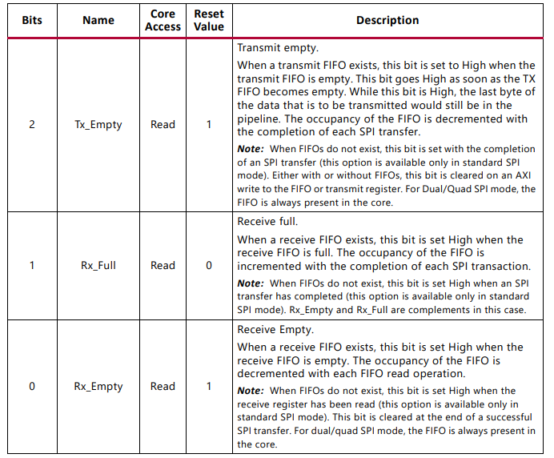

### 0x68 (SPI DTR) 发送数据

SPI 数据发送寄存器 (SPI DTR) 写⼊要在 SPI 总线上发送的数据。数据从 SPI DTR 传输到移位寄存器发送条件：

- 在主模式下将 SPE （SPI控制寄存器）设置为 1
- 在从模式下， spisel 处于活动状态

需要注意：

- SPI DTR 在填充前应处于复位状态，以便 DTR FIFO 写指针指向第 0 个位置。
- 如果尝试在已满的寄存器或 FIFO 上进写⼊，则 AXI 写⼊事务以错误条件完成。

即在发送数据前，需要先在控制寄存器中对TX FIFO进行复位。

**在Dual/quad SPI 模式**：

- 第⼀次写⼊必须始终是来⾃ AXI 事务的 SPI 命令，然后是地址（24 位或 32 位），然后填充要传输的数据。
- 在读取内存的状态寄存器时，根据命令要求，该寄存器应填充虚拟字节以及命令和地址（可选）。

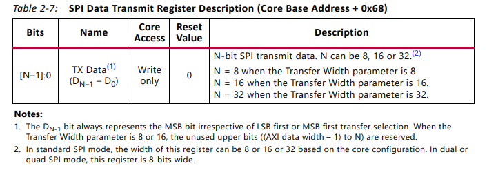

### 0x6c (SPI DRR) 接收数据

SPI 数据接收寄存器 (SPI DRR) ⽤于读取从 SPI 总线接收的数据。这是⼀个双缓冲寄存器。每次完成传输后，接收到的数据都存放在该寄存器中。

SPI 架构没有为从设备提供任何⼿段来限制总线上的流量。因此，对于从设备来说，只有在上次 SPI 传输之前读取 SPI DRR ，SPI DRR 才会在每个完成的事务之后更新。

需要注意：

- 如果 SPI DRR 未读取且已满，则最近传输的数据将丢失并发⽣接收溢出中断。
- 如果试图读取⼀个空的接收寄存器或 FIFO，它会在状态寄存器中给出⼀个错误。
- SPI DRR 的上电复位值未知。

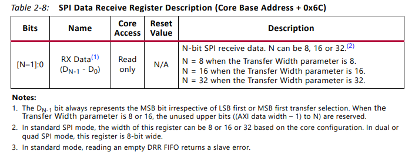

### 0x70 (SPISSR) 从机选择

选择slave个数，有几个slave就拉低几位，最多32个slave

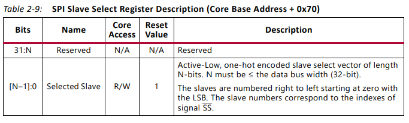

### 0x74 发送FIFO待发送数据量

仅当 AXI Quad SPI 内核配置有 FIFO （FIFO 深度= 16 或 256）时，SPI 发送 FIFO 占⽤寄存器 (TX_FIFO_OCY) 才存在，并且是只读寄存器。

主要用来查看发送FIFO中有多少个数据，比如读出是5，那么FIFO中还有6个数据待发送

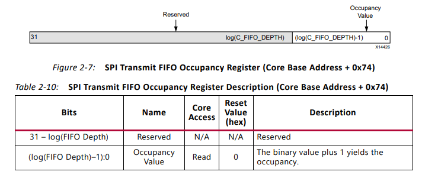

### 0x78 接收FIFO可读取数据量

仅当 AXI Quad SPI 内核配置有 FIFO （FIFO 深度= 16 或 256）时，SPI 接收 FIFO 占⽤寄存器 (RX_FIFO_OCY) 才存在。

主要用来查看接收FIFO中有多少个数据，比如读出是5，那么FIFO中还有6个数据还没接收走。

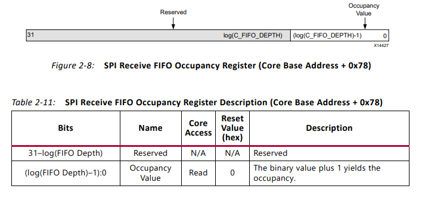

### 0x1C (DGIER) 全局中断使能

使能了全局中断之后才能使用各种中断功能。

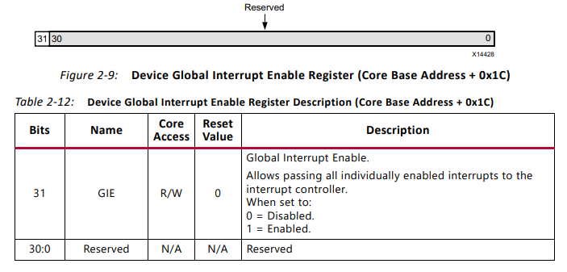

### 0x20 (IPISR) 中断状态

由于中断端口只有一个，当中断发送时需要查询中断状态寄存器来判断是什么中断情况，具体使用什么中断功能由中断使能寄存器控制。

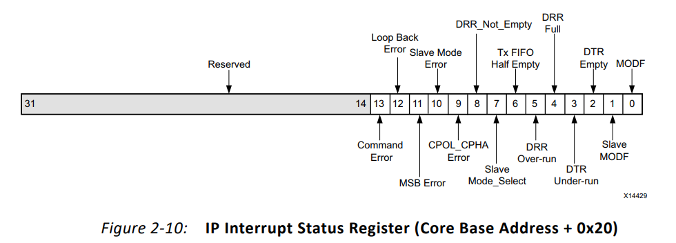

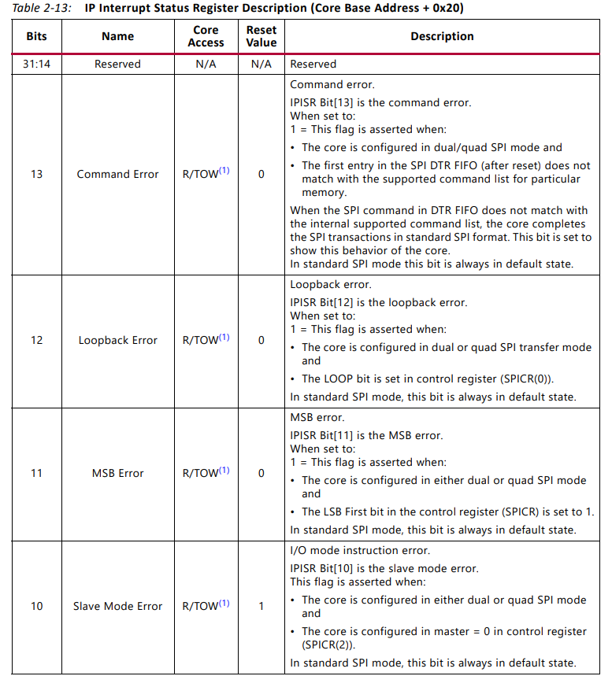

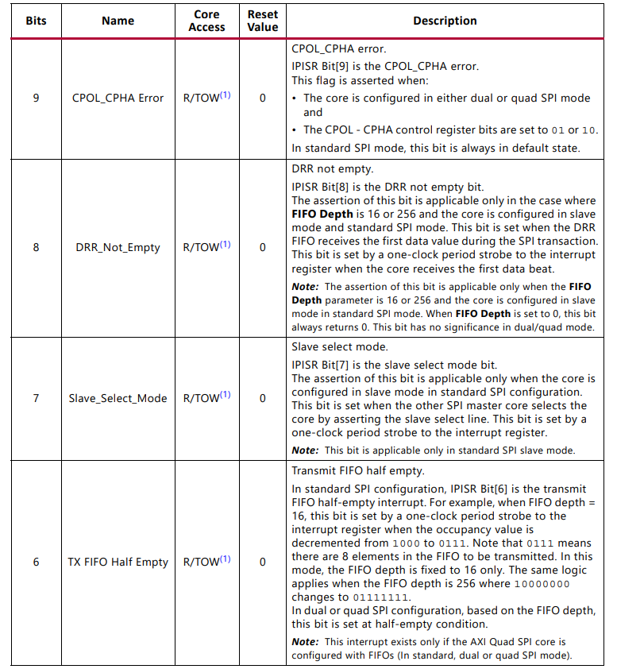

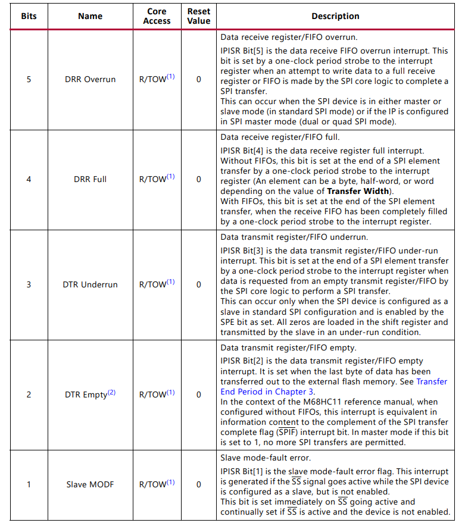

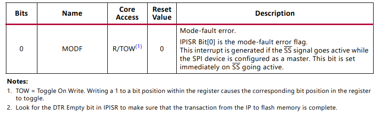

### 0x28 (IPIER) 中断使能

主要是配置中断功能，由于中断功能是复用中断端口，因此需要选择合理的功能来减少控制复杂度

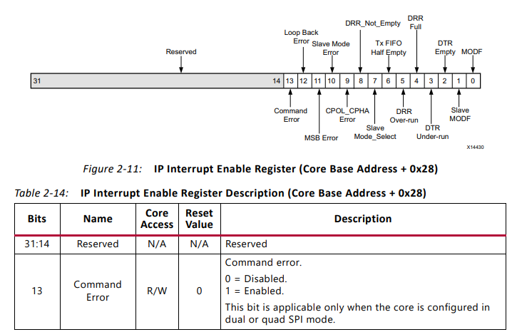

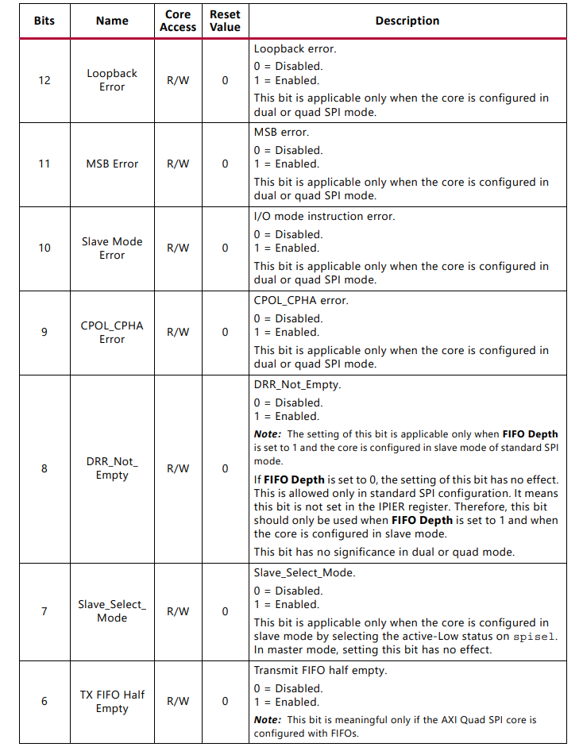

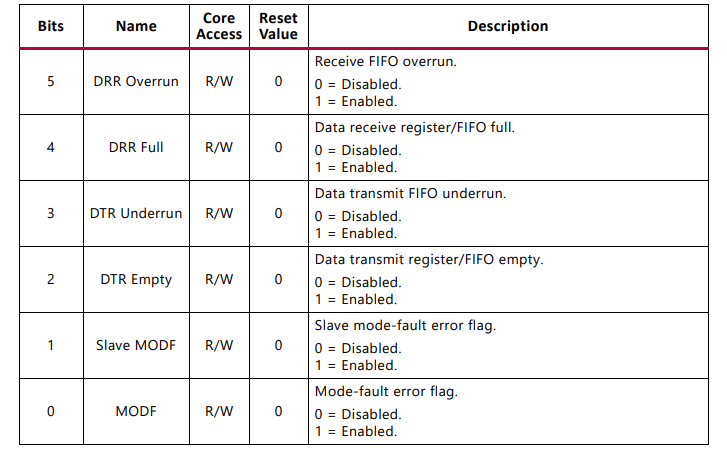

### XIP 模式

在XIP模式，配置寄存器60h和64h变更，并且中断无法使用。

XIP模式适⽤于开机操作。在这种模式下，内核仅⽀持 INCR 和 WRAP 读取事务。

内核将 SPI 视为只读存储器。三个读取命令随读取 SPI 闪存时使⽤的配置模式提供。通过为 AXI4-Lite 和 AXI4 接⼝分配相同的频率来验证核⼼功能。内核内置的三个主要读取命令是快速读取 (0x0Bh)、DIOFR (0xBBh) 和 QIOFR (0xEBh)。

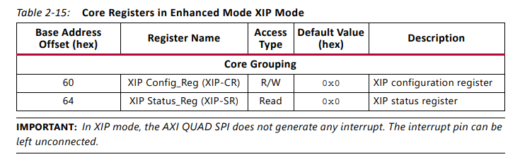

## 支持指令

### 通用指令

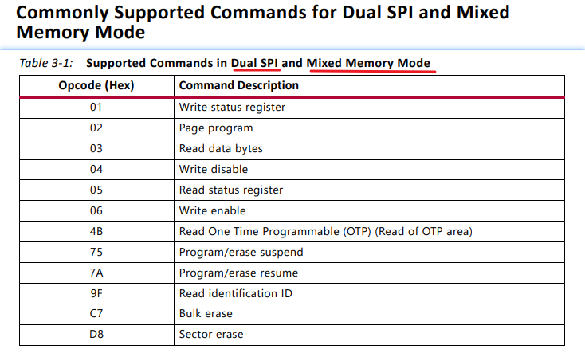

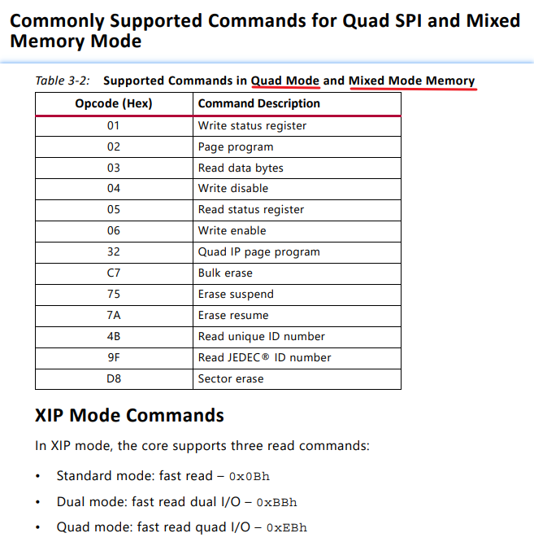

### 其他指令

详见 **PG153 AXI Quad SPI **的**Table 3-3**

## 操作流程

### 写操作

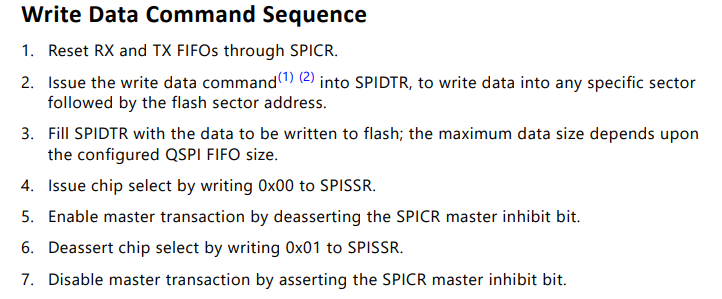

### 读操作

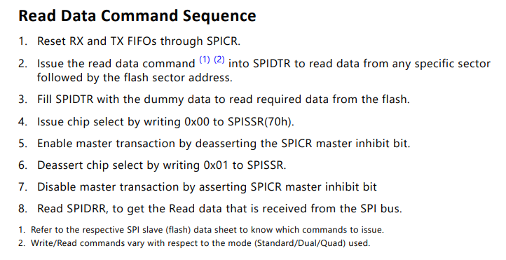

## Flash控制

### 读ID

读ID指令为9F，读几个数据就写几个dummy数据，读fifo的第一个数据是FF，因为写指令占用了，第二个数据开始才是想要的数据。

```tcl
proc RDID {byte_num} {
    # 软件复位
    WriteReg 0x40 0xa
    # 中断使能
    WriteReg 0x28 0x3fff
    # 全局中断使能
    WriteReg 0x1c 0x80000000
    # 复位 tx rx fifo
    WriteReg 0x60 0x1e6
    # 释放 fifo 复位
    WriteReg 0x60 0x186
    # CMD = 9F, 读 FLASH ID
    WriteReg 0x68 0x9f
    # 要读多少个数据就写几个 dummy 数据
    set num 0
    while {$num < $byte_num} {
        WriteReg 0x68 0x00
        incr num 1
    }
    # 选择 0 通道CS
    WriteReg 0x70 0x00
    # 使能 master, 开始发数据
    WriteReg 0x60 0x86
    # 选择 0 通道CS 拉高
    WriteReg 0x70 0x1
    # 禁用 master
    WriteReg 0x60 0x186

    set num 0
    set id_data "RDID is "
    while {$num < $byte_num + 1} {
        if {$num >= 1} {
            append id_data [string range [ReadReg 0x6c] end-1 end]
        } else {
            ReadReg 0x6c
        }
        incr num 1
    }
    return $id_data
}
```

### 写使能

每次进行擦除或者写操作之前都要先开启写使能，否则不生效。

```tcl
proc WREN {} {
    # 复位 tx rx fifo
    WriteReg 0x60 0x1e6
    # 释放 fifo 复位
    WriteReg 0x60 0x186
    # CMD = 06, 写使能
    WriteReg 0x68 0x06
    # 选择 0 通道CS
    WriteReg 0x70 0x00
    # 使能 master, 开始发数据
    WriteReg 0x60 0x86
    # 选择 0 通道CS 拉高
    WriteReg 0x70 0x1
    # 禁用 master
    WriteReg 0x60 0x186
    return "Write Enable!"
}
```

### 扇区擦除

先发送写使能指令，再发送扇区擦除指令

----

对于 N25Q128 FLASH

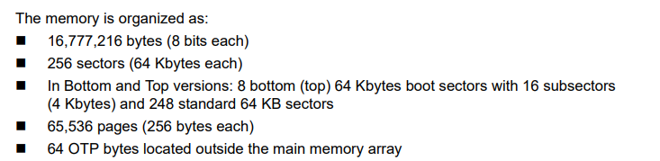

```tcl
proc SE {Sector_Num} {
    WREN
    # 复位 tx rx fifo
    WriteReg 0x60 0x1e6
    # 释放 fifo 复位
    WriteReg 0x60 0x186
    # CMD = d8, 扇区擦除
    WriteReg 0x68 0xd8
    # Write Address
    WriteReg 0x68 $Sector_Num
    WriteReg 0x68 0x00
    WriteReg 0x68 0x00
    # 选择 0 通道CS
    WriteReg 0x70 0x00
    # 使能 master, 开始发数据
    WriteReg 0x60 0x86
    # 选择 0 通道CS 拉高
    WriteReg 0x70 0x1
    # 禁用 master
    WriteReg 0x60 0x186
    return "Sector Erase Done!"
}
```

### 整片擦除

先发送写使能指令，再发送整片擦除指令

```TCL
proc BE {} {
    WREN
    # 复位 tx rx fifo
    WriteReg 0x60 0x1e6
    # 释放 fifo 复位
    WriteReg 0x60 0x186
    # CMD = c7, 整片擦除
    WriteReg 0x68 0xc7
    # 选择 0 通道CS
    WriteReg 0x70 0x00
    # 使能 master, 开始发数据
    WriteReg 0x60 0x86
    # 选择 0 通道CS 拉高
    WriteReg 0x70 0x1
    # 禁用 master
    WriteReg 0x60 0x186
    return "Bulk Erase Done!"
}
```

### 页写

先写前 128 Byte, 因为FIFO深度256, 但是cmd+地址占用4Byte, 所以实际使用不足256Byte可用

```tcl
proc PP {address} {
    WREN
# 先写前 128 Byte, 因为FIFO深度256, 但是cmd+地址占用4Byte, 所以实际使用不足256Byte可用
    # 复位 tx rx fifo
    WriteReg 0x60 0x1e6
    # 释放 fifo 复位
    WriteReg 0x60 0x186
    # CMD = 02, 页写
    WriteReg 0x68 0x02
    # Write Address
    WriteReg 0x68 [expr ($address >> 16)]
    WriteReg 0x68 [expr ($address % (2**16)) >> 8]
    WriteReg 0x68 [expr ($address % (2**8))]
    # Write Data
    set num 0
    while {$num < 128} {
        WriteReg 0x68 $num
        incr num 1
    }
    # 选择 0 通道CS
    WriteReg 0x70 0x00
    # 使能 master, 开始发数据
    WriteReg 0x60 0x86
    # 选择 0 通道CS 拉高
    WriteReg 0x70 0x1
    # 禁用 master
    WriteReg 0x60 0x186
# 再写后 128 Byte
    # 每次写操作之前需要重新开启写使能
    WREN
    set address [expr {$address + 128}]
    puts [ format 0x%08x $address]
    # 复位 tx rx fifo
    WriteReg 0x60 0x1e6
    # 释放 fifo 复位
    WriteReg 0x60 0x186
    # CMD = 02, 页写
    WriteReg 0x68 0x02
    # Write Address
    WriteReg 0x68 [expr ($address >> 16)]
    WriteReg 0x68 [expr ($address % (2**16)) >> 8]
    WriteReg 0x68 [expr ($address % (2**8))]
    # Write Data
    while {$num < 256} {
        WriteReg 0x68 $num
        incr num 1
    }
    # 选择 0 通道CS
    WriteReg 0x70 0x00
    # 使能 master, 开始发数据
    WriteReg 0x60 0x86
    # 选择 0 通道CS 拉高
    WriteReg 0x70 0x1
    # 禁用 master
    WriteReg 0x60 0x186
    return "Page Program Done!"
}
```

### 字节读

```TCL
proc READ {address number} {
    # 复位 tx rx fifo
    WriteReg 0x60 0x1e6
    # 释放 fifo 复位
    WriteReg 0x60 0x186
    # CMD = 03, 按字节读数据
    WriteReg 0x68 0x03
    # Read Address
    WriteReg 0x68 [expr ($address >> 16)]
    WriteReg 0x68 [expr ($address % (2**16)) >> 8]
    WriteReg 0x68 [expr ($address % (2**8))]
    # 要读多少个数据就写几个 dummy 数据
    set num 0
    while {$num < $number} {
        WriteReg 0x68 0x00
        incr num 1
    }
    # 选择 0 通道CS
    WriteReg 0x70 0x00
    # 使能 master, 开始发数据
    WriteReg 0x60 0x86
    # 选择 0 通道CS 拉高
    WriteReg 0x70 0x1
    # 禁用 master
    WriteReg 0x60 0x186

    ######################## 写文件 ########################
    set fn "./rd_data.txt"
    set fid [open $fn w+]
    set num 0
    puts $fid "Number   Address   Data"
    while {$num < $number + 4} {
        if {$num >= 4} {
            puts $fid [format "%-8d %#0-8x   0x%s" [expr {$num-3}] [expr {$address + $num - 3}] [string range [ReadReg 0x6c] end-1 end]]
        } else {
            ReadReg 0x6c
        }
        incr num 1
    }
    close $fid
    ######################## 读文件到变量 line ########################
    # 命令eof, 一旦读取到文件末尾, 该命令就返回 1
    set fid [open $fn r+]
    while {[eof $fid] != 1} {
        gets $fid line
        puts $line
    }
    close $fid
    puts "Read Done!"
    # set num 0
    # set read_data "ReadData is "
    # while {$num < $number + 4} {
    #     if {$num >= 4} {
    #         append read_data [string range [ReadReg 0x6c] end-1 end]
    #     } else {
    #         ReadReg 0x6c
    #     }
    #     incr num 1
    # }
    # return $read_data
}
```


