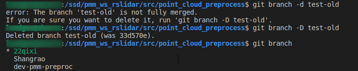
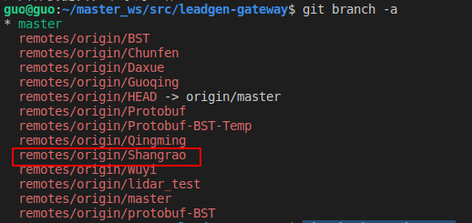
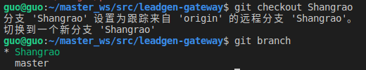
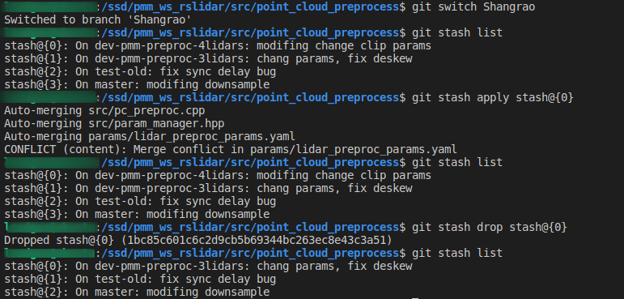
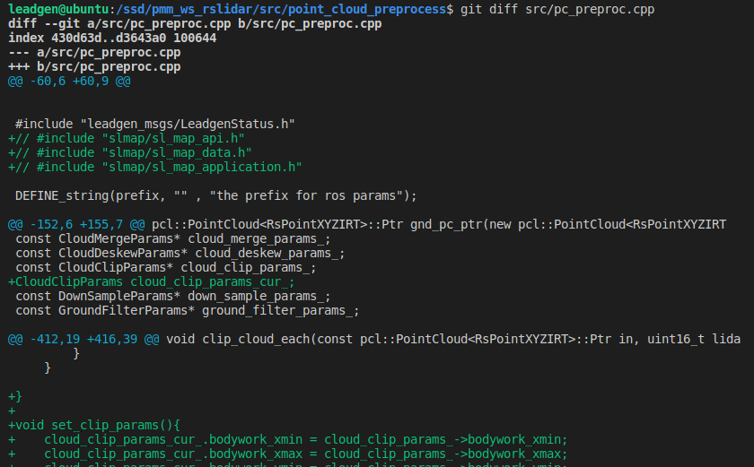

# git commands


## 删除本地分支

```shell
# 删除分支
git branch -d test-old
# 强制删除
git branch -D test-old 
```




## 删除远程分支

```bash
 git push origin --delete branchName
```


## 远程分支关联

在当前分支下, 配置当前分支

```bash
#设置关联
git branch --set-upstream-to=origin/Protobuf-BST
#删除关联
git branch --unset-upstream
```


## 远程分支clean-up

https://blog.csdn.net/BryantLmm/article/details/85130091

```
git remote show origin
git remote prune origin
```

git remote prune origin:  删除远程过时的分支(stale)

过时的(stale)分支:  例, 通过 git push origin --delete branchName 删除的远程分支, 依然会显示出来 (by command: git branch -a )

 

## git config

```shell
git status
git config -l
git config --local user.name panmiaomiao
git config --local user.email panmiaomiao@leadgentech.ai
git config -l
git config -l --local


```


## common used


```
git status
git add .
git commit -m "add <downsize_byVox>"
git push origin dev-pmm
git pull

# 合并 git add . 和 git commit -m
git commit -am

# push 

git remote update
```


## git branch

```bash
# 查看分支列表
git branch 
# 新建分支
git branch dev-pmm
# 切换到分支
git switch dev-pmm

# 查看分支历程
gitk
```


## git push

push 到远程分支(非主分支)

```bash
git push <远程主机名> <本地分支名>:<远程分支名>
git push origin Shangrao:Shangrao

git push origin dev-test-filter-segment-recluster:shangrao-test-gate-segment 
```


## git branch

```shell
# 查看远程所有分支
git branch -a
```




## git fetch

```shell
cd src/point_cloud_track/
git fetch origin
git checkout mot_track
git stash 
git chechout mot_track
```


## git checkout

```shell
# 将远程分支 Shangrao 拉到本地,同时建立远程 Shangrao 与 本地 Shangrao 的关联
git checkout Shangrao
```




## git stash

```
git stash list
git stash apply stash@{0}
git stash drop stash@{0} # 删除
git stash save "..."
```




```bash
git stash save "temp restructer"
git stash pop # 恢复最近的一个stash并将stash删除
git stash apply stash@{0} # 恢复第0个stash, stash@{0}不会被删除
```


## 查看文件修改

```shell
# 查看文件修改
git diff src/pc_preproc.cpp
```





git commit -m "fix clip by section-id"


# git errors

##  Cannot delete branch

**Q-description:**

error: Cannot delete branch 'dev-pmm' checked out at '/ssd/pmm/ws_rslidar/src/point_cloud_preprocess'


**A-solution:**

如果要删除 dev-pmm 分支 , 不能在 dev-pmm 分支下删除分支本身 , 需要切换到 其他 分支上 , 然后再删除 dev-pmm 分支 ;

```bash
git switch ros
git branch -d dev-pmm
```


