# 以太网

- author：hongjh
- time：20220125
- version:

---------

[toc]

计算机网络是指将地理位置不同的具有独立功能的多台计算机及其外部设备，通过通信线路连接起来，在网络操作系统、网络管理软件及网络通信协议的管理和协调下，实现资源共享和信息传递的计算机系统。计算机网络类型的划分标准各种各样，按网络所覆盖的地理范围的不同，计算机网络可分为局域网(LAN)、 城域网(MAN)、广域网(WAN)、互联网(Initernet)。局域网按传输介质所使用的访问控制方法可分为：以太网(Ethernet)、光纤分布式数据接口(FDDI)、异步传输模式(ATM)、令牌环网(Token Ring)、交换网(Switching) 等，它们在拓朴结构、传输介质、传输速率、数据格式等多方面都有许多不同，其中应用最广泛的当属以太网。

以太网是为了实现局域网通信而设计的一种技术，它规定了包括物理层的连线、电子信号和介质访问层协议的内容。以太网根据最大传输速率的不同可以分为标准的以太网(10Mbit/s)、快速以太网(100Mbit/s)、千兆以太网 (1000Mbit/s)和万兆以太网(10Gbit/s)。百兆网和千兆网是目前应用最多的，顾名思义，百兆网的最大传输速率为 100Mbit/s，需要注意的是，我们常见的网速的单位是 MByte/s，而 1Byte 为 8bit，所以百兆网能达到的最大网速为 12.5MByte/s。同理，千兆网的最大传输速率为 1000Mbit/s，能达到的最大网速为 125MByte/s。

# 计算机网络体系结构模型

国际标准化组织(ISO)在 1978 年提出了“开放系统互联参考模型”，即著名的 OSI/RM 模型(Open System  Interconnection/Reference Model)。它将计算机网络体系结构的通信协议划分为七层，自下而上依次为：物理层(Physics Layer)、数据链路层(Data Link Layer)、网络层(Network Layer)、传输层(Transport Layer)、会话层(Session Layer)、表示层(Presentation Layer)、应用层 (Application Layer)。下面 4 层主要提供数据传输和交换功能，即以节点到节点之间的通信为主；第 4 层作为上下两部分的桥梁，是整个网络体系结构中最关键的部分；上 3 层则以提供用户与应用程序之间的信息和数据处理功能为主。

除了标准的 OSI 七层模型以外，常见的网络层次划分还有 TCP/IP 四层协议，它们之间的对应关系如图所示：


不管是 OSI 七层模型还是 TCP/IP 的四层模型，它们每一层中都有自己的专属协议，需要完成相应的工作以及与上下层级之间进行沟通。由于目前 TCP/IP 协议已经成为 Internet 中的【通用语言】，任何和互联网有关的操作都离不开 TCP/IP 协议，没有它我们就根本不可能上网，所以下面就以 TCP/IP 协议为主来进行讲解。

- **应用层**：为操作系统或网络应用程序提供访问网络服务的接口，主要协议有文件传输协议(FTP)，超文本传输协议(HTTP)，简单邮件传输协议(SMTP)，远程登录(Telnet)；
- **传输层**：为两台主机上的应用程序提供端到端的通信，在 TCP/IP 协议簇中，有两个不同的传输协议：TCP(传输控制协议)和 UDP(用户数据报协议)，它们分别承载不同的应用。TCP 协议是一种面向连接的传输，能够提供可靠的字节流传输服务，UDP 协议是一种简单的面向数据报的传输层协议，与 TCP 协议不同的是 UDP 无法保证数据报文准确达到目的地。
- **网络层**：负责提供基本的数据封包传送功能，让每个据包都能够到达目的主机，主要协议有 IP 协议(网际协议)、ICMP 协议(Internet 互连网控制报文协议)、ARP/RARP (地址解析/反向地址解析协议)以及 IGMP 协议(Internet 组管理协议)。
- **网络接口层**：通常包括操作系统中的设备驱动程序和计算机中对应的网络接口卡，它们一起处理与电缆的物理接口细节，主要协议有：以太网、令牌环、帧中继等；


从该图中可以看出，当主机 A 向主机 B 发送数据时，用户数据将由应用层产生；当用户数据在经过传输层时，传输层对用户数据进行封装，在用户数据的基础上添加了一个 TCP/UDP 首部数据，此时数据包变成了 TCP/UDP 段；当它经过网络层时，网络层对 TCP/UDP 段进行封装，在 TCP/UDP 段的基础上添加了一个 IP 首部数据，此时 TCP/UDP 段变成了 IP 数据报；当 它经过网络接口层时，网络接口层对 IP 数据报进行封装，在 IP 数据报的基础上添加了以太网首部数据和以太网尾部（一般为 4byte CRC校验值）两个数据，此时 IP 数据报变成了以太网帧。由此可以看出，数据经过层层封装成帧后发到传输介质上，到达目的主机后每层协议再剥掉相应的首部数据，最后将应用层数据交给主机 B 处理。

# MAC/PHY 基本概念

MAC 即媒介访问控制层（Media Access Control）, 位于TCP/IP协议栈的第二层-数据链路层，用于数据传输过程的数据流控制，其将上层IP数据包分割成适合于物理层传输的数据帧，并负责数据传输的冲突管理。按照 IEEE Std 802-2001 上的定义，MAC主要做如下几个事情：

- 数据帧的封装与识别
- 根据MAC地址来与目标主机进行通讯
- 检测数据传输错误（MAC帧中有一个FCS, Frame Checksum Sequence)
- 物理媒介的访问控制，半双工情况下需要进行传输冲突控制，如CSMA/CD

----

PHY（Physical layer) 即物理层， 其主要负责物理信号的传输， 其通过线束（如光纤/铜线）与其他设备进行连接。一个PHY芯片主要包含了两个部分: PCS(Physical Coding Sublayer), PMD(Physical Medium Dependent), 对车载PHY芯片来说，通常还包含了一个PMA(Physical Media Attachment)子层, 位于PCS与PMD之间。

# MAC与PHY之间的接口

## 概述

**Media  Independent  Interface ( MII)** ，介质独立接口，起初是定义100M以太网（Fast Ethernet）的 MAC  层与 PHY 芯片之间的传输标准（802.3u）。介质独立的意思是指，MAC 与 PHY 之间的通信不受具体传输介质（双绞线或光纤等）的影响，任何 MAC 和 PHY 都可以通过 MII 接口互连。

**MDIO** 是 MII 接口的一部分，用于在 MAC 和 PHY 之间传递配置信息。在系统上电瞬间，PHY 芯片通过管脚的电平状态确定原始设置，进而通过 MDIO 更改配置。

最初 MII 定义数据 4 bit 发送 + 4 bit 接收，每位数据速率  25MHz ，总数据速率 100Mbps。其它  MII 标准的变种，包括 RMII，GMII，RGMII，XGMII，SGMII，基本上都是定位于**更高速率**或者**更少的信号数**的目标。

下图表示在以太网通信层次模型中MII接口的位置：

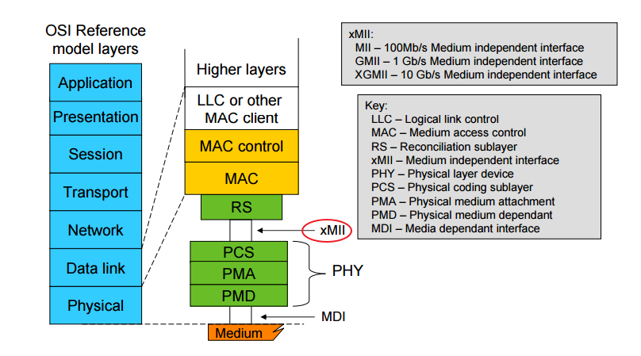

----

针对不同的应用场景，目前MAC与PHY之间的主要数据传输接口有

- **MII（Media Independent Interface）** ：支持 10/100 Mbps，数据位宽为 4 bits；在 100Mbps传输速率下，时钟频率为 25 MHz
- **RMII（Reduce MII）** ：MII 的简化版，数据位宽为 2 bits；在 100Mbps传输速率下，时钟频率为 50 MHz
- **GMII（Gigabit MII）** ：GMII 接口向下兼容 MII 接口，支持 10/100/1000 Mbps，数据位宽为 8 bits；在 100Mbps传输速率下，时钟频率为 125 MHz
- **RGMII（Reduce Gigabit MII）** ：GMII 的简化版，数据位宽为 4 bits；在 100Mbps传输速率下，时钟频率为 125 MHz，但是在为时钟上下沿同时采样数据
- **SGMII（Serial GIgabit MII）** ：串行 GMII，收发各一对差分信号线，时钟频率为 625 MHz，在时钟上下沿同时采样；有效数据带宽1000Mbps，每 10bits 数据包含 8bits 数据位 和 2 bits 控制位
- **XGMII（10-GIgabit MII）** ：速率 10 Gbps，数据位宽为 32 bits，时钟为156.25 MHz，时钟上下沿采样

## MDIO/MDC

SMI（Serial Management Interface）串行管理接口，也被称作 MII 管理接口（MII Management Interface），包括 MDC 和 MDIO 两条信号线。

- MDIO 是一个 PHY 的管理接口，用来读写 PHY 的寄存器，以控制 PHY 的行为或获取 PHY 的状态

- MDC 为 MDIO 提供时钟，由 MAC 端提供

### 帧格式

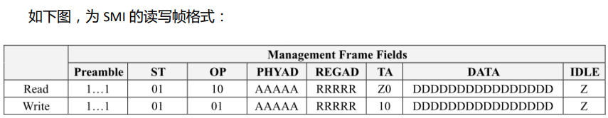

| 名称     | 说明                                                         |
| -------- | ------------------------------------------------------------ |
| Preamble | 由 MAC 发送 32 个连续的逻辑 “1”，同步于 MDC 信号，用于 MAC 与 PHY 之间的同步 |
| ST       | 帧开始位，固定为 “01”                                        |
| OP       | 操作码，“10” 表示读，“01” 表示写                             |
| PHYAD    | PHY 的地址，5 bits                                           |
| REGAD    | 寄存器地址，5 bits                                           |
| TA       | Turn Around， MDIO方向转换<br />① 在写状态下，不需要转换方向，值为 “10”<br />② 在读状态下，MAC 输出端为高阻态，在第二个周期 PHY 将 MDIO 拉低 |
| DATA     | 16 bits 数据                                                 |
| IDLE     | 空闲状态。此状态下 MDIO 为高阻态，由外部上拉电阻拉高         |

### 读时序

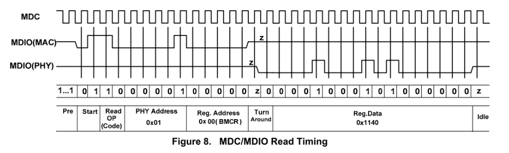

可以看到在 Turn Around状态下，第一个周期 MDIO 为高阻态，第二个周期由 PHY 端拉低。

### 写时序

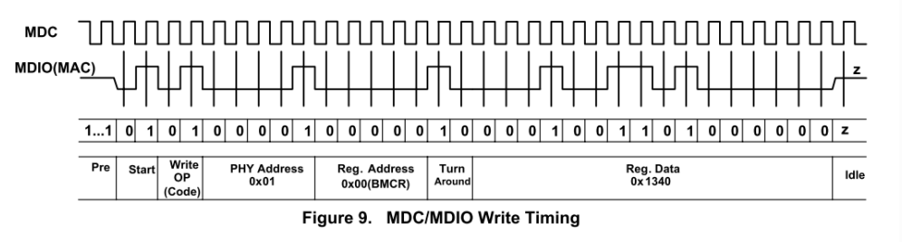

为了保证能够正确采集到数据，在 MDC 上升沿之前就把数据准备好。

## MII

Mll 共计 18 根信号线，只有 MDIO/MDC 信号可以在不同 PHY 间级联。假定系统中有 8 个 PHY，则 Mll 信号总数为 8*16+2=130 根！为减少信号数，RMII 接口应运而生。

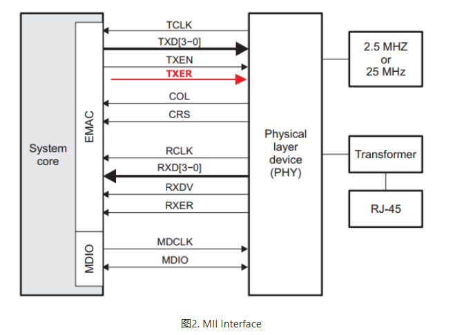

| 信号名称  | 方向（MAC 端） | 描述                                                         |
| --------- | -------------- | ------------------------------------------------------------ |
| TX_CLK    | Input          | 发送数据参考时钟，由 PHY 提供<br />① 100 Mbps 速率下，时钟频率为 25 MHz<br />② 10 Mbps 速率下，时钟频率为 2.5 MHz |
| TXD[3:0]  | Output         | 发送数据信号                                                 |
| TX_EN     | Output         | 发送数据使能信号，TXD 在 TX_EN 拉高时才有效                  |
| TX_ER     | Output         | ① 发送数据错误提示信号， TXD 在 TX_ER 拉高时无效<br />② 10Mbps 速率下，TX_ER 不起作用 |
|           |                |                                                              |
| RX_CLK    | Input          | 接收数据参考时钟，由 PHY 提供<br />① 100 Mbps 速率下，时钟频率为 25 MHz<br />② 10 Mbps 速率下，时钟频率为 2.5 MHz |
| RX_D[3:0] | Input          | 接收数据信号                                                 |
| RX_DV     | Input          | 接收数据使能信号，RXD 在 RX_DV 拉高时才有效                  |
| RX_ER     | Input          | ① 接收数据错误提示信号， RXD 在 RX_ER 拉高时无效<br />② 10Mbps 速率下，RX_ER 不起作用 |
|           |                |                                                              |
| COL       | Input          | ① 载波侦测信号，不需要同步于参考时钟<br />② 只要有数据传输，CAS 就有效<br />③  CAS信号只有 PHY 在半双工模式下有效 |
| CRS       | Input          | ① 冲突检测信号，不需要同步于参考时钟<br />②  COL 信号只有 PHY 在半双工模式下有效 |


## RMII

相比于 MII 接口，RMII 有以下四处变化：

1. TXCLK 和 RXCLK 两个时钟信号，合并为一个时钟 REFCLK
2. 时钟速率由 25MHz 上升到 50MHz，单向数据由 4 bits 变为 2 bits 
3. CRS 和 RX_DV 合并为一个信号 CRS_DV
4. 取消了COL信号

RMII 信号如下图所示。RMII 只要 9 根信号线，相比于 MII 的 18 根信号少了一半，在同一个系统中的多个设备可以共享 MDIO，MDC 和 REFCLK 信号线。

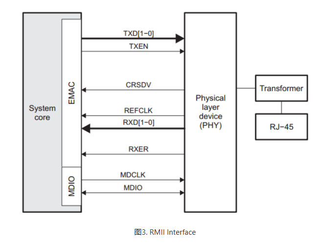

| 信号名称  | 方向（MAC 端） | 描述                                                         |
| --------- | -------------- | ------------------------------------------------------------ |
| REF_CLK   | Output         | 参考时钟，50 MHz                                             |
| TXD[2:0]  | Output         | 发送数据信号                                                 |
| TX_EN     | Output         | 发送数据使能信号，TXD 在 TX_EN 拉高时才有效                  |
|           |                |                                                              |
| RX_D[3:0] | Input          | 接收数据信号                                                 |
| RX_ER     | Input          | ① 接收数据错误提示信号， RXD 在 RX_ER 拉高时无效<br />② 10Mbps 速率下，RX_ER 不起作用 |
|           |                |                                                              |
| CRS_DV    | Input          | ① 由 MII 接口的 RX_DV 和 CAS 合并而成<br />② 当介质不空闲时，CRS_DV 和 REFCLK 相异步给出<br />③ 当 CRS 比 RX_DV 早结束时（即载波消失而队列中海油数据要传输时），就会出现 CRS_DV 在半位元组的边界以 25/2.5 MHz 的频率在0、1之间来回切换。因此，MAC 能够从 CRS_DV 中精确恢复出 RX_DV 和 CRS。 |

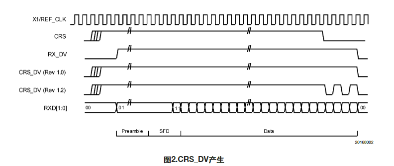

在100Mbps速率时，TX/RX每个时钟周期采样一个数据；在10Mbps速率时，TX/RX每隔10个周期采样一个数据，因而TX/RX数据需要在数据线上保留10个周期，相当于一个数据发送10次。

当PHY层芯片收到有效的载波信号后，CRS_DV信号变为有效，此时如果FIFO中还没有数据，则它会发送出全0的数据给MAC，然后当FIFO中填入有效的数据帧，数据帧的开头是“101010—”交叉的前导码，当数据中出现“01”的比特时，代表正式数据传输开始，MAC芯片检测到这一变化，从而开始接收数据。

当外部载波信号消失后，CRS_DV会变为无效，但如果FIFO中还有数据要发送时，CRS_DV在下一周期又会变为有效，然后再无效再有效，直到FIFO中数据发送完为止。在接收过程中如果出现无效的载波信号或者无效的数据编码，则RX_ER会变为有效，表示物理层芯片接收出错。

## GMII

与 MII 接口相比，GMII 接口的数据速率可达 1000Mbps，数据宽度由 4 位变为 8 位，在实际应用中，绝大多数 GMII 接口都是兼容 MII 接口的，所以，一般的 GMII 接口都有两个发送参考时钟：TX_CLK 和 GTX_CLK (两者的方向是不一样的)，在用作 MII 模式时，使用 TX_CLK 和 8 根数据线中的 4 根。

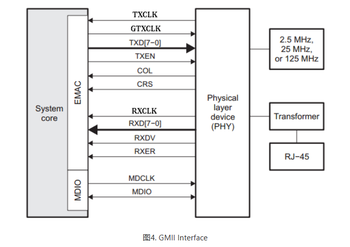

| 信号名称  | 方向（MAC 端） | 描述                                                         |
| --------- | -------------- | ------------------------------------------------------------ |
| GTX_CLK   | Output         | 发送数据参考时钟，由 MAC 提供<br />① 1000 Mbps 速率下，时钟频率为 125 MHz<br />② 100 Mbps 速率下，时钟频率为 25 MHz<br />③ 10 Mbps 速率下，时钟频率为 2.5 MHz |
| TXD[7:0]  | Output         | 发送数据信号                                                 |
| TX_EN     | Output         | 发送数据使能信号，TXD 在 TX_EN 拉高时才有效                  |
| TX_ER     | Output         | 发送数据错误提示信号， TXD 在 TX_ER 拉高时无效               |
|           |                |                                                              |
| RX_CLK    | Input          | 接收数据参考时钟，由 PHY 提供<br />① 1000 Mbps 速率下，时钟频率为 125 MHz<br />② 100 Mbps 速率下，时钟频率为 25 MHz<br />③ 10 Mbps 速率下，时钟频率为 2.5 MHz |
| RX_D[7:0] | Input          | 接收数据信号                                                 |
| RX_DV     | Input          | 接收数据使能信号，RXD 在 RX_DV 拉高时才有效                  |
| RX_ER     | Input          | 接收数据错误提示信号， RXD 在 RX_ER 拉高时无效               |
|           |                |                                                              |
| COL       | Input          | ① 载波侦测信号，不需要同步于参考时钟<br />② 只要有数据传输，CAS 就有效<br />③  CAS信号只有 PHY 在半双工模式下有效 |
| CRS       | Input          | ① 冲突检测信号，不需要同步于参考时钟<br />②  COL 信号只有 PHY 在半双工模式下有效 |

## RGMII

RGMII 相比于 GMII 减小将近一半的管脚数（24 ->12），通过以下两种方式：

- 1000Mbps 模式下，在时钟的上/下边沿均采样数据；10/100Mbps 模式，数据仅在时钟上升沿采样
- 取消不重要的如 CRS，COL 等信号
- TXC 只由 MAC提供，不像 GMII 接口（10/100Mbps 模式下时钟是由 PHY 提供（TXCLK），而 1000Mbps 模式下时钟是由 MAC 提供）
- RGMII 中应用到源同步时钟，即数据与时钟信号是同步的。这要求在PCB设计中，要对时钟信号额外增加 1.5-2ns 的延迟以保证接收端的建立/保持时间满足要求。在RGMII v2.0 规范中有定义MAC/PHY内部延迟
  （RGMII-ID），由此避免PCB设计中再要增加这个延迟。
- RXCTL 和 TXCTL 为复用的传输控制信号。RXCTL 在时钟的上升沿代表 RXDV，在时钟的下降沿代表 RXER；TXCTL 在时钟的上升沿代表 TXEN，在时钟的下降沿代表 TXER
- RGMII v1.3 采用 2.5V CMOS 电平，RGMII v2 采用 1.5V HSTL 电平。

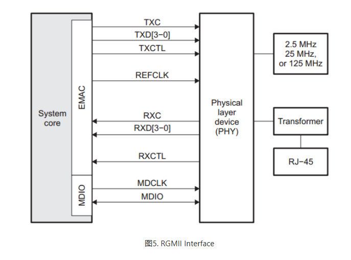

| 信号名称  | 方向（MAC 端） | 描述                                                         |
| --------- | -------------- | ------------------------------------------------------------ |
| GTX_CLK   | Output         | 发送数据参考时钟，由 MAC 提供<br />① 1000 Mbps 速率下，时钟频率为 125 MHz<br />② 100 Mbps 速率下，时钟频率为 25 MHz<br />③ 10 Mbps 速率下，时钟频率为 2.5 MHz |
| TXD[3:0]  | Output         | ① 发送数据信号<br />② 上下沿都传输数据                       |
| TX_CTL    | Output         | ① 上升沿发送数据使能信号<br />② 下降沿发送数据错误提示信号   |
|           |                |                                                              |
| RX_CLK    | Input          | 接收数据参考时钟，由 PHY 提供<br />① 1000 Mbps 速率下，时钟频率为 125 MHz<br />② 100 Mbps 速率下，时钟频率为 25 MHz<br />③ 10 Mbps 速率下，时钟频率为 2.5 MHz |
| RX_D[3:0] | Input          | ① 接收数据信号<br />② 上下沿都传输数据                       |
| RX_CTL    | Input          | ① 接收数据使能信号<br />② 下降沿接收数据错误提示信号         |
|           |                |                                                              |
| COL       | Input          | ① 载波侦测信号，不需要同步于参考时钟<br />② 只要有数据传输，CAS 就有效<br />③  CAS信号只有 PHY 在半双工模式下有效 |
| CRS       | Input          | ① 冲突检测信号，不需要同步于参考时钟<br />②  COL 信号只有 PHY 在半双工模式下有效 |

## SGMII

SGMII 发送和接收时钟频率均为 625MHz，采用 DDR 模式，因此数据速率为1.25Gbps，SGMII 相比于 GMII，功耗更低，采用 SerDes 接口后管脚数更少。SGMII 发送和接受数据各 1 对差分信号（LVDS），另外还有 1 对差分时钟，共 6 根线。对于 MAC/PHY 中包括时钟恢复电路（CDR，Clock and Data Recovery circuitry）的系统，TXCLK 可以省略，SGMII 接口只需要 4 根线，相比于 GMII（24 根）和 RGMII（12 根）信号线大大减少！

TX/RX 在数据发送端必须同时产生时钟，而接收端的时钟是可选的，因为可以通过 CDR 恢复时钟。在 10/100Mbps 工作模式下，数据分别重复发送 100/10 次，因此时钟一直是 625MHz

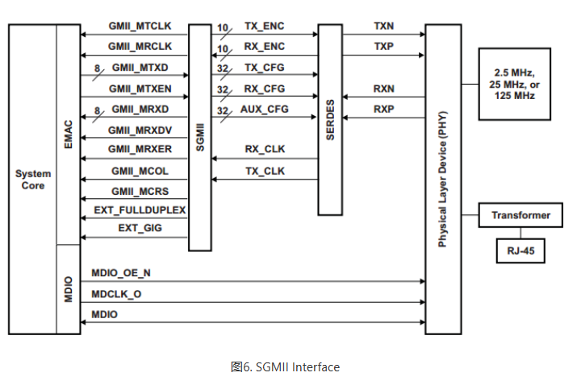

大多数 MAC 芯片的 SGMII 接口都可以配置成 SerDes 接口（在物理上完全兼容，只需配置寄存器即可）。SerDes 直接外接光模块，而不需要 PHY 层芯片，此时时钟速率仍旧是 625 MHz。

不过此时跟 SGMII 接口不同，SGMII 接口速率被提高到 1.25 Gbps 是因为插入了控制信息，而 SerDes 端口速率被提高是因为进行了 8B/10B 变换，本来 8B/10B 变换是 PHY 芯片的工作，在 SerDes 接口中，因为外面不接 PHY 芯片，此时 8B/10B 变换在 MAC 芯片中完成了。

8B/10B 变换的主要作用是扰码，让信号中不出现过长的连 “0” 和连 “1” 情况，影响时钟信息的提取。

所以感觉是 MAC 芯片用加 2bits 控制信息的功能模块去完成了 8B/10B 变换，这样 SerDes 信号就可以直接出去了。

SerDes 通道和 SerDes 接口是两个概念，SGMII 也是需要 SerDes通道（SERDES lane）的。

而 SGMII 需要插入 2bits 控制信号变成 10bits 是因为 SGMII 需要控制信号来实现 10/100/1000 Mbps 速率协商，而 SerDes 是固定速率（1000BASE-x）。

PHY 收到 MAC SGMII 的 10 bits 后，将控制信号去除后，将数据发送出去前还是会加扰码完成 8B/10B 变换。

## XGMII

XGMII 是用于 10G 以太网的 MAC 与 PHY 设备间通信的接口标准，它包括 32 bits 的数据通道（RXD&TXD），两组 4 bits的控制通道（RXC&TXC）和两组时钟（收/发），时钟频率 156.25 MHz，工作在 DDR 模式。

XGMII 接口的连接示意图如下所示，注意 RXD/TXD 信号上的 36 表示 32 bits 数据 + 4 bits 控制信号，其中每 8 bits 数据称为 1 个 Lane，共用 1 路控制信号。

10 Gbps = 156.25 MHz \* 32 bits \* 2

XGMII 信号数目（74 根）较多，通常用于芯片内的连接，不适合作为芯片间通信的接口，因此协议定义 XGXS（XGMII eXtender Sublayer）子层以缩减信号数目，简化硬件设计。

XGXS 子层主要完成 8b/10b 编码和不同 Lane 之间的去偏斜等功能。如图所示，在信号链的两端，MAC和PHY 都包括 XGXS 子层，XAUI 是 XGXS 之间通信的接口。

XAUI 接口包括 4 组发送差分对和 4 组接收差分对，共 16 根信号。每组差分对（Lane）的数据速率为 3.125 Gbps，因此总的数据速率为 4 \*3.125 Gbps = 12.5 Gbps，考虑到 8b/10b 的效率为 80%，因此实际数据速率为12.5Gbps \* 80%= 10 Gbps

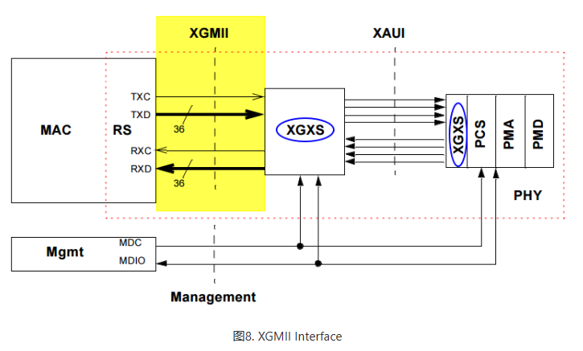

## XFI/XFP

XFI 是10G 以太网 PMA（Physical Medium Attachment）和 PMD（Physical Medium Dependent）之间的接口标准，它只有两对差分线（收/发），共4根线，如下图所示。XFI 接口速度达到10.3125
Gbps，采用64B/66B编码，在 XAUI 与 XFI 之间使用到 SerDes 以减小信号数。

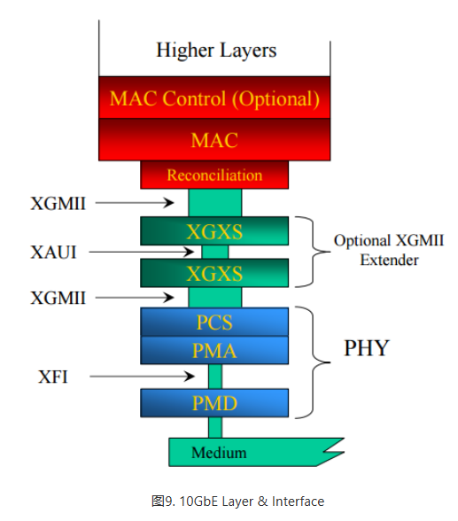

XFP（10 Gigabit Small Form Factor Pluggable）是指应用XFI接口的光模块，应用于10G以太网的光传输。XFP 光模块的尺寸略大于 SFP 和 SFP+ 光模块，三种光模块的详细对比见[链接](http://www.differencebetween.info/difference-between-xfp-sfp-and-sfp-plus)。

# 以太网帧

## 以太网帧格式

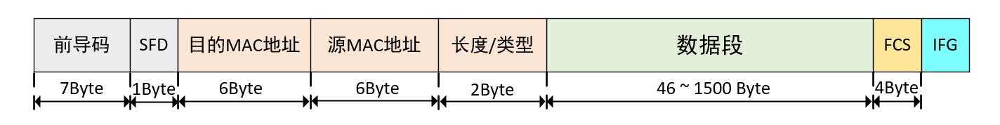

### 前导码（Preamble）

为了实现底层数据的正确阐述，物理层使用7个字节同步码（7 个 0x55），二进制表现为 0 和 1 交替，其作用是使发送方和接收方的时钟同步。

### 帧起始界定符（SFD，Start Frame Delimiter）

使用 1 个字节的SFD（0xd5），二进制表现为“10101011”，用来表示一帧的开始，即后面紧跟着传输的就是以太网的帧头。

### 以太网帧头

#### 目的MAC地址

即接收端物理MAC地址，占用 6 个字节。MAC地址从应用上可分为**单播地址、组播地址和广播地址**。

- 单播地址：第一个字节的最低位为0，比如00-00-00-11-11-11，一般用于标志唯一的设备；
- 组播地址：第一个字节的最低位为1，比如01-00-00-11-11-11，一般用于标志同属一组的多个设备；
- 广播地址：所有48bit全为1，即FF-FF-FF-FF-FF-FF，它用于标志同一网段中的所有设备。

#### 源MAC地址

即发送端物理MAC地址，占用6个字节。

#### 长度/类型

长度/类型具有两个意义

- 当这两个字节的值**小于1536**（十六进制为0x0600）时，代表该以太网中数据段的长度；
- 如果这两个字节的值**大于1536**，则表示该以太网中的数据属于哪个上层协议，例如0x0800代表IP协议（网际协议）、0x0806代表ARP协议（地址解析协议）等。

### 数据段

长度最小46个字节，最大1500个字节。

长度最小46个字节，总的以太网帧长度最小为 64 个字节，其原因是因为以太网是不可靠的，这意味着它并不知道对方有没有收到自己发出的数据包，但如果他发出的数据包发生错误，需要进行重传。以太网的错误主要是发生碰撞，碰撞是指两台机器同时监听到网络是空闲的，同时发送数据就会发生碰撞，碰撞对于以太网来说是正常的。要保证以太网的重传，必须保证收到碰撞信号的时候数据包没有传完，要实现这一要求，发送方和接收方之间的距离很关键，也就是说信号在发送方和接收方之间传输的来回时间必须控制在一定范围之内。IEEE 定义了这个标准，一个碰撞域内最 远的两台机器之间的 round-trip time 要小于 512 bit time(传输一个比特需要的时间)，这也是我们常说的一个碰撞域的直径。512 个 bit time 也就是 64 字节的传输时间，如果以太网数据包 ≥ 64 个字节就能保证碰撞信号到达发送方的时候，数据包还没有传完。最小数据帧的设计和以太网电缆长度有关，为的是让两个相距最远的站点能够感知到双方的数据发生了碰撞，最远两端数据的往返时间就是争用期，以太网的争用期是 51.2 us，正好发送 64byte 数据。

最大值 1500 称为以太网的最大传输单元（MTU，Maximum Transmission Unit），之所以限制最大传输单元是因为在多个计算机的数据帧排队等待传输时，如果某个数据帧太大的话，那么其它数据帧等待的时间就会加长，导致体验变差。另外还要考虑网络I/O控制器缓存区资源以及网络最大的承载能力等因素，因此最大传输单元是由各种综合因素决定的。**为了避免增加额外的配置，通常以太网的有效数据字段小于1500个字节，现在电脑的配置都很高了，很多都支持巨型帧，巨型帧可以超过 1500 个字节**。

不同的协议，数据段的组成结构不同，后面再详细说明。

### 帧检验序列（FCS，Frame Check Sequence）

为了确保数据的正确传输，在数据的尾部加入了4个字节的循环冗余校验码（CRC校验）来检测数据是否传输错误。**CRC数据校验从以太网帧头开始即不包含前导码和帧起始界定符**。通用的CRC标准有CRC-8、CRC-16、CRC-32、CRC-CCIT，其中在网络通信系统中应用最广泛的是CRC-32标准。

### 帧间隙（IFG，Interpacket Gap）

　帧间隙的时间就是网络设备和组件在接收一帧之后，需要短暂的时间来恢复并为接收下一帧做准备的时间，**IFG的最小值是96 bit time**，即在媒介中发送96位原始数据所需要的时间，在不同媒介中IFG的最小值是不一样的。不管10M/100M/1000M的以太网，两帧之间最少要有96bit time，IFG的最少间隔时间计算方法如下：

- 10Mbit/s最小时间为：96*100ns = 9600ns；
- 100Mbit/s最小时间为：96*10ns = 960ns；
- 1000Mbit/s最小时间为：96*1ns = 96ns；

## ARP 数据报

ARP 地址解析协议，即 ARP（Address Resolution Protocol），根据 IP 地址获取物理地址。主机发送包含目的 IP 地址的 ARP 请求广播（MAC 地址为 48’hff_ff_ff_ff_ff_ff）到网络上的主机，并接收返回消息，以此确定目标的物理地址，收到返回消息后将 IP 地址和物理地址保存到缓存中，
并保留一段时间，下次请求时直接查询 ARP 缓存以节约资源。下图为 ARP 数据报格式 。

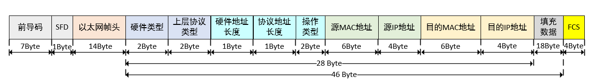

|            | 字段          | 长度 (Byte) | 默认值      | 备注                                     |
| ---------- | ------------- | ----------- | ----------- | ---------------------------------------- |
|            | 前导码+SFD    | 8           | 0x5555...D5 |                                          |
| 以太网首部 | 目的 MAC 地址 | 6           |             |                                          |
|            | 源 MAC 地址   | 6           |             |                                          |
|            | 长度/类型     | 2           | 0x0806      | ARP帧类型值                              |
| ARP 字段   | 硬件类型      | 2           | 0x0001      | 指链路层网络类型，1 为以太网             |
|            | 上层协议类型  | 2           | 0x0800      | 上层协议为 IP 协议                       |
|            | MAC地址长度   | 1           | 0x6         | 以太网 MAC 地址长度为 6                  |
|            | IP地址长度    | 1           | 0x4         | IP 地址长度为 4                          |
|            | 操作码        | 2           | 0x1 / 0x2   | 1 表示 ARP 请求包<br />2 表示 ARP 应答包 |
|            | 源 MAC 地址   | 6           |             |                                          |
|            | 源 IP 地址    | 4           |             |                                          |
|            | 目的 MAC 地址 | 6           |             |                                          |
|            | 目的 IP 地址  | 4           |             |                                          |
|            | 填充数据      | 18          |             | 数据段最小长度为46                       |
| 以太网校验 | 校验字        | 4           |             | 除前导码+SFD 外均计算                    |


## IP 数据报

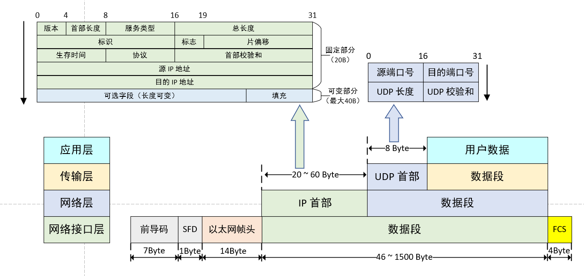

### IP 首部

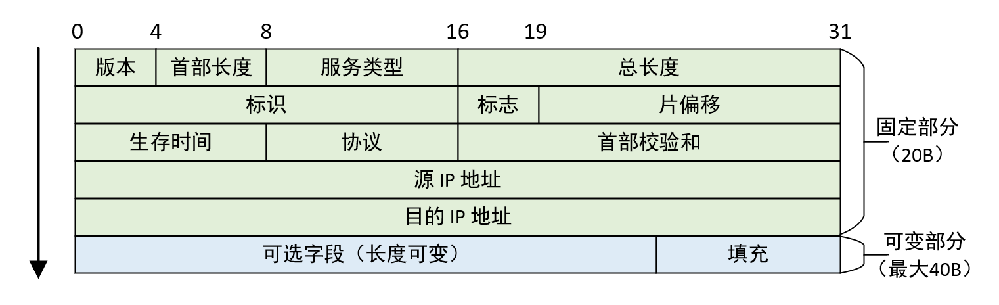

- **版本** ：4位IP版本号（Version），这个值设置为二进制的 “0100” 时表示 IPv4，设置为 “0110” 时表示 IPv6，目前使用比较多的IP协议版本号是 4
- **首部长度** ： 4位首部长度（IHL，Internet Header Length），表示IP首部一共有多少个 32bits（4个字节）。最大可表示15个 32 bits，因此 IP 的首部长度最大值为 60 字节
- **服务类型** ：8位服务类型（TOS，Type of service），该字段被划分成两个子字段：3位优先级字段（现在已经基本忽略掉了）和4位TOS字段，最后一位固定为0。服务类型为0时表示一般服务
- **总长度** ：16位IP数据报总长度（Total Length），包括IP首部和IP数据部分，以字节为单位。我们利用IP首部长度和IP数据报总长度，就可以知道IP数据报中数据内容的起始位置和长度。由于该字段长16bit，所以IP数据报最长可达65535字节。尽管理论上可以传输长达65535字节的IP数据报，但实际上还要考虑网络的最大承载能力等因素
- **标识** ：16位标识（Identification）字段，用来标识主机发送的每一份数据报。通常每发送一份报文它的值就会加1
- **标志** ：3位标志（Flags）字段
  - 最高位为保留位
  - 中间位是 DF （Don't Fragment），表示禁止分片，只有 DF = 0 时才允许分片
  - 最低位是 MF （More Fragment），MF = 1 表示后面还有分片，MF = 0 表示最后一个分片
- **片偏移** ：13位片偏移字段，指较长的分组在分片后某片在原分组中的相对位置，以 8 字节为偏移单位，也就是说每个分片的长度一定是 8 字节的整数倍
- **生存时间** ：8位生存时间字段TTL（Time To Live），设置了数据报可以经过的最多路由器数，表示数据报在网络上生存多久，防止丢失的数据包在无休止的传播TTL的初始值由源主机设置，一般为32、64或者128，一旦经过一个路由器，它的值就减 1，减到 0 时，数据报就丢弃，并发送 ICMP 消息通知源主机
- **协议** ：8位协议（Protocol）类型，指出此数据报携带的数据使用何种协议以便目的主机的 IP 层将数据部分上交给哪个处理过程。 0x01 表示为 ICMP 协议, 0x02 表示为 IGMP 协议, 0x06 表示为 TCP 协议, 0x11 表示为 UDP 协议
- **首部校验和** ：16位首部校验和（Header Checksum），该字段只校验数据报的首部，不包含数据部分；校验IP数据报头部是否被破坏、篡改和丢失等。
- **源 IP 地址** ：32位源IP地址（Source Address），即发送端的IP地址，如192.168.1.123
- **目的 IP 地址** ：32位目的IP地址（Destination Address），即接收端的IP地址，如192.168.1.102
- **可选字段** ：是数据报中的一个可变长度的可选信息，选项字段以32bit为界，不足时插入值为0的填充字节，保证IP首部始终是32bit的整数倍，没有的话长度可以为 0 。

　　IP首部校验和的计算方法：

```
1、将16位检验和字段置为0，然后将IP首部按照16位分成多个单元；
2、对各个单元采用反码加法运算（即高位溢出位会加到低位，通常的补码运算是直接丢掉溢出的高位）；
3、此时仍然可能出现进位的情况，将得到的和再次分成高16位和低16位进行累加；
4、最后将得到的和的反码填入校验和字段。
```

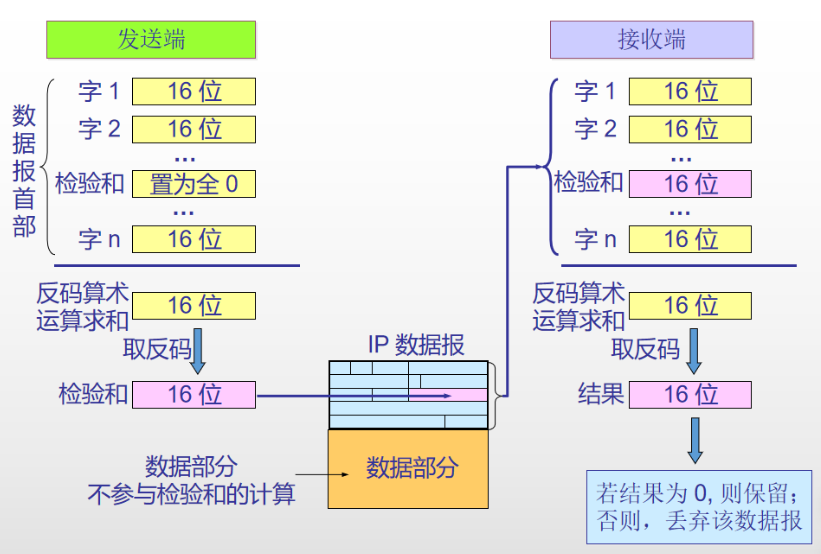

### UDP 数据报格式


- **源端口号** ：16位发送端端口号，用于区分不同服务的端口，端口号的范围从0到65535
- **目的端口号** ：16位接收端端口号
- **UDP 长度** ：16位UDP长度，包含UDP首部长度 + 数据长度，单位是字节
- **UDP 校验和 ** ：16位UDP校验和。UDP计算校验和的方法和计算IP数据报首部校验和的方法相似，但不同的是IP数据报的校验和只检验IP数据报的首部，而**UDP校验和包含三个部分：UDP 伪首部，UDP 首部和 UDP 的数据部分。伪首部的数据是从IP数据报头和UDP数据报头获取的，包括源IP地址，目的IP地址，协议类型和UDP长度**

----

数据是可以直接封装在IP协议里而不使用TCP、UDP或者其它上层协议的。然而在网络传输中同一IP服务器需要提供各种不同的服务，各种不同的服务类型是使用端口号来区分的，例如用于浏览网页服务的80端口，用于FTP（文件传输协议）服务的21端口等。TCP和UDP都使用两个字节的端口号，理论上可以表示的范围为0~65535，足够满足各种不同的服务类型。

TCP协议与UDP协议作为传输层最常用的两种传输协议，这两种协议都是使用IP作为网络层协议进行传输。下面是TCP协议与UDP协议的区别：

```
①TCP协议面向连接，是流传输协议，通过连接发送数据，而UDP协议传输不需要连接，是数据报协议；
②TCP为可靠传输协议，而UDP为不可靠传输协议。即TCP协议可以保证数据的完整和有序，而UDP不能保证；
③UDP由于不需要连接，故传输速度比TCP快，且占用资源比TCP少；
④TCP协议常用在对数据文件完整性较高的一些场景中，如文件传输等。
 UDP协议常用于对通讯速度有较高要求或者传输数据较少时，如视频直播和QQ等。
```

UDP 协议使用报头中的校验值来保证数据的安全。校验值首先在数据发送方通过特殊的算法 计算得出，在传递到接收方之后，还需要再重新计算。如果某个数据报在传输过程中被第三方篡 改或者由于线路噪音等原因受到损坏，发送和接收方的校验计算值将不会相符，由此 UDP 协议可以检测是否出错。虽然 UDP 提供有错误检测，但检测到错误时，只是简单地把损坏的消息段扔掉，或者给应用程序提供警告信息。

### ICMP 报文

#### 报文格式

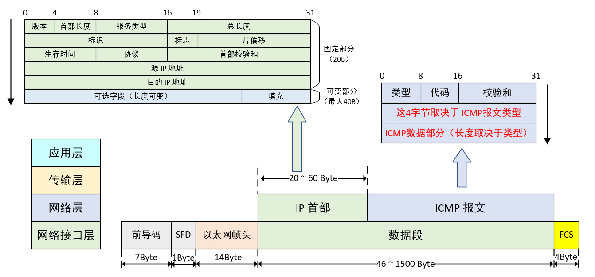

- ICMP 是 TCP/IP 协议族的一个 **IP 层子协议**，包含在 IP 数据报里，用于 IP 主机、路由器之间传递控制消息。控制消息是指网络是否连通，主机是否可达等功能。其中 **ping 功能采用回送请求和回答报文，回送请求报文类型为 0x08，回答报文类型为 0x00**

- **ICMP报文可分为两大类**
  1. 有关信息采集和配置的 ICMP 报文，称为**查询报文**（query）或者**信息类报文**(information message)
  2. 有关 IP 数据报传递的ICMP报，称为**差错报文**（error message）
- **校验和计算（校验 ICMP 首部和数据部分）** ：
  - 将校验和字段设置为0
  - 每16个bit(即2个字节)组成一个数，相加，如果超过16个bit，把超过的高位值加到这16个bit值上，得到的新值再和下一个值相加
  - **如果最后还剩8个bit值，不能简单的加到低位，要把这8个bit当成高位值，再用0填充一个16个bit值，相加**
  - 最后取反，填充到校验和字段

- **报文类型字段（Type）及代码字段（Code）含义**

| 类型TYPE | 代码CODE | 描述 Description                                             |
| -------- | -------- | ------------------------------------------------------------ |
| 0        | 0        | Echo Reply——回显应答（Ping应答）                             |
| 3        | 0        | Network Unreachable——网络不可达                              |
| 3        | 1        | Host Unreachable——主机不可达                                 |
| 3        | 2        | Protocol Unreachable——协议不可达                             |
| 3        | 3        | Port Unreachable——端口不可达                                 |
| 3        | 4        | Fragmentation needed but no frag. bit set——需要进行分片但设置不分片比特 |
| 3        | 5        | Source routing failed——源站选路失败                          |
| 3        | 6        | Destination network unknown——目的网络未知                    |
| 3        | 7        | Destination host unknown——目的主机未知                       |
| 3        | 8        | Source host isolated (obsolete)——源主机被隔离（作废不用）    |
| 3        | 9        | Destination network administratively prohibited——目的网络被强制禁止 |
| 3        | 10       | Destination host administratively prohibited——目的主机被强制禁止 |
| 3        | 11       | Network unreachable for TOS——由于服务类型TOS，网络不可达     |
| 3        | 12       | Host unreachable for TOS——由于服务类型TOS，主机不可达        |
| 3        | 13       | Communication administratively prohibited by filtering——由于过滤，通信被强制禁止 |
| 3        | 14       | Host precedence violation——主机越权                          |
| 3        | 15       | Precedence cutoff in effect——优先中止生效                    |
| 4        | 0        | Source quench——源端被关闭（基本流控制）                      |
| 5        | 0        | Redirect for network——对网络重定向                           |
| 5        | 1        | Redirect for host——对主机重定向                              |
| 5        | 2        | Redirect for TOS and network——对服务类型和网络重定向         |
| 5        | 3        | Redirect for TOS and host——对服务类型和主机重定向            |
| 8        | 0        | Echo request——回显请求（Ping请求）                           |
| 9        | 0        | Router advertisement——路由器通告                             |
| 10       | 0        | Route solicitation——路由器请求                               |
| 11       | 0        | TTL equals 0 during transit——传输期间生存时间为0             |
| 11       | 1        | TTL equals 0 during reassembly——在数据报组装期间生存时间为0  |
| 12       | 0        | IP header bad (catchall error)——坏的IP首部（包括各种差错）   |
| 12       | 1        | Required options missing——缺少必需的选项                     |
| 13       | 0        | Timestamp request (obsolete)——时间戳请求（作废不用）         |
| 14       |          | Timestamp reply (obsolete)——时间戳应答（作废不用）           |
| 15       | 0        | Information request (obsolete)——信息请求（作废不用）         |
| 16       | 0        | Information reply (obsolete)——信息应答（作废不用）           |
| 17       | 0        | Address mask request——地址掩码请求                           |
| 18       | 0        | Address mask reply——地址掩码应答                             |

#### ping 命令诊断网络故障

- **ping 命令只能检测两端口通或不通**

- PING（Packet Internet Grope），因特网包探索器，用于测试网络连接量的程序。Ping 发送一个 ICMP 回声请求消息给目的地并报告是否收到所希望的 ICMP 回声应答。

- ping指的是**端对端**连通，通常用来作为可用性的检查，但是某些病毒木马会强行大量远程执行ping命令抢占你的网络资源，导致系统变慢，网速变慢。严禁ping入侵作为大多数防火墙的一个基本功能提供给用户进行选择。

- 如果你打开IE浏览器访问网站失败，你可以通过ping命令测试到Internet的网络连通，可以为你排除网络故障提供线索，下面展示ping命令返回的信息以及分析其原因。

  - 目标主机不可到达

    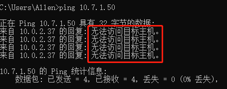

  - 目标网络不可到达

    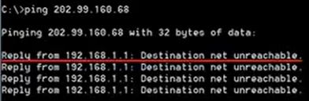

  - 请求超时

    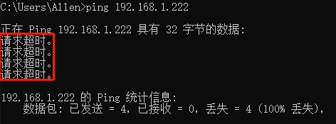

    说明丢包了

  - 通过延迟评估网络带宽

    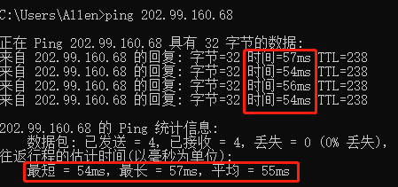

    可以看到最小延迟为54ms，最大延迟57ms，平均延迟55ms

    当 ping 本计算机网关的时候延迟小，速度快

    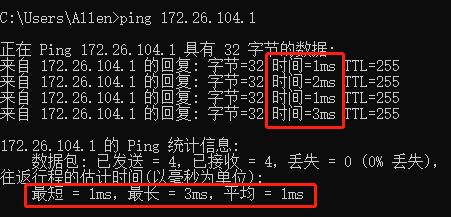

#### pathping命令跟踪数据包路径

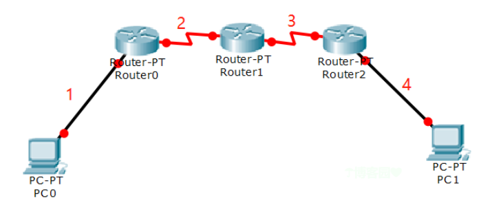

1. 当PC0 ping PC1时不通，可能是1~4处某一处或多处断了，也可能是PC1没有开机。而使用PC0 pathping PC1时，从PC0到PC1，每经过一个路由器都会通过该路由器给PC0发回一个数据包说明PC0到该路由器的路径是通的。即Router1给PC0发回一个数据包则表示1、 2通；Router2给PC0发回一个数据包表示1、 2、 3通。在网络排错中具有很强的实用意义。

2. 若 Router0 设置了进入的数据包无法追踪该路由器，PC0 pathping PC1时，数据包可以通过Router0，但是Router0不会给PC0返回一个数据包

----

输入命令

```
pathping www.bilibili.com
```

表示从本计算机访问 “www.bilibili.com” 该网站的服务器，并追踪途经的各个中转路由器

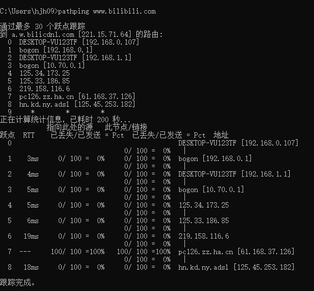

同时pathping命令还会统计通信方到每个中转路由器的丢包率，由此可以看出从哪到哪丢包严重，网络延迟大，据此可以优化网络。

> 相同类型的有trace route命令，该命令较为简略不会统计丢包率

### IGMP 报文


# 硬件接口

常见的以太网接口类型有RJ45接口（电脑网口）、RJ11接口（电话线）、SC光纤接口等。其中RJ45接口是我们常见的网络设备接口，其采用差分传输方式，具有传输速率快、抗干扰、传输距离远等优点。

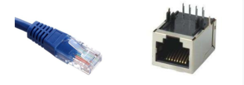

RJ45接口定义以及各引脚功能说明如下图所示，在以太网中只使用了1、2、3、6这四根线，其中1、2这组负责传输数据（TX+、TX-），而3、6这组负责接收数据（RX+、RX-），另外四根线是备用的。

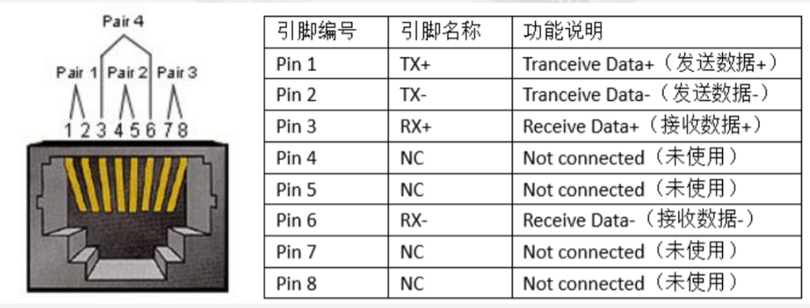
