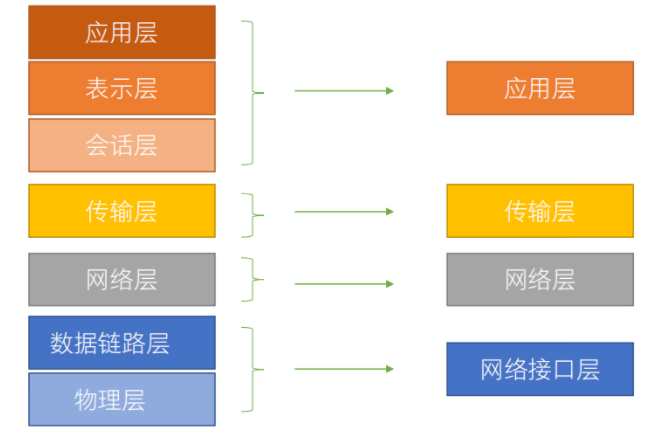
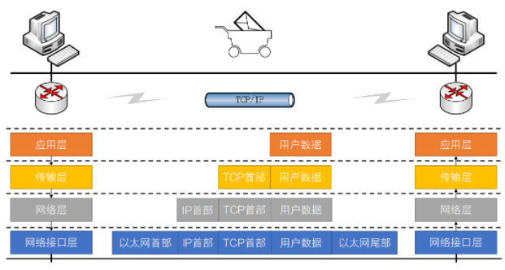
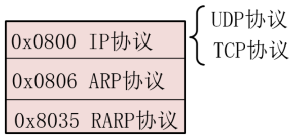
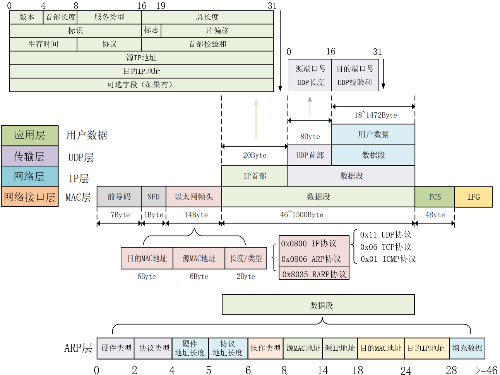
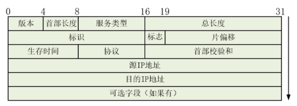

# 以太网（1）网络基础知识

- author：hongjh
- time：20220125
- version:

---------

[toc]

计算机网络是指将地理位置不同的具有独立功能的多台计算机及其外部设备，通过通信线路连接起来，在网络操作系统、网络管理软件及网络通信协议的管理和协调下，实现资源共享和信息传递的计算机系统。计算机网络类型的划分标准各种各样，按网络所覆盖的地理范围的不同，计算机网络可分为局域网(LAN)、 城域网(MAN)、广域网(WAN)、互联网(Initernet)。局域网按传输介质所使用的访问控制方法可分为：以太网(Ethernet)、光纤分布式数据接口(FDDI)、异步传输模式(ATM)、令牌环网(Token Ring)、交换网(Switching) 等，它们在拓朴结构、传输介质、传输速率、数据格式等多方面都有许多不同，其中应用最广泛的当属以太网。

以太网是为了实现局域网通信而设计的一种技术，它规定了包括物理层的连线、电子信号和介质访问层协议的内容。以太网根据最大传输速率的不同可以分为标准的以太网(10Mbit/s)、快速以太网(100Mbit/s)、千兆以太网 (1000Mbit/s)和万兆以太网(10Gbit/s)。百兆网和千兆网是目前应用最多的，顾名思义，百兆网的最大传输速率为 100Mbit/s，需要注意的是，我们常见的网速的单位是 MByte/s，而 1Byte 为 8bit，所以百兆网能达到的最大网速为 12.5MByte/s。同理，千兆网的最大传输速率为 1000Mbit/s，能达到的最大网速为 125MByte/s。

## 一、计算机网络体系结构模型

国际标准化组织(ISO)在 1978 年提出了“开放系统互联参考模型”，即著名的 OSI/RM 模型(Open System  Interconnection/Reference Model)。它将计算机网络体系结构的通信协议划分为七层，自下而上依次为：物理层(Physics Layer)、数据链路层(Data Link Layer)、网络层(Network Layer)、传输层(Transport Layer)、会话层(Session Layer)、表示层(Presentation Layer)、应用层 (Application Layer)。下面 4 层主要提供数据传输和交换功能，即以节点到节点之间的通信为主；第 4 层作为上下两部分的桥梁，是整个网络体系结构中最关键的部分；上 3 层则以提供用户与应用程序之间的信息和数据处理功能为主。

除了标准的 OSI 七层模型以外，常见的网络层次划分还有 TCP/IP 四层协议，它们之间的对应关系如图所示：



不管是 OSI 七层模型还是 TCP/IP 的四层模型，它们每一层中都有自己的专属协议，需要完成相应的工作以及与上下层级之间进行沟通。由于目前 TCP/IP 协议已经成为 Internet 中的【通用语言】，任何和互联网有关的操作都离不开 TCP/IP 协议，没有它我们就根本不可能上网，所以下面就以 TCP/IP 协议为主来进行讲解。

- **应用层**：为操作系统或网络应用程序提供访问网络服务的接口，主要协议有文件传输协议(FTP)，超文本传输协议(HTTP)，简单邮件传输协议(SMTP)，远程登录(Telnet)；
- **传输层**：为两台主机上的应用程序提供端到端的通信，在 TCP/IP 协议簇中，有两个不同的传输协议：TCP(传输控制协议)和 UDP(用户数据报协议)，它们分别承载不同的应用。TCP 协议是一种面向连接的传输，能够提供可靠的字节流传输服务，UDP 协议是一种简单的面向数据报的传输层协议，与 TCP 协议不同的是 UDP 无法保证数据报文准确达到目的地。
- **网络层**：负责提供基本的数据封包传送功能，让每个据包都能够到达目的主机，主要协议有 IP 协议(网际协议)、ICMP 协议(Internet 互连网控制报文协议)、ARP/RARP (地址解析/反向地址解析协议)以及 IGMP 协议(Internet 组管理协议)。
- **网络接口层**：通常包括操作系统中的设备驱动程序和计算机中对应的网络接口卡，它们一起处理与电缆的物理接口细节，主要协议有：以太网、令牌环、帧中继等；



从该图中可以看出，当主机 A 向主机 B 发送数据时，用户数据将由应用层产生；当用户数据在经过传输层时，传输层对用户数据进行封装，在用户数据的基础上添加了一个 TCP/UDP 首部数据，此时数据包变成了 TCP/UDP 段；当它经过网络层时，网络层对 TCP/UDP 段进行封装，在 TCP/UDP 段的基础上添加了一个 IP 首部数据，此时 TCP/UDP 段变成了 IP 数据报；当 它经过网络接口层时，网络接口层对 IP 数据报进行封装，在 IP 数据报的基础上添加了以太网首部数据和以太网尾部（一般为 4byte CRC校验值）两个数据，此时 IP 数据报变成了以太网帧。由此可以看出，数据经过层层封装成帧后发到传输介质上，到达目的主机后每层协议再剥掉相应的首部数据，最后将应用层数据交给主机 B 处理。

# 二、以太网帧结构

以太网类型有很多种，如下所示：



TCP协议比较难设计，这里仅说明 IP 协议的 UDP协议，顺便说一下简单的 ARP协议。如下图所示（单击图片可放大），上半部分为 IP - UDP 协议，下半部分为 ARP 协议，一图说明所有。



## 1、前导码（Preamble）

为了实现底层数据的正确阐述，物理层使用7个字节同步码（7个55），二进制表现为 0 和 1 交替，其作用是==使发送方和接收方的时钟同步==。

## 2、帧起始界定符（SFD，Start Frame Delimiter）

使用1个字节的SFD（0xd5），二进制表现为“10101011”，==用来表示一帧的开始==，即后面紧跟着传输的就是以太网的帧头。

## 3、以太网帧头

### （1）目的MAC地址

即接收端物理MAC地址，占用6个字节。MAC地址从应用上可分为单播地址、组播地址和广播地址。单播地址：第一个字节的最低位为0，比如00-00-00-11-11-11，一般用于标志唯一的设备；组播地址：第一个字节的最低位为1，比如01-00-00-11-11-11，一般用于标志同属一组的多个设备；广播地址：所有48bit全为1，即FF-FF-FF-FF-FF-FF，它用于标志同一网段中的所有设备。

### （2）源MAC地址

即发送端物理MAC地址，占用6个字节。

### （3）长度/类型

长度/类型具有两个意义，当这两个字节的值**小于1536**（十六进制为0x0600）时，代表该以太网中数据段的长度；如果这两个字节的值**大于1536**，则表示该以太网中的数据属于哪个上层协议，例如0x0800代表IP协议（网际协议）、0x0806代表ARP协议（地址解析协议）等。

## 4、数据段

长度最小46个字节，最大1500个字节。

长度最小46个字节，总的以太网帧长度最小为 64 个字节，其原因是因为以太网是不可靠的，这意味着它并不知道对方有没有收到自己发出的数据包，但如果他发出的数据包发生错误，需要进行重传。以太网的错误主要是发生碰撞，碰撞是指两台机器同时监听到网络是空闲的，同时发送数据就会发生碰撞，碰撞对于以太网来说是正常的。要保证以太网的重传，必须保证收到碰撞信号的时候数据包没有传完，要实现这一要求，发送方和接收方之间的距离很关键，也就是说信号在发送方和接收方之间传输的来回时间必须控制在一定范围之内。IEEE 定义了这个标准，一个碰撞域内最 远的两台机器之间的 round-trip time 要小于 512 bit time(传输一个比特需要的时间)，这也是我们常说的一个碰撞域的直径。512 个 bit time 也就是 64 字节的传输时间，如果以太网数据包 ≥ 64 个字节就能保证碰撞信号到达发送方的时候，数据包还没有传完。最小数据帧的设计和以太网电缆长度有关，为的是让两个相距最远的站点能够感知到双方的数据发生了碰撞，最远两端数据的往返时间就是争用期，以太网的争用期是 51.2 us，正好发送 64byte 数据。

最大值1500称为以太网的最大传输单元（MTU，Maximum Transmission Unit），之所以限制最大传输单元是因为在多个计算机的数据帧排队等待传输时，如果某个数据帧太大的话，那么其它数据帧等待的时间就会加长，导致体验变差。另外还要考虑网络I/O控制器缓存区资源以及网络最大的承载能力等因素，因此最大传输单元是由各种综合因素决定的。为了避免增加额外的配置，通常以太网的有效数据字段小于1500个字节，现在电脑的配置都很高了，很多都支持巨型帧，巨型帧可以超过 1500 个字节。

不同的协议，数据段的组成结构不同，后面再详细说明。

## 5、帧检验序列（FCS，Frame Check Sequence）

为了确保数据的正确传输，在数据的尾部加入了4个字节的循环冗余校验码（CRC校验）来检测数据是否传输错误。CRC数据校验从以太网帧头开始即不包含前导码和帧起始界定符。通用的CRC标准有CRC-8、CRC-16、CRC-32、CRC-CCIT，其中在网络通信系统中应用最广泛的是CRC-32标准。

## 6、帧间隙（IFG，Interpacket Gap）

　帧间隙的时间就是网络设备和组件在接收一帧之后，需要短暂的时间来恢复并为接收下一帧做准备的时间，**IFG的最小值是96 bit time**，即在媒介中发送96位原始数据所需要的时间，在不同媒介中IFG的最小值是不一样的。不管10M/100M/1000M的以太网，两帧之间最少要有96bit time，IFG的最少间隔时间计算方法如下：

- 10Mbit/s最小时间为：96*100ns = 9600ns；
- 100Mbit/s最小时间为：96*10ns = 960ns；
- 1000Mbit/s最小时间为：96*1ns = 96ns；

# 三、ARP协议

## 1、ARP作用


## 2、ARP字段

# 四、IP协议和UDP协议

当【以太网帧头】的【长度/类型】为 0x0800 时，表明这是 IP 包，【IP 首部】的协议为 17（0x11）时，表明这是 UDP协议。

## 1、IP首部



IP协议是TCP/IP协议簇中的核心协议，也是TCP/IP协议的载体，IP协议规定了数据传输时的基本单元和格式。IP协议内容由IP首部和数据字段组成。所有的TCP、UDP及ICMP数据都以IP数据报格式传输，如果发送某种错误，IP 会丢失该数据，然后发送 ICMP 消息给信源端。另外 IP 数据报可以不按发送顺序接收。前20个字节（前4行）和紧跟其后的可选字段（最后1行）是IP数据报的首部，前20个字节（前4行）是固定的，后面可选字段是可有可无的。

- **版本**：4位IP版本号（Version），这个值设置为二进制的0100时表示IPv4，设置为0110时表示IPv6，目前使用比较多的IP协议版本号是4。
- **首部长度**：4位首部长度（IHL，Internet Header Length），表示IP首部一共有多少个32位（4个字节）。在没有可选字段时，IP首部长度为20个字节，因此首部长度的值为5。
- **服务类型**：8位服务类型（TOS，Type of service），该字段被划分成两个子字段：3位优先级字段（现在已经基本忽略掉了）和4位TOS字段，最后一位固定为0。服务类型为0时表示一般服务。
- **总长度**：16位IP数据报总长度（Total Length），包括IP首部和IP数据部分，以字节为单位。我们利用IP首部长度和IP数据报总长度，就可以知道IP数据报中数据内容的起始位置和长度。由于该字段长16bit，所以IP数据报最长可达65535字节。尽管理论上可以传输长达65535字节的IP数据报，但实际上还要考虑网络的最大承载能力等因素。
- **标识字段**：16位标识（Identification）字段，用来标识主机发送的每一份数据报。通常每发送一份报文它的值就会加1。
- **标志字段**：3位标志（Flags）字段，第1位为保留位；第2位表示禁止分片（1表示不分片，0表示允许分片）；第3位标识更多分片（除了数据报的最后一个分片外，其它分片都为1）。片偏移：13位片偏移（Fragment Offset），在接收方进行数据报重组时用来标识分片的顺序。可以全部设置为0。
- **片偏移**：13位片偏移字段，较长的分组在分片后,某片在原分组中的相对位置,，就是说相对用户数据字段的起点，该片从何处开始。片偏移以 8 个字节为偏移单位，也就是说每个分片的长度一定是 8 字节的整数倍。
- **生存时间**：8位生存时间字段TTL（Time To Live），设置了数据报可以经过的最多路由器数，表示数据报在网络上生存多久。TTL的初始值由源主机设置，一般为32、64或者128，一旦经过一个路由器，它的值就减 1，减到 0 时，数据报就丢弃，并发送 ICMP 消息通知源主机。==TTL防止丢失的数据包在无休止的传播。==
- **协议**：8位协议（Protocol）类型，表示此数据报所携带上层数据使用的协议类型，ICMP为01，TCP为06，UDP为17，当然还有很多别的协议类型。
- **首部校验和**：16位首部校验和（Header Checksum），该字段只校验数据报的首部，不包含数据部分；校验IP数据报头部是否被破坏、篡改和丢失等。
- **源IP地址**：32位源IP地址（Source Address），即发送端的IP地址，如192.168.1.123。
- **目的IP地址**：32位目的IP地址（Destination Address），即接收端的IP地址，如192.168.1.102。
- **可选字段**：是数据报中的一个可变长度的可选信息，选项字段以32bit为界，不足时插入值为0的填充字节，保证IP首部始终是32bit的整数倍，没有的话长度可以为 0 。

　　IP首部校验和的计算方法：

```
1、将16位检验和字段置为0，然后将IP首部按照16位分成多个单元；
2、对各个单元采用反码加法运算（即高位溢出位会加到低位，通常的补码运算是直接丢掉溢出的高位）；
3、此时仍然可能出现进位的情况，将得到的和再次分成高16位和低16位进行累加；
4、最后将得到的和的反码填入校验和字段。
```

## 2、UDP首部

