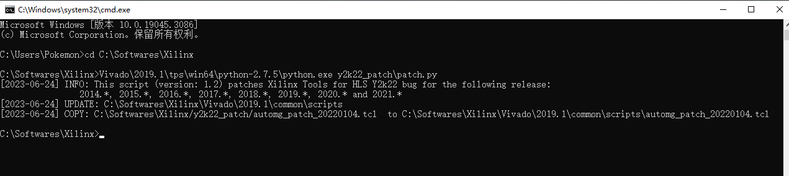
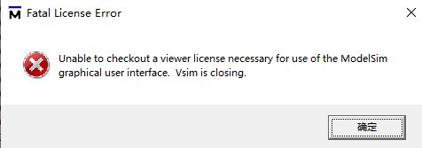
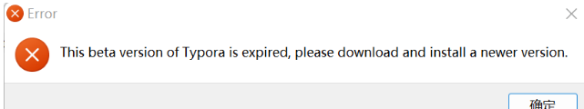
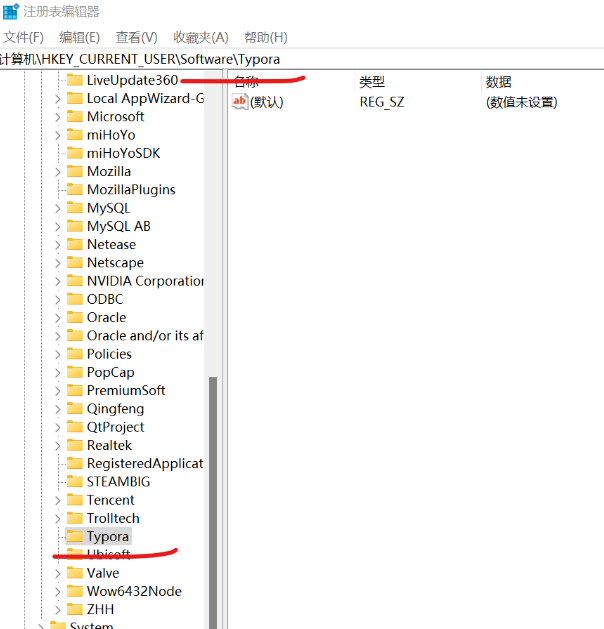
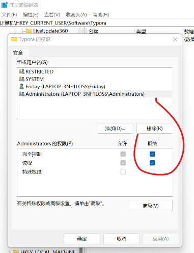

- Author：hongjh
- Time：20230624
- Version:

---------

[toc]

# TCL

## 1. extra characters after close-brace

**原因** ： }{  紧挨在一起了

## 2. extra characters after close-quote

**原因** ：记得用空格

# Vivado

## 1. ERROR: add_1 must be in range [-1, DEPTH-1]

仿真FIR IP时出现问题，原因是IP核复位端口没有连接，导致IP输入信号没有初始值

## 2. 仿真 TPG IP 时报错 xx is not define

- **原因** ： Vivado 软件版本问题，2022 以下版本需要打补丁

- **补丁链接** ：在 github 仓库 FPGA_NOTES 下

- **补丁流程** ：

  1. 下载补丁包 y2k22_patch-1.2.zip
  2. 解压补丁包到vivado安装Q根目录下。比如我的vivado安装根目录为D:Xilinx，因此解压后文件的路径为：D:Xilinxly2k22_patch。（注意不要更改文件名和路径）
  3. 打开命令提示符cmd工具，将cmd的工作路径调整为D:\Xilinx
  4. 根据y2k22_patch-1.2.zip中的readme文件，安装vivado不同版本，需要输入不同cmd命令。比如我的vivado版本为2021.1，因此我输入的命令为Vivado2021.1tpslwin64python-3.8.3lpython.exe y2k22-patchlpatch.py（patch.py为python语言编写的补丁替换安装工具）
  5. 回车，得到如下数据反馈，标志补丁包安装成功

  

## 3. Vivado2018.3 MIG 7 series IP核导致闪退

- **方法** ：project.srcs/sources_1/bd/design_1/ip/mig_7series_0_0下的mig_a.prj，删除开头的乱码"x？"，问题即可解决。

# Modelsim

## Fatal License Error

- **原因** ：被远程的电脑不能进行 modelsim 仿真，会报如下错误

- **方法** ：远程的时候不要使用 modelsim 仿真，可以使用 Vivado 自带仿真，虽然速度慢些

# ISE

## IMPACT添加flash的时候直接闪退

1. 在ISE的安装目录下找到如下路 D:\Xilinx\14.7\ISE_DS\ISE\lib\nt64，在此目录下找到libPortability.dll 文件，将它后缀名修改为 libPortability.dll.orig；其次，在相同目录下找到libPortabilityNOSH.dll，将它在此目录下直接进行复制，可以得到libPortabilityNOSH_副本.dll文件，将此副本文件修改名称为libPortability.dll，因此在此目录下就会新得到一个libPortability.dll 文件。

2. 在ISE的安装目录下找到如下路 D:\Xilinx\14.7\ISE_DS\common\lib\nt64，将步骤1中，在最后新得到的libPortability.dll 文件进行复制，复制到步骤2中的目录下，进行直接文件覆盖（替换）

## IMPACT烧录时出现 ID CHECK失败的问题

在项目中会遇到使用国微的flash，在烧录过程中出现id check失败的问题，解决方式如下：

1. 右击计算机属性，进入高级系统设置，进入系统属性，选择高级中的环境变量

2. 新建环境变量，变量名为XIL_IMPACT_SKIPIDCODECHECK,变量名设置为1

3. 确定后重启电脑

补充：

再调试过程中使用国微的256mFLASH搭配复旦微k7芯片，出现烧写mcs，报错：device has ecceeded the allocated time，然后烧写mcs失败。出现上述原因是因为fpga芯片不稳定，flash虽然烧写的是mcs文件，但是在烧写过程中，会用bit文件与fpga进行类似握手操作，建立链接；解决方式：1、如果工程中由多重配置image功能，去掉多重配置功能。2、用impact烧写bit文件，成功后，擦除flash，然后再烧写。使用上述两个步骤，基本就可解决国产芯片烧写失败的问题。3 、如果还是时断时续的有错误，flash可能出现了虚焊。

# Typora 旧版本不能使用

- **方法** ：

  1. 打开注册表

     cmd –> regedit

  2. 修改Typora权限

     计算机\HKEY_CURRENT_USER\Software\Typora

     

  3. 右键Typora选择权限打开，组或用户名选择Administrators 然后选择拒绝

     

  4. 再次打开Typora即可正常打开
