# 数字电路基础

- author：hongjh
- time：20211012
- version: 0.1

---------

[toc]

-------------

# 1. 数字逻辑概论

## 1.1 数字信号与数字电路

### 1.1.1 概念

用数字信号完成对数字量进行算术运算和逻辑运算的电路称为数字电路或数字系统。由于它具有逻辑运算和逻辑处理功能，所以又称数字逻辑电路。

### 1.1.2 发展历史

- 1948年，贝尔实验室制成第一只晶体管（Wllliam Shockley）
- 1958年，集成电路（Jack Kilby）
- 1969年，大规模集成电路
- 1975年，超大规模集成电路

### 1.1.3 分类

- 有无集成元器件
  - 分立元器件数字电路：晶体管（二极管、三极管、MOS管）
  - 集成数字电路：编码器、锁存器、译码器、CPU、AD/DA等
- 功能
  - 组合逻辑电路
    - 组成：由最基本的逻辑门电路组合而成
    - 特点：输出值只与当时的输入值有关，即输出惟一地由当时的输入值决定。
    - 举例：3-8译码器
  - 时序逻辑电路
    - 组成：由最基本的逻辑门电路加上反馈逻辑回路（输出到输入）或器件组合而成的电路，与组合电路最本质的区别在于时序电路具有记忆功能。
    - 特点：输出不仅取决于当时的输入值，而且还与电路过去的状态有关。
- 集成电路的集成度
  - 小规模集成数字电路（SSI）（Small-Scale Integration）
  - 中规模集成数字电路（MSI）（Middle-Scale Integration）
  - 大规模集成数字电路（LSI）（Large-Scale Integration）
  - 超大规模集成数字电路（VLSI）（Very-Large-Scale Integration）
- 半导体器件
  - 双极性数字电路：由三极管组成
  - 单极性数字电路：由MOS管组成

### 1.1.4 优点

- 稳定性好，可靠性高
- 可长期存储
- 便于计算机处理
- 便于高度集成化

### 1.1.5 数电与模电的区别

- **工作任务不同**

  - 模电研究的输出与输入信号的大小、相位、失真等的关系
  - 数字电路主要研究的是输出与输入间的逻辑关系

- **三极管的工作状态不同**

  - 模电主要工作在放大区
  - 数字电路中的三极管工作在饱和或截止状态，起开关作用

  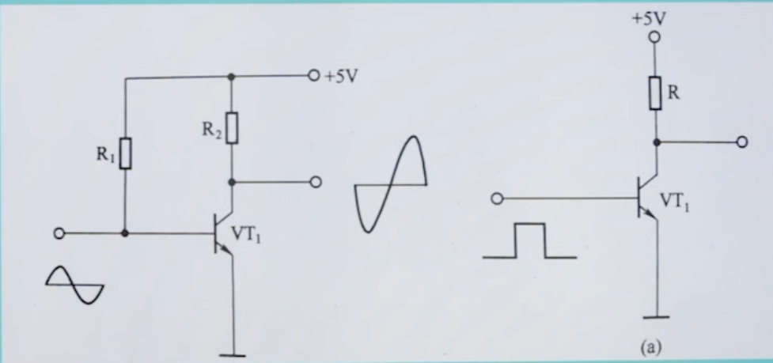

- **模拟信号与数字信号**

  - 数字信号是离散（不连续）的，而模拟信号是连续的；
  - 数字信号只有“0”和“1”两种状态，而模拟信号可以是任意数值状态；
  - 模拟信号是用一系列连续变化的电磁波或电压信号来表示，而数字信号是用一系列断续变化的电压脉冲或光脉冲来表示。

  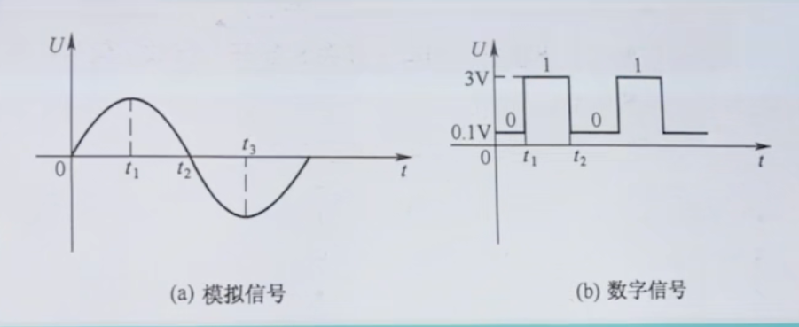

## 1.2 数制

- **概述**：数字电路所处理的各种数字信号都是以数码（一种符号）形式给出的，用数码表示数量的大小时采用的各种计数进位制规则称为数制

- **进位制**：多位数码每一位的构成以及从低位到高位的进位规则

- **基数**：数制所使用数码的个数

- **位权**：在某一进位制的数中，每一位的大小都对应着该位上的数码乘上一个固定的数，这个固定的数就是这一位的权数，权数是一个寡

- **常用的进制**

  - 十进制（Decimal）
  - 二进制（Binary）
  - 八进制（Octal）
  - 十六进制（Hexadecimal）

  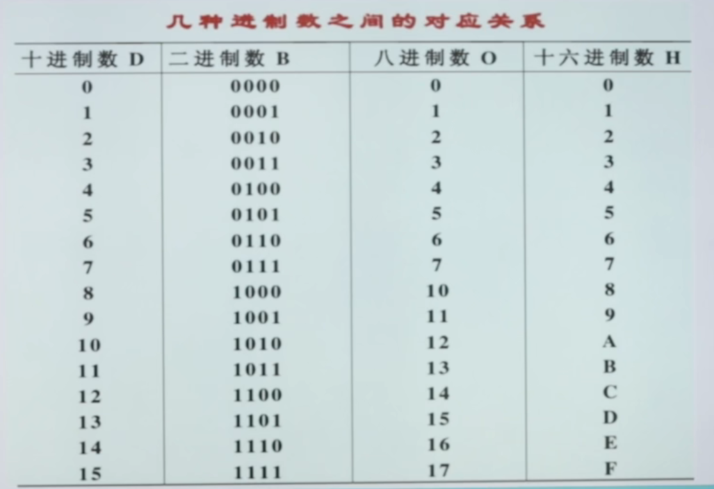

- **二进制的算术运算**

  当两个二进制数码表示两个数量大小时，他们之间可以进行数值运算，这种运算称为算术运算

  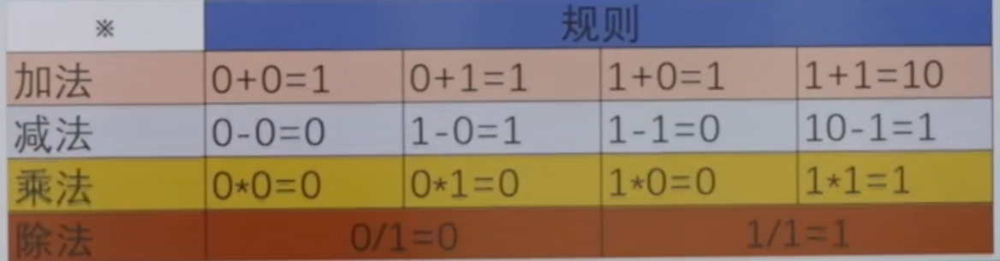

## 1.3 编码（二进制编码）

### 1.3.1 概念

用二进制数表示各种数字或符号的过程称为编码。

### 1.3.2 原码、反码和补码

- 原码：最高位是符号位，0代表正数，1代表负数，非符号位为该数字绝对值的二进制。
- 反码：正数的反码与原码一致，负数的反码是对原码按位取反，只是最高位（符号位）不变。
- 补码：正数的补码与原码一致，负数的补码是对原码按位取反加1，符号位不变。

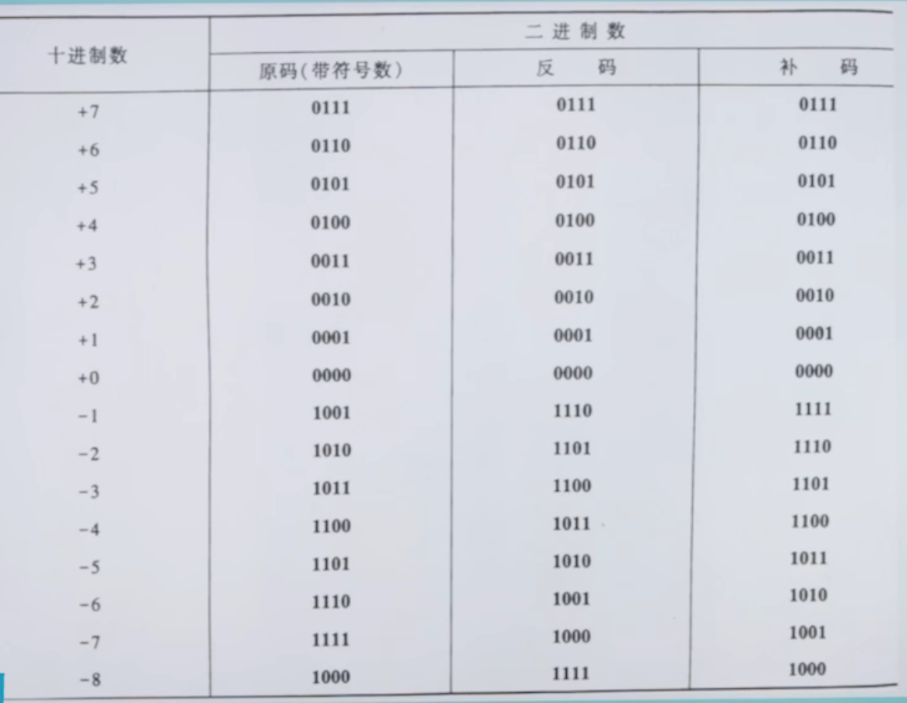

### 1.3.3 常见编码（2421BCD，5421BCD和8421BCD码、余3码）

- 余3码：在8421BCD码基础上加 3 得到

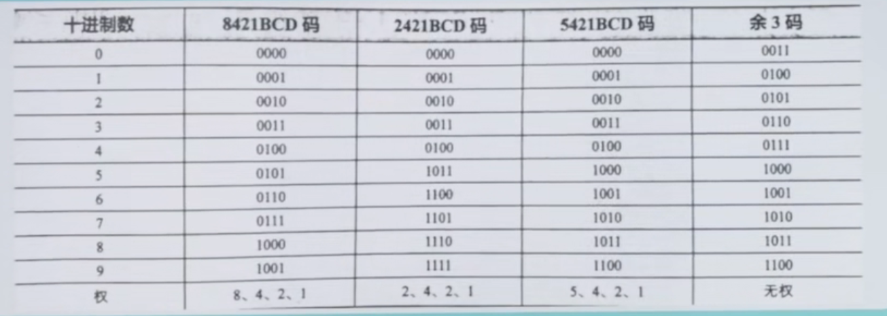

### 1.3.4 格雷码（Gray Code）

- 概念：两个相邻代码之间仅有1位数码不同的无权码

- 优点：功耗低、变化快、出错的几率小

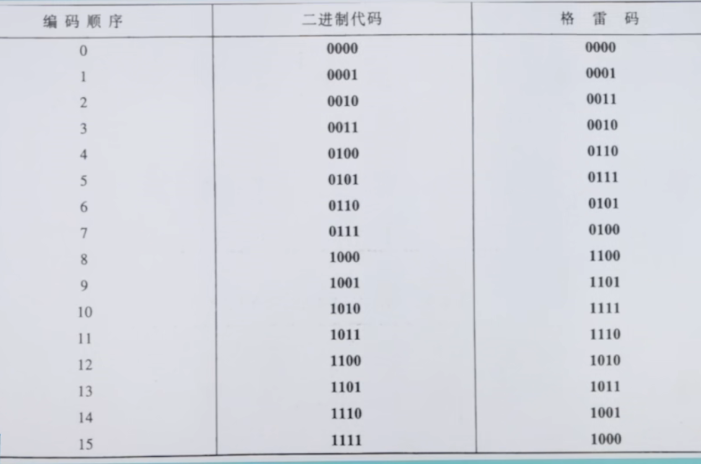

### 1.3.5 奇偶校验码

- 奇校验：一组二进制代码的数位中 ‘1‘ 的个数为奇数，校验位为0；偶数为1
- 偶校验：一组二进制代码的数位中 ‘1‘ 的个数为偶数，校验位为0；偶数为1

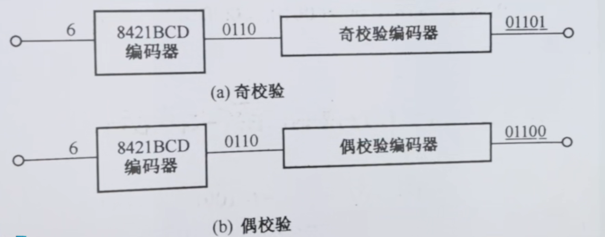

## 1.4 逻辑函数及其表示方法

- **逻辑变量**：输入逻辑变量和输出逻辑变量。
- **逻辑函数**：描述输入逻辑变量和输出逻辑变量之间的因果关系。由于逻辑变量是只取0或1的二值逻辑变量，因此逻辑函数也是二值逻辑函数。
- **逻辑函数的表示方法**：
  - **真值表**：将输入变量所有可能的取值与相应的函数值列成表格，就得到真值表。
  - **逻辑表达式**：逻辑表达式是用与、或、非等运算组合起来，表示逻辑函数与逻辑变量之间关系的逻辑代数式。
  - **逻辑图**：用与、或、非等逻辑符号表示逻辑函数中各变量之间的逻辑关系所得到的图形称为逻辑图。
  - **波形图**：对输入变量随时间变化的每一种取值，求出相应的输出值。并将输入和输出关系按时间顺序依次排列得到的图形，称为波形图。

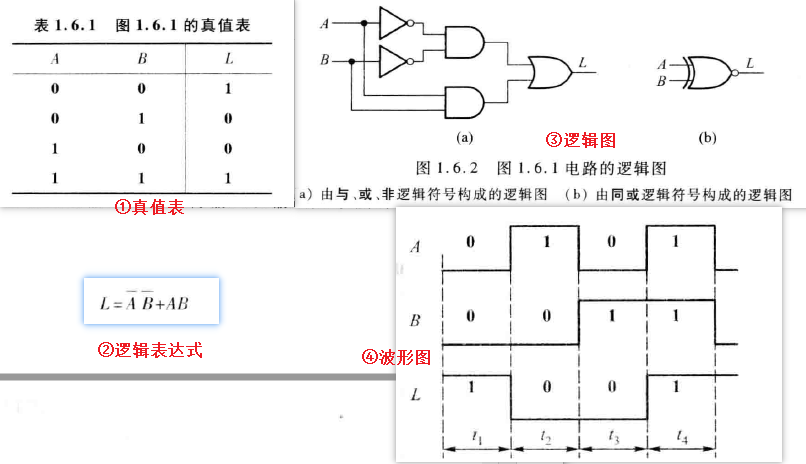

# 2. 逻辑代数

逻辑代数的基本运算规律

逻辑代数的基本定理

逻辑函数的描述方法

逻辑函数描述方法间的转换

逻辑函数的公式化简法

逻辑函数的两种标准形式

卡诺图化简法

# 3. 逻辑门电路

## 3.1 逻辑门电路简介

### 3.1.1 基本门电路（与或非）

- **概念**：用以实现基本逻辑和复合逻辑运算的单元电路称为门电路，或逻辑门
- **正逻辑**：用高电平表示逻辑1，用低电平表示逻辑0
- **负逻辑**：用低电平表示逻辑1，用高电平表示逻辑0
- **与（AND）符号**：“·”，Y=A·B

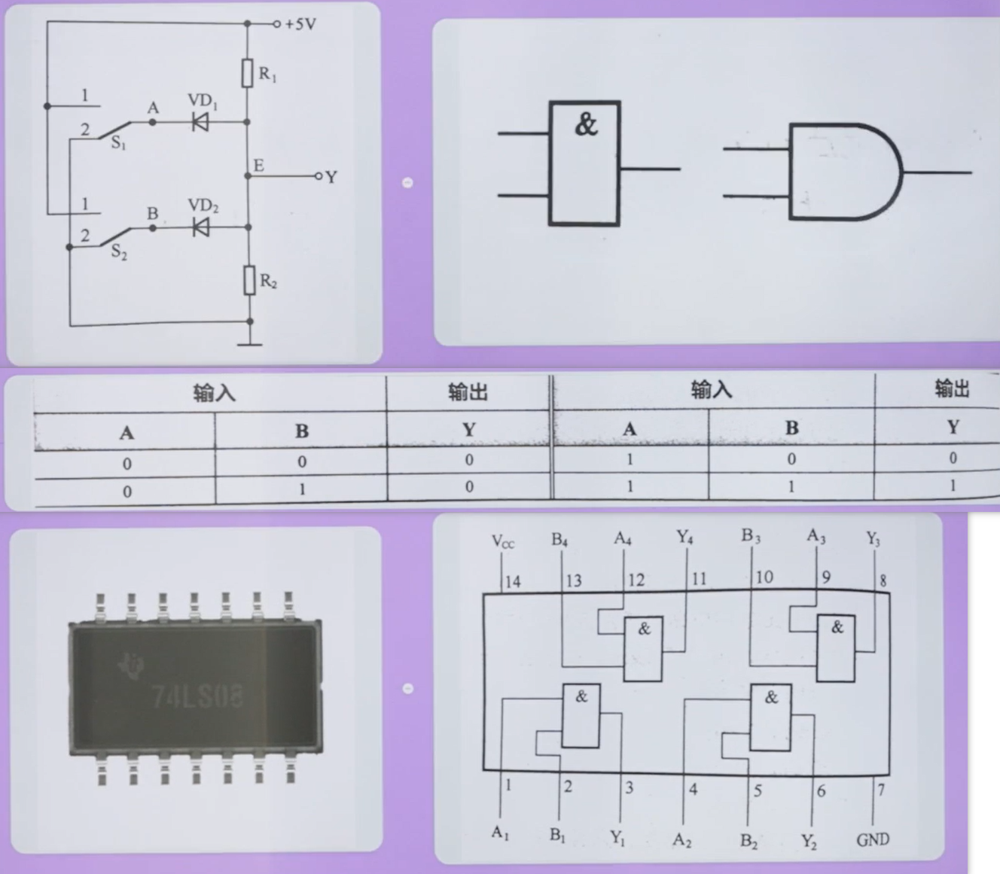

- 或（OR）符号：”+”，Y=A+B

  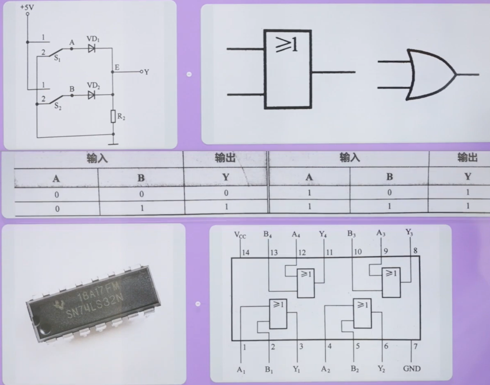

- 非（NOT）符号：“ ‘ 或 ^—^ ”，Y=A’

  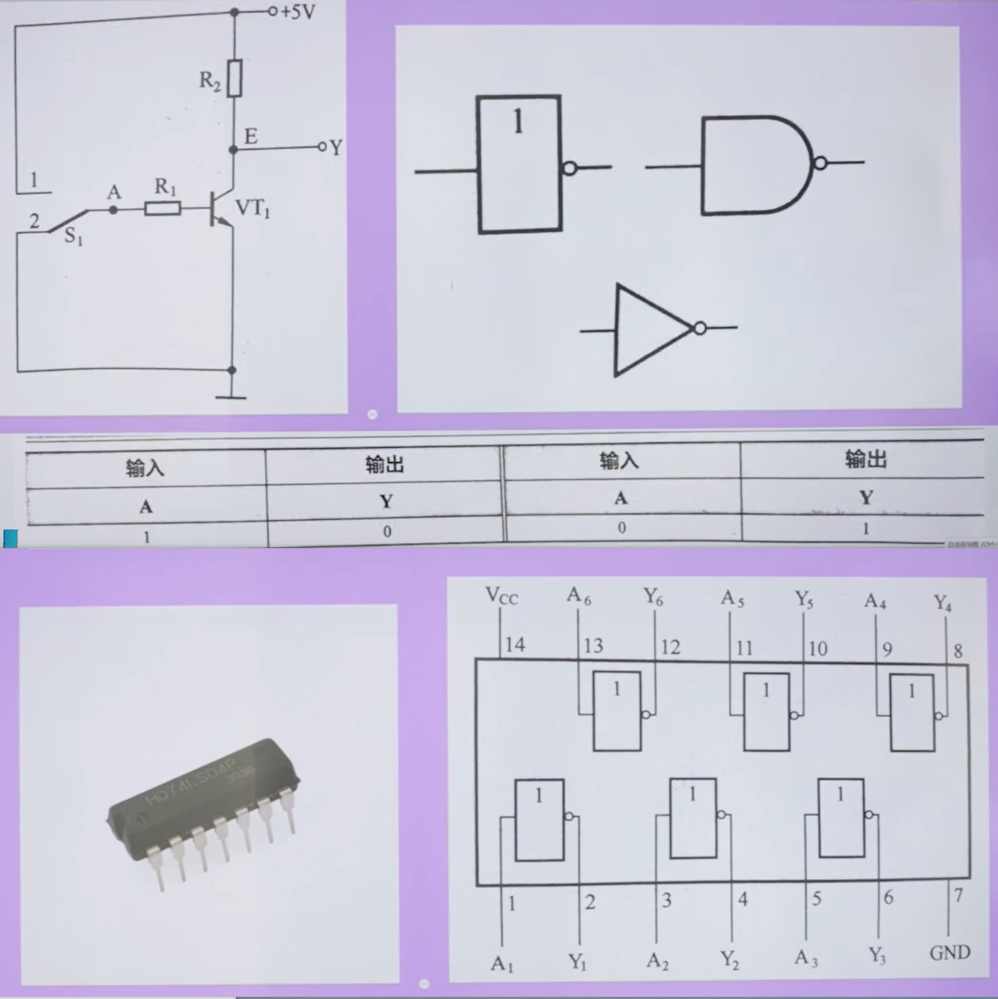

### 3.1.2 复合门电路

  复合门电路又称组合门电路，由基本门电路组合而成（与非门、或非门、与或非门、异或门、同或门）。

- 与非门

  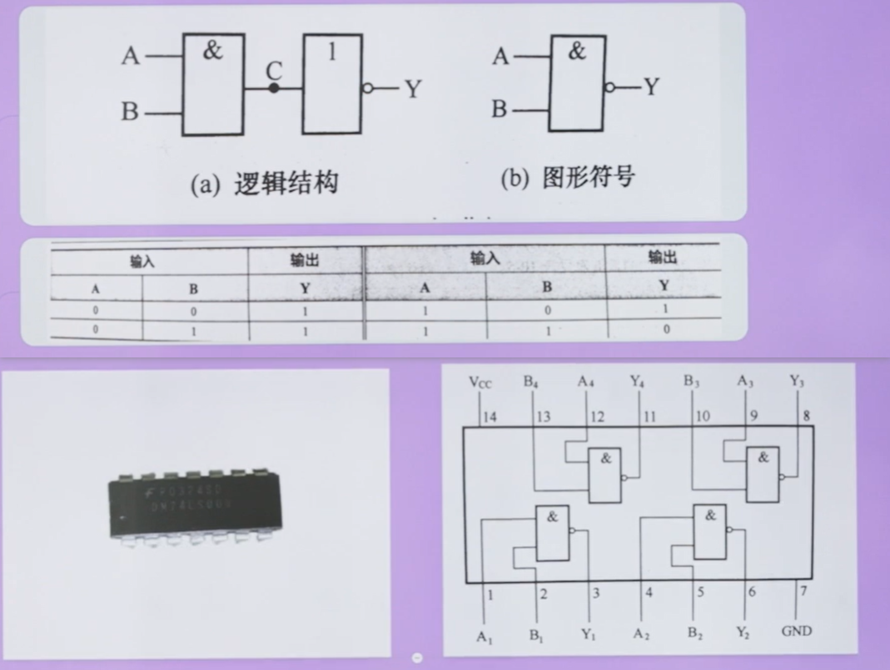

- 或非门 

  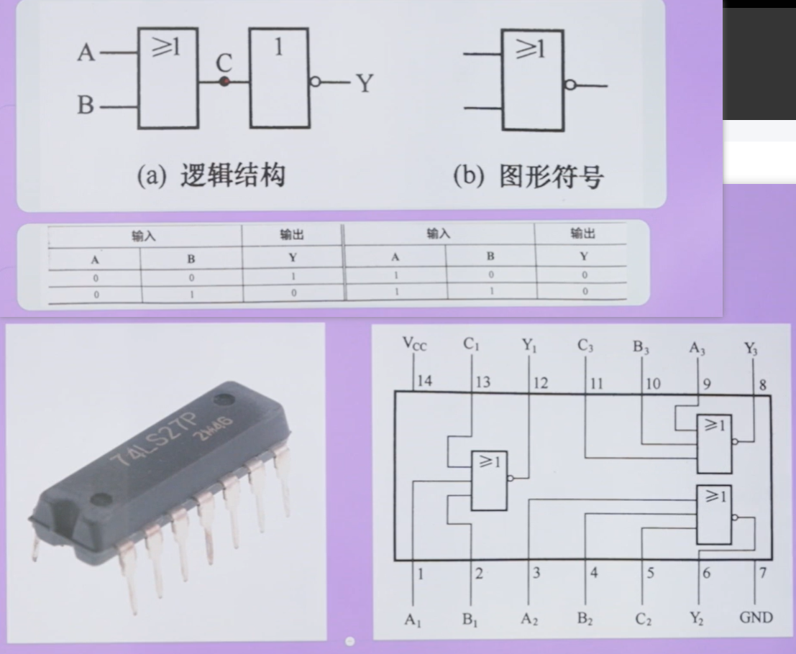

- 与或非门

  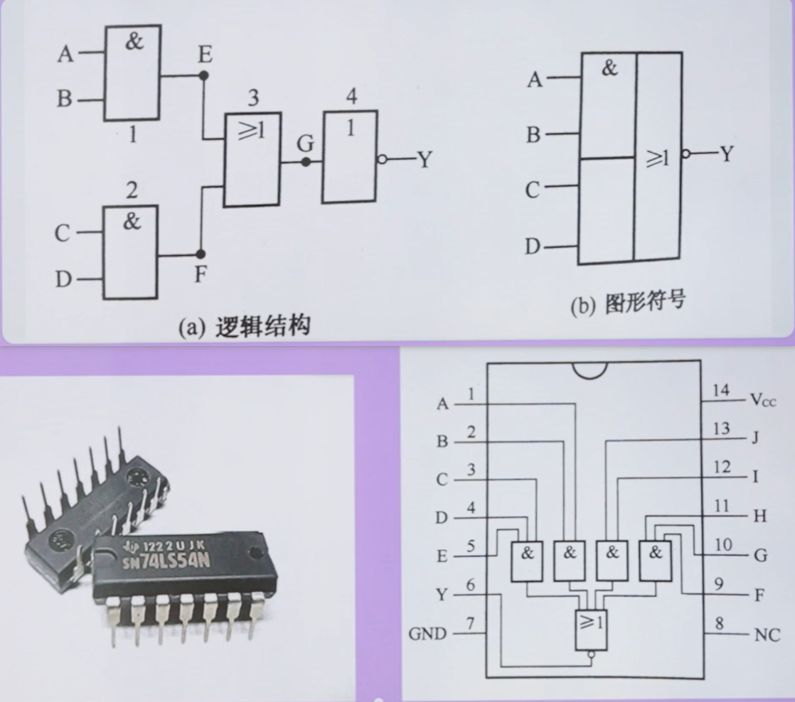

- 异或门

  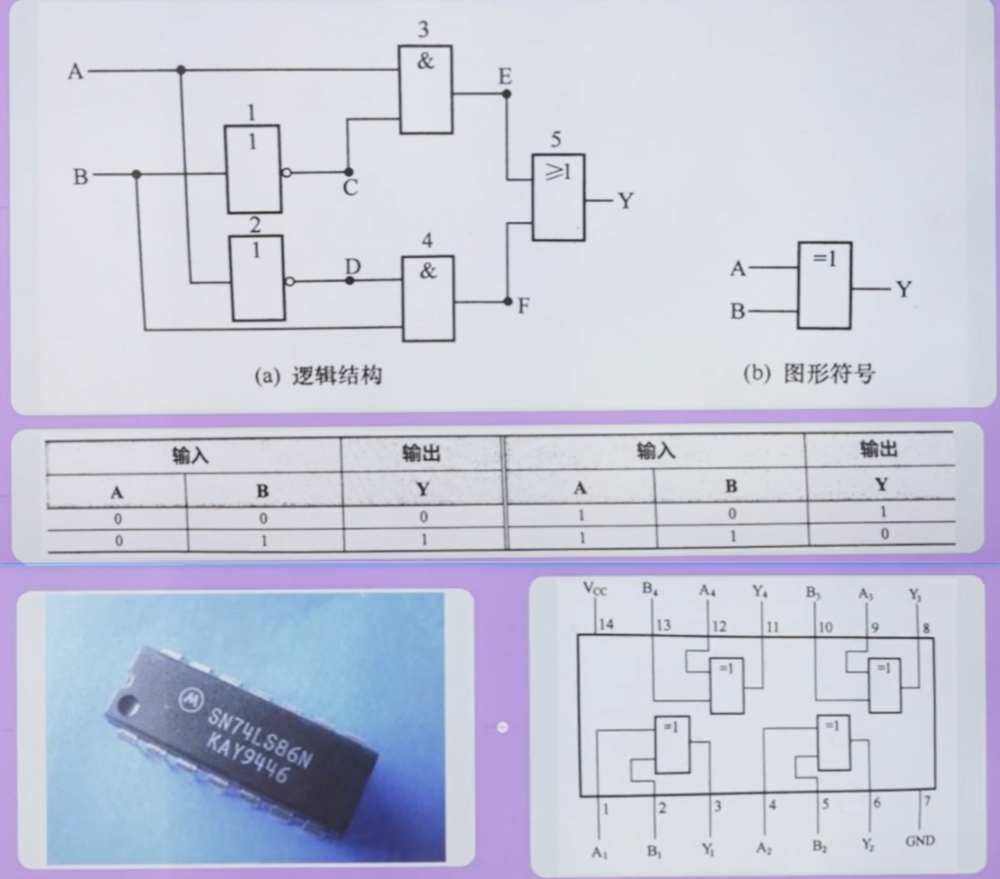

- 同或门

  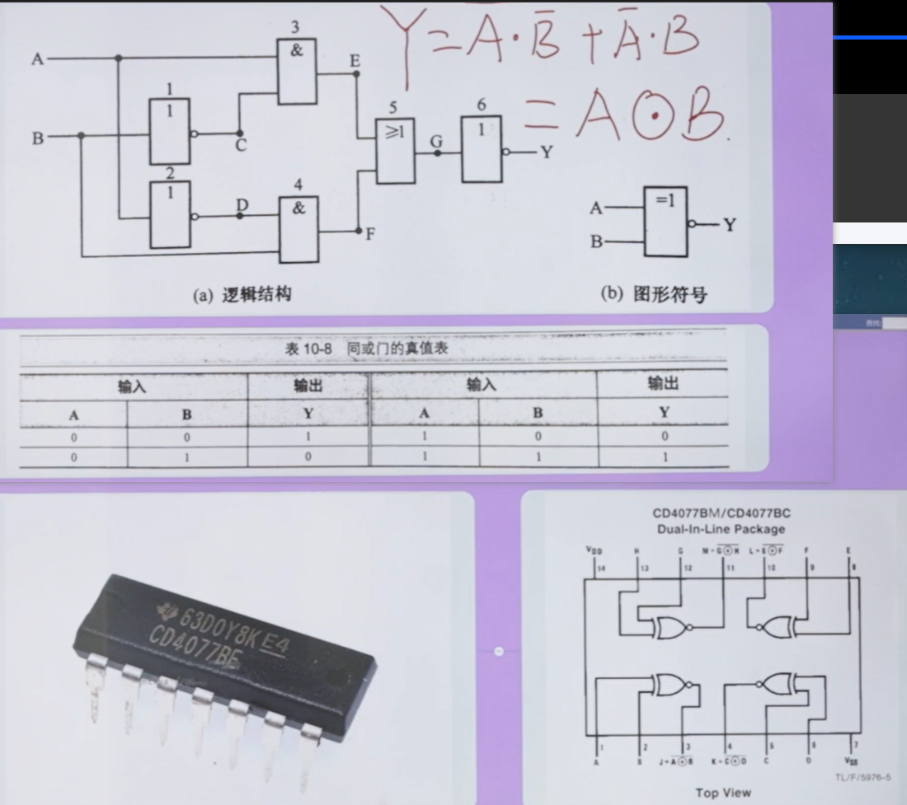

## 3.2 晶体管

- **定义**：晶体管（Transistor），是一种固体半导体器件，包括二极管（二端子）、三极管、场效应管、晶闸管（后三者均为三端子）等，具有检波、整流、放大、开关、稳压、信号调制等功能。
- **分类**：三端子晶体管主要分为两大类
  - 双极性晶体管（BJT）
  - 场效应晶体管（FET，单极性）

### 3.2.1 BJT

- 半导体三极管（Bipolar Junction Transistor，BJT），也称双极型晶体管、晶体三极管。

- 对于NPN管，它是由2块N型半导体中间夹着一块P型半导体所组成，发射区与基区之间形成的PN结称为发射结，而集电区与基区形成的PN结 称为集电结，三条引线分别称为发射极e（Emitter）、基极b（Base）和集电极c（Collector），类型分为**NPN型与PNP型**，如下图：

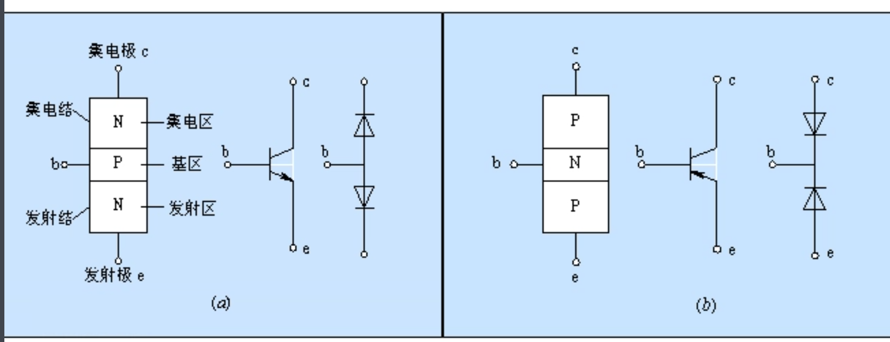

- **三种工作状态**（以NPN型为例）
  - 截止状态：当发射结为零偏，集电结为反向偏置
  - 放大状态：发射结正向偏置，集电结反向偏置
  - 饱和状态：发射结正向偏置，集电结正向偏置

### 3.2.2 FET

场效应晶体管（Field Effect Transistor，FET），简称场效应管。主要有两种类型：结型场效应管（junction FET，JFET）和金属-氧化物半导体场效应管（metal-oxide semiconductor FET，MOS-FET）。由多数载流子参与导电，也称为单极型晶体管。它属于电压控制型半导体器件。具有输入电阻高（10^7^~10^15^Ω）、噪声小、功耗低、动态范围大、易于集成、没有二次击穿现象、安全工作区域宽等优点，现已成为双极型晶体管和功率晶体管的强大竞争者。

## 3.3 MOS管及其开关特性

近年来，数字电路基本上都是由 MOSFET 场效应管构成的，简称MOS管。MOSFET是一种在施加电压后可以像开关一样工作的半导体器件。按照导电载流子的不同，MOSFET分为N沟道MOS（NMOS）管和P沟道MOS（PMOS）管。按照导电沟道形成机理的不同分为增强型和耗尽型。

### 3.3.1 N沟道增强型MOS管的结构和工作原理

N沟道增强型MOS管的结构示意图及符号如图3.2.1所示。它是在P型衬底上，用扩散法制作两个高掺杂浓度的N区。然后在P型硅表面生长一层很薄的二氧化硅绝缘层，并在二氧化硅表面及两个N型区各安置一个电极，形成==栅极g（Gate）、源极s（Source）和漏极d（Drain）==。由于栅极被绝缘，其电阻高达10^12^~10^15^Ω。通常将衬底与源极相连，或接地电位，以防止有电流从衬底流入源极和导电沟道。

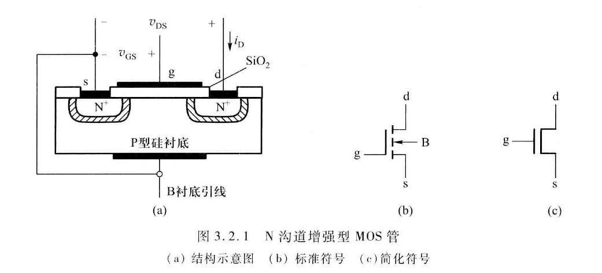

如果栅极和源极之间所加电压v~GS~=0，则源区、衬底和漏区形成的两个PN结背靠背串联，d间不导通，i~D~=0。

当栅源之间加正向电压v~GS~，且v~GS~≥V~T~（**V~T~为开启电压**）时，栅极和衬底之间形成足够强的电场，吸引衬底中的少数载流子（电子），使其聚集在栅极下的衬底表面，形成N型反型层，该反型层就构成了d、s间的导电沟道。若此时漏极和源极之间加电压s，将有漏极电流i~D~产生，如图3.2.2所示。这种在v~GS~=0时不存在导电沟道，v~GS~必须增强到足够大时才形成导电沟道的场敚应管，称为N沟道增强型MOS管。

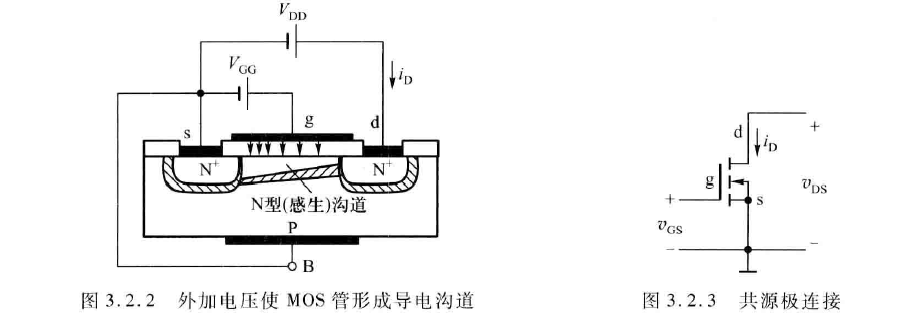

### 3.3.2 N沟道增强型MOS管的输出特性和转移特性

MOS管可视为二端口网络，如图 3.2.3 所示，栅-源为输入端口，漏-源为输出端口，源极为公共端，故称共源极连接。当端口电压不同时，回路电流也将发生变化。因此用 I-V 特性曲线反映电压与电流的关系。MOS管的 I-V 特性包括输出特性和转移特性，分别如图3.2.4（a）、（b）所示。

**输出特性曲线**是指栅源电压 v~GS~一定的情况下，漏极电流in与漏源电压vns之间的关系。输出特性曲线分为三个工作区**：截止区、饱和区和可变电阻区**。

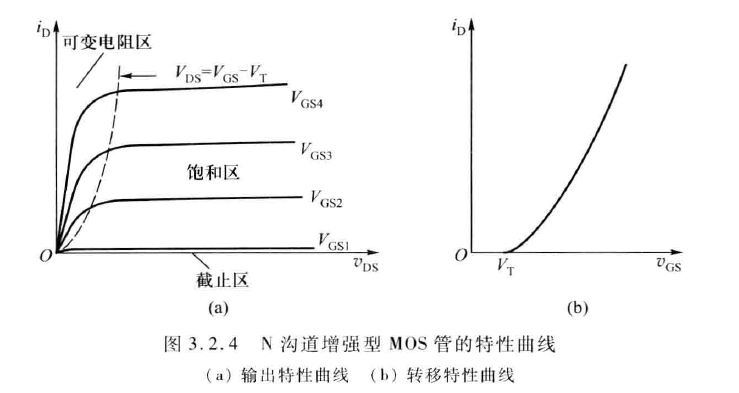

- 当 v~GS~<V~T~，时，导电沟道尚未形成，i~D~=0，漏-源间电阻很大，可达10^9^ Ω以上，相当于断开，MOS管处于截止工作状态，特性曲线的该区域称为**截止区**。
- 当 v~GS~≥V~T~，时，产生导电沟道，外加 v~DS~ 较小时，i~D~随 v~DS~ 呈线性增长。此时MOS管可以看成一个受v~GS~控制的可变电阻 r~ds~，v~GS~越大，输出特性曲线越倾斜，等效电阻越小。因此，该区域称为**可变电阻区**。r~ds~由下式确定。由式（3.2.1）可知，为使 r~ds~尽可能小，应当使 v~GS~ 尽可能大。
- 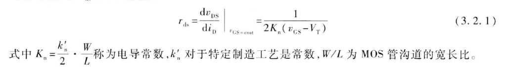

- 当 v~DS~ 继续增加到一定数值使 v~DS~ = v~GS~ - V~T~，时，沟道在靠近漏极处开始消失，称为预夹断。随着 v~DS~ 继续增加，i~D~ 几乎不再增加，此时的区域称为**饱和区**。因此，当v~DS~ < v~GS~ - V~T~，时，N沟道MOS管工作于**可变电阻区**。当v~DS~ ≥ v~GS~ - V~T~，时，MOS管工作于**饱和区**。

**转移特性**是指在漏源电压 v~DS~ 一定的条件下，栅源电压 v~GS~ 对漏极电流 i~D~ 的控制作用。当MOS管工作在饱和区时，由于  v~DS~ 对 i~D~ 的影响很小，所以不同的 v~DS~ 所对应的转移特性曲线基本重合，可以用一条曲线来表示。这条曲线与横坐标的交点即为开启电压 V~T~。

### 3.3.3 其他类型的MOS管

==1）P沟道增强型MOS管==

与N沟道MOS管相反，P沟道MOS管是在N型衬底上制作两个高浓度的P区，导电沟道为P型，载流子为空穴。其符号如图3.2.5所示。通常将衬底与源极相连，或接电源。为吸引空穴形成导电沟道，栅极接电源负极，与衬底相连的源极接电源的正极，即v~GS~为负值，因此开启电压V~T~也为负值。而i~D~的实际方向为流出漏极，与通常的假定方向正好相反。图3.2.6所示为P沟道增强型MOS管的输出特性和转移特性曲线。

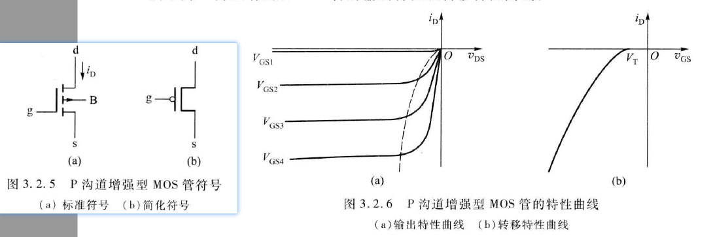

==2）N沟道耗尽型MOS管==

N沟道耗尽型MOS管的结构与增强型基本相同，最大的区别是在生产过程中，在SiO~2~绝缘层中掺入大量正离子，其结构示意图与符号如图3.2.7所示。v~GS~=0时，由于正离子的作用，将电子吸引到栅极下面的衬底表面形成N型沟道。当v~GS~>0时，沟道变宽。在v~DS~作用下，i~D~的数值更大。v~GS~为负，沟道变窄，i~D~减小，当v~GS~达到某一负值V~P~时，沟道完全被夹断，即使加v~DS~，也不会有漏极电流i~D~，MOS管截止，V~P~称为夹断电压。

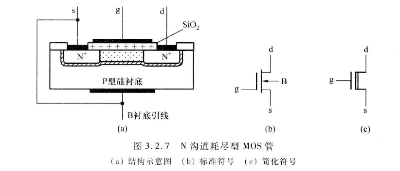

==3）P沟道耗尽型MOS管==

P沟道耗尽型MOS管的结构与增强型基本相同，但在SiO~2~绝缘层中掺入大量负离子，形成P型导电沟道，其夹断电压V~P~为正值。v~GS~可以是负值、零或正值。v~GS~为负值时i~D~增加，v~GS~为正值时i~D~减小。当v~GS~达到V~P~时，沟道完全被夹断，MOS管截止。P沟道耗尽型MOS管的符号如图3.2.8所示。

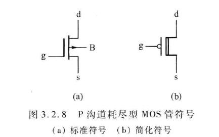

### 3.3.4 MOS管开关电路

用N沟道增强型MOS管替代图3.1.3所示的开关S构成的电路如图3.2.9所示。MOS管的作用对应于有触点开关S的“断开”和“闭合”，但在速度和可靠性方面比机械开关优越得多。

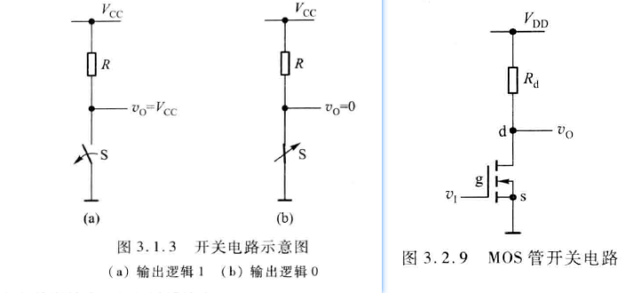

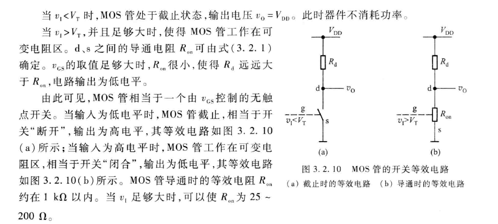

### 3.3.5 MOS管开关电路的动态特性

在图3.2.9所示MOS管开关电路的输入端，加一个理想的脉冲波形，如图3.2.11（a）所示。由于MOS管中栅极与衬底间电容C~gb~（即数据手册中的输入电容C~1~）、漏极与衬底间电容C~db~、栅极与漏极电容C~gd~以及导通电阻等的存在，使其在导通和闭合两种状态之间转换时，不可避免地受到电容充、放电过程的影响。输出电压v~o~的波形已不是与输入一样的理想脉冲，如图3.2.11（b）所示。上升沿和下降沿的变化都变得缓慢了，而且输出v~O~的变化滞后于输入v~I~的变化，t~pHL~ 为输出v~O~由高电平跳变为低电平的传输延迟时间，t~pLH~为输出v~O~由低电平跳变为高电平的传输延迟时间。

图3.2.9所示电路中R~d~的作用是：当输入为高电平时，流过导通NMOS管的电流很大，R~d~起限流作用，但此时消耗在其上的功率也很大。为了克服这个缺点，用另一个PMOS管替代电阻R~d~，就构成了CMOS反相器。

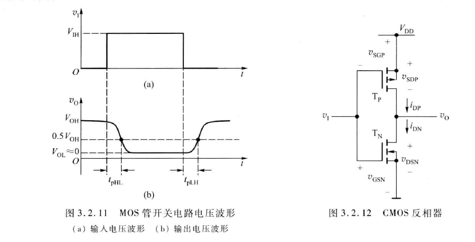

## 3.4 CMOS门电路

### 3.4.1 概述

CMOS集成门电路简称CMOS门电路，以金属-氧化物-半导体场效应晶体管（Metal-Oxide-Semiconductor Field Effect Transistor）作为开关器件。由PMOS场效应管和NMOS场效应管以互补对称的形式组成。

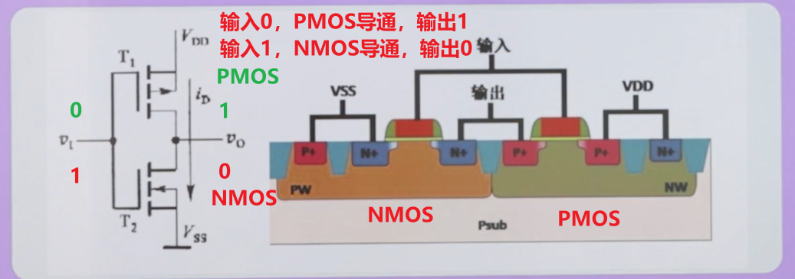

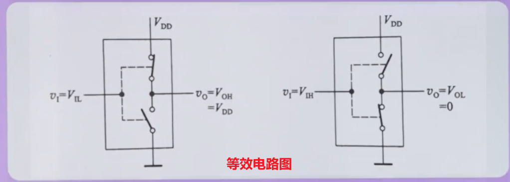

- CMOS集成电路的性能及特点
  - 功耗低：只有一个
  - 工作电压范围宽
  - 逻辑摆幅大
  - 抗干扰能力强（噪声容限大）
  - 输入阻抗高
  - 温度稳定性能好
  - 扇出能力强 
  - 抗辐射能力强

### 3.4.2 COMS反相器

#### 3.4.2.1 电压传输特性

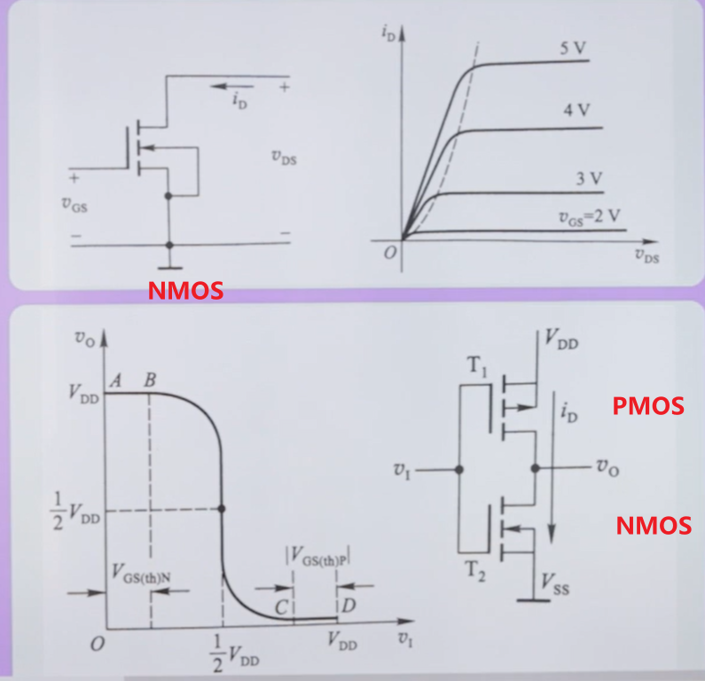

#### 3.4.2.2  电流传输特性

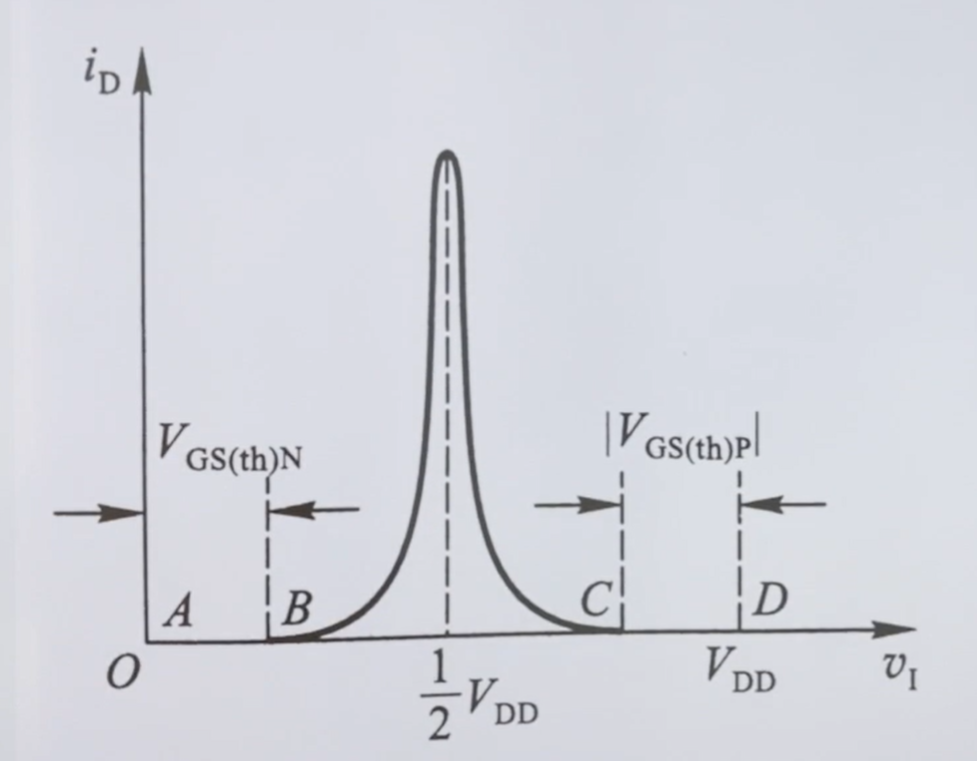

#### 3.4.2.3  输入端噪声容限

- 概念：在保证输出的高低电平基本不变的条件下，允许输入信号的高低电平有一个波动范围。

- 输入端噪声容限决定该器件的抗干扰能力

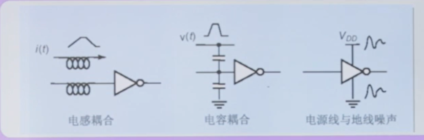

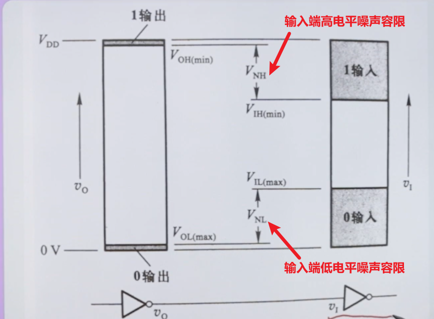

- 不同的系统电压（V~DD~）决定系统的噪声容限，噪声容限是有一定范围的，系统电压越大，噪声容限范围越大。

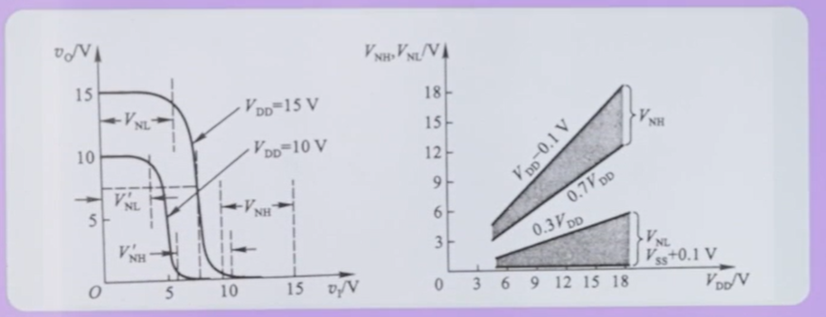

#### 3.4.2.4  静态特性

- 静态特性：指电路在保持某一种状态不变化的情况下的一些特性。
- 动态特性：对于CMOS电路，动态特性指输入电平在0-1之间跳变的时候电路所呈现出来的特性
- 输入特性（Input Characteristic）：从反相器输入端看进去的输入电压与输入电流的关系

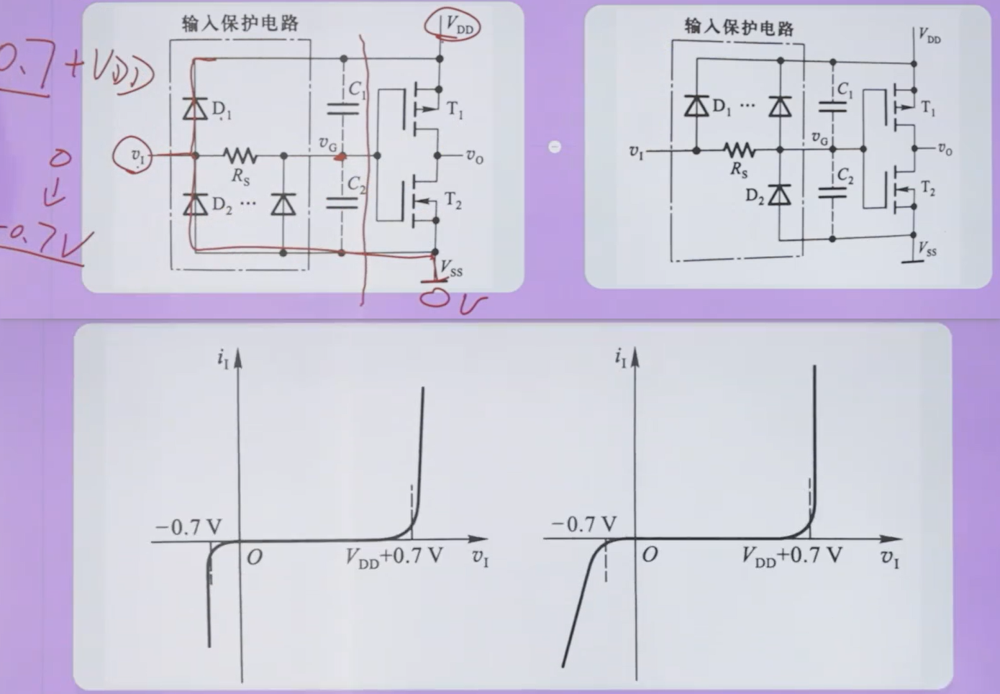

- 输出特性：从反相器输出端看进去的输出电压与输出电流的关系

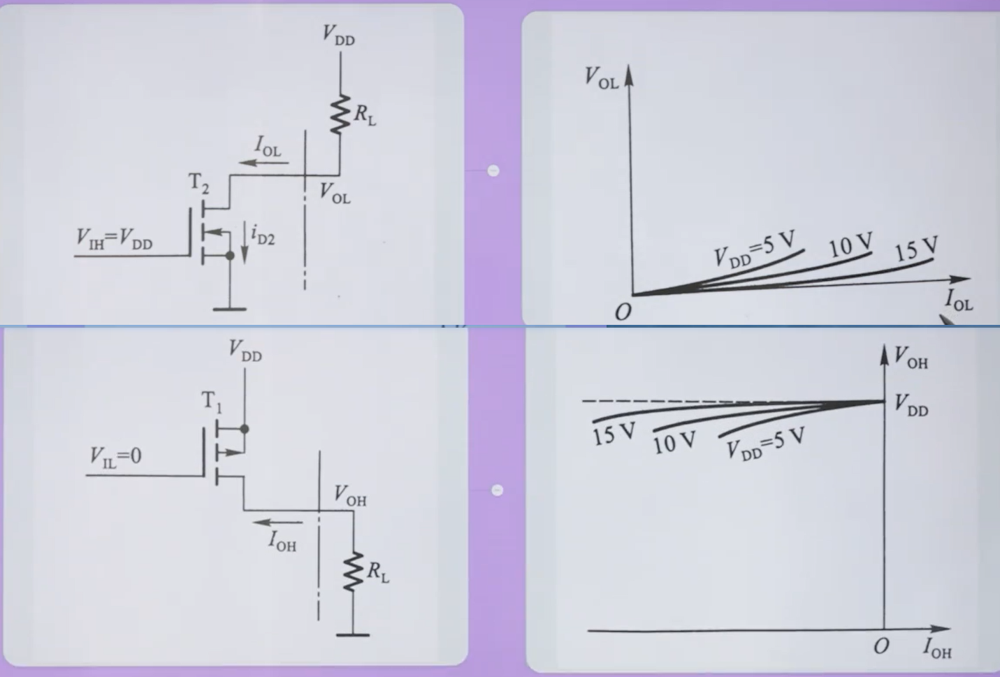

#### 3.4.2.5  动态特性

- **传输延迟（Tansmission Delay）**

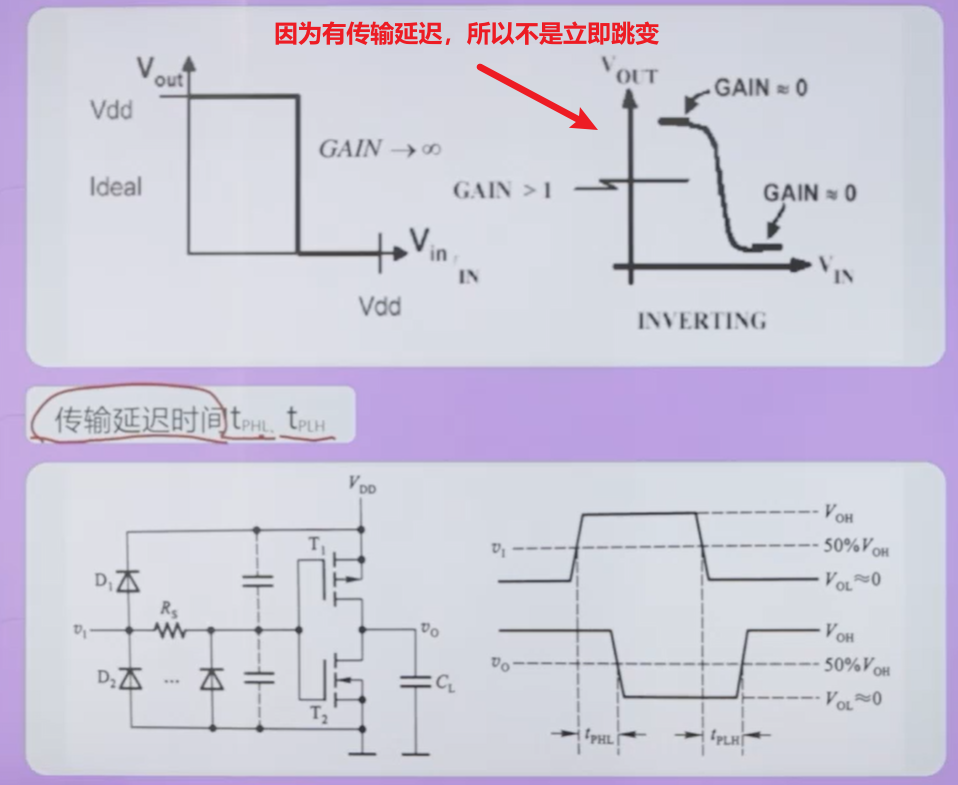

- **扇出**：以数字表示一个电路的输出端能够驱动同类负载电路输入端的数目

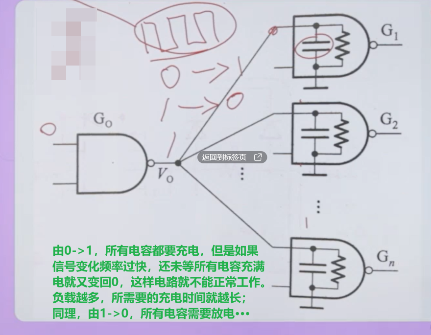

- **动态功耗（Danamic Power）**

 CMOS反相器从一种稳定工作状态突然转变到另一种稳定状态的过程中，将产生附加的功耗。包括两个： 

1. 因为负载电容充放电所产生的功耗；

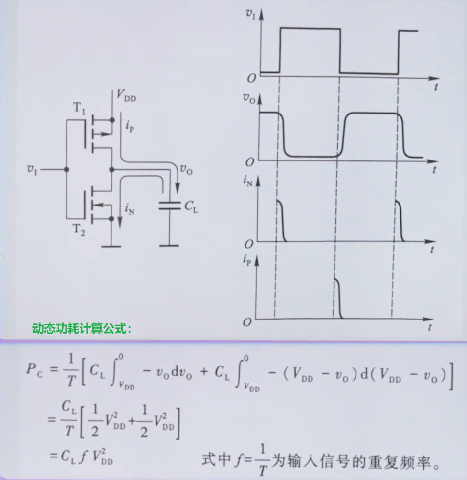

2. 两个MOS管在0->1、1->0跳变过程中，会有一个瞬时导通产生的功耗

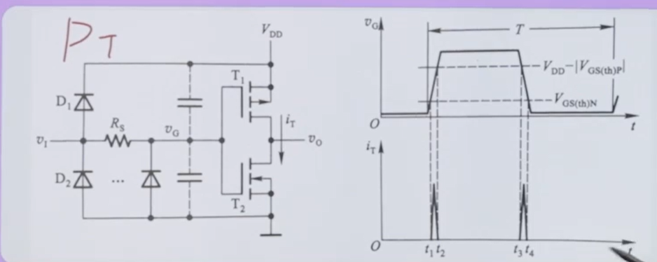

**动态功耗 P~D~ = P~C~ + P~T~**

 **静态功耗 P~S~**：MOS管组成元素PN结，而PN结可以等效为二极管，二极管就会有漏电流，就会才产生功耗。

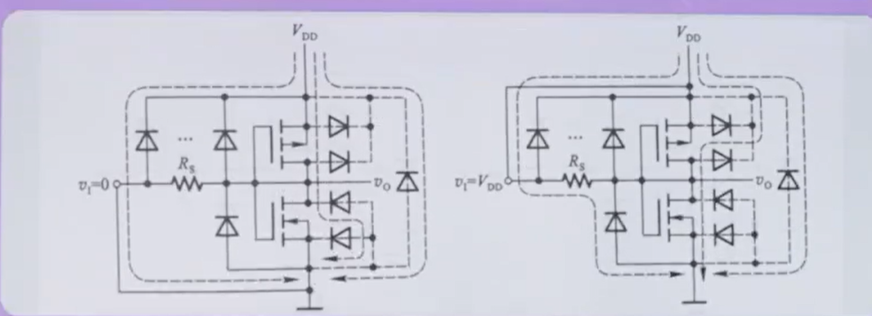

芯片手册有参数：输入漏电流（input leakage current）

### 3.4.3 COMS与非、或非门电路

- 输出缓冲器（Output Buffer）

#### 3.4.3.1 非门 

CMOS反相器电路如图3.2.12所示，由两只增强型MOS管组成，其中T~N~为N沟道MOS管，T~P~为P沟道MOS管。两只MOS管的栅极连在一起作为输入端；它们的漏极连在一起作为输出端。

当输入v~1~=V~DD~时，输出v~o~≈0；而输入v~1~=0，输出v~o~≈V~DD~。**输出与输入之间为逻辑非的关系**，也称非门为反相器（ Inverter）。CMOS反相器近似于一个理想的逻辑单元，其输出电压接近于零或+V~DD~。

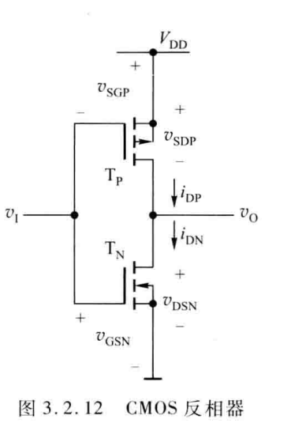

#### 3.4.3.2 与非门

图3.2.17是2输入端CMOS与非门电路，其中包括两个串联的N沟道增强型MOS管和两个并联的P沟道增强型MOS管。每个输入端连到一个N沟道和一个P沟道MOS管的栅极。电路输岀与输入信号逻辑关系及各个MOS管的工作状态如表3.2.1所示。当输入端A、 B有一个为低电平时，就会使与它相连的NMOS管截止，PMOS管导通，输出为高电平；仅当A、 B全为高电平时，才会使两个串联的NMOS管都导通，使两个并联的PMOS管都截止，输出为低电平。

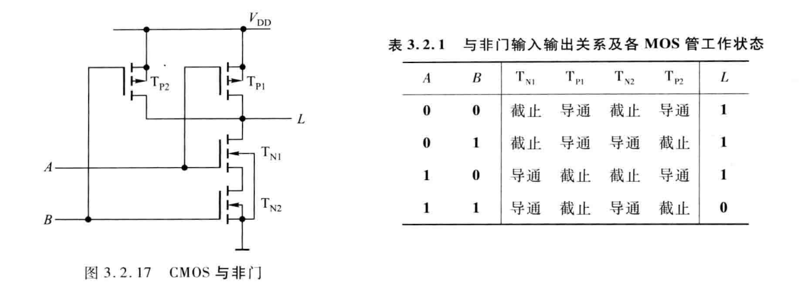

n个输入端的与非门必须有n个NMOS管串联和n个PMOS管并联。

#### 3.4.3.3 或非门

图3.2.18是2输入端CMOS或非门电路，其中包括两个并联的N沟道增强型MOS管和两个串联的P沟道增强型MOS管。

电路输出与输入信号逻辑关系及各个MOS管的工作状态如表3.2.2所示。当输入端A、B只要有一个为高电平时，就会使与它相连的NMOS管导通，而PMOS管截止，输出为低电平；仅当A、B全为低电平时，两个并联NMOS管都截止，两个串联的PMOS管都导通，输出为高电平。

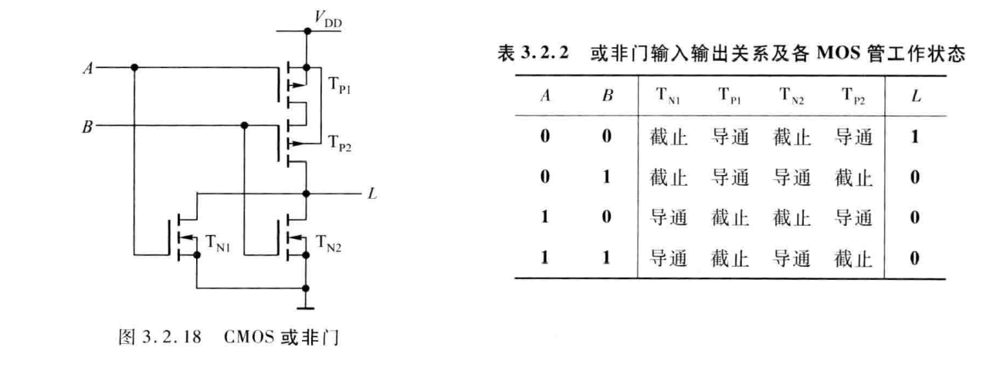

同样，n个输入端的或非门必须有n个NMOS管并联和n个PMOS管串联。

从以上CMOS与非门和或非门电路可知，输入端的数目越多，则串联的管子也越多。若串联的管子全部导通时，其总的导通电阻会增加，以致影响输出电平，使与非门的低电平升高，使或非门的高电平降低。因此CMOS逻辑门电路的输入端不宜过多。

逻辑门电路的电路符号称为 MIL（美军标准）逻辑符号。数字电子电路通过基本逻辑电路的组合来实现各种逻辑电路功能。

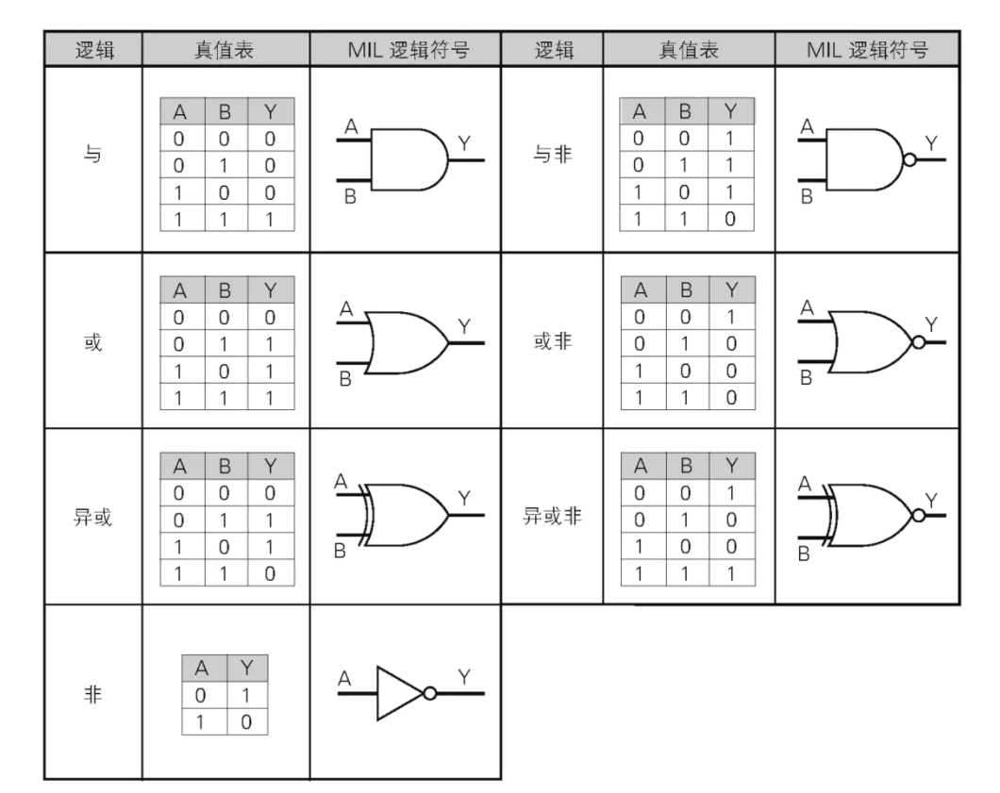

#### 3.4.3.4 改进后的与非、或非门电路

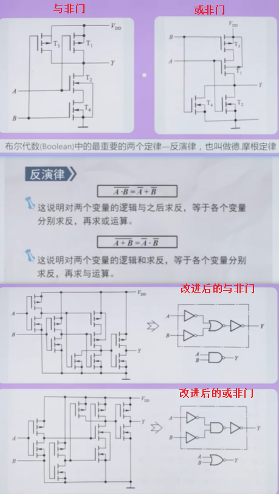

### 3.4.4 CMOS漏极开路门（OD门）

Open-Drain Output

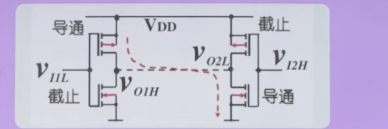

- **定义**：为了满足输出电平变换、吸收大负载电流以及实现线与连接等需求，将输出级电路结构改成一个漏级开路输出的MOS管，构成漏级开路输出门电路。

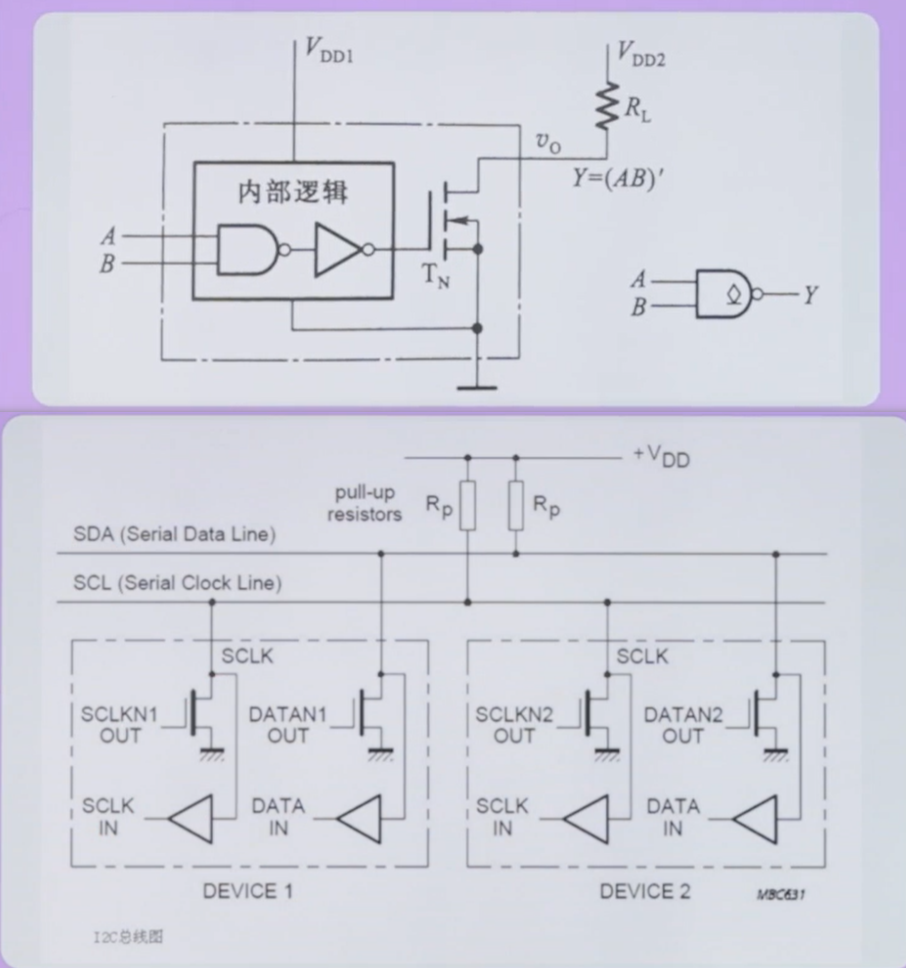

- **线与的概念**：即两个输出端（包括两个以上）直接互连就可以实现"AND"的逻辑功能

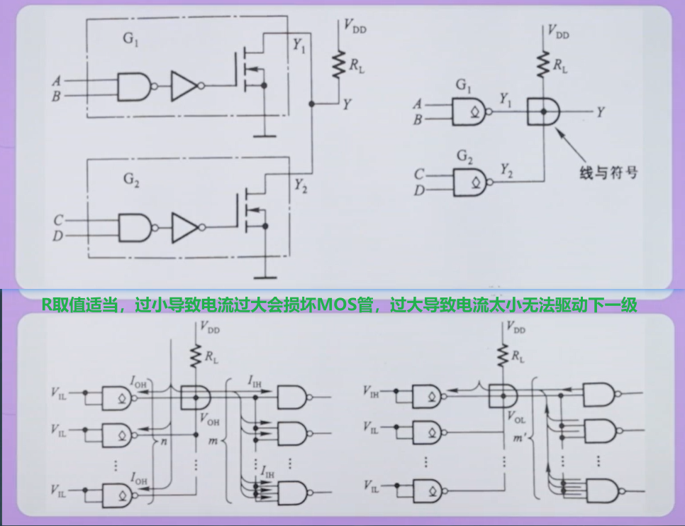

### 3.4.5 CMOS传输门

- 传输门（Transmission Gate，TG）的应用比较广泛，不仅可以作为基本单元电路构成各种逻辑电路，用于数字信号的传输，而且可以在取样-保持电路、斩波电路、模数和数模转换等电路中传输模拟信号，因而又称为模拟开关。

- **定义**：CMOS传输门是一种由控制信号来控制电路通断的门电路，利用PMOS和NMOS的互补性组成

- 使用普通MOS管做传输门是不行的，因为普通MOS管是单向导通的，源极和衬级连在一起，同时只有一个PN结导通

- 传输门一般用做模拟开关

  

  

### 3.4.6 CMOS三态输出门（TSL）

Tristate Logic

高阻态（High-Impedance State）

- 利用OD门虽然可以实现**线与**的功能，但外接电阻R，的选择要受到一定的限制，因此影响了工作速度。同时它省去了PMOS有源负载，使得带负载能力下降。为保持互补输出级的优点，又可以与总线连接，人们又开发了一种三态输出门电路，它的输出除了具有一般门电路的两种状态，即输出高、低电平外，还具有高输出阻抗的第三状态，称为高阻态，又称为禁止态。

- 三态输出门电路的输出除了高、低电平外，还有第三个状态-高阻态。因这种电路结构总是接在集成电路的输出端，所以也将这种电路称为输出缓冲器。


### 3.4.7 闩锁效应（Latch-up）

闩锁，即Latch-up，是任何CMOS电路中都存在的寄生结构，也是一类引起芯片失效的原因。只要存在PMOS和NMOS的对管，就会存在这种寄生的p-n-p-n的可控硅结构，而一旦触发条件形成，两个寄生三极管构成对电流放大的正反馈通路，从电源到地就会有大电流流过，从而使芯片发热甚至会烧毁芯片，其带来的危害是致命的。


## 3.5 TTL逻辑门电路

Transistor-Transistor Logic 晶体管-晶体管逻辑（电路）


- **TTL反相器工作原理详解及其电压传输特性曲线**


- **多发射极三极管及TTL与非门、或非门工作原理**


# 4.组合逻辑电路

- 组合逻辑电路（Combinational Logic Circuit）

## 4.1 定义

对于一个逻辑电路，其输出状态在任何时刻只取决于同一时刻的输入状态，而与电路原来的状态无关，这种电路被定义为**组合逻辑电路**。

## 4.2 竞争-冒险现象


## 4.3 判别和消除竞争-冒险现象的方法

- 判别方法


- 消除方法


# 5. 锁存器和触发器

大多数数字系统中，除了需要具有逻辑运算和算术运算功能的组合逻辑电路外，还需要具有存储功能的电路。组合电路与存储电路结合构成时序逻辑电路，简称时序电路。

## 5.1 SR锁存器


## 5.2 触发器（Flip-Flop）


### 5.2.1 电平触发器


### 5.2.2 D触发器（D锁存器）


### 5.2.3 边沿触发器（Edge Triggered）


### 5.2.4 脉冲触发器

- 边沿触发器存在空翻现象，为了避免空翻现象，提高触发器工作的可靠性，**希望在每个CLK期间输出端的状态只改变一次**，则在电平触发的触发器的基础上设计出脉冲触发的触发器。

- 分类
  - 脉冲触发的SR触发器（主从SR触发器）
  - 脉冲触发的JK触发器（主从JK触发器）

#### 5.2.4.1 脉冲触发的SR触发器


#### 5.2.4.2 脉冲触发的JK触发器

  


## 5.4 触发器的分类（逻辑功能）

### 5.4.1 SR触发器

凡在时钟信号作用下逻辑功能符合表中所规定的逻辑功能无论触发方式如何，均称为SR触发器


### 5.4.2 JK触发器


### 5.4.3 T触发器

  在某些场合，需要这样一种逻辑功能触发器，当控制信号T=1时每来一个时钟信号他的状态就翻转一次，而当T=0时，时钟信号到达后他的状态保持不变，这种逻辑功能的触发器称为T触发器


### 5.4.4 D触发器


## 5.5 触发器的动态特性


# 6. 时序逻辑电路

## 6.1 定义

对于一个逻辑电路，其输出状态在任何时刻不仅取决于同一时刻的输入状态，还与电路原来的状态有关，这种电路被定义为**时序逻辑电路**，简称时序电路。

时序电路中除具有**逻辑运箅**功能的**组合电路**外，还必须有能够**记忆电路状态**的**存储单元**或延迟单元，这些存储或延迟逻辑单元主要由**锁存器或触发器**组成。

# 7. 存储器（Memory）

## 7.1 存储器的分类及特点

磁盘：magnetic disk

- **定义**

  **存储器是数字电路系统中**具有记忆功能的部件，由大量的记忆单元组成用来存放二进制数表示的程序或数据

- **组成**

  构成存储器的存储介质主要采用半导体器件和磁性材料。存储器中**最小的存储单位就是一个双稳态半导体电路或一个CMOS晶体管或磁性材料的存储元，**它可存储一个二进制代码。由若干个存储元组成一个存储单元，然后再由许多存储单元组成一个存储器

- **分类**

  - 按存储介质分类
    - 半导体存储器（内存储器）
    - 磁表面存储器（磁盘存储器）

  - 按存储方式分类
    - 随机存储器（RAM）
    - 顺序存储器（磁带存储器）
  - 按存储器的读写功
    能分类
    - 只读存储器（ROM）
    - 随机读写存储器（RAM）
  - 按信息可保存性分
    类
    - 非永久记忆的存储器
    - 永久记忆性存储器

- **计算机中的存储器**

  


## 7.2 顺序存储器（SAM）

Sequential Access Memory

- **定义**：是一种读/写存储器，其中数据按照一定顺序串行的写入和读出
- **组成**：由动态移存器组成的，动态移存器则是由基本的动态移存单元组成的，
- **动态移存单元**：由MOS管构成，所以称为MOS移存单元，CMOS为常见的动态移存单元


## 7.3 只读存储器（ROM）

Read Only Memory

- **ROM分类**
  - 掩膜只读存储器（Mask Rom）
  - 可编程只读存储器（PROM）
  - 可改写只读存储器（EPROM）
  - 电可改写只读存储器（EEPROM）
  - 快闪存储器（Flash Memory）

- **ROM按构成器件分类**
  - 二极管ROM
  - 双极性三极管ROM
  - MOS管ROM

### 7.3.1 掩膜只读存储器（Mask ROM）

- **定义**：一种可以长期保存信息的存储器，具有**断电后信息仍可继续保存**的特点，在正常工作时只可读取数据，而不能写入数据

- 采用掩膜工艺制作OM集成电路芯片时，其中存储的数据是由制作过程中使用的掩膜板决定的

- **特点**：出厂时已经固定，不能更改，适合大量生产简单，便宜，非易失性
- **内部结构组成**：储存矩阵、地址译码器、输出缓存器


### 7.3.2 PROM可编程只读存储器

- **PROM（Programmable Read Only Memory）**的英文缩写，出厂时他是一种空白ROM，用户可 以根据需要写入信息，但写入信息后就不能再更改
- **结构**：与ROM结构类似，同样由存储矩阵，地址译码器，和输出电路组成。只是存储单元不同


### 7.3.3 EPROM可改写只读存储器

浮栅：Floating gate

- EPROM（Erasable Programmable Read Only Memory）具有可写入数据，在紫光灯的照射下可以将写入的数据擦除，再重新写入数据的特点，
- 结构：与ROM结构类似，存储单元不同，由一种层叠栅MOS管代替普通MOS管


### 7.3.4 EEPROM电可改写只读存储器

隧道氧化层：Tunnel Oxide

- EEPROM（Electrically Erasable Programmable Read-Only Memory）具有可写入数据，在电压的控制下并且可以将写入的数据擦除，再重新写入数据的特点
- 结构：与EPROM很相似，不同之处在于EEPROM的叠层MOS管的浮置栅极上增加了一个隧道管，在电压的控别下，浮置细极上的电子可以通过隧道管放掉


### 7.3.5 Flash Memory快闪存储器

（SD卡：Secure Digital Card）

- **定义**：Flash Memory 一种电子式只读存储器，允许在操作中被多次擦或写的存储器
- **特点**：
  - 优点：质量轻、能耗低、体积小、抗震能力强
  - 缺点：需要先擦除再写入；块擦除次数有限；读写干扰
- **组成**：在MOS管中，除了控制栅Gc以外，还在控制栅和衬底之间又增加了一个浮置册Gf


- **nor flash**：数据线和地址线分开，可以实现ram一样的随机寻址功能，可以读取任何一个字节
- **nand flash**：据线和地址线复用，不能利用地址线随机寻址。读取只能按页来读取


### 7.3.6 静态存储器（SRAM）

（Static Ramdom Access Memory )

- **定义**：采用锁存器作为记忆单元，用静态存储单元构成的存储器称为静态存储器，通常由NMOS和CMOS两种。
- **优点**：
  - 数据由锁存器记忆，不需要另设电路定期刷新。
  - 存取速度很快（SRAM采用了与制作CPU相同的半导体工艺）
- **缺点**：
  - 所用元件较多，集成度比DRAM低。
  - 功耗较大。
  - 体积较大，制造成本比DRAM高


与NMOS相比，CMOS存储单元功耗极小的特点，在降低电源电压的情况下还能保存数据。故可用电池供电，从而弥补随机存储器数据因断电而丢失的缺 点。


### 7.3.7 动态存储器（DRAM）

( Dynamic Ramdom Access Memory )

- **组成**：采用MOS管的栅电容（分布电容）来存储数据，用动态存储单元构成的存储器成为动态存储器
- **优点**：所用元件少，集成度高，功耗低，便于大规模集成
- **缺点**：
  - 需要定期刷新，外围电路较复杂。
  - 刷新期间不能进行读写操作，使有效利用时间受到限时
- **刷新方式**
  - 集中刷新：在规定的一个刷新周期内，对全部存储单元集中一段时间进行逐步刷新，此刻必须停止读/写操作
  - 分散刷新：指对每行存储单元的刷新分散到每个存储周期内完成。
  - 异步刷新：是集中刷新和分散刷新的结合

- **种类**
  - 单管存储单元
  - 3管存储单元


单管采用元器件少，故集成度高，且功耗低，所以大容量的动态存储器的存储单元大多采用单管构成

