# 时序分析与时序约束

- Author：hongjh
- Time：20220625
- Version:

---------

[toc]

# 1. 数字电路基础

## 1.1 SR锁存器（Latch）

- **定义**：是静态存储单元当中最基本，也是电路结构最简单的一种，通常由两个**或非门**或者**与非门**组成。
- **优点**：
  - 面积比FF小
  - 速度比FF快
- **缺点**：
  - 电平触发，非同步设计，受布线延迟影响较大，很难保证输出没有毛刺产生
  - latch将静态时序分析变得极为复杂

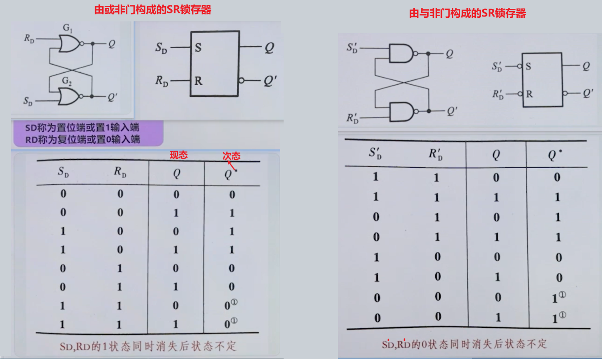

## 1.2 触发器（Flip-Flop）

- **时钟信号**：与锁存器不同在于，它除了置1，置0输入端以外，又增加了一个触发信号输入端。只有当触发信号到来时，触发器才能按照输入的置1，置0信号置成相应的状态，并保持下去，这个触发信号称为时钟信号（CLOCK），记作CLK.
- **触发信号的方式（3种）**
  - 电平触发
  - 边沿触发
  - 脉冲触发

### 1.2.1 电平触发器

#### 1.2.1.1 电平触发器（常规）

- **电平触发方式的动作特点**
  - 只有当CLK变为有效电平时，触发器才能接受输入信号并按照输入信号将触发器的输出置成相应的状态
  - 在CLK=1的全部时间里，S和R状态的变化都可能引起输出状态的改变，在CLK回到0以后，触发器保存的是CLK回到0以前的状态

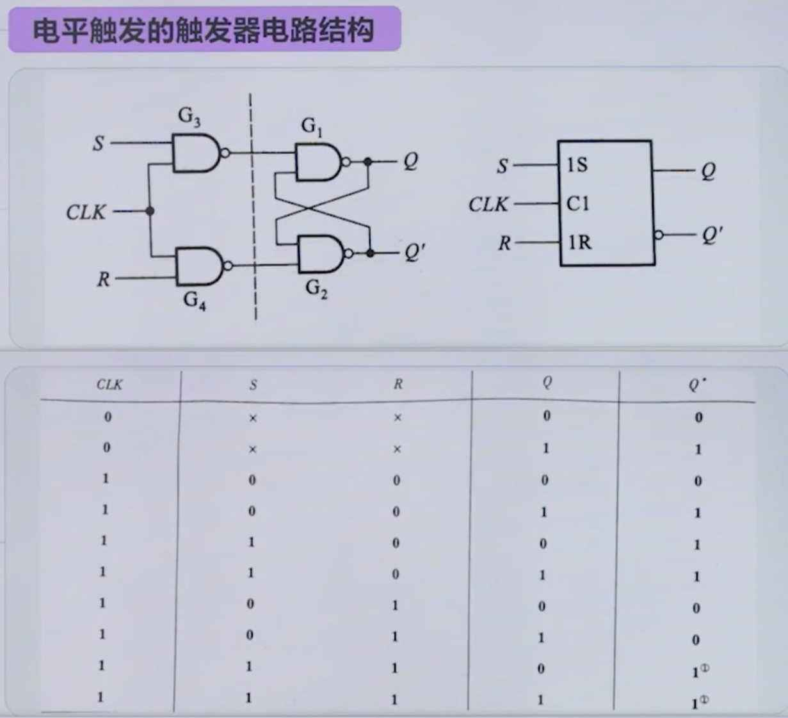

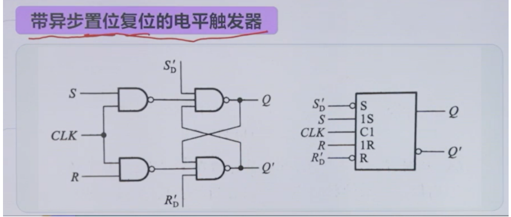

#### 1.2.1.2 D触发器（D锁存器）


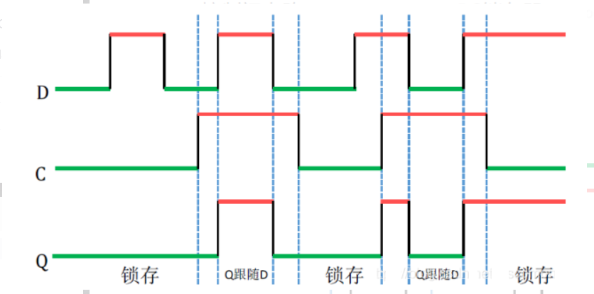

### 1.2.2 边沿触发器

- 只有在CLK的下降沿（或上升沿）时刻才对输入信号的状态响应，而在此之前或之后输入状态的变化对触发器的次态没有影响
- **特点**：提高了触发器的可靠性，增强抗干扰能力

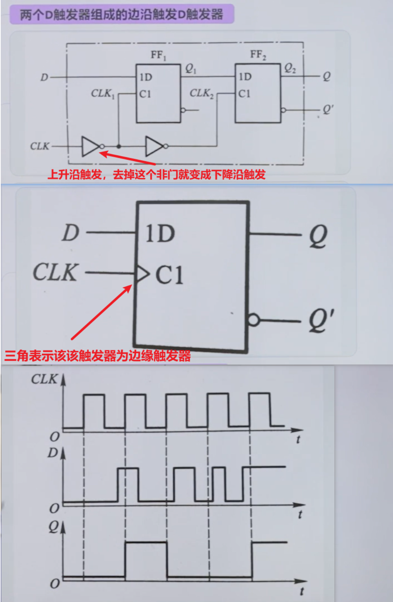

### 1.2.3 脉冲触发器

- 边沿触发器存在空翻现象，为了避免空翻现象，提高触发器工作的可靠性，**希望在每个CLK期间输出端的状态只改变一次**，则在电平触发的触发器的基础上设计出脉冲触发的触发器。
- **分类**
  - 脉冲触发的SR触发器（主从SR触发器）
  - 脉冲触发的JK触发器（主从JK触发器）
- **脉冲触发的动作特点**
  - **触发器的翻转分两步动作**
    - **第一步**：当CLK以高电平为有效信号时，在CLK=1期间**主触发器**接收输入端（S、R 或 J、K）的信号，被置成相应的状态，而**从触发器**不动
    - **第二步**：CLK下降沿到来时**从触发器**按照**主触发器**的状态翻转，所以Q、Q'端状态的改变发生在CLK的下降沿。（若CLK以低电平为有效信号，则Q和Q'状态的变化发生在CLK的上升沿。）
  - **因为主触发器本身是一个电平触发SR触发器，所以在CLK=1的全部时间里输入信号都将对主触发器起控制作用**

#### 1.2.3.1 脉冲触发的SR触发器


#### 1.2.3.2 脉冲触发的JK触发器

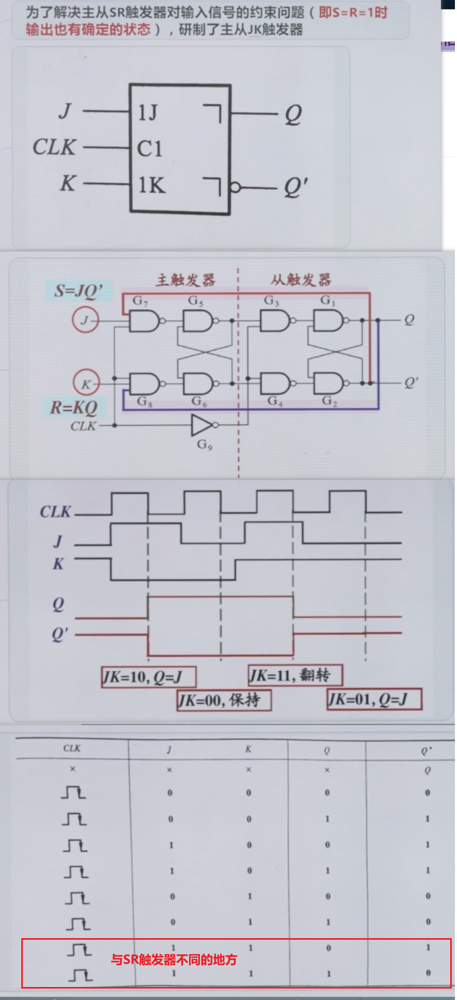

# 2. 时序分析

## 2.1 基础知识

### 2.1.1 时序分析定义

时序分析本质上就是一种时序检查，目的是检查设计中所有的D触发器是否能够正常工作，也就是检查D触发器的**同步端口**（数据输入端口）的变化是否满定**建立时间要求**（Setup）和**保持时间要求**（Hold）；检查D触发器的**异步端口**（异步复位端口）的变化是否满足**恢复时间要求**（Recovery）和**移除时间要求**（Removal）。

- **建立时间（T~su~）**：在触发器时钟采样沿到来前，数据必须保持稳定的时间，该时间量称为建立时间。
- **保持时间（T~h~）**：在触发器时钟采样沿到来后，数据必须保持稳定的最短时间。

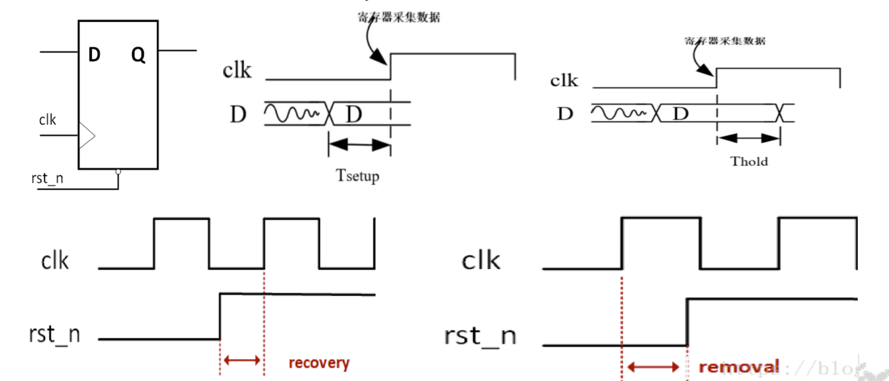

- **T~co~**：从触发器检测到时钟端跳变沿到输出端稳定下来这段时间

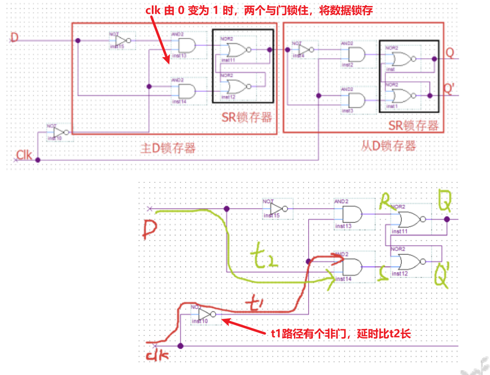


### 2.1.2 时序分析类型

- **动态时序分析**：将布局布线生成的布线延迟信息反标注到门级网表中进行仿真，检查是否存在时序违例。此时的仿真包括门延迟和布线延迟信息，能够较好反应芯片的实际工作情况。因为不可能产生完备的测试向量，覆盖门级网表中的每一条路径。因此在动态时序分析中，无法暴露一些路径上可能存在的时序问题。
- **静态时序分析（STA）**：采用穷尽分析方法来提取出整个电路存在的所有时序路径，计算信号在这些路径上的传播延时，检查信号的建立和保持时简是否满足时序要求，通过对最大路径延时和最小路径延时的分析，找出违背时序约束的错误。它不需要输入向量就能穷尽所有的路径，且运行速度很快、占用内存较少，不仅可以对芯片设计进行全面的时序功能检查，而且还可利用时序分析的结果来优化设计，因此静态时序分析已经越来越多地被用到数字集成电路设计的验证中。

### 2.1.3 时序分析工具

- 静态时序分析工具

  - Xilinx Vivado Intergreated Design Environment Time Engine

  - Altera Quartus II Timequest

  - DC等

- **动态时序分析工具**

  - Mentor Modelsim
  - Cadence NC-Verilog
  - Sysnopsys VCS
- **静态时序分析准备工作**
  撰写基本的时序约束文件，告知时序引擎一些必要的信息（比如时钟，输入输出延时等）。若没有正确的时序约束，那么时序分析的结果是没有意义的。(**用户逻辑不要加在复位路径和时钟路径上**)

### 2.1.4 时序分析中常用术语

- **源时钟**（Source Clock/Launch Clock，也称为发起时钟）
- **目的时钟**（Destination Clock/Capture Clock，也称为捕获时钟）
- **发起沿**（launch edge，源时钟产生数据的有效时钟沿）
- **捕获沿**（capture edge，目的时钟捕获数据的有效时钟沿）
- 发起沿通常在0ns，捕获沿通常在下一个发起沿，发起沿和捕获沿通常相差一个时钟周期

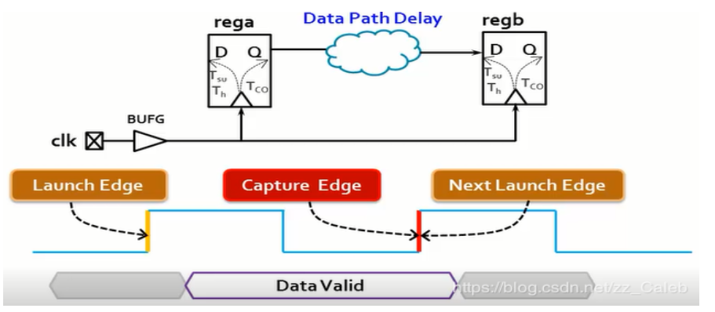

## 2.2 时序路径

### 2.2.1 一条普通时序路径的三要素

- **源时钟路径**：从源时钟的源节点（通常是FPGA的时钟输入引脚）到源寄存器的时钟端口的路径。当时序路径的起点是FPGA输入端口时，该时序路径是没有源时钟路径的
- **数据路径**：从时序路径的起点到时序路径的终点之间的数据传播路径。时序路径的起点可以是源寄存器的时钟端口或FPGA的输入端时序路径的终点可以是目的寄存器的输入端口或FPGA的输出端目的
- **时钟路径**：从目的时钟的源节点（通常是FPGA的时钟输入引脚）到目的寄存器的时钟端口的路径。当时序路径的终点是FPGA的输出端口时，该时序路径是没有目的时钟路径的

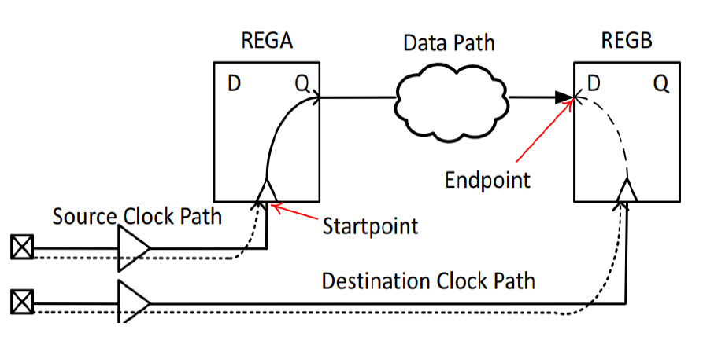

### 2.2.2 FPGA中常见的四种时序路径

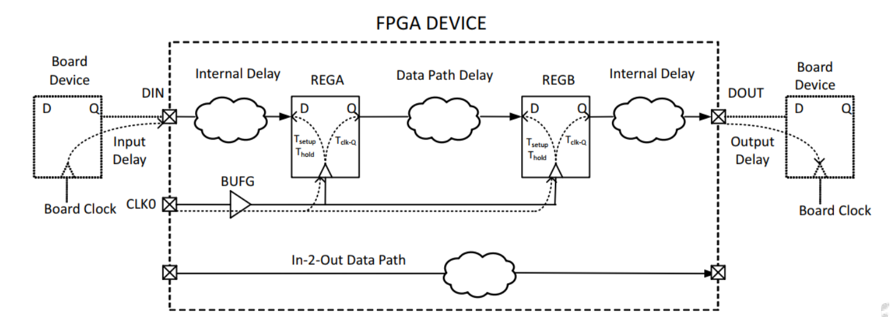

- 第一种，从源寄存器的时钟端口到目的寄存器的数据输入端口
  - 数据由源时钟发起并在FPGA内部产生；
  - 数据经过Data Path Delay后到达由目的时钟驱动的目的寄存器；
  - 这种时序路径是最常见的，**用户需要约束源时钟和目的时钟告知时序引必要的信息**，时序引擎才能正确的分析这种时序路径。

- 第二种，从FPGA的输入端口到目的寄存器的数据输入端口
  - 数据由Board clock发起并在FPGA外部产生；
  - 数据经过Input Delay的延迟后到达FPGA的输入端口；
  - 数据经过FPGA的Internal Delay后到达由目的时钟驱动的目的寄存器
  - 这种路径是**没有源时钟路径的，用户需要约束Input Delay和时钟来告知时序引擎必要信息**，时序引擎才能正确的分析这种路径。
- 第三种，从源寄存器的时钟端口到FPGA的输出端口
  - 数据由源时钟发起并在FPGA内部产生；
  - 数据经过Internal Delay后到达输出端口；
  - 数据经过Output Delay后被Board Clock捕获到；
  - 这种路径是**没有目的时钟路径的，用户需要约束Output Delay和时钟来告知时序引擎必要信息**，时序引擎才能正确的分析这种路径。

- 第四种，从FPGA的输入端口到FPGA的输出端口
  - 数据横穿FPGA，没有经过任何触发器，这种路径也叫in-to-out path，约束输入和输出延时的参考时钟可以使用虚拟时钟。
  - 这种路径中**只有数据路径，用户需要约束Input Delay和Output Delay，告知时序引擎必要的信息**，时序引擎才能正确的分析这种时序路径。

## 2.3 Setup 检查

### 2.3.1 时序引擎是如何进行Setup检查的

1. 确定建立时间要求（建立时间的捕获沿-建立时间的发起沿）

   时序引擎会找出发起时钟和捕获时钟的最小公共周期，然后在最小公共周期内找到所有发起时钟沿和捕获时钟沿的所有可能的情况，并在所有可能的情况中挑选出最小的建立时间需求（大于0），从而确定了Launch edge和Capture edge。

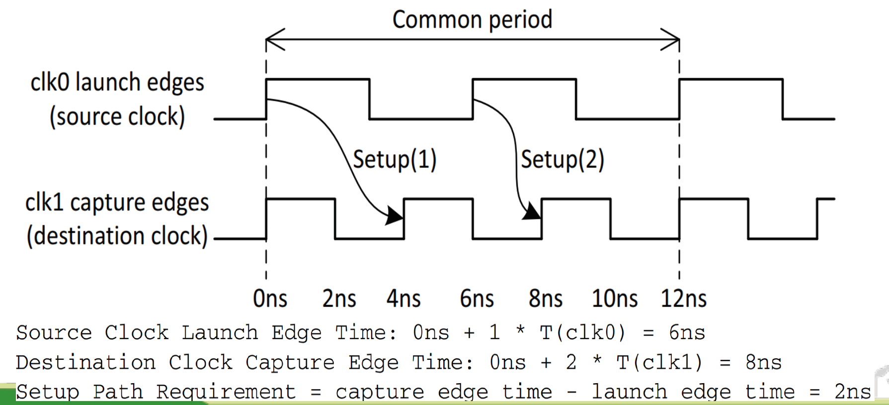

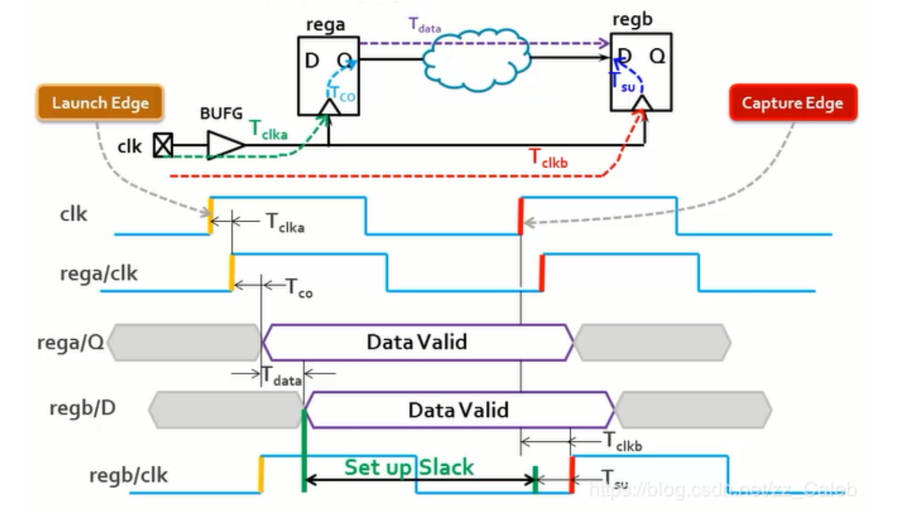

2. 计算数据的需求时间

```
Data Required Time (setup) = capture edge time
                             + destination clock path delay
                             - clock uncertainty
                             - setup time
                             
                           = capture edge + Tclkb - Tsu
```

3. 计算数据的到达时间

```
Data Arrival Time (setup) = launch edge time
                            + source clock path delay
                            + datapath delay
                            
                          = lauch edge + Tclka + Tco + Tdata(Tlogic + Tnet)
```

4. 计算Setup的裕量（Slack）

```
Slack (setup) = Data Required Time - Data Arrival Time
              
              = （Capture edge-Launch edge）
                +（destination clk delay - source clk delay）
                - Setup time 
                - clk uncertainty 
                - datapath delay 
```

==化简后==

```
Slack (setup) = Setup Requirement（一定大0）
                + clk skew 
                - Tsu - Tco 
                - Tclk uncertainty 
                - Tlogic 
                - Tnet 
```

- **Setup Requirement（一定大0）**：正常情况下，源时钟和目的时钟是一样的，时序引擎选择没有问题；但如果是不同频率，有可能会选错，就会导致 **Setup Requirement** 很小，无论如何都满足不了要求
- **clk skew**：时钟歪斜，一般情况下，如果时钟路径设置合理，没有在时钟路径上加组合逻辑等不合理操作，一般是300-500ps
- **Tsu 、Tco**：寄存器特有属性，而且很小，除非在使用 **Block RAM** 情况下需要考虑其影响 
- **Tclk uncertainty**：一般只有零点几纳秒，不作为主要影响因素
- **Tlogic **：组合逻辑延时，两级寄存器中间组合逻辑很长，比如：进行大位宽的运算，中间的LUT就会很多
- **Tnet**：布线延时，一般一根网线不超过 1 ns，但如果布线拥塞，就会变长

### 2.3.2 根据公式分析 Setup Slack 为负原因

#### 2.3.2.1 Setup Requirement 与实际情况不符

建立时间需求过小，这种情况**通常会在同步跨时钟域路径中出现**，在同步跨时钟域路径中的源时钟频率与自的时钟频率的相位关系虽然已知的，但是**时序引擎默认选择的捕获沿通常都是错误的，需要用户通过多周期路径约束的方式手动修正建立时间需求**。比如下图中，两个同频不同相的同步时钟，时序引擎默认选择的捕获沿是自的时钟第二个上升沿，导致建立时间需求非常小，最终肯定会导致时序违例。

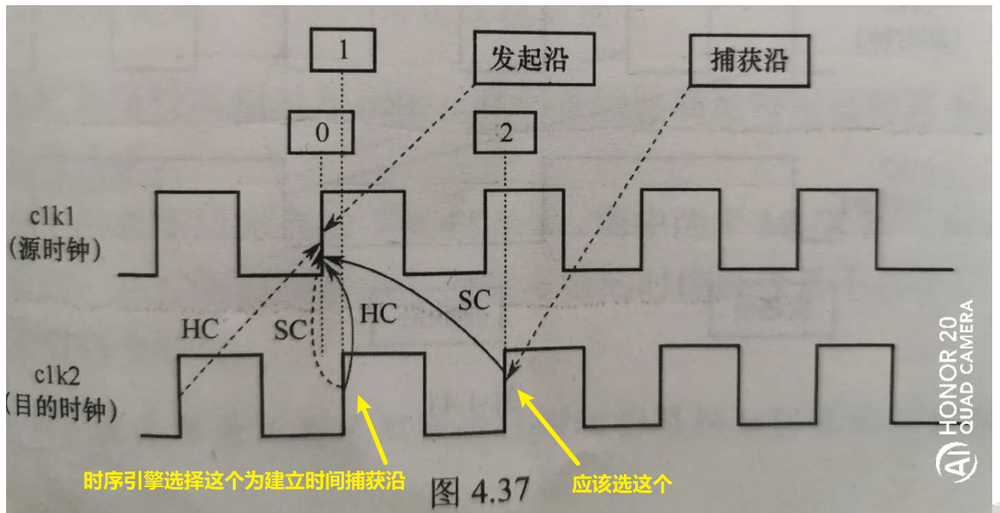

#### 2.3.2.2 clk skew 为负值，且很大（绝对值）

通常情况下，**同一个时钟下**的时钟歪斜不应该超过300ps，**同步跨时钟域路径**的时钟歪斜不应该超过500ps，异步跨时钟域路径的时钟歪斜一般比较大（不用考虑），因为它们的时钟源不同。

当出现时钟歪斜大的情况时：

1. 检查源时钟路径和目的时钟路径上是否干净，时钟路径上是否引入了组合逻辑，时钟路径是否使用了过多的BUFGCE，时钟路径上是否级联了多个BUFGCE导致时钟延时变大。
2. 检查源时钟路径和目的时钟路径所经过的模块是否相同，比如源时钟路径上经过全局缓冲，PMMCM，但是目的时钟路径上只经过了全局缓冲。如下图所示，第一条路径的源时钟路径上有BUFGCE/MMCM/BUFGCE，而目的时钟路径上只有BUFGCE，所以源时钟路径和目的时钟路径的延时不同，导致时钟歪斜较大，应该尽量避免此类路径。第二条路径的源时钟和目的时钟都是来源于MMCM的不同的时钟，所以时钟歪斜较小。

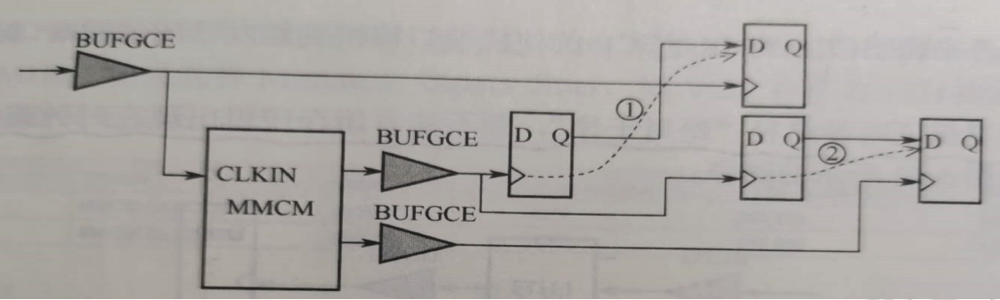

#### 2.3.2.3 Tsu/Tco 大

当设计中使用Block（DSP/Block RAM等）时，应该要注意以下问题。

对于以这些Block为时序路径的起点或终点的时序路径，这些Block的Tsu/Th/Tco都比普通的寄存器大，而且这些Block的布线延时和时钟歪斜比较大。

所以当使用这些Block作为时序路径的终点时，它的**起点一定要是触发器**，比如说：

- **一个Block RAM的写数据信号，输入进Block前最好打一拍；**
- **当使用这些Block作为时序路径的起点时，应该使用Block内部的输出寄存器，比如使用由Block RAM组成的FIFO时，尽量不要使用首字置出的，而使用打一拍后输出的，使用后者可以显著降低Tco。**
- **当时序路径为从一个Block到另一个Block时中间需要进行打拍操作。（一般Block RAM 出来是，先打一拍）**
- **当使用这些Block的控制端口时，应该保证这些控制信号的低扇出，如使用由Block RAM组成的FIFO时，应该尽量降低读/写能信/地址信号的扇出。**

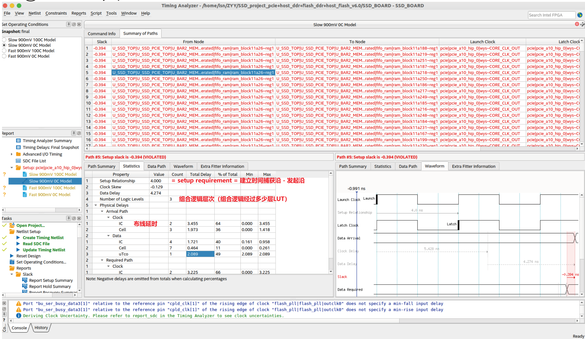

#### 2.3.2.4 Tlogic 大

一般情况下，逻辑延时与时序路径的逻辑层级数息息相关。

**逻辑层级是指时序路径的起点和终点之间组合逻辑单元（LUT）的个数，而逻辑层级多一级意味着多1个LUT的延时加1条连接LUT的网线延时。**

通常二级逻辑层级的延时标准是1个LUT加1根网线的总延迟为0.5ns，如果某条路径的逻辑级数大于时钟周期/0.5ns，那么这条路径就被称为**长路径**。

常用的处理长路径的方案有两种：

- 第一种，修改 rtl 代码，**在长路径的逻辑中插入流水线**，将长路径打破分为多条短路径；
- 第二种，**使用综合工具的retiming优化方式**，retiming实际上是寄存器重定向，原理是当某条长路径的相邻路径的建立时间裕量较大，那么它可以调整中间寄存器的位置，来调整布线延迟，通过适当增加相邻路径的布线延迟而减少长路径的布线延迟，使得那些时序违例较小的长路径通过这种微调实现时序收敛。需要强调的是，这种方式优化的力度非常有限，它**只适合时序违例较小的长路径**，对于一些延时特别天的长路径而言，也是无力回天。

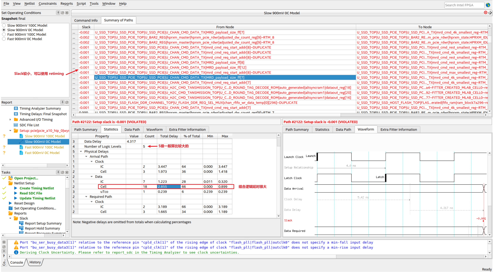

#### 2.3.2.5 Tnet 大

一般情况下，布线延迟与设计整体或局部模块的资源利用率以及拥塞程度息息相关。

在正常情况下，一条网线的延时小于1ns，在发生拥塞的区域，网线的延时可能达到若干ns，导致布线延时显著增加。为了解决布线延迟大，需要从降低资源利用率和隆低拥塞程度下手，比如：

- 某个模块使用了大量的寄存器堆，占用了大量的资源，此时应该考虑使用BlockRAM代替这些寄存器堆；
- 某个模块使用了大量的数据选择器，此时应该考虑如何优化这些数据选择器；
- 某个模块的控制信号扇出比较大，与其他模块的互联很重，此时应该考虑如何降低这些信号的扇出；
- 某条时序路径的起点或终点是Block，由于Block的位置比较固定，所以Block的布线延迟会大一些。

最后需要强调的是，一定要额外关注高扇出的网线也会对布线延时产生影响。

设计整体资源利用率一般包括两个：

- CLB（可编程逻辑块）：其中，寄存器用来实现时序逻辑；LUT 用来实现组合逻辑（如果LUT作为分布式RAM，其他相邻寄存器无法使用，会导致浪费）
- BRAM：实现用户存储功能

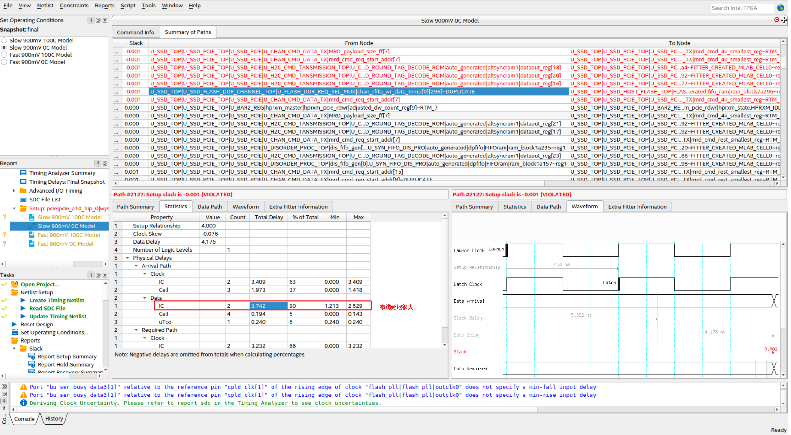

### 2.3.3 TimeQuest 时序分析（Setup）

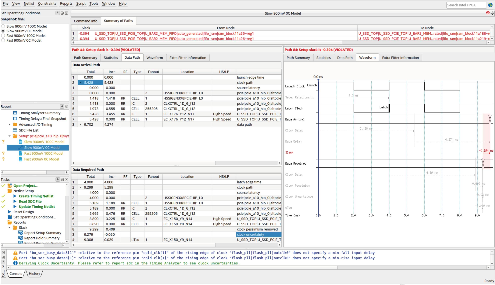

## 2.4 Holdup 检查

### 2.4.1 时序引擎是如何进行Holdup检查的

1. 确定保持时间要求（确定用于保持时间分析的发起沿和捕获沿）

   **保持时间要求是以建立时间要求为基础的**，保持时间要求有两种：

   - 当前建立时间的发起沿产生的数据不能被当前建立时间的捕获沿的前一个有效沿捕获
   - 当前建立时间发起沿的下一个有效沿产生的数据不能被当前建立时间的捕获沿捕获

   根据所有的建立时间需求找到所有的保持时间需求，并从保持时间需求（可正可负）中找到最大的保持时间需求。

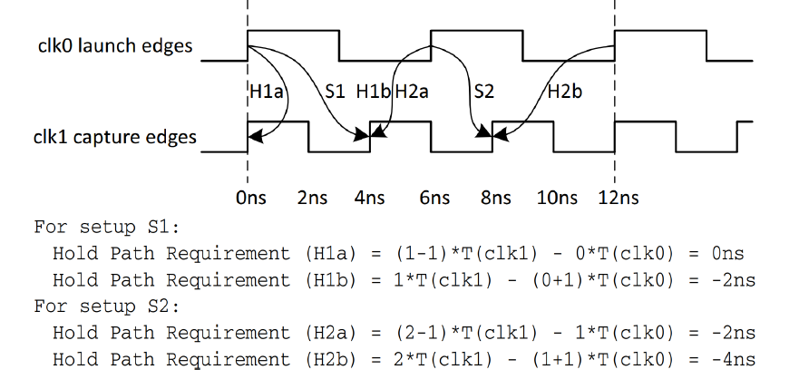

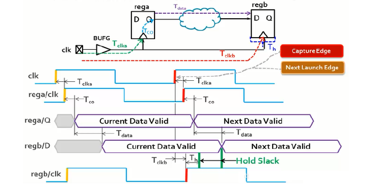

2. 计算数据的需求时间

```
Data Required Time (hold) = destination clock capture edge time                               + destination clock path delay
                            + clock uncertainty
                            + hold time
                            
                          = capture edge + Tclkb + Th

```

3. 计算数据的到达时间

```
Data Arrival Time (hold) = source clock launch edge time
                           + source clock path delay
                           + datapath delay
                           
                         = lauch edge + Tclka + Tco + Tdata(Tlogic + Tnet)

```

4. 计算Holdup 的裕量（Slack）

```
Slack (hold) = Data Arrival Time - Data Required Time
             = (lauch edge - capture edge)
               + (Tclka - Tclkb)
               + Tco
               + Tdata(Tlogic + Tnet)
               - Th
               
             = - Holdup Requirement
               - clk skew
               + Tco
               + Tdata(Tlogic + Tnet) 
               - Th  
```

### 2.4.2 根据公式分析 Holdup Slack 为负原因

Hold up Slack为负的情况比较少见，当Setup Slack有较大裕量时，通常工具会自动插入延时来增加Hold up Slack。

下面几种 Hold  up Slack 为负情况：

- 保持时间需求大于0（通常由时序引擎选择错误的捕获沿导致）
- 时钟歪斜大于300ps（通常由时钟路径上的组合逻辑导致）
- Th过大（通常由时序路径终点为Block导致）

### 2.4.3 TimeQuest 时序分析（Hold up）

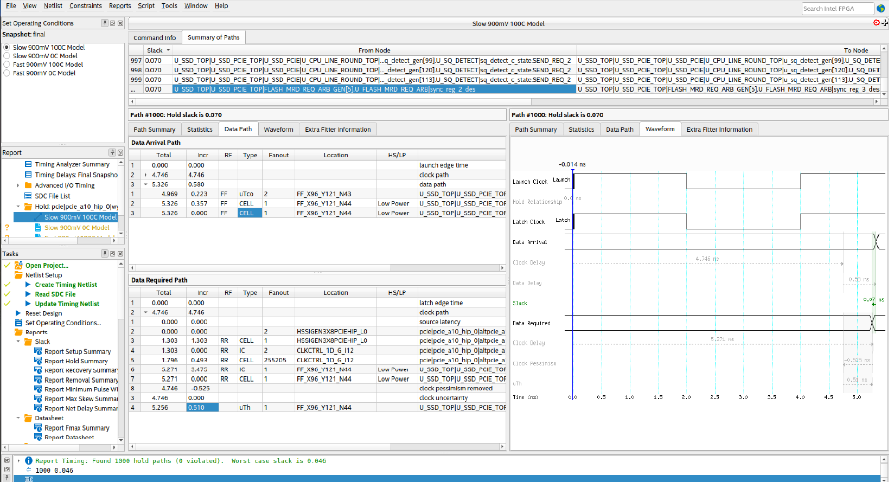

## 2.5 Recovery检查

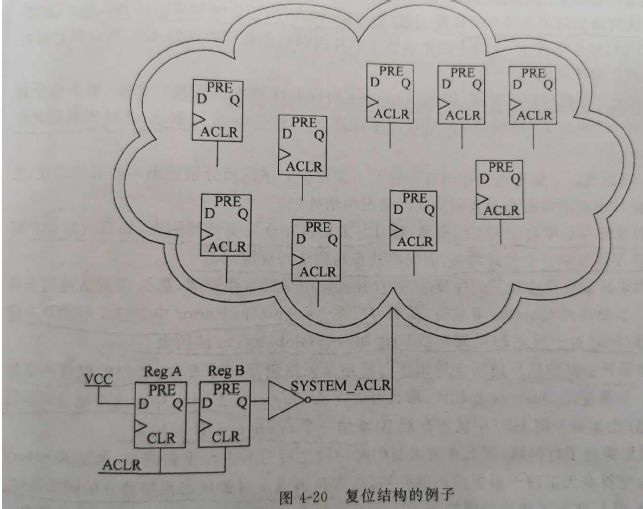

```
Required Time (recovery) = destination clock edge start time
                           + destination clock path delay
                           - clock uncertainty
                           - recovery time
                           
Arrival Time (recovery)  = source clock edge start time
                           + source clock path delay
                           + datapath delay
                           
Slack (recovery) = Required Time - Arrival Time
```

复位准则：

1. 尽量少使用复位，特别是少用全局复位，一定要用复位的使用局部复位；
2. 尽量使用同步复位，一定要用异步复位的地方，采用“异步复位，同步释放”；
3. 复位电平：Xilinx 使用高电平复位，Altera 使用低电平复位（这跟FPGA 器件内部结构有关）；
4. 没有反馈的电路不需要复位；
5. **当设计每部分时，都要想想：这个部分需要复位吗？**

只复位一些需要复位的信号，比如一些控制信号、状态机以及一些带有反馈的电路；而像流水上的数据信号就不需要复位。

一般修改方法：先检查所有复位，有没有原本不需要复位的寄存器，比如FIFO的数据不需要复位，只需复位控制信号，不然会导致异步复位信号扇出非常大，进而导致延时大

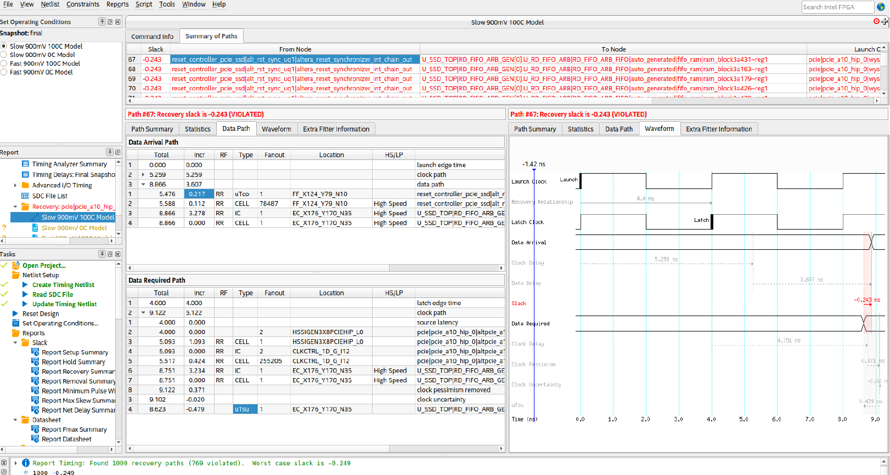

## 2.6 Removal 检查

```
Required Time (removal) = destination clock edge start time
                          + destination clock path delay
                          + clock uncertainty
                          + removal time
                          
Arrival Time (removal) = source clock edge start time
                          + source clock path delay
                          + datapath delay
                          
Slack (removal) = Arrival Time - Required Time
```

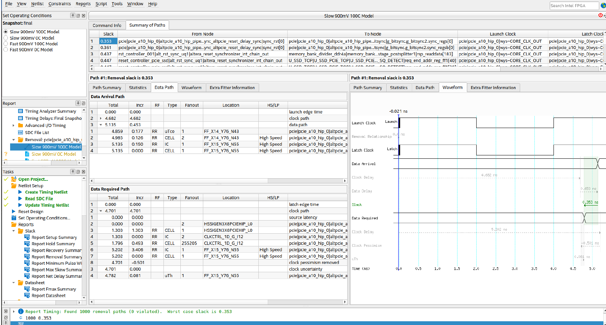


# 3. 时序约束

**时序引擎能够正确分析4种时序路径的前提是，用户已经进行了正确的时序约束。**

时序约束本质上就是告知时序引擎一些进行时序分析所必要的信息，这些信息只能由用户主动告知，时序引擎对有些信息可以自动推断，但是推断得到的信息不一定正确。

第一种路径需要约束时钟；

第二种路径需要约束 Input delay；

第三种路径需要约束output delay；

第四种路径需要约束Max delay/Min delay；


## 3.1 时钟约束

首先用户必须要正确的约束时钟，时序引擎才能根据时钟信息进行各种时序检查。

用户约束时钟时，一般有两种类型的时钟需要约束：

- 主时钟（Primary Clock）

  主时钟有两种类型：

  - 第一种是从FPGA的全局时钟输入引脚输入的时钟；
  - 第二种是从高速收发器输出给用户的恢复时钟

- 生成时钟（Generated Clock）

  生成时钟有两种类型：

  - 第一种是由FPGA的专用时钟管理模块（PLL/MMCM）产生的时钟（这种时钟可以由时序引擎自动推断出来）；
  - 第二种是由用户通过LUT或寄存器产生的时钟（这种时钟必须由用户手动约束）

### 3.1.1 主时钟约束

使用 **create clock** 进行时序约束

==FPGA端口 ports ；内部模块端口 pins==

- **第一种是从FPGA的全局时钟输入引脚输入的时钟**

  - 全局时钟输入引脚是sysclk，时钟周期10ns，占空比50%，相移0度

  ```
  create_clock -period 10 [get_ports sysclk]
  ```

  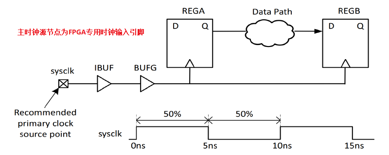

  - 全局时钟输入引脚是ClkIn，时钟周期10ns，占空比25%，相移90度

  ```
  create_clock -name devclk -period 10 -waveform {2.5 5}[ get_ports clkIn]
  ```

  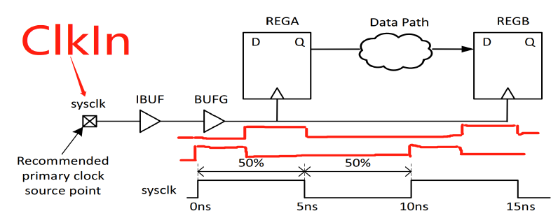

- **第二种是从高速收发器输出给用户的恢复时钟**

  - 内部模块端口RXOUTCLK信号，时钟周期3.3ns，占空比50%，相移0度

  ```
  create_clock -name rxclk -period 3.33 [get_pins gt0/RXOUTCLK]
  ```

  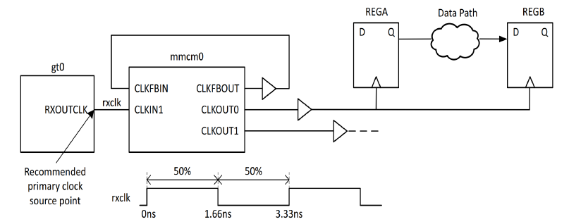

### 3.1.2 生成时钟约束

用 create_generated_clock 进行时序约束

- 每个生成时钟都会对应一个时钟源（Master_clk），这个时钟源可以是Primary Clock或者另一个Generated Clock。
- 在约束生成时钟时，用户不需要描述生成时钟的周期和波形，只需要描述由Master_clk经过了怎样的变化而产生的生成时钟即可。比如经过分频（-devide_by），倍频（-multiply_by），反相（-invert），相移（-edge_shift）等等操作。

----

**分频**

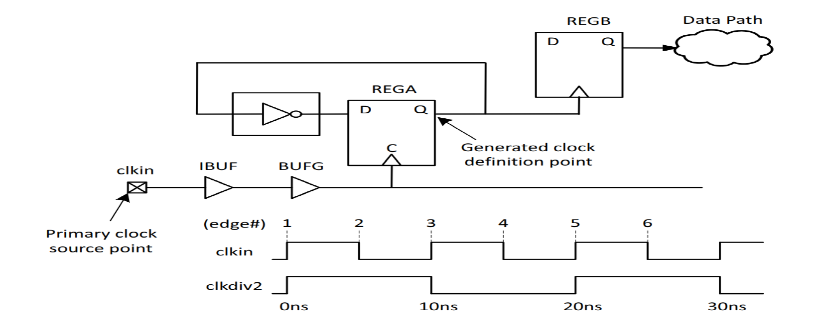

```
create_clock -name clkin -period 10 [get_ports clkin]

# Option 1: master clock source is the primary clock source point
create_generated_clock -name clkdiv2 -source [get_ports clkin] -divide_by 2
[get_pins REGA/Q]

# Option 2: master clock source is the REGA clock pin
create_generated_clock -name clkdiv2 -source [get_pins REGA/C] -divide_by 2
[get_pins REGA/Q]

# option 3：waveform specified with -edges instead of -divide_by
create_generated_clock -name clkdiv2 -source [get_pins REGA/C] -edges {1 3 5} \ [get_pins REGA/Q]
```

----

**相移**

- 当生成时钟需要进行相移时，使用-edge_shift选项
- -edge_shift不能与-divide_by/-multipl_by/-invert同时使用

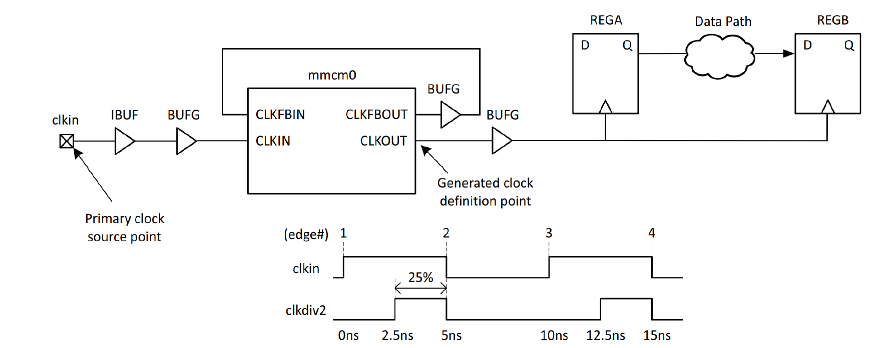

```
create_clock -name clkin -period 10 [ get_ports clkin]

create_generated_clock -name clkshift -source [ get_pins mmcm0/CLKIN] -edges {1 2 3} -edge_shift {2.5 0 2.5} [ get_pins mmcm0/CLKOUT]
# First rising：  edge: 0ns + 2.5ns = 2.5ns
# Falling edge:   5ns + 0ns = 5ns
# Second rising edge: 10ns + 2.5ns = 12.5ns
# 括号里的数字表示各个沿相对原先时钟的偏移大小
```

### 3.1.3 时钟分组、伪路径

- 时序引擎默认情况下会分析所有时钟之间的时序路径，用户可以通过**时钟分组（set_clock_group）命令或伪路径（set false_path）**命令来关闭异步路径的时序分析。
- **使用set_clock_group命令，时序引擎会将不同分组的时钟之间的路径分析关闭，相同分组的时钟之间的路径仍然存在。**
- **使用set_false_path命令，时序引擎会忽略两个时钟的双向路径。**
- ==被忽略的路径不一定能够正常工作，需要用户确保该路径使用了两级触发器同步或按照异步数据传输方式传输数据。用户负责保证这些被忽略的路径可以正常工作。==
- 两个时钟的关系
  ①同步时钟（synchronous clock）
  ②异步时钟（asynchronous clock）
  ③不可扩宽的时钟（unexpandable clock）

-----

**同步时钟**

- **两个时钟之间的相对相位关系是固定的（两个时钟来源于同一个Primary clock），并且这两个时钟的频率的最小公共周期是个整数**
- 比如一个生成时钟（200M）和该生成时钟的Master_clk，（100M）之间就属于同步时钟关系，因为这两个时钟的相位关系肯定是确定的，并且可以找到两个时钟的最小公共周期。通常情况下，一个Primary Clock和它产生的生成时钟之间都属于同步时钟关系，除非找不到最小公共周期。**属于同步时钟关系的两个时钟之间的路径是可以进行时序分析的。**

----

**异步时钟**

- **两个时钟之间的相对相位关系不确定。**
- 比如FPGA上两个晶振分别产生两个Primary clock（相对相位关系不固定），，这两个Primary clock分别从FPGA的两个全局时钟引脚输入给两个MMCM，由两个MMCM分别产生的生成时钟之间属于异步时钟。一般情况下，不同的Primary clock之间都属于异步时钟，这些Primary clock分别产生的生成时钟之间也属于异步时钟关系。
- **属于异步时钟关系的两个时钟之间的路径无法进行正确的时序分析。**
- **一般情况下，如果用户不通过时钟分组对时钟之间的关系进行约束，时序引擎会默认所有的时钟之间都属于同步时钟关系。**

----

**不可扩宽的时钟**

- 对于这类时钟，时序引擎无法在1000个时钟周期内找到两个时钟的公共周期，时序引擎就会从这1000个时钟周期中找到建立时间需求最差的情况，并进行时序分析，然而它不一定FPGA实际运行过程中建立时间需求最差的情况，因为在1000个时钟周期外可能还会有建立时间需求更差的情况，这样一来，时序引擎的分析结果就无法保证该路径定不会出现问题，所以时序引擎的分析结果也就变的无意义。
- 比如说由同一个Primary Clock驱动的两个MMCM的生成时钟分别是clk0（5.125ns）和clk1（6.666ns），虽然它们的相对相位关系是固定的，但是时序引擎无法保证对两个时钟之间路径的分析属于最差情况，这种情况和异步时钟之间的时序分析类似，时序分析的结果都看起来正常，但是这个结果却是不可信的。**所以对这种时钟的处理方式与处理异步时钟是相同的，用户都需要进行跨时钟域的操作。**

----

==总结：异步时钟和不可扩展的时钟之间的路径都无法进行正确的时序分析，所以在时序分析之前，需要使用set_clock_group对时钟进行分组，从而将这些无法进行正确时序分析的路径忽略掉。==

**时钟分组实例**

- 第一个Primary clock clk0从FPGA的全局时钟引脚进入了一个MMCM，MMCM生成了两个生成时钟userclk，itfclk
- 第二个Primary clock clk1是一个高速收发器输出的恢复时钟，将该恢复时钟输入进一个MMCM，MMCM生成了两个生成时钟gtxclkrx，gtxclktx 

```
set_clock_groups-name async_clk0_clk1 -asynchronous-group {clk0 usrclk itfclk} \ -group {clk1 gtclkrx gtclktx}

# or

set_clock_groups-name async_clk0_clk1 -asynchronous -group {get_clocks -include_generated_clocks clk0} -group {get_clocks -include_generated_clocks clk1}
```


## 3.2 Input 延时约束

- Input delay 用于约束输入端口和FPGA中第一级触发器之间的时序关系。

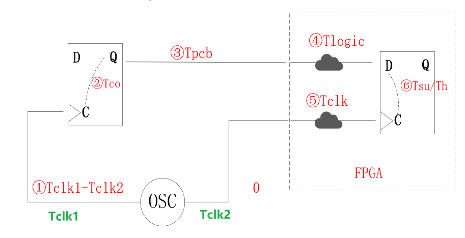

### 3.2.1 计算 Input delay

- 时序引擎只知道④⑤⑥，需要用户告诉时序引擎 ①②③（即 Input delay）
- Max Input Delay 一般用来分析 setup/recovery 分析
- Min Input Delay 一般 用来分析 holdup/removal 分析

- 如果不知道值，一般约束为整个时钟周期的 60%

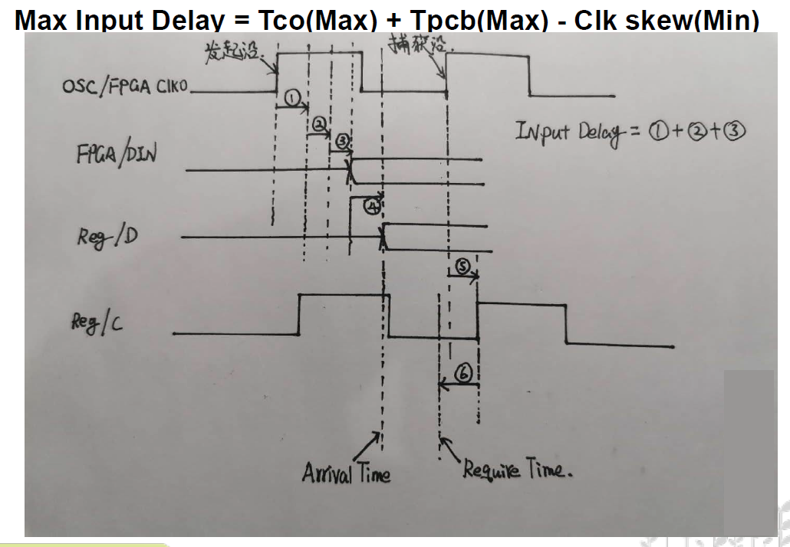

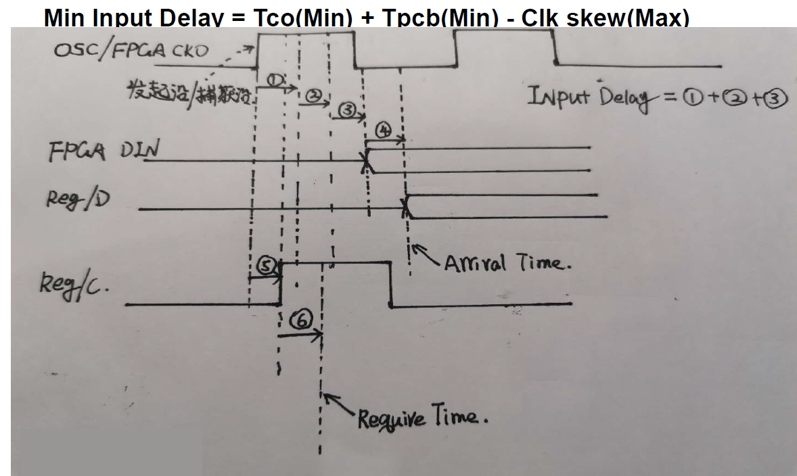

### 3.2.2 约束 Input delay

- 进行 Input delay 约束需要有一个参考时钟（如下面的 sysclk）

```
create_clock -name sysclk -period 10 [get_ports CLK0]
set_input_delay -clock sysclk 2 [get_ports DIN]

#如果不分 max和 min，则时序引擎用这个值同时做setup、holdup、recovery、removal分析

create_clock -name sysclk -period 10 [get_ports CLKO]
set_input_delay -clock sysclk-max 4 [get_ports DIN]
set_input_delay -clock sysclk-min 1 [get_ports DIN]
```

- 像DDR3是双沿采样，所以上下沿都得约束

```
create_clock -name clk_ddr -period 6 [get_ports DDR_CLK_IN]
set_input_delay -clock clk_ddr -max 2.1 [get_ports DDR_IN] 
set_input_delay -clock clk_ddr -max 1.9 [get_ports DDR_IN] -clock_fall -add_delay 
set_input_delay -clock clk_ddr -min 0.9 [get_ports DDR_IN 
set_input_delay -clock clk_ddr -min 1.1 [get_ports DDR_IN] -clock_fall -add_delay
```


## 3.3 Output 延时约束

- Output delay 用于约束最后一级触发器与FPGA输出端口之间的时序关系
- 如果不知道值，一般约束为整个时钟周期的 60%

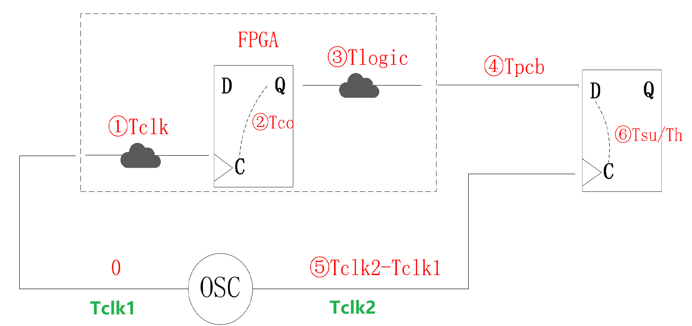

### 3.3.1 计算 Output delay

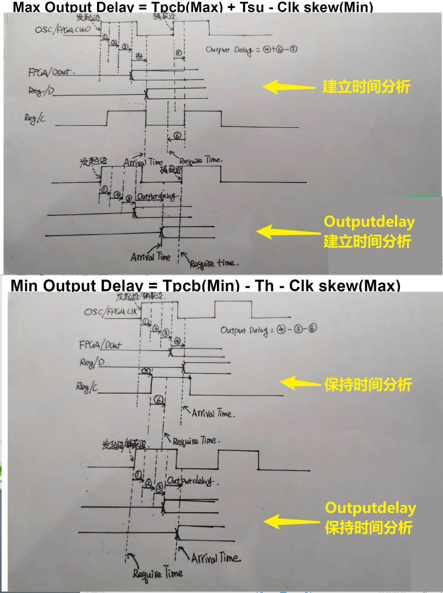

### 3.3.2 约束 Output delay

```
create_clock -name sysclk -period 10 [get_ports CLKO]
set_output_delay -clock sysclk 6 [get_ports DOUT]

create_clock -name clk_ddr -period 6 [get_ports DDR_CLK_IN]
set_output_delay -clock clk_ddr -max 2.1 [get_ports DDR_OUT]
set_output_delay -clock clk_ddr -max 1.9 [get_ports DDR_OUT] -clock_fall -add_delay
set_output_delay -clock clk_ddr -min 0.9 [get_ports DDR_OUT]
set_output_delay -clock clk_ddr -min 1.1 [get_ports DDR_OUT] -clock_fall -add_delay

```


## 3.4 Multicycle 约束


## 3.5 Falsepath 约束

- 使用 set_false_path 命令进行约束
- Falsepath 路径是指该路径在拓扑结构中的确存在，但是满足以下任一条件的路径（一般3种情况）：
  - 在实际运行过程中，该路径不工作
  - 异步复位路径
  - 跨异步时钟域路径
  - 比如：
    - 已经做了同步处理的跨时钟域路径
    - 只在上电时工作一次的寄存器
    - 异步复位路径或者用于测试的路径

- 注意：如果用户的目的只是放松某条路径的时序约束，可以用 set_multicycle_path 命令进行约束，不要使用 set_false_path
- 设置FalsePath的好处：
  ①减小综合/实现/时序分析的时间。
  ②极大的提升工具对设计的综合/实现/优化的结果。

```
set_false_path [-setup] [-hold] [-from <node_list>] [-to <node_list>] \ [-through <node_list>]

#-from/-to的node list必须是有效的时序路径的起点和终点，或是时钟。-through的node_list应该是ports/pins/nets
```

----

**约束举例**

① 将异步复位信号设置为伪路径

```
set_false_path -from [get_port reset] -to [all_registers]
```

② 将CLKA到CLKB的**单向路径**设置为伪路径

```
set_false_path -from [get_clocks CLKA] -to [get_clocks CLKB]
```

③ 将CLKA到CLKB以及CLKB到CLKA的**双向路径**设置为伪路径

```
set_false_path -from [get_clocks CLKA] -to [get_clocks CLKB]
set_false_path -from [get_clocks CLKB] -to [get_clocks CLKA]
```

注：当有多个异步时钟之间的路径需要设置为伪路径时，推荐使用set_clock_group命令。

## 3.6 Maxdelay 约束
